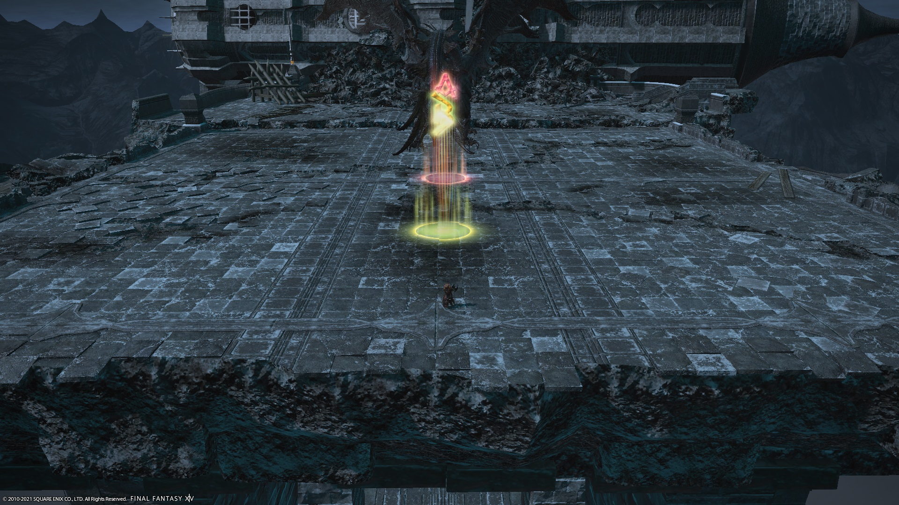

# The Minstrel's Ballad: Nidhogg's Rage

## English
```
■ Adds phase
　Brobinyak (OT)⇒Falak (MT)⇒Dragon (H2 bait)
■ Towers
 ↑　D1 　D2　 ↑　※ DPS take towers
MT←H1　H2→ST　※ Healers start
　　D3　 D4　　　　　between towers
■ Sable Price #1, #3
Movement: B→A→spread
　 D1　 D2
ST　　　　MT
　　　◎
H1　　　　H2
　 D3　 D4
```

## Japanese
```
■雑魚フェーズ…ST⇒西(プロビニャク) 、MT⇒東(ファラク)
　処理順…西プロビニャク⇒東ファラク⇒北ウェアドラゴン
《散開図》
■塔フェーズ…DPS塔踏み、ヒラ塔の間スタート
  ↑　 D1 　D2　 ↑　
MT←H1　H2→ST
　　 D3　 D4
■火球(奇数)…B→A→下記散開
　 D1　 D2
ST　　　　MT
　　 火球
H1　　　　H2
　 D3　 D4
```

## Markers

`A` and `B` are used to dodge alternate Sable Prices, starting with the first.

A more modern approach would be to use `ABCD` to mark cardinal directions, and use `1` and `2` for Sable Price instead (there were only `ABC` markers available at the time).

