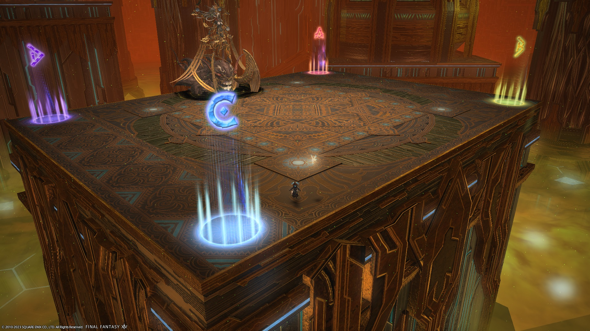

# Containment Bay P1T6 (Extreme)

## Things to check

- Check the Sin and Punishment spread positions.

## Japanese
```

```

## English
```

```

## Markers

The `ABCD` markers are for orientation.

The `A` marker is used as a gathering point to bait falloff AoEs during second Quasar.


<details markdown=block>
<summary>XIVLauncher WaymarkPresetPlugin positions</summary>

```json
{"Name":"Sophia EX","MapID":184,"A":{"X":16.863,"Y":0.0,"Z":-12.567,"ID":0,"Active":true},"B":{"X":16.863,"Y":0.0,"Z":12.567,"ID":1,"Active":true},"C":{"X":-16.863,"Y":0.0,"Z":12.567,"ID":2,"Active":true},"D":{"X":-16.863,"Y":0.0,"Z":-12.567,"ID":3,"Active":true},"One":{"X":0.0,"Y":0.0,"Z":0.0,"ID":4,"Active":false},"Two":{"X":0.0,"Y":0.0,"Z":0.0,"ID":5,"Active":false},"Three":{"X":0.0,"Y":0.0,"Z":0.0,"ID":6,"Active":false},"Four":{"X":0.0,"Y":0.0,"Z":0.0,"ID":7,"Active":false}}
```

</details>

## Equilibrium Tilts

- Always dodge to the side opposite the blue Meteor
- If the total number of meteors/tethers is **even**, go all the way to the edge.
- If the total number of meteors/tethers is **odd**, stop around 1/4 of the way to the edge.