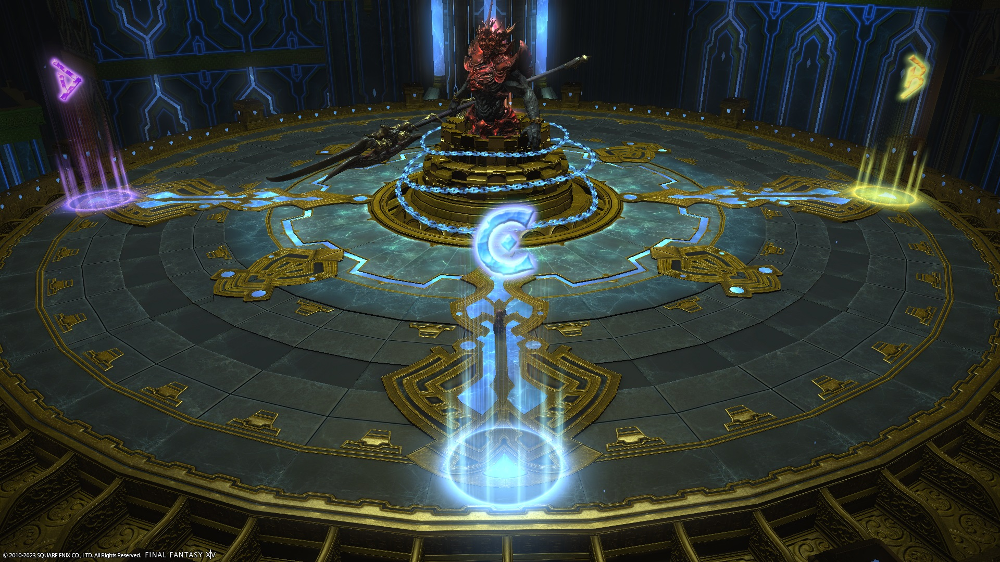

# Containment Bay Z1T9 (Extreme)

## Japanese
```

```

## Markers

These are just the standard cardinal markers. At the time, the `D` marker did not exist.


<details markdown=block>
<summary>XIVLauncher WaymarkPresetPlugin positions</summary>

```json
{"Name":"Zurvan EX","MapID":224,"A":{"X":0.0,"Y":0.0,"Z":-18.0,"ID":0,"Active":true},"B":{"X":18.0,"Y":0.0,"Z":0.0,"ID":1,"Active":true},"C":{"X":0.0,"Y":0.0,"Z":18.0,"ID":2,"Active":true},"D":{"X":-18.0,"Y":0.0,"Z":0.0,"ID":3,"Active":true},"One":{"X":0.0,"Y":0.0,"Z":0.0,"ID":4,"Active":false},"Two":{"X":0.0,"Y":0.0,"Z":0.0,"ID":5,"Active":false},"Three":{"X":0.0,"Y":0.0,"Z":0.0,"ID":6,"Active":false},"Four":{"X":0.0,"Y":0.0,"Z":0.0,"ID":7,"Active":false}}
```

</details>