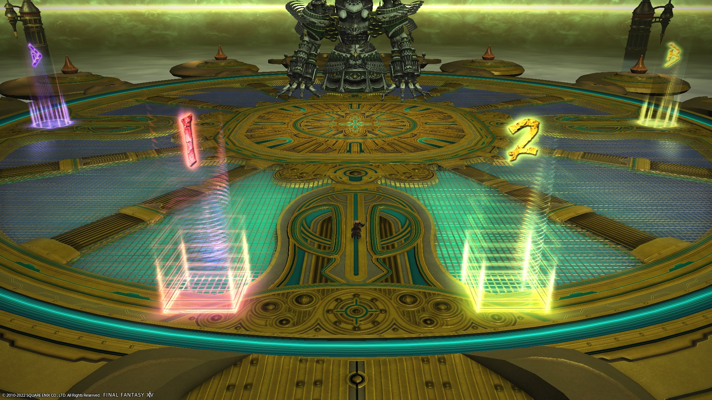

# Alexander - The Eyes of the Creator (Savage)

This is [Cien Choco's macro](https://jp.finalfantasyxiv.com/lodestone/character/1622544/blog/3194463/) for Pekoelog's strat.

Pekoelog:
  - [Part 1](http://pekoe1001.blog.shinobi.jp/Entry/1585/)
  - [Part 2](http://pekoe1001.blog.shinobi.jp/Entry/1586/)

## Japanese

```
■■■■■ Ｐ１ ■■■■■
　▼赤玉担当：リスト↑白、↓学
　▼重力異常：ボス真下集合
■■■■■ Ｐ２（雑魚フェーズ）■■■■■
　▼ウィング：東から時計回り、１匹目に近接LB
　▼タイムマイト：MTタイム　STマイト
■■■■■ Ｐ３（時間停止フェーズ） ■■■■■
　▼時間停止（１回目）
　　【DPS】
　　　名誉：機A、竜B、忍C ※黒は空いた所へ
　　　集団：左円
　　【タンク】
　　　接近強制：左円、禁止：MTA、ST左円
　　【ヒーラー】
　　　2人とも右円
　▼時間停止（２回目）
　　【DPS】
　　　接近強制：左円
　　　接近禁止：優先順位 [左円]←黒 機 忍 竜→[Ａ]
　　　　集団：優先順位 [左円]←黒 機 忍 竜→[右円]
　　【タンク】
　　　名誉：C　　接近強制：右円、禁止：A
　　【ヒーラー】
　　　名誉：B　　接近強制&禁止：右円
■■■■■ Ｐ４（隔離・結晶フェーズ） ■■■■■
　▼タイムゲート：忍11時 竜1時 戦7時 学5時
■■■■■ Ｐ５（時空潜行フェーズ） ■■■■■
　▼確定判決（ボス出現位置を12時として）
　　【DPS】
　　　接近強制：3時
　　　接近禁止：優先順位 [9時]←竜 忍 機 黒→[3時]
　　　　※相方がタンクヒラの場合は9時
　　【タンク】
　　　名誉：9時、接近強制&禁止：3時
　　【ヒーラー】
　　　2人とも3時
■■■■■ Ｐ６（最終フェーズ） ■■■■■
　▼懺悔（ボス正面を12時、タンクは場所入れ替え無し）
　　　3時：竜→黒→MT　近接ヒール=学
　　　9時：忍→機→ST　近接ヒール=白
　▼コミュニオン
　　　近接=北からAOE外回り、遠隔=南からAOE内回り
```

## English

```
■■■■■ P1 ■■■■■
　▼Red prey：↑WHM、↓SCH
　▼Gravitational Anomaly：Bait underneath the boss
■■■■■ P2 (Adds phase) ■■■■■
　▼Wing：Start from the east, go clockwise, melee LB the first add
　▼Time/Might：MT: Time, OT: Might
■■■■■ P3 (Temporal Stasis phase) ■■■■■
　▼Timestop (1st)
　　【DPS】
　　　Defamation：MCH: A、DRG: B、NIN: C ※BLM goes to the empty spot
　　　Shared Sentence：South-left
　　【Tank】
　　　House Arrest：South-left
　　　Restraining Order：MT: A, OT: South-left
　　【Healers】
　　　Both healers: South-right
　▼Timestop（2nd）
　　【DPS】
　　　House Arrest: South-left
　　　Restraining Order: [South-left] ← BLM MCH NIN DRG → [A]
　　　Shared Sentence:   [South-left] ← BLM MCH NIN DRG → [South-right]
　　【Tank】
　　　Defamation：C　　
　　　House Arrest：South-right    Restraining Order: A
　　【Healer】
　　　Defamation：B　　
　　　House Arrent & Restraining Order: South-right
■■■■■ P4 (Judgment Crystal phase) ■■■■■
　▼Timegate：NIN: NW, DRG: NE, WAR: SW, SCH: SE
■■■■■ P5 (Inception) ■■■■■
　▼Inception（Treat the boss's location as 12 o'clock）
　　【DPS】
　　　House Arrest：3 o'clock
　　　Restraining Order：[9 o'clock] ← DRG NIN MCH BLM → [3 o'clock]
　　　　※ If tethered to a tank/healer, go to 9 o'clock
　　【Tank】
　　　Defamation：9 o'clock, House Arrest/Restraining Order: 3 o'clock
　　【Healers】
　　　Both healers go to 3 o'clock
■■■■■ P6 (Last phase) ■■■■■
　▼Repentance（The front of the boss is 12 o'clock）
　　　3 o'clock：DRG → BLM → MT (SCH heals the NIN)
　　　9 o'clock: BLM → MCH → OT (WHM heals the DRG)
　▼Communion
　　　Melee: Start on the inside from the north
　　　Ranged: Start on the outside from the south
```

## Markers

At the time, only the `ABC` markers were available.

Now that more markers are available, I would place the markers as below. The `A` marker is hidden behind the boss.

"South-left" would be the `1` marker, while "South-right" would be the `2` marker.

`ABD` are used for Defamation during Temporal Stasis.
`12` are used for Shared Sentence and Aggravated Assault during Temporal Stasis.


<details markdown=block>
<summary>XIVLauncher WaymarkPresetPlugin positions</summary>

```json
{"Name":"A12S","MapID":193,"A":{"X":0.0,"Y":400.0,"Z":-24.5,"ID":0,"Active":true},"B":{"X":24.5,"Y":400.0,"Z":0.0,"ID":1,"Active":true},"C":{"X":0.0,"Y":0.0,"Z":0.0,"ID":2,"Active":false},"D":{"X":-24.5,"Y":400.0,"Z":0.0,"ID":3,"Active":true},"One":{"X":-5.0,"Y":400.0,"Z":24.7,"ID":4,"Active":true},"Two":{"X":5.0,"Y":400.0,"Z":24.7,"ID":5,"Active":true},"Three":{"X":0.0,"Y":0.0,"Z":0.0,"ID":6,"Active":false},"Four":{"X":0.0,"Y":0.0,"Z":0.0,"ID":7,"Active":false}}
```

</details>