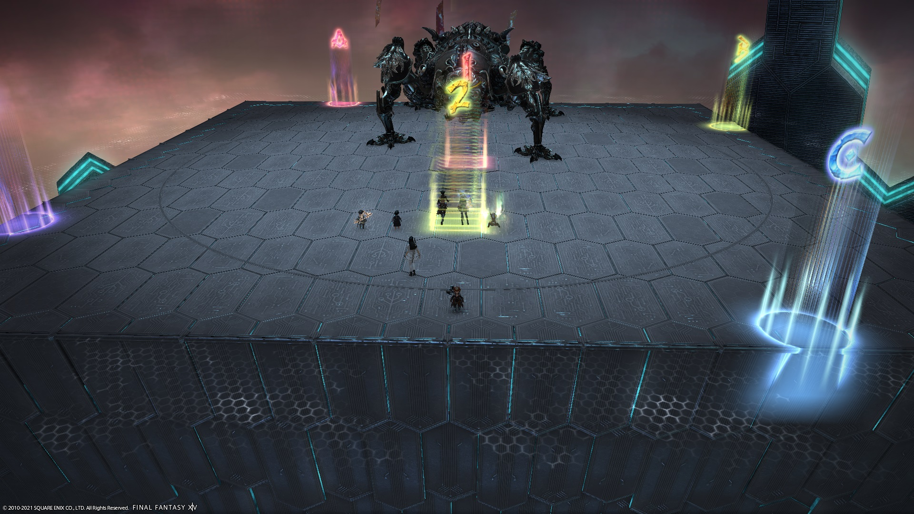

# Alphascape V3.0 (Savage)

This is the "Haru Yamagata" strategy you'll often see on PF, usually shortened to just "Haru strat" (ハル式 - "HARU shiki")

## English
```
【Flamethrowers】　|【1st Rocket Punch】
　D3   　MT 　D4　　|　　　 MT
　H1　BOSS　H2　　| 　　 BOSS　
　D1   　ST　   D2 　  |　D1　 ①　D2
※Dodge clockwise   |　H1　D3　H2
※Relative to boss　  |　　　 ②　D4
【Rocket Punch】Fix any errors at ①
Top:D1D3D2/Bottom:H1D4H2(Pairs:D1H1/D3D4/D2H2)
Different colours:Bottom player stacks with top player
Same colours: Top player to ①, bottom player to ②
【Magnets】T+H→N or E/DPS→S or W
【Chains of Memory】H1:West　H2:East(Rotate clockwise)
Tanks+DPS→North(N/S towers are near center)or South(N/S towers near outer edge)
Boss will face South after Delta Attack
【2nd + 3rd Rocket Punch】 Move to the marker based on your tether
【1st Pantokrator】 Stack behind the boss, rotate clockwise
【Pantokrator #1 Wave Cannons】 1st: T+H(cardinal positions), 2nd DPS(inter-cardinal positions)
【Proximity damage】 Gather NW corner(A marker), note boss faces south
【Red Rocket Punch】 Stack underneath the boss, Tank LB
【2nd Pantokrator】
Stack behind→Move to the front(Place the 4th AoE in front)
→After seeing whether the Flamethrowers go clockwise or anti-clockwise,
rotate accordingly
→After the 10th AoE around 9-10 o'clock (2-3 o'clock), stack behind the boss
※PLD moves to the edge and Invincibles
【Pantokrator #2 Wave Cannons】
　　MT　　　ST
　　　　BOSS
　D1/D3　D2/D4　※1st Wave Cannons:D1、H1、D2
　　　H1/H2　　　 ※2nd Wave Cannons:D3、H2、D4
```

## Japanese
```
【火炎放射、レーザー】|【ロケットパンチ1回目】
　D3　MT　D4　　　　|　　　 MT
　H1　ボス　H2　　 　|　　　 ボス　
　D1　ST　　D2　　 　|　D1　 ①　D2
※時計周り避け　　　 　|　H1　D3　H2
※ボス基準散開　　　　 |　　　 ②　D4
【ロケットパンチ補足】やり直し時は①で処理
上:D1D3D2/下:H1D4H2(ペア:D1H1/D3D4/D2H2)
ペア異色:下が上に重ねる/ペア同色:上は①へ、下は②へ
【マグネット】TH→北or東/DPS→南or西
【連鎖忘却】H1:西　H2:東(時計周り)
TD→北(北南外周円無し)or南(北南外周円有り)
履行後、ボスはそのまま南向き維持
【ロケットパンチ2-3回目】一番近くの線のマーカーへ
【パントクラトル1回目】ボス背面集合で時計回り
【波動砲】1回目TH(十字)、2回目DPS(×字)
【距離減衰】北西端(Aマーカー方面)集合、ボス南向いてる為注意
【強化型ロケットパンチ】ボス下集合タンクLB
【パントクラトル2回目】
背面集合→正面移動(AoE4発目正面捨て)
→時計、半時計判断後、ボス周囲を時計(半時計)周り
→9-10時(2-3時)に10発目AOEを捨てたら背面頭割り
※ナSTのみ端に離れて無敵受け
【拡散波動砲連発】
　　MT　　　ST
　　　　ボス
　D1/D3　D2/D4　※1回目:D1、H1、D2
　　　H1/H2　　　 ※2回目:D3、H2、D4
```

## Markers

Markers are used for Rocket Punch. `1` and `2` are for the first set (before the Level Checker), while `ABCD` are for the other Rocket Punches (after Level Checker).

<details markdown=block>
<summary>XIVLauncher WaymarkPresetPlugin positions</summary>

```json
{"Name":"O11S","MapID":593,"A":{"X":89.0,"Y":0.0,"Z":81.0,"ID":0,"Active":true},"B":{"X":119.0,"Y":0.0,"Z":89.0,"ID":1,"Active":true},"C":{"X":111.0,"Y":0.0,"Z":119.0,"ID":2,"Active":true},"D":{"X":81.0,"Y":0.0,"Z":111.0,"ID":3,"Active":true},"One":{"X":100.0,"Y":0.0,"Z":100.0,"ID":4,"Active":true},"Two":{"X":100.0,"Y":0.0,"Z":110.0,"ID":5,"Active":true},"Three":{"X":0.0,"Y":0.0,"Z":0.0,"ID":6,"Active":false},"Four":{"X":0.0,"Y":0.0,"Z":0.0,"ID":7,"Active":false}}
```

</details>

## Timeline


*(Credit: [u/Syldris](https://www.reddit.com/r/ffxiv/comments/9kff83/alphascapesavage_rotation_and_timeline_images_list/))*