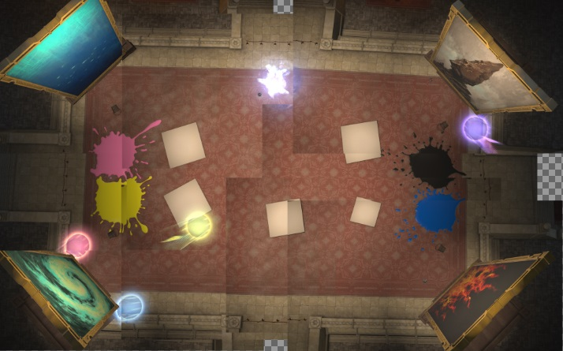

# Sigmascape V2.0 (Savage)

## English
```
■ For all phases:
【Demonic Pain (Line):】 Tank moves
【Flash Wind (the stack):】 OT solos with Invincibility
【Typhon:】 H2 【Rock:】 H1
【Last Kiss:】 Pass to the OT at A or D.
 
■ Phase specific:
【P2 large AoEs:】 Bait at B → Dodge to C
【P3 Lullaby:】
    Pink: H2    Black: D4
    Yellow: H1  Blue: D3
【P4 large AoEs:】 Bait at A → Dodge to B → C
【P4 small AoEs:】 C → A → C
【P6 large AoEs:】 Bait at A → Dodge to B → C
```

## Japanese
```
■全Phase共通
 【デモニックペイン(線)】タンクが移動
 【フラッシュウィンド(頭割り)】ST無敵
 【テュポーン】H2　【岩】H1
 【死の口づけ】A・DマーカーでSTに受け渡し
 ■各Phase
 【P2大AoE】B集合→C
 【P3子守唄】子守唄の詠唱が終わったら即塗る
 　桃 H2　　D4 黒
 　黄 H1　　D3 青
 【P4大AoE】A集合→B回避→C
 【P4小AoE】C→A→C
 【P6大AoE】A集合→B回避→C
```

## Markers


<details markdown=block>
<summary>XIVLauncher WaymarkPresetPlugin positions</summary>

```json
{"Name":"O6S","MapID":293,"A":{"X":-21.0,"Y":0.008,"Z":7.9,"ID":0,"Active":true},"B":{"X":-8.4,"Y":0.007,"Z":5.5,"ID":1,"Active":true},"C":{"X":-15.2,"Y":0.008,"Z":13.7,"ID":2,"Active":true},"D":{"X":21.0,"Y":0.008,"Z":-7.9,"ID":3,"Active":true},"One":{"X":0.0,"Y":0.0,"Z":0.0,"ID":4,"Active":false},"Two":{"X":0.0,"Y":0.0,"Z":0.0,"ID":5,"Active":false},"Three":{"X":0.0,"Y":0.0,"Z":0.0,"ID":6,"Active":false},"Four":{"X":0.0,"Y":0.0,"Z":0.0,"ID":7,"Active":false}}
```

</details>