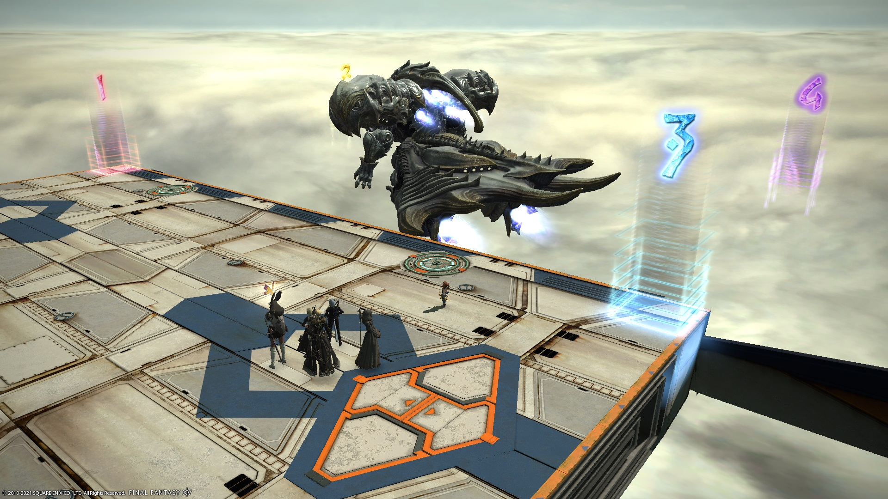

# The Cloud Deck (Extreme)

Enrage: **11:58**

## English
```
【Spread/Towers】　【Flood Ray】
　　MT　　OT　　　　1/5　　2/6
　　D1　　D2
　　H1　　H2
　　D3　　D4　　　　3/7　　4/8
※Return to your assigned side after Flood Ray
【Claw Swipes】
　Group that did not cross first crosses after
【Diamond Shrapnel】
　Bait AoEs in corner with the hand beams,
　then cross to the opposite platform
```

## Japanese
```
【基本散開/塔踏み】　【サイコロ】
　　MT　　ST　　　　1/5　　2/6
　　D1　　D2
　　H1　　H2
　　D3　　D4　　　　3/7　　4/8
※サイコロ全部処理完了後、自分の担当船に戻る
【爪】終わったら移動してない組が移動
【ダイヤバースト（タケノコ）】
　手のビームが来る側の角へ捨て、反対側の船へ移動
```

## Markers

The markers are for Flood Ray positions.

Note that you will not be able to place the east-side markers until you've cleared Diamond Weapon EX (and both platforms are on the arena), although you can also copy from someone else.


## Flood Ray

<blockquote class="twitter-tweet" data-dnt="true" data-theme="dark"><p lang="zxx" dir="ltr"><a href="https://t.co/8mIPXvbEXn">pic.twitter.com/8mIPXvbEXn</a></p>&mdash; ice (@ice42951647) <a href="https://twitter.com/ice42951647/status/1381993636733181953?ref_src=twsrc%5Etfw">April 13, 2021</a></blockquote> <script async src="https://platform.twitter.com/widgets.js" charset="utf-8"></script> 