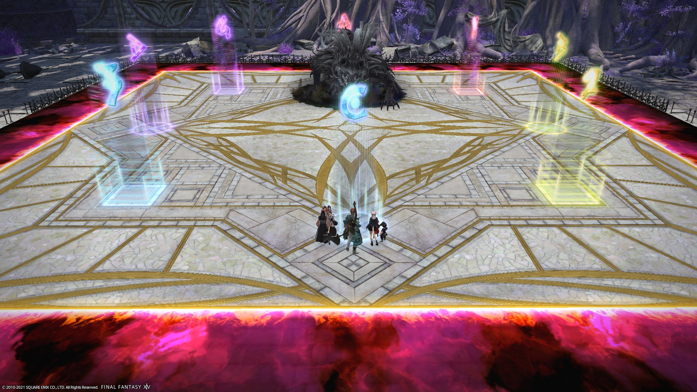
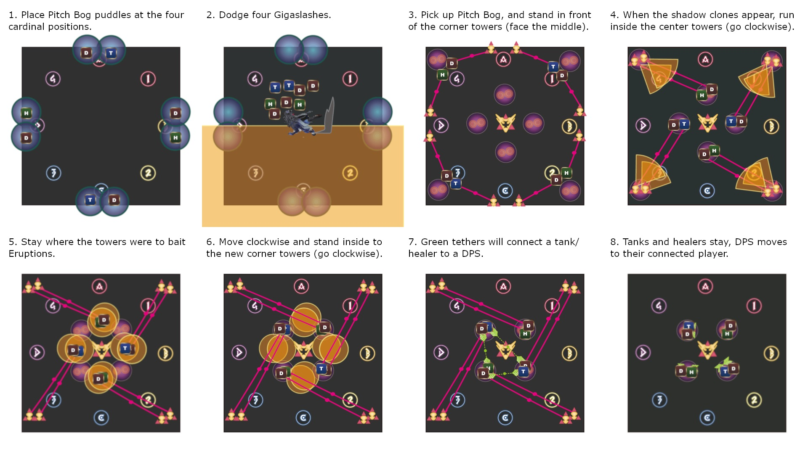

# Eden's Promise: Litany (Savage)

## Timeline


*(Credit: [u/Syldris](https://www.reddit.com/r/ffxiv/comments/kg6pd6/e10s_timeline_image/))*

## English
```
■ Spread　　　■ Pairs+Puddles
　D3　MT　D4　　　 D3 MT
　H1　 ▲ 　H2　　H1　　　D4
　D1　OT　 D2　　D1　　　H2
　　　　　　　　　　　OT D2
■ Umbral Orbs
　MT　H1D1D3：CCW from 12 o'clock
　OT 　H2D2D4：CW from 1 o'clock
■ Shadow Warrior + Umbral Orbs
　From safe side, looking at the boss:
　　　　　　　　  ▼
　L：MT H1D1D3＞OT H2D2D4：R
■ Voidgate
　1st→ No shadow: Spread in 十-positions
　　　　　Shadowed: Resolve shadows first
　2nd→ Clockwise from the 1st positions
　　　　　Shadowed: Resolve towers first
■ Shackled Apart：　T/H: North, DPS: South
■ Shackled Together：T/H stays, DPS moves
```

## Japanese
```
■ 基本散開　　　■ 塔ペア・沼捨て
　D3　MT　D4　　　 D3 MT
　H1　 ▲ 　H2　　H1　　　D4
　D1　ST　 D2　　D1　　　H2
　　　　　　　　　　　ST D2
■ アンブレラオーブ
　MT　H1D1D3：12時から反時計回り
　 ST 　H2D2D4：1時から時計回り
■ スポーンシャドウ+アンブレラオーブ
　　　　　　　　　▼
　左：MT H1D1D3＞ST H2D2D4：右
■ ヴォイドゲート
　１回目→影なしは十字散開
　　　　　影ありは影処理優先
　２回目→１回目の位置から時計回り
　　　　　影ありは塔処理優先
■ 離別の鎖：北TH、南DPS
■ 束縛の鎖：TH固定、DPS移動
```

## Strategy

Akito's strat/あきと式 (Japanese): [video](https://youtu.be/mLFIYKvt3QY)

## Things to check on Party Finder

Since tanks swap during this fight, check with your other tank whether MT for Umbral Orbs means whoever is currently tanking the boss, or the original MT.

## Markers

The markers are just for orientation. The intercardinal markers also are indicators for the range of the AoE when the boss stands up. 


## Final Voidgates

PF uses Akito's strat: [video](https://youtu.be/mLFIYKvt3QY&t=743)

This is not mentioned in the macro, and you are expected to know this coming in.

(Yes, this is a melee downtime strategy.)
