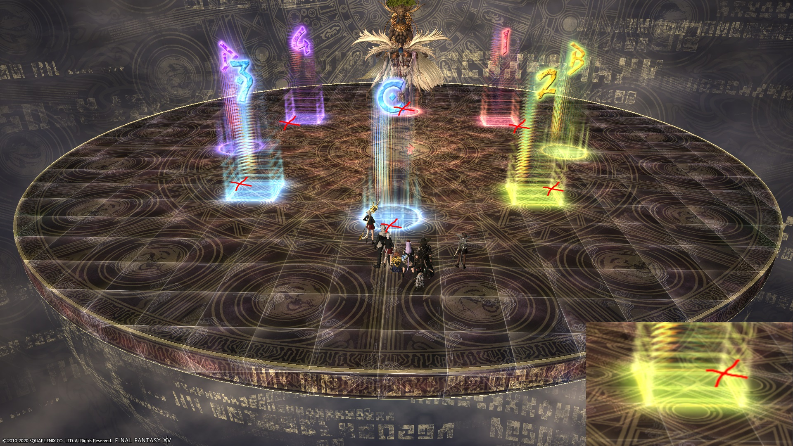
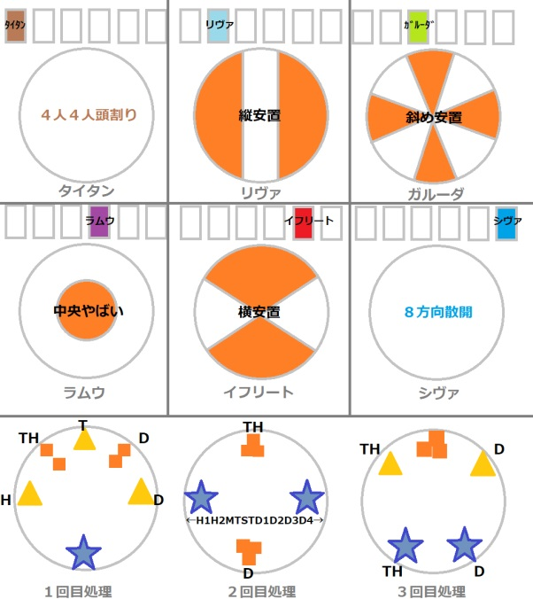
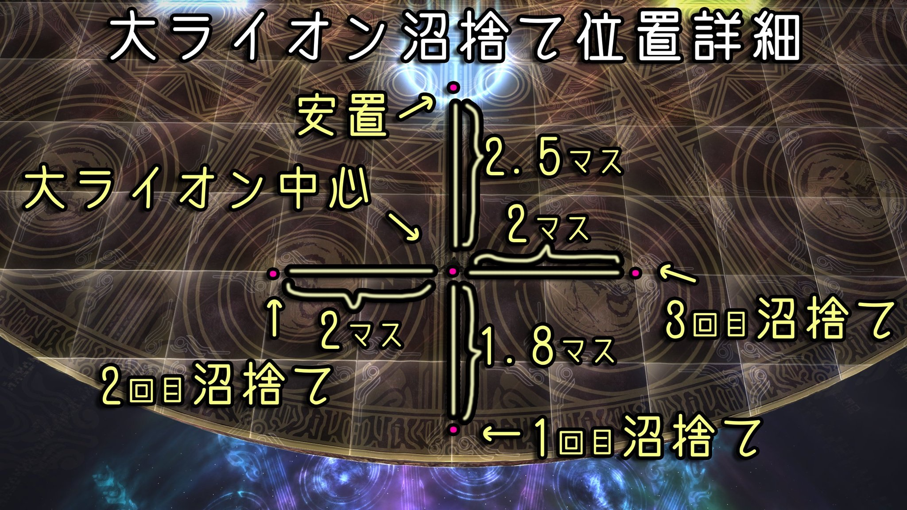

# Eden's Promise: Eternity (Savage) Part 1

## Strategy

The standard PF strat takes [Idyll strat (イディル式)](http://kanatan.info/archives/25637304.html) positions for Titan, but use [Akito's strat (あきと式)](https://youtu.be/hdLm1Q1BEWg) for Giants (巨人) and Lion. (Akito brings the boss down to the south edge and has the statue stacks north and south of the boss.)

#### Things to check on Party Finder

- Check Shiva spread positions- some macros have the healers on the NW and SE diagonals.
- Decide which tank is going to Reprisal Obliterations, and which tank will Reprisal Diamond Dust and Earthern Fury.
- Sort out tank Invulns for the three Formless Judgments. If there is a PLD, they should Hallowed Ground the 2nd , and the other tank should Invuln the 1st and 3rd.

#### Aproximate milestones

- **54%** HP at the end of Titan phase (when the floor changes back).
- **23%** HP at the end of Lions (when the Lions disappear).

## English
```
【Shiva Spread】   【Shiva Stacks・Diamond Dust】
D3 MT D4     |   Top-left(D-1):H1MT←→D1D3
H1  ▲  H2     |  Bottom-right(B-3):D4D2←→OTH2
D1 ST  D2     |
【Titan 1】　　　　　　　　【Titan 2】
 TH　T　D　　　　　　　TH
 H　  ▲  　D 　 ← H1H2MTOTD1234 → 
               　　　　　　　　　　DPS
【Titan 3】　　　【Obliteration】South/West
TH　　D　 【Giants】Boss south
　　　  ▲　　　　　　North stack: OT H2 D2 D4
TH　　　D　　　 South stack: MT H1 D1 D3
【Lions：TT strat】
Big Lions：
  North：H1MTH1　/　D3D1D3
　　South：H2OTH2　/　D4D2D4
　※Puddles order: Center→Left→Right
```

## Japanese
```
【ダスト散開】   【シヴァ頭割り・氷柱】
D3 MT D4     |   上左(D-1)：H1MT←→D1D3
H1  ▲  H2     |    下右(B-3)：D4D2←→STH2
D1 ST  D2     |   散開はマップ基準
　【タイタン1】　　　　　　【タイタン2】
橙TH　黄T　橙D　　　　　　　　橙TH
黄H　   ▲　 黄D　青：(西) H1H2MTSTD1234 (東)
　　　 青D　　　　　　　　　　　橙D
  【タイタン3】 　【はなつ＋ビーム】  南/西
  黄TH  橙   黄D　【石像】ボス南誘導
　　　 ◎　　　　　北：STH2D2D4
  青TH　　青D　　  南：MTH1D1D3
【ライオン：TT式】
大：北：H1MTH1　/　D3D1D3
　　南：H2STH2　/　D4D2D4
　※沼捨て順：外周→左→右
```

## Markers

There are two sets of markers used in PF, that are used for the Lions phase. 

**English** parties will put markers centered on the circle patterns on the ground.

Small lions are pointed to the center of the markers, while the big lion players dodge the fire cones in the center of the N/S markers (see image).


**Japanese** parties will put the markers aligned to the grid tiles on the ground.

Small lions are pointed towards specific corners of the square markers, while the big lion players dodge the fire cones by standing on the outer side of the N/S markers (see image).


## Primals/Titan phase



## Giants/巨人

The main way PF handles the giants is Akito's method or more commonly referred to as N/S giants (巨人南北):

**Akito/1A**: MT brings boss south, party stacks north and south. MT group stacks south, OT group stacks north (since the boss will be facing south)

## Akito TT Lion strat/ライオンAkitoTT式

Explanation (Japanese): [video](https://youtu.be/hdLm1Q1BEWg?t=657)

**Baiting small lions**: Where players stand to bait the small lions will depend on which markers you use (see marker images above).

**Baiting big lions**: The second and third big lion baits should not be all the way at the edge of the arena. The center of the lion is just under two tiles away from the edge of the arena.

If you go all the way to the edge of the arena to bait the second or third big lion, you are actually going further from the big lion, and the big lion will target the person standing at `A` or `C` instead. 


## Timeline


*(Credit: [u/Syldris](https://www.reddit.com/r/ffxiv/comments/khx7wr/e12s_part_i_timeline_image/))*