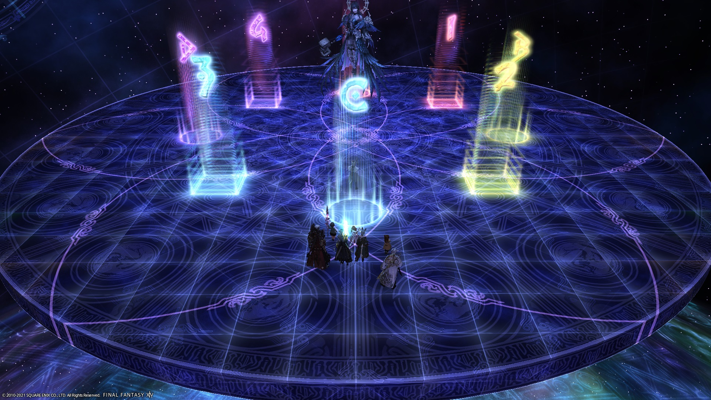

# Eden's Promise: Eternity (Savage) Part 2

[Thoughts Per Second (TPS) strat](https://youtu.be/eBdHx53XteI)

Note: There are some details that are added in the macro, in particular, a DPS priority order for Basic Relativity.

### Things to check on Party Finder

- **Shockwave Pulsars**: The MT usually Reprisals all the Relativities, while the OT usually reprisals Shockwave Pulsars.
- **Somber Dance**: The way EN and JP parties bait Somber Dance differs- EN parties will tend to bait next to the boss, while JP will bait on the other side of the arena. MT usually baits first.
- **Advanced Relativity**: The macro has D3 and D4 adjust in the event D1+D3 or D2+D4 have the same (non-Fire) debuffs. Some macros have D2 and D3 adjust instead.
  - Having D3 and D4 adjust means that each side is guaranteed to have one melee DPS, one ranged DPS so there's no confusion over Dark Fire spots.
  - Having D2 and D3 adjust keeps the standard based on past fights (e.g: E8S), but means that if a swap happens, there will be two melee on one side, and two ranged on the other, so the Dark Fire priorities get a little more complex.
- **Terminal Relativity**: Check your party's mitigation plan. 

#### Approximate milestones

- **30%** HP at Advanced Relativity (when the boss becomes untargetable)

## English
```
【Dark Eruption】【After Single Apoc】【Int. Relativity】
　　　　MT　　　　　MT　ST　　　　　　　D3  MT  D4
　　D1  ▲  D2　　　　　▲　　　　　　 　　H1   ▲   H2
　  D3　ST　D4　　　D1　D2　D4　　　　D1   ST   D2 
　　  H1　H2　　　　　  H1　H2　　　　　　　
　　　　　　　　　　　　　 D3　※Healer/ranged adjust based on AoE direction
【Basic Relativity】 Yellow lights = 12 o'clock
　9 o'clock (L)→ MTH1　　3 o'clock (R)→STH2
　1st Beam/Dark Fire Priority: (L) D1>D2>D3>D4 (R)
　Beam order: DPS→Healers→Tanks
【Black Halo】MT Invuln→OT Invuln
【After Single Apoc】Stack in mid→Healer/range spread to where AoE exploded
【Intermediate Relativity】 Use true north
【After Dual Apoc】 Stack in front of boss→Spread based on boss
【Advanced Relativity】
　North→MTH1D1D3  ※D3, D4 adjust
　South→STH2D2D4
　Dark Fire Priority: In: Tanks>D1D2D3D4>Healers :Out
【Triple Apoc】Bait boss to the outside, ahead of the center light's 3rd position→Knockback L/R as appropriate
【Terminal Relativity】 MT mitigation, MT Reprisal, D4 Addle, D3 mitigation
　Pulsar 1: H2 mitigation (1, 2)
　Pulsar 2: OT Reprisal, H1 mitigation (2, 3)
　Pulsar 3: OT mitigation (D2 Addle if 2x caster)
```

## Japanese
```
【エラプ・基本散開】【シングル後散開】【破】北基準
　　　MT　　　　　MT　ST　　　　　D3  MT  D4
　D1  ▲  D2　　　　　▲　　　　　　 H1   ▲   H2
  D3　ST　D4　　　D1　D2　D4　　D1   ST   D2 
　  H1　H2　　　　　  H1　H2　　　　　　　
　　　　　　　　　　　　 D3　※AoE回転方向によりヒラ遠隔のみ左右反転
【序】黄砂時計を12時とする
  9時(左)→ MTH1  3時(右)→STH2
  優先度:左>D1>D2>D3>D4>右で1回目ビーム誘導/ファイガ散開
  ビーム誘導:DPS→ヒラ→タンク
【ブラックヘイロー】MT無敵→ST無敵
【シングル後】中央で頭割り→AoEが爆発した場所にヒラ遠隔が散開
【破】北基準、破の散開位置のライン上で配置
【ダブル後】ボス前方で頭割り→ボス基準で基本散開
【急】北(10時～2時)→MTH1D1D3　※D3D4調整
　　　南(4時～8時)→STH2D2D4
　　　ファイガ:　内：タンク・D1D2D3D4・ヒーラ：外
【トリプル】中央から出る予兆の3回目側より少し先の外周にボス誘導→左or右斜めの狭い方にノックバック
【終】 MT軽減、MTリプ、D4アドル、D3軽減
　パルサー1：H2軽減 (1,2)
　パルサー2：STリプ、H1軽減 (2,3)
　パルサー3：ST軽減 (D2アドル)
```

## Markers

*(These markers are the same as the Japanese markers from Part 1)*

<details markdown=block>
<summary>XIVLauncher WaymarkPresetPlugin positions</summary>

```json
{"Name":"E12S P2","MapID":759,"A":{"X":0.0,"Y":75.0,"Z":-85.0,"ID":0,"Active":true},"B":{"X":10.0,"Y":75.0,"Z":-75.0,"ID":1,"Active":true},"C":{"X":0.0,"Y":75.0,"Z":-65.0,"ID":2,"Active":true},"D":{"X":-10.0,"Y":75.0,"Z":-75.0,"ID":3,"Active":true},"One":{"X":7.071,"Y":75.0,"Z":-82.071,"ID":4,"Active":true},"Two":{"X":7.071,"Y":75.0,"Z":-67.929,"ID":5,"Active":true},"Three":{"X":-7.071,"Y":75.0,"Z":-67.929,"ID":6,"Active":true},"Four":{"X":-7.071,"Y":75.0,"Z":-82.071,"ID":7,"Active":true}}
```

</details>

## Advanced Relativity


## Timeline


*(Credit: [u/Syldris](https://www.reddit.com/r/ffxiv/comments/kj03t5/e12s_part_ii_timeline_image/))*