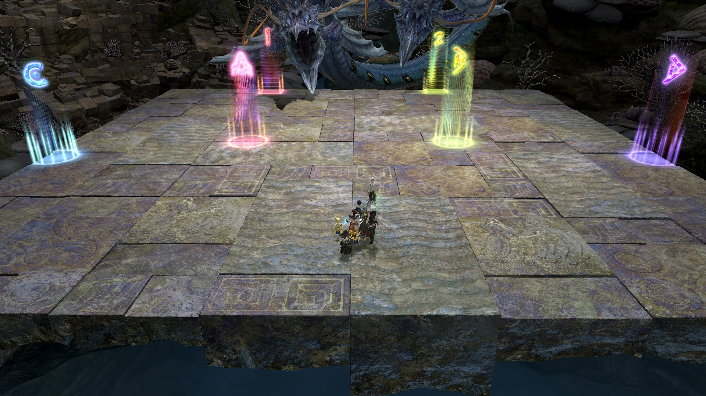

# Eden's Gate: Inundation (Savage)

## Timeline


*(Credit: [u/Syldris](https://www.reddit.com/r/ffxiv/comments/clkiwe/e3s_rotation_and_timeline/))*

## English
```
────────────────────
《Spread》   | 　《Stormy Horizon》
　　　　　　 | Gather NW, bait along
  MT　　ST    | targeting circle
  D1　　D2   |　《Tsunami 2》
  D3　　D4   | Left: MT + Healers + 
  H1　　H2   |　　　Omni-knockback DPS
　　　　　　 | Right: OT + All other DPS
----------------------------------------------------------
《Black Smokers》
Baiter：Ranged DPS
Water puddle order：
　Melee → Healer → Melee → Ranged
────────────────────
```

## Japanese
```
────────────────────
  　《散開》　　 | 　《大時化》
　MT　　ST　　| 左上集合ｻｰｸﾙ沿って捨てる
　D1　　D2　　| 　《大海嘯②》4:4
　D3　　D4　　| 左ヒラ・強圧DPS・MT
　H1　　H2　　| 右他DPS・ST
----------------------------------------------------------
《ブラックスモーカー》
誘導：遠隔
熱水AoE処理順：近接 → ヒラ→ 近接→ 遠隔
────────────────────
```

## Markers

`A` and `B` are stack points for Tsunami 2. `1`, `2`, `C` and `D` demarcate the boundaries for dodging Temporary Current.
