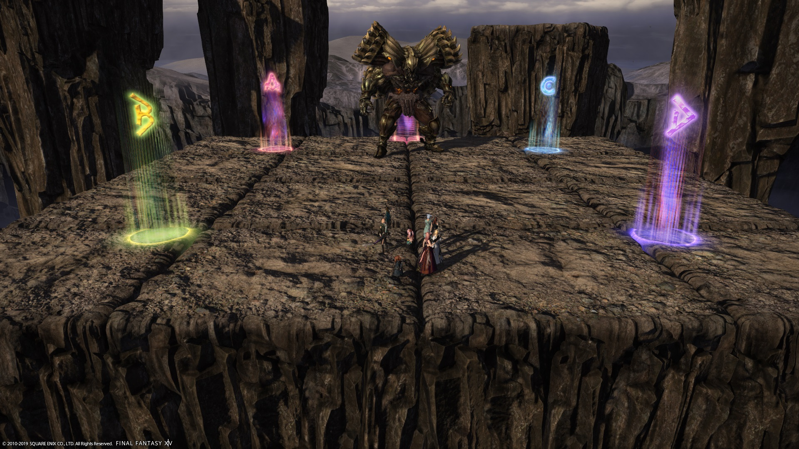

# Eden's Gate: Sepulture (Savage)

There were two strategies used in the final phase (Orogenesis); Amaya, and Idyll (also known as "1A"). By the end of the tier, Amaya was the more common strategy.

#### Approximate milestones

- **69%** at the transition to Titan Maximum
- **29%** at the start of the Orogenesis phase

## Fixed tiles/マス固定

This is an evolution of Amaya's strategy, and largely became the PF standard. It is characterized in the final phase (Orogenesis) by having the party rotate along with the exploding tile in the center.

- Guide (Japanese): [link](https://jp.finalfantasyxiv.com/lodestone/character/9416493/blog/4188969/)
- Orogenesis: [video](https://youtu.be/wyCey_t9MiI)

### English
```
■ Evil Eyes　　　　　　■Faultline/Landslide
　N corner→@boss 　(BOSS)→D→T→H
■ Yellow Spread　　　■ Crumbling Down
　D3 MT OT D4 　　　　 #1 (West):TH:A　DPS:B
　H1 D1 D2 H2　　　 　 #2 (East):TH:C　DPS:D
ーーーーTitan Maximumーーーー
■ Dual Earthern Fists　■ Tectonic Uplift #1
　OT  　　　　　　　　　N:DPS　S: TH
　MT PT　　　　　　　　■ Tectonic Uplift #2
■ Granite Gaols　　　　　N：MT H1 D1 D2
　N:H1　S:H2　　　　　　S：OT H2 D3 D4
■ Plate Fracture #2　　 ■ Stack
　　　　　　　　　　　 2 tanks stack
　　　□　　　 ■ Stonecrusher
　□□　　□□　　　　MT Invuln
　□
■ Orogenesis
　Stack：3rd exploding tile
　MT/D1：1st exploding tile
　ST/D2：2nd exploding tile
　H1/D3：West side
　H2/D4：East side
```

### Japanese
```
■イビルアース　　　　　　■突進
　北角→ボス下でオレンジ (ボス)橙→黄D→黄T→黄H
■黄色散開　　　　　　　 ■隕石
　D3 MT ST D4 　　　　　 1回目(西)TH:A　DPS:B
　H1 D1 D2 H2　　　 　　 2回目(東)TH:C　DPS:D
ーーーー巨大化ーーーー
■大地の両拳　　　　 ■リフト１回目
　ST 青　　　　　　　北:DPS　南:TH
　MT 他
■ジェイル　　　　　 ■リフト2回目(青は横へ降りる)
　北:H1　南:H2　　　北:MTH1D1D2　南:STH2D3D4
■長方形フェーズ　　　　 ■頭割り
　黄橙　　　　　　　　　　 2人受け
　黄黄　　青□黄橙　　　 ■ロッククラッシュ
　□□　　□□黄黄　　　　MT無敵
　青□
■時計回りAoEフェーズ
　頭割り:3回目爆発の場所
　MT/D1：1回目爆発の場所
　ST/D2：2回目爆発の場所
　H1/D3：西側
　H2/D4：東側
```

## Idyll strat/イディル式

The other strategy used for Orogenesis was the Idyll strat (イディル式). This strat is characterized by bringing Titan north in line with the second row of tiles. Yellow melee are resolved on the top two rows, while Orange stack is resolved on the third row from the top.

- Guide (Japanese): [link](http://kanatan.info/archives/18869710.html)
- Orogenesis: [video](https://youtu.be/HRN7Fw9xbrA)

### English
```
■ Evil Eyes　　　　　　■Faultline/Landslide
　N corner→@boss 　(BOSS)→D→T→H
■ Yellow Spread　　　■ Crumbling Down
　D3 MT OT D4 　　　　 #1 (West):TH:A　DPS:B
　H1 D1 D2 H2　　　 　 #2 (East):TH:C　DPS:D
ーーーーTitan Maximumーーーー
■ Dual Earthern Fists　■ Tectonic Uplift #1
　OT  　　　　　　　　　N:DPS　S: TH
　MT PT　　　　　　　　■ Tectonic Uplift #2
■ Granite Gaols　　　　　N：MT H1 D1 D2
　N:H1　S:H2　　　　　　S：OT H2 D3 D4
■ Plate Fracture #2　　 ■ Stack
　　　　　　　　　　　 2 tanks stack
　　　□　　　 ■ Stonecrusher
　□□　　□□　　　　MT Invuln
　□
■ Plate Fracture #2　　 ■ Stack
　　　　　　　　　　　 2 tanks stack
　　　□　　　 ■ Stonecrusher
　□□　　□□　　　　MT Invuln
　□
■ Orogenesis
　□□　(D2/ST)
　□□　(D1/MT)
　□□　※ 1st AoE top-left： bottom-right
　□□　　　　　otherwise： bottom-left
(D3/H1) (D4/H2)
```

### Japanese
```
■イビルアース　　　　　　■突進
　北角→ボス下でオレンジ (ボス)橙→黄D→黄T→黄H
■黄色散開　　　　　　　 ■隕石
　D3 MT ST D4 　　　　　 1回目(西)TH:A　DPS:B
　H1 D1 D2 H2　　　 　　 2回目(東)TH:C　DPS:D
ーーーー巨大化ーーーー
■大地の両拳　　　　 ■リフト１回目
　ST 青　　　　　　　北:DPS　南:TH
　MT 他
■ジェイル　　　　　 ■リフト2回目(青は横へ降りる)
　北:H1　南:H2　　　北:MTH1D1D2　南:STH2D3D4
■長方形フェーズ　　　　 ■頭割り
　黄橙　　　　　　　　　　 2人受け
　黄黄　　青□黄橙　　　 ■ロッククラッシュ
　□□　　□□黄黄　　　　MT無敵
　青□
■回転床
　□近接□　(D2/ST)
　□近接□　(D1/MT)
　□橙橙□　※橙は基本左下優先で頭割り
　遠□□遠　(D3/H1、D4/H2)
```

## Markers

`ABCD` are used for Crumbling Down. `1` marks North for orientation. Both strategies use the same markers.

<details>
<summary>XIVLauncher WaymarkPresetPlugin positions</summary>

<div class="language-json highlighter-rouge"><div class="highlight"><pre class="highlight">
<code>{"Name":"E4S","MapID":690,"A":{"X":88.5,"Y":0.0,"Z":88.5,"ID":0,"Active":true},"B":{"X":88.5,"Y":0.0,"Z":111.5,"ID":1,"Active":true},"C":{"X":111.5,"Y":0.0,"Z":88.5,"ID":2,"Active":true},"D":{"X":111.5,"Y":0.0,"Z":111.5,"ID":3,"Active":true},"One":{"X":100.0,"Y":0.0,"Z":82.0,"ID":4,"Active":true},"Two":{"X":0.0,"Y":0.0,"Z":0.0,"ID":5,"Active":false},"Three":{"X":0.0,"Y":0.0,"Z":0.0,"ID":6,"Active":false},"Four":{"X":0.0,"Y":0.0,"Z":0.0,"ID":7,"Active":false}}
</code></pre></div></div>

</details>

## Timeline


*(Credit: [u/Syldris](https://www.reddit.com/r/ffxiv/comments/cokaco/e4s_rotation_and_timeline_reformed/))*