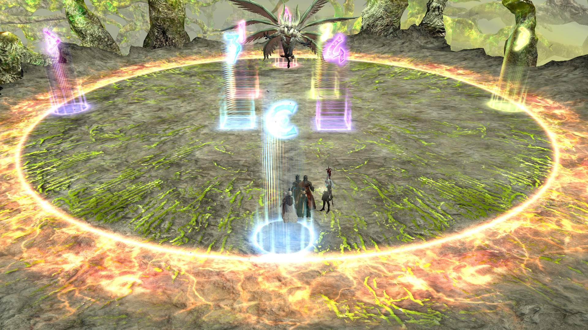

# Eden's Verse: Furor (Savage)

## Timeline


*(Credit: [u/Syldris](https://www.reddit.com/r/ffxiv/comments/fl6vmk/e6s_timeline_image/))*

## English
```
■ Basic Pairs ※ Use anti-knockbacks
　MT/D1　　ST/D2
　H1/D3　　H2/D4
■ Divided Arena
　Ifrit+Garuda teams as above
■ Raktapaksa Tethers
　1st (North):　MT, ST, H1, H2
　2nd (South):　D1, D2, D3, D4
　※ DPS rotate clockwise after final phase's Enumeration
■ Conflag Strike
　DPS→West　 TH→East
　Vortexes：MT→North、OT→South
　※ Pairs (end of Conflag)
　D1D4　　MT・H　※ Tanks, D3D4 fixed
　D2D3　　ST・H　 ※ Healers, D1D2 adjust
```

## Japanese
```
■基本ペア ※吹き飛ばし無効
    MT/D1        ST/D2
    H1/D3        H2/D4
■分断　※2体ﾌｪｰｽﾞは北東固定
　北基準で基本散会通り
■合体後線取り　※ｲﾌﾌｪｰｽﾞはヒラ遠隔
   1回目：北側で　MT, ST, H1, H2
   2回目：南側で　D1, D2, D3, D4
   最終ﾌｪｰｽﾞｶｳﾝﾄ後はDPS時計回りで処理
■ｺﾝﾌﾗｸﾞﾚｰｼｮﾝｽﾄﾗｲｸ
  DPS→西　 TH→東
   渦処理：MT→北、ST→南
☆竜巻後ペア
    D1D4　　MT・H　　※MTST、D3D4固定
    D2D3　　ST・H　　  ※ヒラ近接移動
```

## Variants

You may see configurations where D3 and D4 are on Ifrit, while D1 and D2 are on Garuda.

## Strategy

Akito's strat/アキト式: [video](https://www.youtu.be/dAzhPxWFao4)

Amaya's strat/あまや式: [link](https://jp.finalfantasyxiv.com/lodestone/character/9416493/blog/4354941/)

## Markers

`ABCD` are for orientation. `1234` are for resolving Air Bumps.
