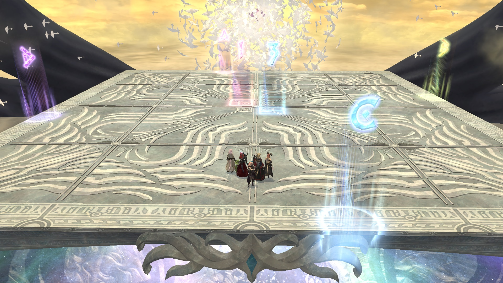

# Eden's Verse: Iconoclasm (Savage)

## English
```
■ Betwixt Worlds (stacks)
  Center-west：MT H1　Center-east：ST H2
■ 2nd Words of Motion ⇒ Away with Thee
  MT　　ST　　　　 　　MT
  D1　　D2　　⇒　　　ST
  D3　　D4　　⇒ <DPS stack>
  H1　　H2　　　　　　H1
■ Adds phase　　　H2
  Left：MTD1D3H1　Right：STD2D4H2
■ Words of Entrapment
  N+E: Tanks　S+W: Healers
■ Words of Night
  Spread strat (same quadrants as 2nd Words of Motion)
■ Words of Fervor
Orb priority: Healers＞D1＞D2＞D3＞D4
```

## Japanese
```
■次元孔（頭割り位置）
  中心西：MT H1　中心東：ST H2
■波状の号令2回目⇒整列
  MT　　ST　　　　 　　MT
  D1　　D2　　⇒　　　ST
  D3　　D4　　⇒ 　　頭割り
  H1　　H2　　　　　　H1
■雑魚フェーズ　　　　　H2
  左：MTD1D3H1　右：STD2D4H2
■包囲の号令
  北/東：タンク　南/西：ヒラ
■夜襲の号令
  波状2回目の散開でペア
■乱舞の号令
玉取り優先度　ヒラ＞D1＞D2＞D3＞D4
```

## Markers



## Words of Night (Colours + Portals)

クルル式 (Kururu/Krile strat): [video](https://www.youtu.be/eW5YzRFim1U)

1. Get hit by opposing colour.
2. Get hit by opposing colour in the NE corner. **Check colour of NW portal.**
3. Move one column west to bait AoEs.
4. Go back to east-most column.
   - If NW portal was **red**: Switch row, then switch row again after AoEs hit.
   - If NW portal was **blue**: Stay on the same row all the way. 

## 1st Away with Thee

DPS positions are based on which ball you are tethered to.


## Timeline


*(Credit: [u/Syldris](https://www.reddit.com/r/ffxiv/comments/fld0v5/e7s_timeline_image/))*