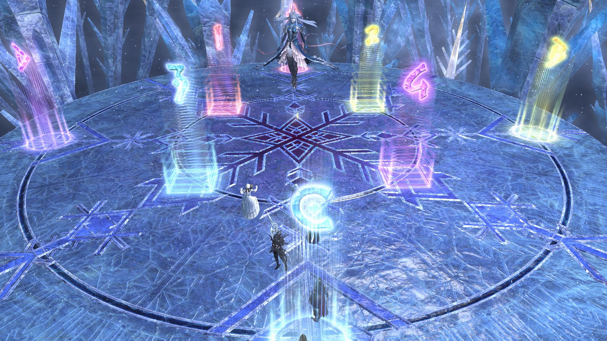
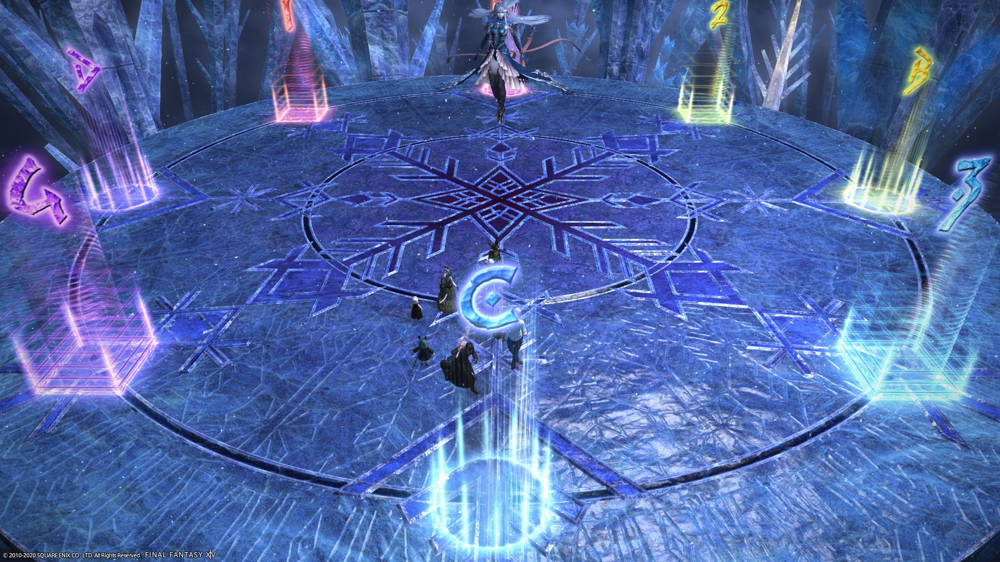

# Eden's Verse: Refulgence (Savage)

By the end of the tier, the most common strategies were "DD out", "Ayatori Light Rampant" and "Arthars' strat" (a.k.a. "KB uptime)

## English
```
■ Diamond Frost
　AoEs： Tank NW　Healer:NE
　　　　  DPS: South (West: D1>2>3>4: East)
　Flares： Tank：N or W　Healer：S or E
　DPS：Bait AoEs south
■ Light Rampant: Ayatori's Strat
　Square： Tank + SW DPS swap
　Hourglass： Healer + SW DPS swap
■ Mirrors
　　　MTD3　　　H1D1　MTD3
　H1D1　H2D2
　　　STD4　　　  STD4　H2D2
※ If spread, tanks/melee by the boss.
■ Adds： West: MT,H1,D1,D3　East: ST,H2,D2,D4
　Tether：H > T > D3/4 > D1/2
　Silence：(West) D3>MT　(East) OT、Stun
■ Akh Morn
　(West)MT,H1,D1,D3　(East)ST,H2,D2,D4
■ Wyrm's Lament #1
　N: TH14s > DPS20s > TH22s > DPS28s
　S: TH30s > DPS36s > TH38s > DPS44s
■ Hallowed Wings: Fixed at red
　　　　　※Use knockbacks
　Red: MT (H1,D1,D3)　Mid: ST (H2,D2,D4)
■ Icelit Dragonsong
　D1　MT　D2
　H1　　　  H2
　D3　ST　 D4
■ Wyrm's Lament #2
　West: MT→H1　East: ST→H2
　West: D1>2>3>4
　※Invuln 1st and 2nd Morn Afahs
```

## Japanese

(N.B: This is the macro with  "DD out", "Ayatori Light Rampant" and "Fixed at red Hallowed Wings" strat)
```
■ﾀﾞｲｱﾓﾝﾄﾞﾀﾞｽﾄ
　AoE：北西タンク　北東ヒラ
　　　　南DPS(西D1>2>3>4)
　無職T：北or西　H：南or東　D：3連AoE南捨て
■光の暴走：あやとり式
　四角：タンクと南西DPS交換
　砂時計：ヒラと南西DPS交換
■鏡(十字)　　　　(X字)
　　　MTD3　　　H1D1　MTD3
　H1D1　H2D2
　　　STD4　　　  STD4　H2D2
※散開の場合はタンクと近接は敵側、ヒラ遠隔キャスは鏡側に散開
■雑魚：西MTH1D1D3　東STH2D2D4
　線：H>T>D34>D12
　沈黙(西)D3>MT　(東)ST、スタン
■アクモーン
　西MTH1D1D3　東STH2D2D4
■生首
　北TH14s>DPS20s>TH22s>DPS28s
　南TH30s>DPS36s>TH38s>DPS44s
■ぼよん赤固定　※ノックバック無効技使用
　赤MT(H1D1D3)　黄ST(H2D2D4)
■竜詩
　D1　MT　D2
　H1　　　  H2
　D3　ST　 D4
■聖竜の咆哮
　西MTH1　東STH2
　西D1>2>3>4
　※アファー1・2回目無敵受け。
```

## Markers

**Markers (inside DD/DD内捨て)**


**Outside DD/DD外捨て**


## Diamond Frost/ダイモンド・ダスト(DD)

(Yes, it's called "Diamond Frost", not "Diamond Dust" in English...)
  - **DD in/内捨て**: Everyone gets knocked back to the edges.
  - **DD out/外捨て**: Only Flare'd healer gets knocked back. Everyone else uses Arm's Length/Surecast. DPS baiting AoEs start in the south sector.

*Driving/Biting Frost*:
  - **Japanese** parties will always face the boss outside the arena, and it is the party's responsibility to move to the safe side.
  - **English** parties will have the MT turn the boss so the safe side faces the party (i.e: if the boss did Biting Frost first)


## Light Rampant/光の暴走

The standard is **Ayatori's strat/あやとり式**:

JP: [video](https://youtu.be/AXVwgQRr3J0?t=198)  
JP: [video](https://youtu.be/pmYgfT3Dbno)  
EN (Zuinx#3536): [video](ttps://youtu.be/ySKy8uXRcxc)  
EN guide (Nic#3333): [link](https://docs.google.com/presentation/d/1J-Niu4T-joOKG0Kt3vv7UzBBNUZ6PMXUTQTvoEZehRU/)  

## Hallowed Wings/ぼよんぼよん

(In particular, the Hallowed Wings to the front)
There are three main ways of doing this-
- **アーサー/"Arthars' strat"/"KB Uptime strat"**: Arm's Length/Surecast both knockbacks. Surecast timing is tight; screwing it up will get you tossed off the arena.

Twitch clip: [video](https://clips.twitch.tv/InquisitiveCheerfulClamHassanChop)  
JP explanation: [video](https://youtu.be/hCiDNU6pIxk)  

- **赤固定:/"Fixed at red"**: Party moves towards the red mirror and uses Arm's Length/Surecast. Party will get knocked back on the third Wings. Safest, but less uptime compared to Arthas'.

- **色固定/"Fixed at colours"**: Party moves towards the green mirror. No Arm's Length/Surecast. Party will get knocked twice, on the second and third Wings. This strat is the least common.

## Final Akh Morns/最終のアク・モーン

D2 and D3 will need to swap Akh Morn stacks if both reds or both blues are on the same side. Oftentimes, this is done after the first (5-hit) Akh Morn, but it is sometimes done before. 

## Timeline


*(Credit: [u/Syldris](https://www.reddit.com/r/ffxiv/comments/fm0rm4/e8s_timeline_image/))*