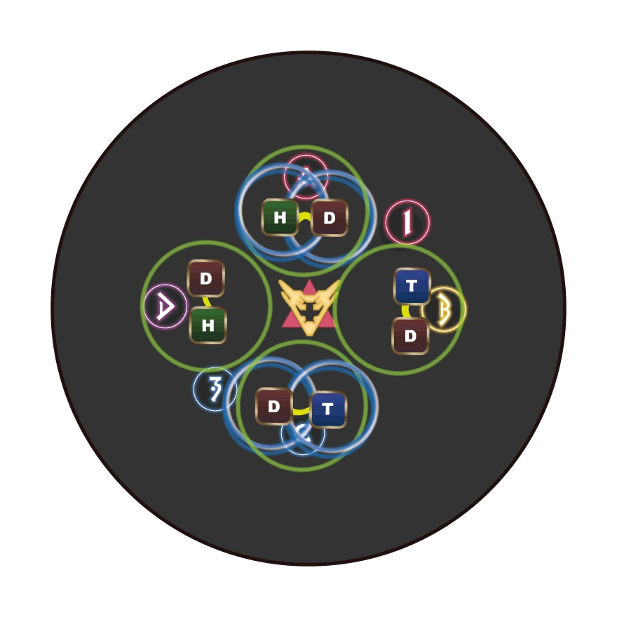
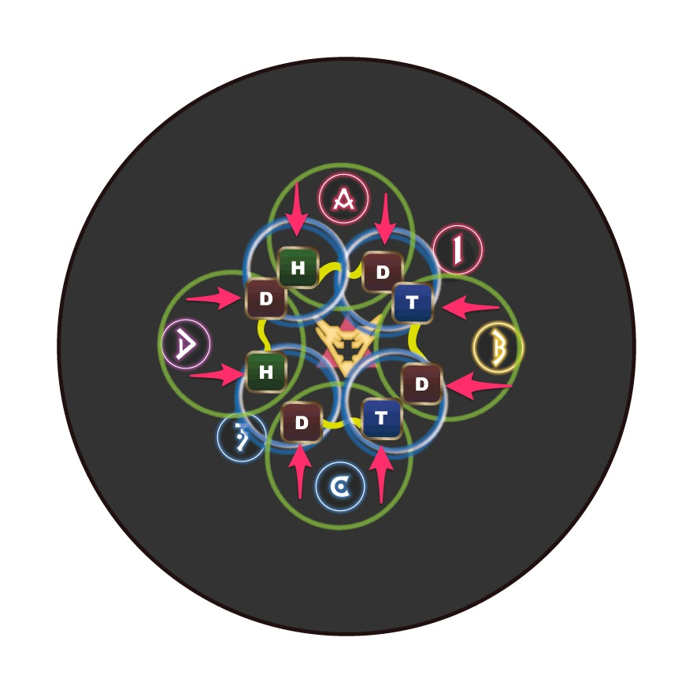
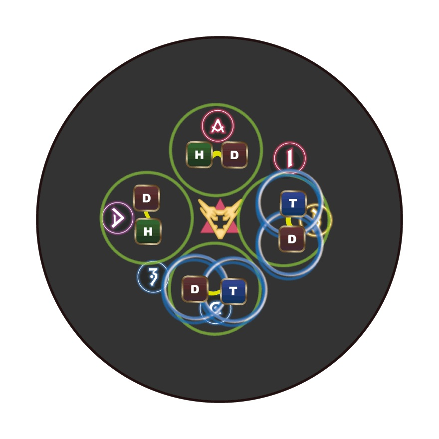

# Storm's Crown (Extreme)

This is [game8's macro](https://game8.jp/ff14/477950).

It's basically [Hamkatsu's strat](https://youtu.be/FToWDK7uy4w), but resolves Playstation symbols in a "braindead" manner (T/H go to assigned cardinals, DPS all stack in the center and get pulled to their assigned partner). 

## Japanese
```
【基本散開】 　【ペアバンプ】　【散開基準】
　D3 MT D4　　　MTD3　　　ヘアレイド：ボス基準
　H1　　H2　 H1D1　 H2D4　それ以外：北基準
　D1 ST D2　 　　 STD2
【ヘアレイド】D3 H1 MT ◎ ST H2 D4
　　　　　　　　　　  D1　D2
【距離減衰+頭割り】【プレステ脳死：TH固定】
　　MT　　ST　　　　　　  MT　　※Tの２回目は
　　　　◎ 　　　　　　H1 DPS H2　1回目と同じ
　　　頭割り 　 　　 　　　   ST　　　マーカー付近
【呪髪拘束1】① ③マーカー頭割り
【呪髪拘束2】DPS：時計回り　TH：反時計回り
【4連円範囲捨て】Cマーカー付近から時計回り
【プレステバンプ】  隣：隣組とペア
　　　　　　　　対角：DPS時計側 TH反時計側とペア
```

## English
```
【Spread】　　　 【Pairs】　Spreads relative to：
　D3 MT D4　　　　MTD3　　　Hair Raid: Boss
　H1　　H2　 　H1D1　 H2D4　Others：True N
　D1 ST D2　　 　　 STD2
【Hair Raid】H1 MT ◎ ST H2
　　　　　　　D3 D1　D2 D4
【2x Flares + stack】【Playstation (braindead)】
　　MT　　ST　　　　　　　MT　　※ Use original
　　　　◎ 　 　　　 　　H1 DPS H2　　MT/ST
　　　stack 　　　　　　　　ST　　　　positions
【Teasing Tangles #1】Pairs at ①+③
【Teasing Tangles #2】DPS：cw　TH：ccw
【Mario Kart】Start at C, run clockwise
【PS Bumps】Adjacent：Stack with adjacent pair
　　　　　　　Opposite：cw DPS + ccw T/H pairs
```

## Markers

You might see the `ABCD` markers placed further out towards the edge of the arena.

- `ABCD`: Orientation, T/H Playstation positions
- `C`: Party stack during 2x Flares + stack
- `1` and `3`: Enumeration pairs during Teasing Tangles


<details markdown=block>
<summary>XIVLauncher WaymarkPresetPlugin positions</summary>

```json
{"Name":"Barbariccia EX","MapID":871,"A":{"X":100.0,"Y":0.0,"Z":91.5,"ID":0,"Active":true},"B":{"X":108.5,"Y":0.0,"Z":100.0,"ID":1,"Active":true},"C":{"X":100.0,"Y":0.0,"Z":108.5,"ID":2,"Active":true},"D":{"X":91.5,"Y":0.0,"Z":100.0,"ID":3,"Active":true},"One":{"X":106.0,"Y":0.0,"Z":94.0,"ID":4,"Active":true},"Two":{"X":106.0,"Y":0.0,"Z":94.0,"ID":5,"Active":false},"Three":{"X":94.0,"Y":0.0,"Z":106.0,"ID":6,"Active":true},"Four":{"X":94.0,"Y":0.0,"Z":106.0,"ID":7,"Active":false}}
```
</details>

## Playstation 2 + Air Bumps

<table>
  <tr>
    <td>
      <p><b>Case 1: Enumeration pairs are opposite each other.</b></p>
      <p>Pair with the player beside you in the adjacent pair.</p>
    </td>
    <td></td>
    <td></td>
  </tr>
  <tr>
    <td>
      <p><b>Case 2: Enumeration pairs are adjacent to each other.</b></p>
      <p>Stack with the adjacent pair (Enumeration pair + no enumeration pair).</p>
    </td>
    <td></td>
    <td></td>
  </tr>
</table>

*(Credit: [Game8](https://game8.jp/ff14/477950))*