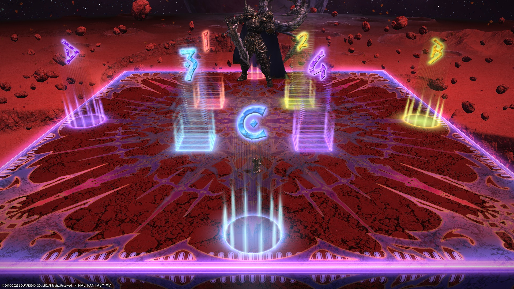
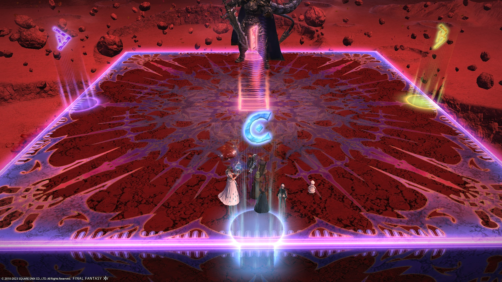

# The Voidcast Dais (Extreme)

There are two strats that are going around:

1. [Game8 (Modified Hamkatsu)](#game8-modified-hamkatsu) *(this is by far the more common strat)*
2. [FFO (Modified Nukemaru)](#ffo-modified-nukemaru)

### Things to check

Check the following things:

1. How the groups are split for Void Stardust.
  - Game8/Hamkatsu puts the **MT group north, ST group south**.
  - Nukemaru/FFO puts the **MT group west, ST group east**.
2. The stack positions during Terrastorm + Arctic Assault.
  - Game8/Hamkatsu puts the **MT group outside, ST group inside**.
  - Nukemaru/FFO puts the **MT group inside, ST group outside**.
  - The FFO melee uptime variant puts **melee inside** (MTH1D1D2), and **ranged outside** (STH2D3D4).

To summarize:

- **Game8/Modified Hamkatsu** (ハムカツ改) → N/S Stardust, MT group outside *(most common)*
- **FFO/Modified Nukemaru** → E/W Stardust, MT group inside
- **FFO melee uptime** (アース氷近接内) → E/W Stardust, melee inside

## Game8 (Modified Hamkatsu)

[Game8](https://game8.jp/ff14/529320) has gone ahead with Hamkatsu's strat for Golbez EX.



*N.B: Hamkatsu has released a [follow-up video](https://youtu.be/uqJI2jL-8rw) where he updated the Gale Sphere positions to melee-in, ranged-out.

The key points to note are:
- Void Stardust splits are **North/South**.
- The MT group is **outside** for Terrastorm + Arctic Assault + stacks.

### English

```

```

### Japanese

```

```

## FFO (Modified Nukemaru)

Nukemaru has also released their guide to the fight, which is the base of the FFO strat.

If you take Nukemaru's strat and also update the Gale Sphere positions like the Modified Hamkatsu strat, you get the FFO strat.


*(English subtitled)*

The key points to note are:
- Void Stardust splits are **East/West**.
- The MT group is **inside** for Terrastorm + Arctic Assault + stacks.

### English

```

```

### Japanese

```

```

To get the FFO melee uptime variant, the groups for Terrastorm + Arctic Assault + stacks would be:

- Melees in (MTH1D1D2)
- Ranged out (STH2D3D4)

## Markers

Game8/Hamkatsu uses the following markers:

- `ABCD` are for orientation. 
- The `1` marker in the middle is for the healer knockback position.

<details markdown=block>
<summary>XIVLauncher WaymarkPresetPlugin positions</summary>

```json
{"Name":"Golbez EX","MapID":950,"A":{"X":100.0,"Y":0.029,"Z":87.0,"ID":0,"Active":true},"B":{"X":113.0,"Y":0.029,"Z":100.0,"ID":1,"Active":true},"C":{"X":100.0,"Y":0.029,"Z":113.0,"ID":2,"Active":true},"D":{"X":87.0,"Y":0.029,"Z":100.0,"ID":3,"Active":true},"One":{"X":100.0,"Y":0.029,"Z":100.0,"ID":4,"Active":true},"Two":{"X":100.0,"Y":0.029,"Z":100.0,"ID":5,"Active":false},"Three":{"X":100.0,"Y":0.029,"Z":100.0,"ID":6,"Active":false},"Four":{"X":100.0,"Y":0.029,"Z":100.0,"ID":7,"Active":false}}
```
</details>

You can use these markers instead:

- `ABCD` are for orientation. 
- The `1234` markers demarcate the boundaries of the Gale Force line AoEs (markers are *not* safe), and players can stand on the markers to get knocked back to the towers.

<details markdown=block>
<summary>XIVLauncher WaymarkPresetPlugin positions</summary>

```json
{"Name":"Golbez EX","MapID":950,"A":{"X":100.0,"Y":0.029,"Z":87.0,"ID":0,"Active":true},"B":{"X":113.0,"Y":0.029,"Z":100.0,"ID":1,"Active":true},"C":{"X":100.0,"Y":0.029,"Z":113.0,"ID":2,"Active":true},"D":{"X":87.0,"Y":0.029,"Z":100.0,"ID":3,"Active":true}, "One":{"X":103.9,"Y":0.029,"Z":96.1,"ID":5,"Active":true}, "Two":{"X":103.9,"Y":0.029,"Z":103.9,"ID":7,"Active":true}, "Three":{"X":96.1,"Y":0.029,"Z":103.9,"ID":6,"Active":true}, "Four":{"X":96.1,"Y":0.029,"Z":96.1,"ID":4,"Active":true}}
```
</details>

## Timeline

*(Credit: [u/ExiaKuromonji](https://www.reddit.com/r/ffxiv/comments/13qswiz/spoiler_64_ex6_abilities_and_timeline/))*

## Frequently Asked Questions

<details markdown=block>
<summary><b>[Game8]</b> What was the modification made to Hamkatsu's to get to Game8?</summary>
<table>
  <tr><td><p>The difference is in the lineup for Gale Spheres #2 and #3.</p>
  <p>Hamkatsu's original strategy has the tanks/healers and DPS line up differently:</p>
  <pre><code>N/W：MTD1 > STD2 > H1D3 > H2D4：S/E</code></pre>
  <p>This has a couple issues, namely that it is difficult for the MT and D1 to maintain uptime on the boss.</p>
  <p>Hamkatsu released a <a href="https://youtu.be/uqJI2jL-8rw/">follow-up video</a> where he updated the Gale Sphere positions to what we have now (melee-in, ranged-out), which Game8 picked up, hence the "Modified Hamkatsu".</p></td></tr>
</table>
</details>
<details markdown=block>
<summary><b>[FFO]</b> What was the modification made to Nukemaru's strat to get to FFO?</summary>
<table>
  <tr><td><p>The difference is how the two strategies resolves the 4:4 light party stacks during Gale Sphere #2 and #3.</p>
  <ul>
    <li>The <b>FFO strat</b> follows Hamkatsu, and puts the MT group towards N/W, and the ST group towards S/E.</li>
    <li><b>Nukemaru's strat</b> mirrors the Terrastorm + Arctic Assault stacks, with the MT group near the boss, and the ST group away <em>(and it wasn't clear which side)</em>.</li>
  </ul>
  <p>If you take Nukemaru's strat, and replace Gale Spheres with the melee-in method in Hamkatsu's modified strat, you get the FFO strat.</p></td></tr>
</table>
</details>