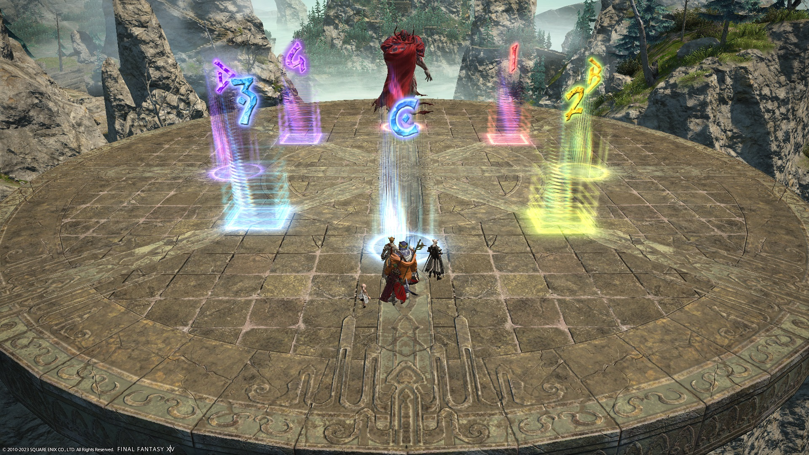

# Mount Ordeals (Extreme)

There are currently two main strats that are going around- the FFO strat, and Nukemaru's strat (which Game8 has also adopted).

Both strats are identical, *except* for how Flamerake is handled and where the party stacks during Sweeping Immolation.

### Things to check on Party Finder

- Check how Flamerake is being resolved.
- Check the stack/spread positions for Sweeping Immolation.

## FFO strat

The following is the FFO macro for Rubicante EX. It's the macro that best approximates what *actually* gets done in PF, and is the one I would like to use.

### Japanese
```

```

### English
```

```

## Game 8/Nukemaru's strat

These macros are from [Game8](https://game8.jp/ff14/507079) which follows Nukemaru's strat.



### Japanese
```

```

### English
```

```

## Markers

- The markers are the spread positions during Flamerake and Scalding Ring/Signal.



## Timeline


*(Credit: [u/ExiaKuromonji](https://www.reddit.com/r/ffxiv/comments/10ai5g6/63_trial_timeline/))*