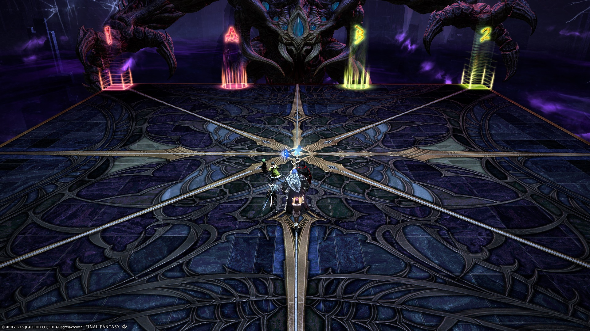

# The Abyssal Fracture (Extreme)

[Game8](https://game8.jp/ff14/557945) has gone ahead with Hamkatsu's strat:



### English
```

```

### Japanese
```

```

## Markers

- The `AB` markers are for the party to stack at during Black Hole, while the `12` markers are for the blue marker.



## Frequently Asked Questions

<details markdown=block>
<summary><b>[Meteors]</b> Can a tank invuln the tethers and not stretch their tether instead?</summary>
<table>
  <tr><td><p>Alas, no- the damage from the tethers ignores invulnerability.</p><p>With some help from the party, an unstretched tether <em>can</em> be super-mitigated- it will hit a tank for about 300% of their max HP (remember there are Max HP down debuffs at the time!).</p></td></tr>
</table>
</details>