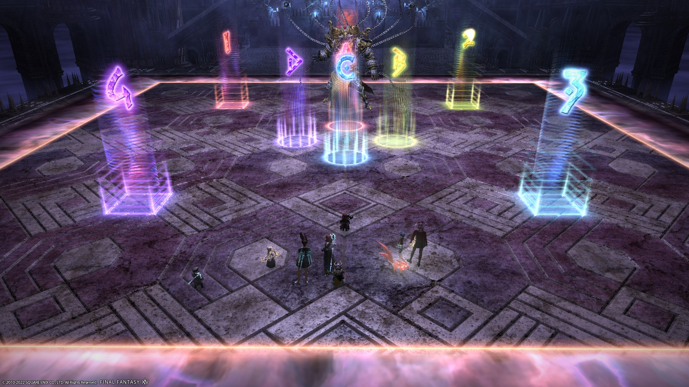

# Asphodelos: The First Circle (Savage)

PF references the following guides for P1S:

- [Inumaru](https://www.youtube.com/watch?v=Hb7zp2AUACA)
- [Nukemaru](https://www.youtube.com/watch?v=6Q2IMu5cINQ)

#### Things to check

- Check the chain pairs (Japanese groups pair MT+D4 instead of MT+D3, etc.)
- Check the markers. In particular, Japanese groups rotate all the outer markers clockwise.

## English

```
【Spread Positions】
　　D3 MT D4
　　H1 ▲ H2
　　D1 ST D2
【Aetherial Shackles】
Swap within same coloured marker as needed.
【Intemperance】
S tile not 3x Ice → MT+D3 swap for 3rd gems.
【Tankbusters (Pitiless Flails)】
Tank swap, Knockback to NW, Flare NE
【Shackles of Time】
Debuff: White, Party: Red
【Fourfold Shackles】
In order of ascending debuff time (3,8,13,18s)
Purple：ABCD, Red：1234
```

## Japanese

```
【基本散開】
　D3 MT D4
　H1 ▲ H2
　D1 ST D2
【1回目鎖＆2回目光炎中の鎖】
マーカーに基本散開、同色マーカーのペアで交代して調整
【氷火の調整】
1・3個目別色時にMTD3が3個目を交代
【懲罰連撃】
スイッチ、北西側へノックバック、北東側から交代
【時限の縛鎖】
デバフ付いた人は白床、その他は赤床
【4連鎖】
時間の短い順に(3,8,13,18秒)
紫：ABCD、赤：1234
```

## Markers

The markers are for the purple/red chains. `1234` are for the red chains, while `ABCD` are for purple chains.

<details>
  <summary>XIVLauncher WaymarkPresetPlugin positions</summary>

<pre><code>{"Name":"P1S (EN)","MapID":809,"A":{"X":99.966,"Y":0.0,"Z":96.418,"ID":0,"Active":true},"B":{"X":103.367,"Y":0.0,"Z":100.085,"ID":1,"Active":true},"C":{"X":100.014,"Y":0.0,"Z":103.379,"ID":2,"Active":true},"D":{"X":96.711,"Y":0.0,"Z":100.131,"ID":3,"Active":true},"One":{"X":90.101,"Y":0.0,"Z":90.031,"ID":4,"Active":true},"Two":{"X":110.059,"Y":0.0,"Z":90.089,"ID":5,"Active":true},"Three":{"X":109.988,"Y":0.0,"Z":110.001,"ID":6,"Active":true},"Four":{"X":90.016,"Y":0.0,"Z":110.06,"ID":7,"Active":true}}
</code></pre>

</details>