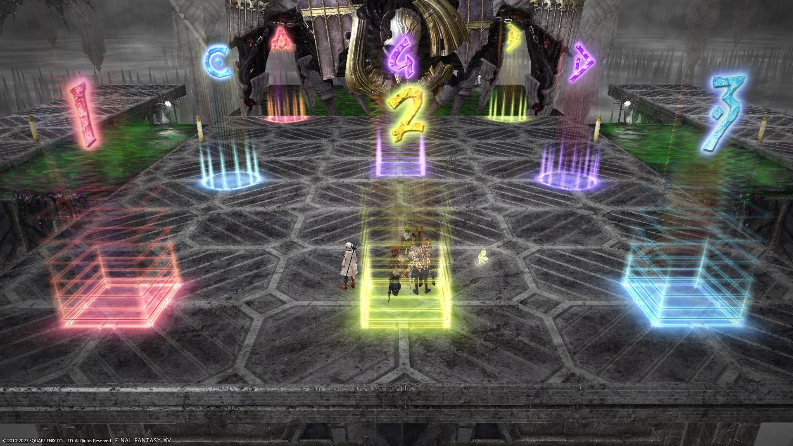

# Anabaseios: The Tenth Circle (Savage)

[Game8](https://game8.jp/ff14/532718) has gone with the FFO strat.

The FFO strat is just Inumaru's strat with a small adjustment to resolve the first set of Dæmoniac Bonds using just the west-side island.



### English

```

```

### Japanese

```

```

## Markers


<details markdown=block>
<summary>XIVLauncher WaymarkPresetPlugin positions</summary>

```json
{"Name":"P10S","MapID":939,"A":{"X":92.0,"Y":0.0,"Z":85.7,"ID":0,"Active":true},"B":{"X":108.0,"Y":0.0,"Z":85.7,"ID":1,"Active":true},"C":{"X":91.85,"Y":0.0,"Z":100.0,"ID":2,"Active":true},"D":{"X":108.15,"Y":0.0,"Z":100.0,"ID":3,"Active":true},"One":{"X":92.0,"Y":0.0,"Z":111.3,"ID":4,"Active":true},"Two":{"X":108.0,"Y":0.0,"Z":111.3,"ID":5,"Active":true},"Three":{"X":100.0,"Y":0.0,"Z":111.3,"ID":6,"Active":true},"Four":{"X":100.0,"Y":0.0,"Z":98.0,"ID":7,"Active":true}}
```

</details>