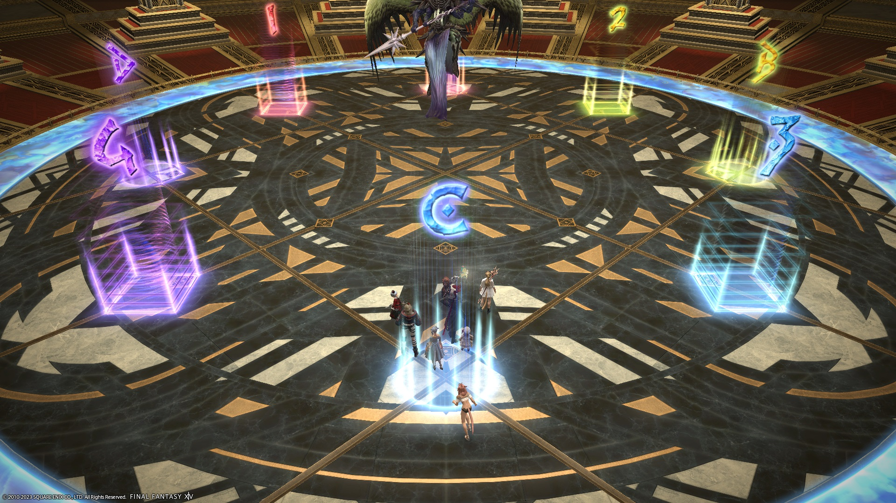
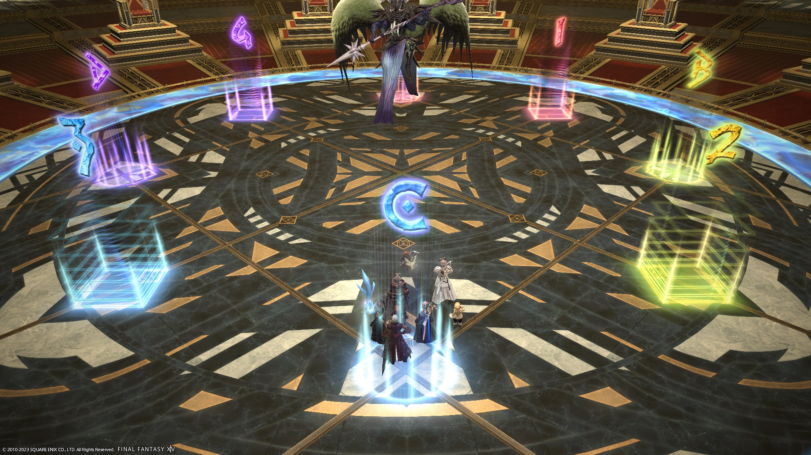

# Anabaseios: The Eleventh Circle (Savage)

<div style="background-color: #200 ; padding: 10px; border: 1px solid;"><b>UNDER CONSTRUCTION</b></div>

[Game8](https://game8.jp/ff14/532825) is using an updated version of Hamkatsu's strat, with ZizieZip's updated Light and Darkness strat.



### Things to check on Party Finder

- **Japanese** parties will:
  - Begin Shadowed Messengers with the boss facing true West. This results in two movements while dodging all the AoEs, but doesn't rely on the MT looking for the Light clone.
- **English** groups will:
  - Begin Shadowed Messengers with the boss facing the Light clone (or directly opposite), resulting in one less movement from the dodge.

### Japanese

```

```

## Markers

The colours indicate the pairs positions (MT/D3 are on red, etc).


<details markdown=block>
<summary>XIVLauncher WaymarkPresetPlugin positions</summary>

```json
{"Name":"P11S","MapID":941,"A":{"X":100.0,"Y":0.0,"Z":86.0,"ID":0,"Active":true},"B":{"X":114.0,"Y":0.0,"Z":100.0,"ID":1,"Active":true},"C":{"X":100.0,"Y":0.0,"Z":114.0,"ID":2,"Active":true},"D":{"X":86.0,"Y":0.0,"Z":100.0,"ID":3,"Active":true},"One":{"X":90.101,"Y":0.0,"Z":90.101,"ID":4,"Active":true},"Two":{"X":109.899,"Y":0.0,"Z":90.101,"ID":5,"Active":true},"Three":{"X":109.899,"Y":0.0,"Z":109.899,"ID":6,"Active":true},"Four":{"X":90.101,"Y":0.0,"Z":109.899,"ID":7,"Active":true}}
```

</details>

You may see the square markers rotated 90 degrees clockwise in Japanese parties.


<details markdown=block>
<summary>XIVLauncher WaymarkPresetPlugin positions</summary>

```json
{"Name":"P11S (JP)","MapID":941,"A":{"X":100.0,"Y":0.0,"Z":86.0,"ID":0,"Active":true},"B":{"X":114.0,"Y":0.0,"Z":100.0,"ID":1,"Active":true},"C":{"X":100.0,"Y":0.0,"Z":114.0,"ID":2,"Active":true},"D":{"X":86.0,"Y":0.0,"Z":100.0,"ID":3,"Active":true},"One":{"X":109.9,"Y":0.0,"Z":90.1,"ID":4,"Active":true},"Two":{"X":109.9,"Y":0.0,"Z":109.9,"ID":5,"Active":true},"Three":{"X":90.1,"Y":0.0,"Z":109.9,"ID":6,"Active":true},"Four":{"X":90.1,"Y":0.0,"Z":90.1,"ID":7,"Active":true}}
```

</details>

## Timeline

*(Credit: [u/ExiaKuromonji](https://www.reddit.com/r/ffxiv/comments/13xvne7/spoiler_64_p11s_timeline_and_abilities/))*
