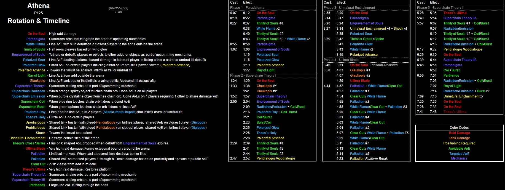
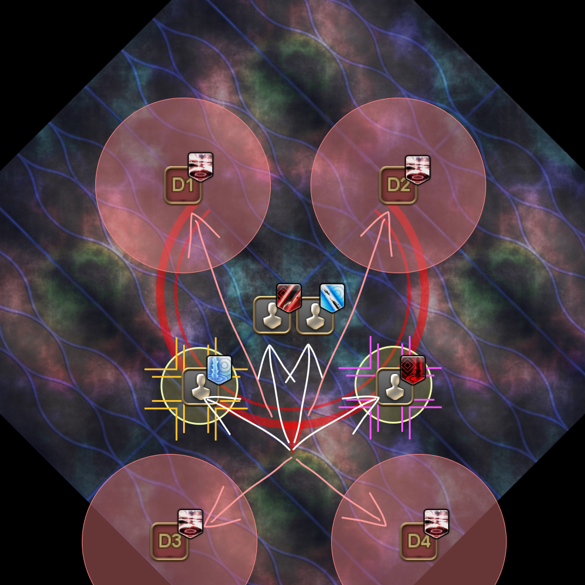
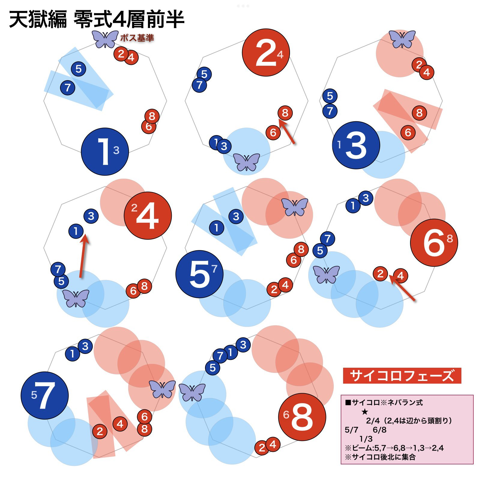

# Anabaseios: The Twelfth Circle (Savage) - Part 1

[Game8](https://game8.jp/ff14/534748) has gone along with Nukemaru's strategy for the fight:


*(English subtitled)*

- Invuln Paradeigma 1
- 十-shaped Paradeigma 2
- Idyllshire's Paradeigma 3
- Neverland's Limit Cut

### Approximate milestones

- **Under 32%** when the boss disappears for Limit Cut.

### English

```

```

### Japanese

```

```

## Markers


<details markdown=block>
<summary>XIVLauncher WaymarkPresetPlugin positions</summary>

```json
{"Name":"P12S-1","MapID":943,"A":{"X":100.0,"Y":0.0,"Z":82.0,"ID":0,"Active":true},"B":{"X":118.0,"Y":0.0,"Z":100.0,"ID":1,"Active":true},"C":{"X":100.0,"Y":0.0,"Z":118.0,"ID":2,"Active":true},"D":{"X":82.0,"Y":0.0,"Z":100.0,"ID":3,"Active":true},"One":{"X":110.0,"Y":0.0,"Z":90.0,"ID":4,"Active":true},"Two":{"X":110.0,"Y":0.0,"Z":110.0,"ID":5,"Active":true},"Three":{"X":90.0,"Y":0.0,"Z":110.0,"ID":6,"Active":true},"Four":{"X":90.0,"Y":0.0,"Z":90.0,"ID":7,"Active":true}}
```

</details>

## Timeline

*(Credit: [u/ExiaKuromonji](https://www.reddit.com/r/ffxiv/comments/141xz50/spoiler64_p12s_part_1_timeline_and_abilities/))*

## Superchain Theory 1

The debuffs applied during Superchain Theory 1 split the party into tanks/healers and DPS:

- One role is responsible for placing and resolving the aspected towers.
- The other role will spread for the Heavensflame AoEs.

Because of this, the movement after the third set of shapes is fixed:

<table>
  <tr>
    <th>Tanks + Healers Heavensflame, DPS towers</th>
    <th>DPS Heavensflame, Tanks + Healers towers</th>
  </tr>
  <tr>
    <td></td>
    <td></td>
  </tr>
</table>

## Limit Cut

The diagram below showcases the general idea, but the positioning for baiting the beams is inconsistent.

When baiting the beams, **PF will put the smaller number on the right**, facing inwards (numbers increase as you go clockwise).


*(Credit: [R'ubia Neko](https://twitter.com/RubiaNeko/status/1670087804431536128?s=20))*

## Frequently Asked Questions

<details markdown=block>
<summary><b>[Damage Down]</b> How strong is the damage down debuff in this fight?</summary>
<table>
  <tr><td><p>The Damage Down debuff in this phase lowers a player's damage by <b>38%</b>.</p></td></tr>
</table>
</details>