# Anabaseios: The Twelfth Circle (Savage) - Part 2

[Game8](https://game8.jp/ff14/535668) has listed out a strat, but oddly has not published a macro (yet).

Nukemaru has published a video outlining the PF strat:


*(English subtitled)*

### Things to check on Party Finder

- Check the Caloric Theory 1 strat.
  - **Japanese** parties will go with [Mochibe's strat](#mochibes-caloric-theory-1)
  - **English** parties will go with [Papan's strat](#papans-caloric-theory-1).

## Nukemaru + Mochibe's Caloric 1

This is the preferred strat by JP.

### English (Mochibe)

```

```

### Japanese (Mochibe)

```

```

### Markers (Mochibe)

The following markers are for Mochibe's Caloric Theory 1 strat:


<details markdown=block>
<summary>XIVLauncher WaymarkPresetPlugin positions</summary>

```json
{"Name":"P12S-2 (Mochibe)","MapID":943,"A":{"X":97.67,"Y":0.0,"Z":92.67,"ID":0,"Active":true},"B":{"X":102.33,"Y":0.0,"Z":92.67,"ID":1,"Active":true},"C":{"X":102.33,"Y":0.0,"Z":97.33,"ID":2,"Active":true},"D":{"X":97.67,"Y":0.0,"Z":97.33,"ID":3,"Active":true},"One":{"X":99.0,"Y":0.0,"Z":81.0,"ID":4,"Active":true},"Two":{"X":119.0,"Y":0.0,"Z":91.0,"ID":5,"Active":true},"Three":{"X":105.67,"Y":0.0,"Z":101.0,"ID":6,"Active":true},"Four":{"X":94.33,"Y":0.0,"Z":101.0,"ID":7,"Active":true}}
```

</details>

### Mochibe's Caloric Theory 1

<table>
  <tr>
    <td width="50%"><p><b>1.</b> One random tank/healer and one random DPS will be targeted with a Fire mark.</p>
    <p><em>In this example, ST and D3 are marked for Fire.</em></p>
    <ul>
      <li><b>Marked players:</b> Stand on either side of the blue-line intersection above the A and B markers.
        <ul>
          <li><b>Tank/healer:</b> Stand to the <b>west</b> of the intersection.</li>
          <li><b>DPS:</b> Stand to the <b>east</b> of the intersection.</li>
        </ul>
      </li>
      <li><b>All other players:</b> Stand between the C and D markers.</li>
    </ul></td>
    <td>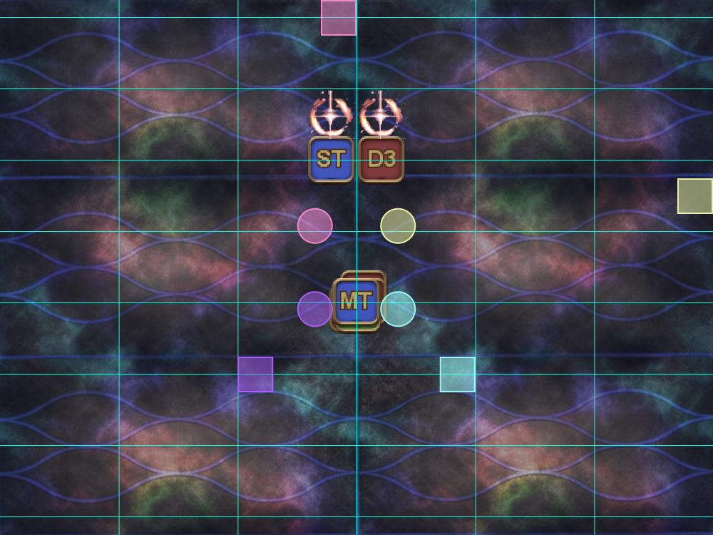</td>
  </tr>
  <tr>
    <td><p><b>2.</b> One of the marked players (at random) will be targeted for a shared damage AoE (shared between both marked players).</p>
    <p>The party also takes raid-wide damage.</p>
    <p>All party members get marked with either Pyrefaction (Fire ) or Atmosfaction (Wind ) debuffs.</p>
    <ul><li>The two marked players are guaranteed to get Wind.</li><li>The remaining four Fire and two Wind debuffs are randomly distributed among the six unmarked players.</li></ul>
    <p><em>In this example:</em></p>
    <ul>
      <li><em>MT, D1, D2, D4 are marked for Fire.</em></li>
      <li><em>ST, H1, H2, D3 are marked for Wind.</em></li>
    </ul></td>
    <td>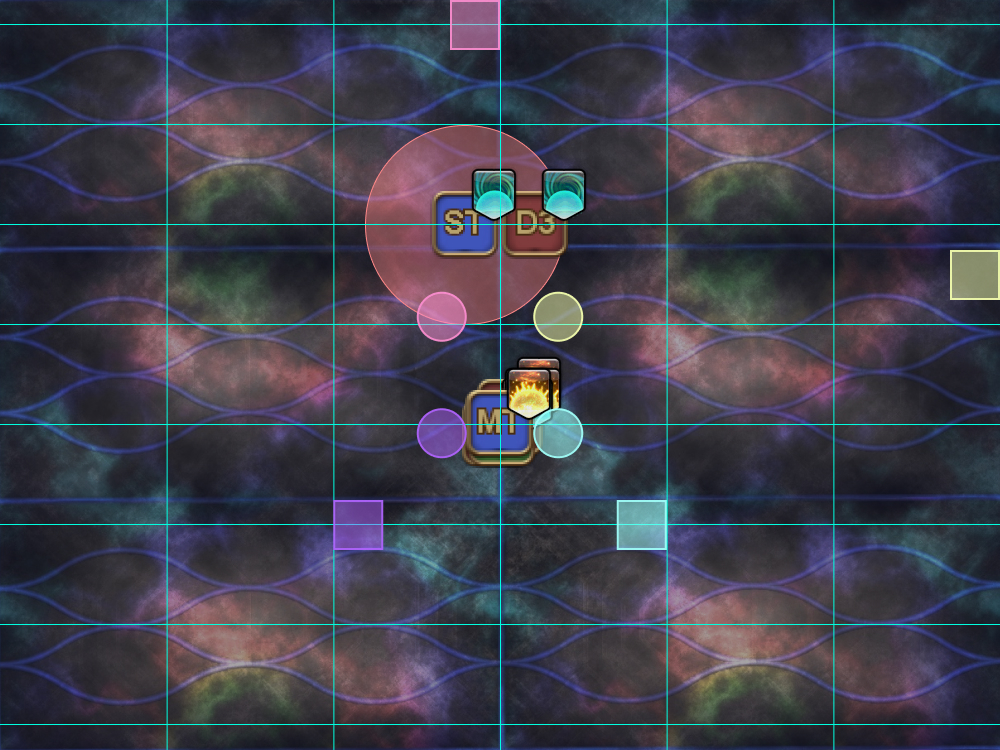</td>
  </tr>
  <tr>
    <td><p><b>3.</b> Move to create four pairs of Fire + Wind.</p>
    <ul>
      <li><b>Initially marked players:</b> Follow the blue line on the ground west/east, and stop directly above the A and B markers.</li>
      <li><b>All other players:</b> Take turns moving into position, following the priority order.</li>
    </ul>
    <p><b>Clockwise from A:</b> MT ST H1 H2 D1 D2 D3 D4</p>
    <p>The pairs on the north side should stand in the markers, but <b>above</b> the blue line.</p>
    <p>Similarly, the pairs on the south side should stand in the markers, but <b>below</b> the blue line.</p>
    <p><em>In this example, we have:</em></p>
    <ul>
      <li><em><b>A (NW):</b> MT (Fire), ST (Wind)</em></li>
      <li><em><b>B (NE):</b> D1 (Fire), D3 (Wind)</em></li>
      <li><em><b>C (SE):</b> D2 (Fire), H1 (Wind)</em></li>
      <li><em><b>D (SW):</b> D4 (Fire), H2 (Wind)</em></li>
    </ul></td>
    <td>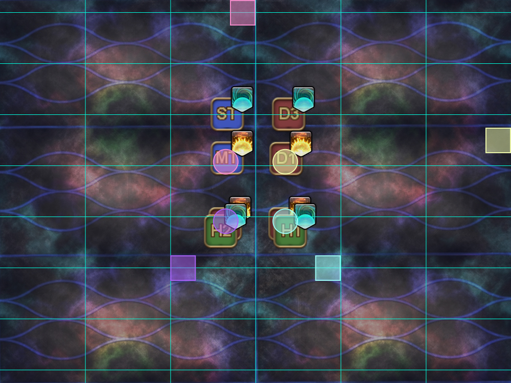</td>
  </tr>
  <tr>
    <td><p><b>4.</b> Fire stacks resolve.</p><p>Two of the four players that had Fire (at random) will keep their Fire debuffs.</p>
    <p><em>In this example, MT and D4 kept their Fire debuff.</em></p></td>
    <td></td>
  </tr>
  <tr>
    <td><p><b>5.</b> Wind players move out, while (previously) Fire players rearrange themselves to create two Fire + no-debuff pairs at the B and D markers.</p>
    <ul>
      <li><b>Wind players:</b> Move diagonally outwards to the next blue-line intersection on the ground.</li>
      <li><b>(Previously) Fire players:</b> Either move vertically, or criss-cross to create two pairs at the A and B markers.</li>
    </ul>
    <p><em>In this example, D4 and D2 have to cross diagonally (the worst-case scenario).</em></p></td>
    <td>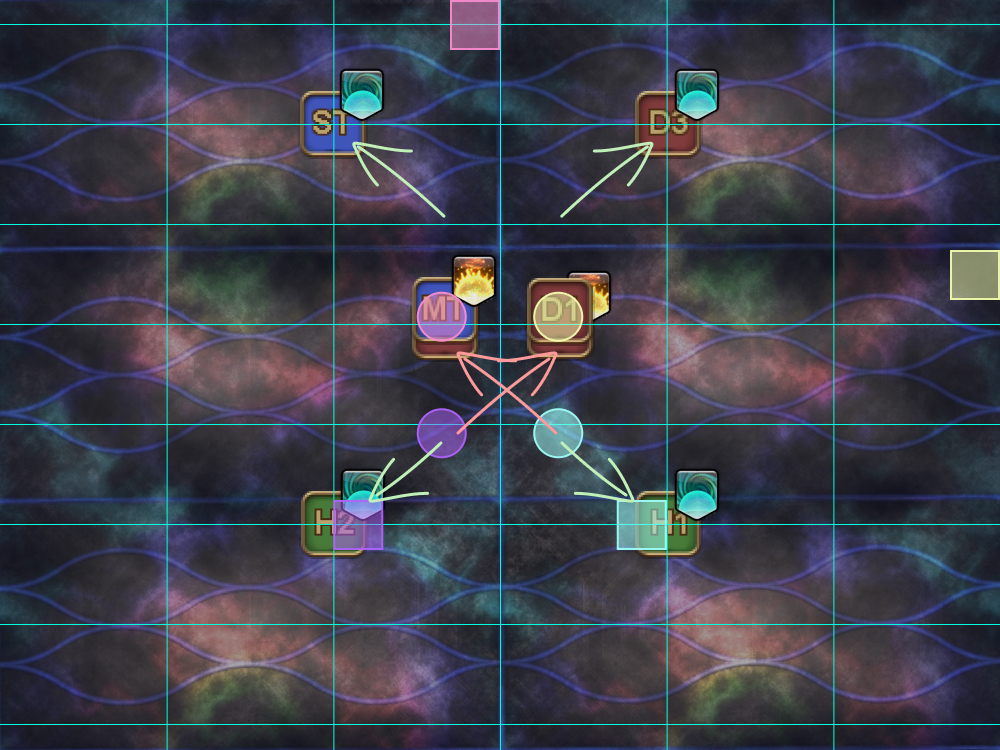</td>
  </tr>
  <tr>
    <td><p><b>6.</b> Fire stacks and Wind AoEs resolve.</p></td>
    <td>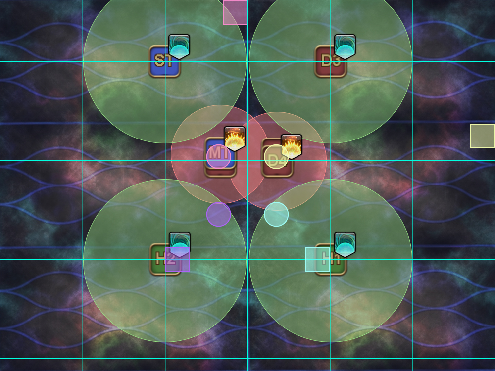</td>
  </tr>
</table>

## Nukemaru + Papan's Caloric 1

This is the preferred strat by EN. The macro below follows [Papan's Toolbox](https://ff14.toolboxgaming.space/?id=845983862306861&preview=1) and the following video guide:



### English (Papan)

```

```

### Markers (Papan)

The following markers are for Papan's Caloric Theory 1 strat:


<details markdown=block>
<summary>XIVLauncher WaymarkPresetPlugin positions</summary>

```json
{"Name":"P12S-2 (Papan)","MapID":943,"A":{"X":100.0,"Y":0.0,"Z":89.0,"ID":0,"Active":true},"B":{"X":104.0,"Y":0.0,"Z":93.0,"ID":1,"Active":true},"C":{"X":100.0,"Y":0.0,"Z":97.0,"ID":2,"Active":true},"D":{"X":96.0,"Y":0.0,"Z":93.0,"ID":3,"Active":true},"One":{"X":99.0,"Y":0.0,"Z":81.0,"ID":6,"Active":true},"Two":{"X":113.0,"Y":0.0,"Z":93.0,"ID":5,"Active":true},"Three":{"X":119.0,"Y":0.0,"Z":91.0,"ID":7,"Active":true},"Four":{"X":87.0,"Y":0.0,"Z":93.0,"ID":4,"Active":true}}
```

</details>

### Papan's Caloric Theory 1

<table>
  <tr>
    <td width="50%"><p><b>1.</b> Preposition with the healers + ranged at their assigned spots, and the tanks + melee in the middle of all the markers.</p><p>One random tank/healer and one random DPS will be targeted with a Fire mark.</p>
    <p><em>In this example, ST and D3 are marked for Fire.</em></p></td>
    <td>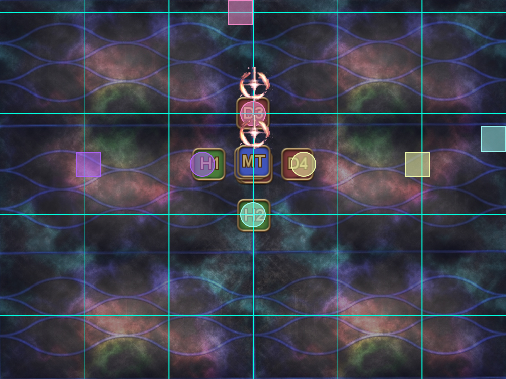</td>
  </tr>
  <tr>
    <td><p><b>2.</b> Swap positions as needed to get the marked players on the east (B) and west (D) markers.</p>
    <ul>
      <li><b>Marked tank/healer:</b> Swap positions with H1 (west).</li>
      <li><b>Marked DPS:</b> Swap positions with D4 (east).</li>
    </ul>
    <p>The players on the B and D markers should stand in the markers, but <b>towards the party in the middle</b>.</p></td>
    <td>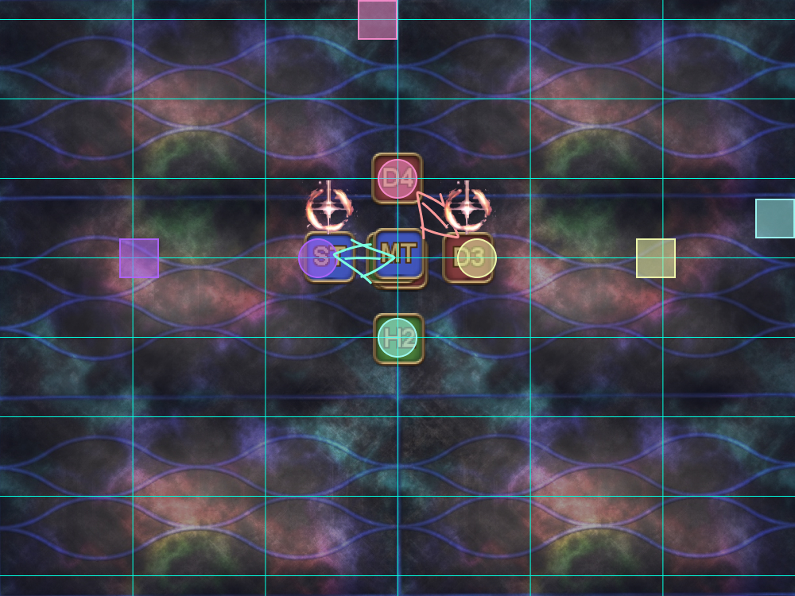</td>
  </tr>
  <tr>
    <td><p><b>3.</b> One of the marked players (at random) will be targeted for a shared damage AoE (shared with all the players in the middle).</p>
    <p>The party also takes raid-wide damage.</p>
    <p>All party members get marked with either Pyrefaction (Fire ) or Atmosfaction (Wind ) debuffs.</p>
    <ul><li>The two marked players are guaranteed to get Wind.</li><li>The remaining four Fire and two Wind debuffs are randomly distributed among the six unmarked players.</li></ul>
    <p><em>In this example:</em></p>
    <ul>
      <li><em>MT, D1, D2, D4 are marked for Fire.</em></li>
      <li><em>ST, H1, H2, D3 are marked for Wind.</em></li>
    </ul></td>
    <td>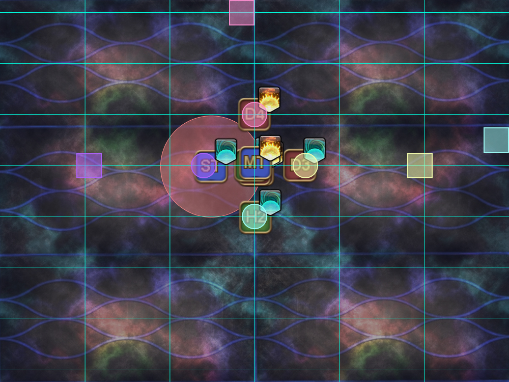</td>
  </tr>
  <tr>
    <td><p><b>4.</b> Move to create four pairs of Fire + Wind.</p>
    <p>Take turns moving into position, following the priority order.</p>
    <p><b>CCW from West:</b> H1 MT ST D2 D1 D4 <b>:CW from North</b></p>
    <p><em>(This is essentially ranged adjust first, then melee, with the MT group going first.)</em></p>
    <p><em>In this example, we have:</em></p>
    <ul>
      <li><em><b>North:</b> D4 (Fire), H1 (Wind)</em></li>
      <li><em><b>East:</b> D1 (Fire), D3 (Wind)</em></li>
      <li><em><b>South:</b> D2 (Fire), H2 (Wind)</em></li>
      <li><em><b>West:</b> MT (Fire), ST (Wind)</em></li>
    </ul></td>
    <td>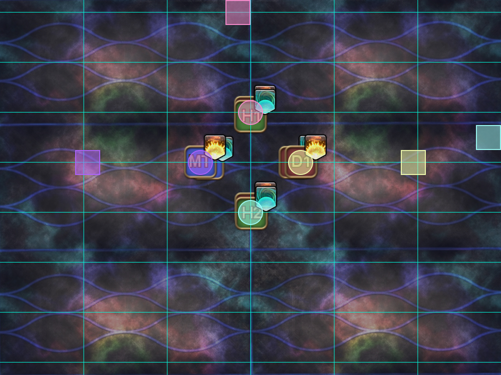</td>
  </tr>
  <tr>
    <td><p><b>5.</b> Fire stacks resolve.</p><p>Two of the four players that had Fire (at random) will keep their Fire debuffs.</p>
    <p><em>In this example, MT and D4 kept their Fire debuff.</em></p></td>
    <td>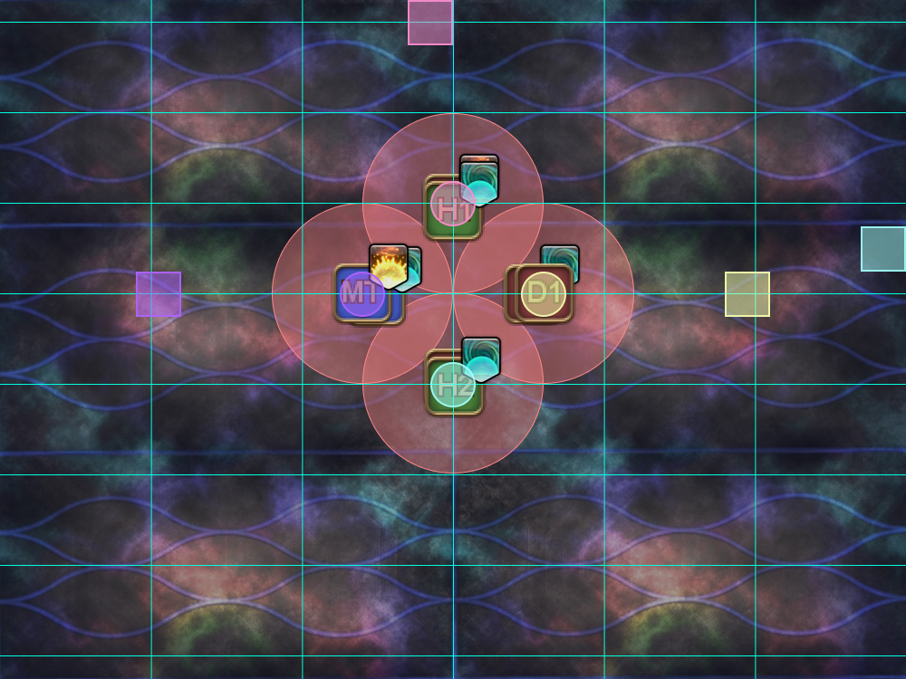</td>
  </tr>
  <tr>
    <td><p><b>6.</b> Wind players move out, while (previously) Fire players rearrange themselves to create two Fire + no-debuff pairs at the B and D markers.</p>
    <ul>
      <li><b>Wind players:</b> Move out to either the blue-line intersection on the ground (if you are North or South), or to the next set of waymarks (if you are East or West).</li>
      <li><b>(Previously) Fire players:</b> Rotate as needed to create two pairs at the A and B markers. Prioritise rotating <b>clockwise</b>, but be prepared to rotate anti-clockwise if clockwise doesn't give the correct configuration.</li>
    </ul>
    <p><em>In this example, D4 and D2 rotate clockwise.</em></p></td>
    <td></td>
  </tr>
  <tr>
    <td><p><b>7.</b> Fire stacks and Wind AoEs resolve.</p></td>
    <td>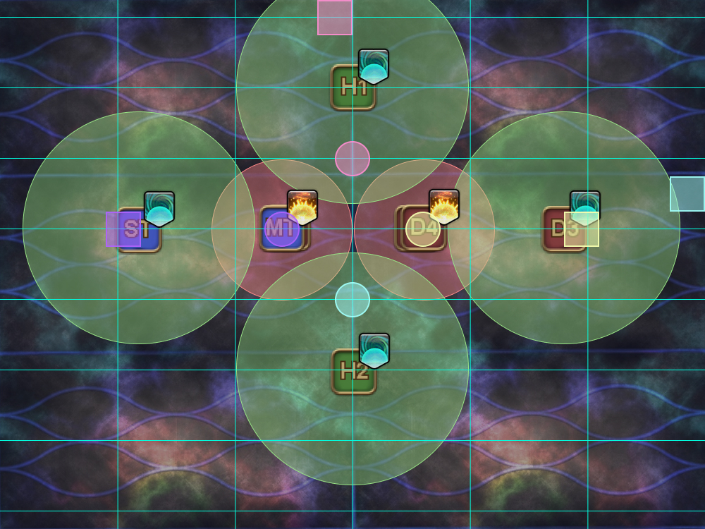</td>
  </tr>
</table>

## Timeline

*(Credit: [u/ExiaKuromonji](https://www.reddit.com/r/ffxiv/comments/141y028/spoiler64_p12s_part_2_timeline_and_abilities/))*