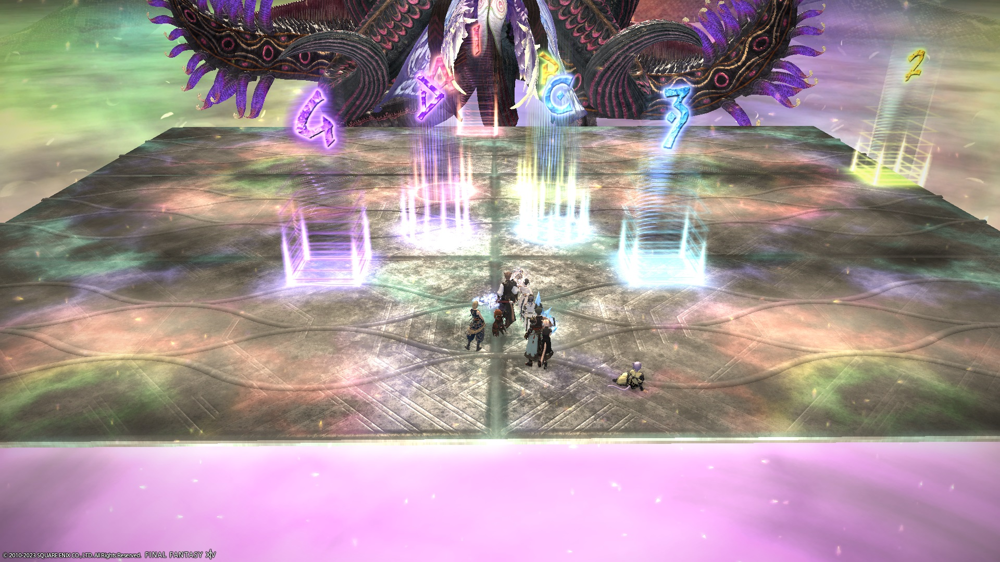
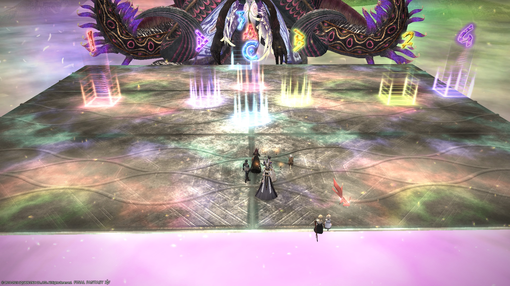

# Anabaseios: The Twelfth Circle (Savage) - Part 2

<div style="background-color: #200 ; padding: 10px; border: 1px solid;"><b>UNDER CONSTRUCTION</b></div>

[Game8](https://game8.jp/ff14/535668) has listed out a strat, but oddly has not published a macro (yet).

Meanwhile, Nukemaru has published a video outlining the PF strat:


*(English subtitled)*

### Things to check on Party Finder

- Check the Caloric Theory 1 strat.
  - **Japanese** parties will go with [Mochibe's strat](#nukemaru--mochibes-caloric-1).
  - **English** parties will go with [Papan's strat](#nukemaru--papans-caloric-1).

## Nukemaru + Mochibe's Caloric 1

This is the preferred strat by JP.

### English (Mochibe)

```

```

### Japanese (Mochibe)

```

```

### Markers (Mochibe)

The following markers are for Mochibe's Caloric Theory 1 strat:


<details markdown=block>
<summary>XIVLauncher WaymarkPresetPlugin positions</summary>

```json
{"Name":"P12S-2 (Mochibe)","MapID":943,"A":{"X":97.67,"Y":0.0,"Z":92.67,"ID":0,"Active":true},"B":{"X":102.33,"Y":0.0,"Z":92.67,"ID":1,"Active":true},"C":{"X":102.33,"Y":0.0,"Z":97.33,"ID":2,"Active":true},"D":{"X":97.67,"Y":0.0,"Z":97.33,"ID":3,"Active":true},"One":{"X":99.0,"Y":0.0,"Z":81.0,"ID":4,"Active":true},"Two":{"X":119.0,"Y":0.0,"Z":91.0,"ID":5,"Active":true},"Three":{"X":105.67,"Y":0.0,"Z":101.0,"ID":6,"Active":true},"Four":{"X":94.33,"Y":0.0,"Z":101.0,"ID":7,"Active":true}}
```

</details>

## Nukemaru + Papan's Caloric 1

This is the preferred strat by EN. The macro below follows [Papan's Toolbox](https://ff14.toolboxgaming.space/?id=845983862306861&preview=1) and the following video guide:



### English (Papan)

```

```

### Markers (Papan)

The following markers are for Papan's Caloric Theory 1 strat:


<details markdown=block>
<summary>XIVLauncher WaymarkPresetPlugin positions</summary>

```json
{"Name":"P12S-2 (Papan)","MapID":943,"A":{"X":100.0,"Y":0.0,"Z":89.0,"ID":0,"Active":true},"B":{"X":104.0,"Y":0.0,"Z":93.0,"ID":1,"Active":true},"C":{"X":100.0,"Y":0.0,"Z":97.0,"ID":2,"Active":true},"D":{"X":96.0,"Y":0.0,"Z":93.0,"ID":3,"Active":true},"One":{"X":99.0,"Y":0.0,"Z":81.0,"ID":6,"Active":true},"Two":{"X":113.0,"Y":0.0,"Z":93.0,"ID":5,"Active":true},"Three":{"X":119.0,"Y":0.0,"Z":91.0,"ID":7,"Active":true},"Four":{"X":87.0,"Y":0.0,"Z":93.0,"ID":4,"Active":true}}
```

</details>

## Timeline

*(Credit: [u/ExiaKuromonji](https://www.reddit.com/r/ffxiv/comments/141y028/spoiler64_p12s_part_2_timeline_and_abilities/))*