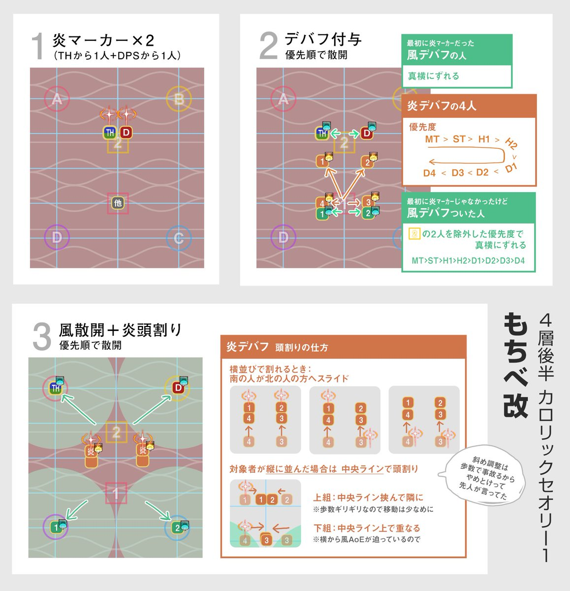

# Anabaseios: The Twelfth Circle (Savage) - Part 2

<div style="background-color: #200 ; padding: 10px; border: 1px solid;"><b>UNDER CONSTRUCTION</b></div>

[Game8](https://game8.jp/ff14/535668) has listed out a strat, but oddly has not published a macro (yet).

Meanwhile, Nukemaru has published a video outlining the PF strat:



### English

```

```

### Japanese

```

```

## Markers


## Timeline

*(Credit: [u/ExiaKuromonji](https://www.reddit.com/r/ffxiv/comments/141y028/spoiler64_p12s_part_2_timeline_and_abilities/))*

### Caloric Theory 1 (Mochibe strat)


*(Credit: Unknown)*