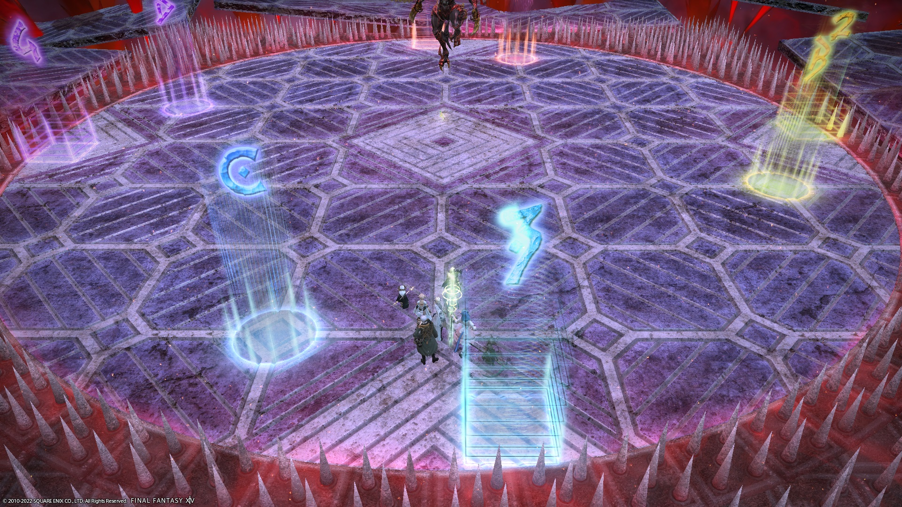
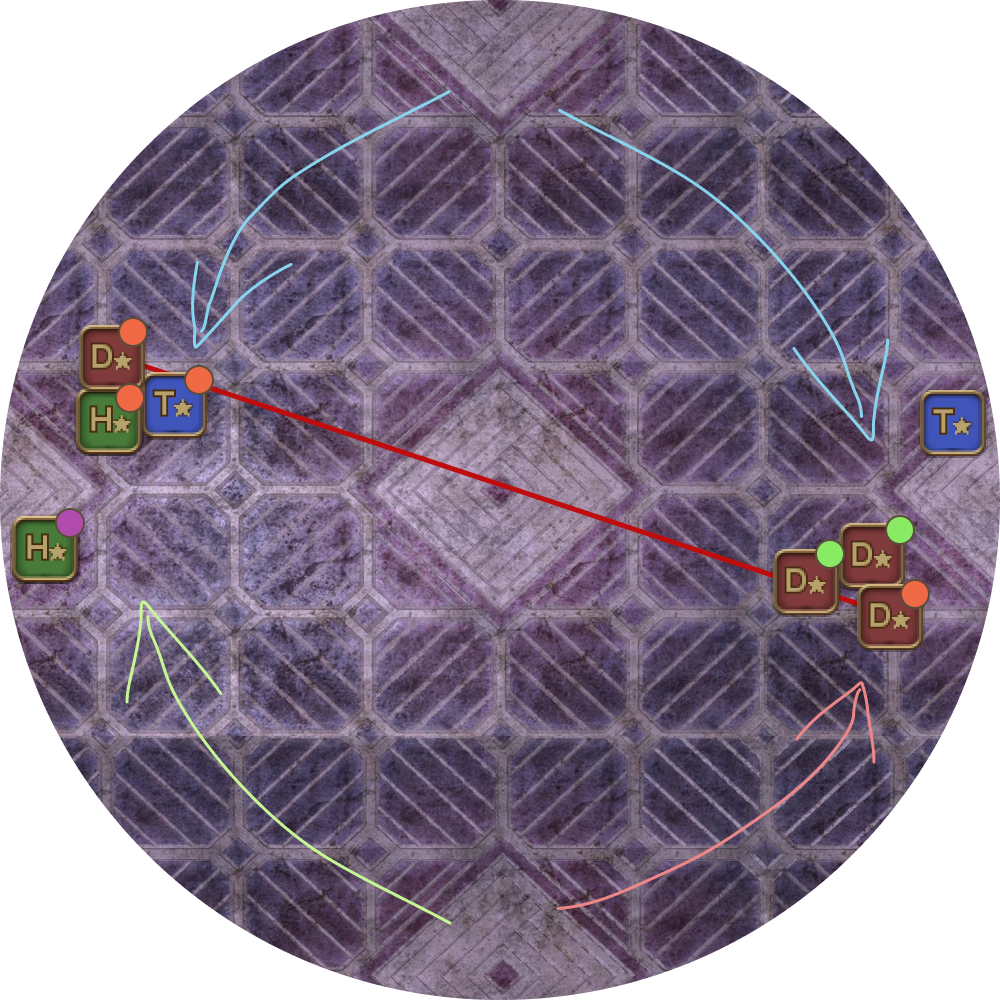
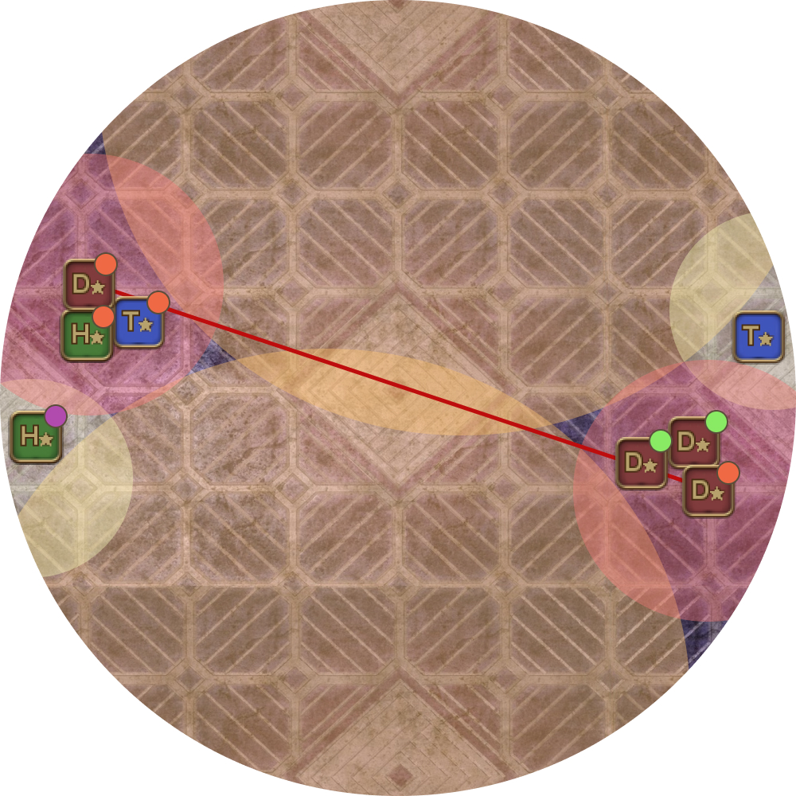

# Asphodelos: The Fourth Circle (Savage) - Part 2

PF uses [Inumaru's strat](https://youtu.be/1sfnBHXf2nA) (essentially identical to the Idyllshire strat, except for Act 3), with the following modifications:

- **Japanese** parties will do Inumaru's strat for Act3.
- **English** parties will do Xeno's strat for Act 3.
- Curtain Call timings are flipped from Inumaru's video:
  - Tanks/Healers cut their tethers at 6 seconds remaining.
  - DPS cut theirs at 11 seconds remaining.

## English

English parties will do Xeno's strat for Act 3.
```

```

<details markdown=block>
<summary>Japanese translation</summary>

```

```

</details>

## Japanese

Japanese parties will do Inumaru's strat for Act 3.
```

```

<details markdown=block>
<summary>English translation</summary>

```

```

</details>

## Markers

- `1234` are for towers
- `ABCD` are for resolving fire stacks in Act 2 (they won't line up with the thorns).

The markers also indicate the tether order for Act 4. Of note, 1234 overlap the white triangles on the floor.


<details markdown=block>
<summary>XIVLauncher WaymarkPresetPlugin positions</summary>

```json
{"Name":"P4S P2","MapID":801,"A":{"X":105.0,"Y":0.0,"Z":85.0,"ID":0,"Active":true},"B":{"X":115.0,"Y":0.0,"Z":105.0,"ID":1,"Active":true},"C":{"X":95.0,"Y":0.0,"Z":115.0,"ID":2,"Active":true},"D":{"X":85.0,"Y":0.0,"Z":95.0,"ID":3,"Active":true},"One":{"X":98.5,"Y":0.0,"Z":81.5,"ID":4,"Active":true},"Two":{"X":118.5,"Y":0.0,"Z":98.5,"ID":5,"Active":true},"Three":{"X":101.5,"Y":0.0,"Z":118.5,"ID":6,"Active":true},"Four":{"X":81.5,"Y":0.0,"Z":101.5,"ID":7,"Active":true}}
```

</details>

## Act 2

Elemental uses the [Idyllshire Act 2 strat](https://youtu.be/1sfnBHXf2nA?t=278).

<table>
  <tr>
    <td><p><b>1.</b> Break AoEs, break Dark tether</p><ul><li><b>Dark (no orb) Tank:</b> Always NW.</li><li><b>Dark Healer:</b> Always SE.</li><li><b>Fire DPS:</b> Identify your Fire partner and priority for later.</li><li><b>Everybody except Dark Tank/Healer:</b> Stack middle.</li></ul></td>
	<td></td>
  </tr>
  <tr>
    <td><p><em>(The following diagrams assume the N/S towers will resolve first- rotate 90 degrees anti-clockwise if E/W towers will resolve first instead.)</em></p><p><b>2.</b> After baiting AoEs, everyone moves into position for the first set of mechanics.</p><ul><li>Dark Tank/Healer always get towers.</li><li>Fire Tank + Healer break their tether.</li></ul></td>
	<td></td>
  </tr>
  <tr>
    <td><p><b>3.</b> First set of mechanics resolve.</p></td>
	<td></td>
  </tr>
  <tr>
    <td><p><b>4.</b> Everyone moves in for healing, then moves to prepare for the second set of mechanics:</p><ul><li><b>Healers:</b> Rotate <b>clockwise</b></li><li><b>Dark Tank:</b> Rotate <b>clockwise</b> to the next tower.</li><li><b>Fire Tank:</b> Rotate <b>anti-clockwise</b> to the next stack.</li><li><b>Fire DPS:</b> Break your tether.</li></ul><p>Everyone rotates clockwise <em>except</em> the Fire Tank and the Fire DPS in the following priority:</p><p>clockwise: D1 > D2 > D3 > D4: anti-clockwise</p></td>
	<td></td>
  </tr>
  <tr>
    <td><p><b>5.</b> Second set of mechanics resolve.</p></td>
	<td></td>
  </tr>
</table>


## Act 3

Note that English and Japanese groups will do different Act 3 strats.

- English groups will use Xeno's Act 3.
  - Tanks/Melee and Healers/Ranged alternate taking towers + Earthshakers.
- Japanese groups will use [Inumaru's Act 3](https://youtu.be/1sfnBHXf2nA?t=627).
  - Tanks/Melee take all Earthshakers. Healers/Ranged take all towers.

## Timeline


*(Credit: [u/Syldris](https://www.reddit.com/r/ffxiv/comments/s3yfu8/p4s_rotation_and_timeline/))*