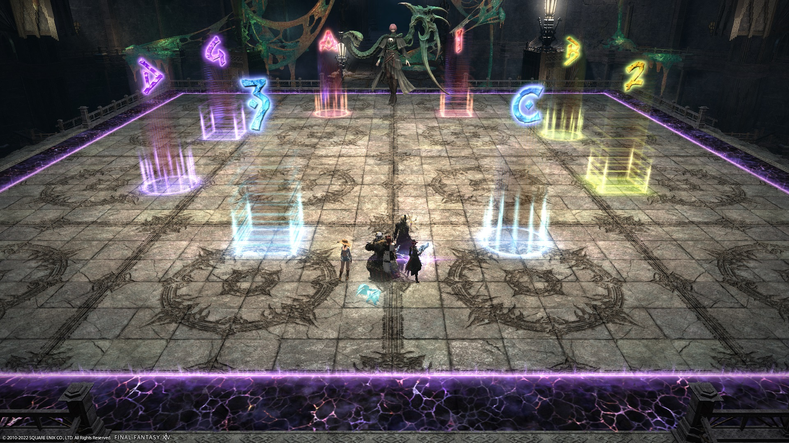

# Abyssos: The Sixth Circle (Savage)

PF uses [Nukemaru's strat](https://youtu.be/pibChZ8AjZ8) as a base.

**English** parties will replace Nukemaru's Cachexis 1 strat with [ZizieZip's Cachexis 1 strat](https://twitter.com/ZizieZip/status/1564991162775060480).

The following macros are from [Game8](https://game8.jp/ff14/479307).

## Japanese
*(Nukemaru's Cachexia 1)*
```
※MT組：MTH1D1D3 ST組：STH2D2D4
　【基本散開】　　【カヘキシー1回目】
MT/D3　ST/D4 　 　 8　　 　 　8
　　 　 ★　　 　 　12　20 ★ 20　12
H1/D1　H2/D2　　16 　 　 　 16
【 頭割り+扇範囲 】｜ 【4：4頭割り】
西：MT組 東：ST組｜西側→MT組 東側→ST組
※時計回りで頭割り｜※内周4マスを使用
【サイコロ】　　 　｜【チェンジバースト2回目】
西：奇数　　　　　｜西→T・H 東→DPS
東：偶数　　　　　｜※AOEも上記方向に捨てる
【カヘキシー2回目】
西：紫デバフ　東：緑デバフ
北・南外周マス→AoE　内周マス→頭割り
```

## English
*(Nukemaru's Cachexia 1)*
```
　　【Spread】　　【Cachexia 1 (Nukemaru)】
　MT/D3　ST/D4 　　　 　 8　　 　 　8
　　　 　 ★　　 　 　　　12　20 ★ 20　12
　H1/D1　H2/D2　　　　16 　 　 　 16
【Stacks+fan AoE (Poly 1) + 4:4 stacks (Poly 3)】
　West：MTH1D1D3　East：STH2D2D4
　※ Poly 1: Rotate cw　※ Poly 3: Use inner tiles
【Limit Cut】　【Exchange of Agonies 2】
　West： Odd　　West→T+H　East→DPS
　East： Even　　※AoEs go outside as above
【Cachexis 2】
　West：Purple　East：Green
　N/S Outer tiles→AoE　N/S Inner tiles→Stacks
```

*(ZizieZip's Cachexia 1)*
```
【Spread】　　【Cachexia】
　D3　　　D4　　Purple→West　Green→East
　　MT　ST　　　■ Cachexia 1 (ZizieZip)
　　　 ●　　　　　　T　T　
　　D1　D2　　　H　　　H　※ 20s timers start
　H1　　　H2　　D　　　D　under boss circle
【Limit Cut】 　　　D　D
　Odd→West　　■ Cachexia 2
　Even→East　　　Stacks→N/S inner tiles
【Poly 1】　　　　　AoEs→N/S outer tiles
　West：MTH1D1D3
　East：STH2D2D4
【Exchange of Agonies 2】【Poly 3】
　West→T+H　　　　　　Center：MTH1D1D3
　East→DPS　　　　Outer corner：STH2D2D4
```

## Markers (Nukemaru)

These markers are for Nukemaru's Cachexis 1:

- `1` and `A`: 8 seconds
- `2` and `B`: 12 seconds
- `3` and `C`: 16 seconds
- `4` and `D`: 20 seconds

Players rotate moving "down" in the markers (i.e: 4→3→2→1→4 and D→C→B→A→D)


<details markdown=block>
<summary>XIVLauncher WaymarkPresetPlugin positions</summary>

```json
{"Name":"P6S (Nukemaru)","MapID":881,"A":{"X":108.7,"Y":0.0,"Z":91.3,"ID":0,"Active":true},"B":{"X":115.0,"Y":0.0,"Z":100.0,"ID":1,"Active":true},"C":{"X":108.7,"Y":0.0,"Z":108.7,"ID":2,"Active":true},"D":{"X":104.5,"Y":0.0,"Z":100.0,"ID":3,"Active":true},"One":{"X":91.3,"Y":0.0,"Z":91.3,"ID":4,"Active":true},"Two":{"X":85.0,"Y":0.0,"Z":100.0,"ID":5,"Active":true},"Three":{"X":91.3,"Y":0.0,"Z":108.7,"ID":6,"Active":true},"Four":{"X":95.5,"Y":0.0,"Z":100.0,"ID":7,"Active":true}}
```

</details>

## Markers (ZizieZip)

These markers are for ZizieZip *(I want to update these so that the same-coloured markers are at each intercardinal corner)*.

- `1` and `A`: Tanks
- `2` and `B`: Healers
- `3`, `C`, `4`, and `D`: DPS


<details markdown=block>
<summary>XIVLauncher WaymarkPresetPlugin positions</summary>

```json
{"Name":"P6S (ZizieZip)","MapID":881,"A":{"X":95.0,"Y":0.0,"Z":88.333,"ID":0,"Active":true},"B":{"X":111.667,"Y":0.0,"Z":95.0,"ID":1,"Active":true},"C":{"X":105.0,"Y":0.0,"Z":111.667,"ID":2,"Active":true},"D":{"X":88.333,"Y":0.0,"Z":105.0,"ID":3,"Active":true},"One":{"X":105.0,"Y":0.0,"Z":88.333,"ID":4,"Active":true},"Two":{"X":111.667,"Y":0.0,"Z":105.0,"ID":5,"Active":true},"Three":{"X":95.0,"Y":0.0,"Z":111.667,"ID":6,"Active":true},"Four":{"X":88.333,"Y":0.0,"Z":95.0,"ID":7,"Active":true}}
```

</details>