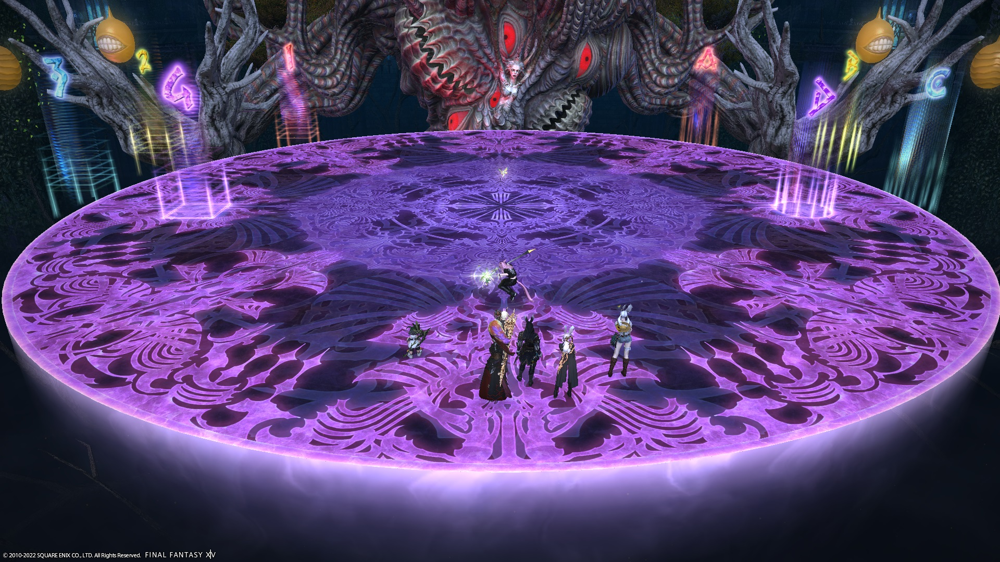
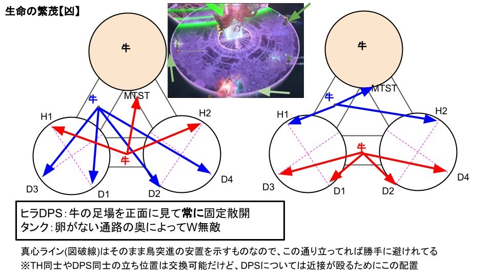
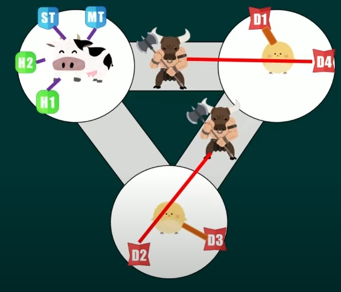

# Abyssos: The Seventh Circle (Savage)

PF uses [Shinosho's strat](https://youtu.be/JOMBTuWf-j8) as a base, but modifies the following sections:

- [Sleepo's strat for Inviolate Purgation](https://ff14.toolboxgaming.space/?id=339073562612661&preview=1).
- Fixed positions strat for Death's Harvest.
- Inumaru's strat for War's Harvest.

Guides:

- [Hamkatsu](https://youtu.be/_mkllPXUVuI) - only Purgation, Famine, Death, and War's Harvest
- [Nukemaru](https://youtu.be/iaxDpAfkTIA)

### Things to check on Party Finder

- Check the Purgation positions, **especially if you join a Japanese party**.

## Japanese

The following is [Game8's macro](https://game8.jp/ff14/479465):
```
MT組：MTH1D1D3　ST組：STH2D2D4
　【基本散開】　　　　　【ノックバック+鳥】
MT/D1　ST/D2　　　　 D1　　 　 　 D2
　　 　 ★　　　　　　D3　 MT　 　ST　 D4
H1/D3　H2/D4　　　　通路 　 　 　 通路
　　　　　　　　　　　H1　　　　　　　H2
【生命の果実：頭割り】　│【魔印創成：散開】
北側：MT組　南側：ST組 │基本散開※頭割りと被ったら通路
【エクサ+頭割り】　 　 　 │【鳥誘導＋塔】
西：MT組　東：ST組　　 │基本散開準拠でズレたら時計回り
【魔印創成：獄】
　 ▼西島▼　　　　　　　 　 ▼東島▼
頭割り　MT/D1 　 　 　 MT/D1　頭割り
ST/D2　H2/D4　通路　H2/D4　ST/D2
　　　　H1/D3　 　　　H1/D3
```

## English
```
G1：MTH1D1D3　G2：STH2D2D4
　【Basic spread】　【Knockback + birds】
　MT/D1　ST/D2　　　 D1　　 　 　 D2
　　　 　 ★　　　　　D3　 MT　 　ST　 D4
　H1/D3　H2/D4　　(bridge)　(bridge)
　　　　　　　　　　　　H1　　　　　H2
【Forbidden Fruit 1】　　│【Inviolate Bonds】
　North：G1　South：G2│Basic spread
【Exaflares + stack】 　　 │【Birds + towers】
　West：G1　East：G2 　│Basic spread, bait CW
【Inviolate Purgation (Sleepo)】
　　 ▼West▼　　　　　　　 　 ▼East▼
　(stack)　MT/D1 　 　 　　　 MT/D1　(stack)
　ST/D2　H2/D4　(bridge)　H2/D4　ST/D2
　　　　　H1/D3　 　　　　　H1/D3
```

## Markers (placeable in-game)

These are the markers I use, and can be placed in-game.

- `123`: Center of the three platforms when the arena changes.

In particular, I use square markers because the flat edges give a reference to where True North is to help players align themselves for Purgation.


<details markdown=block>
<summary>XIVLauncher WaymarkPresetPlugin positions</summary>

```json
{"Name":"P7S","MapID":877,"A":{"X":0.0,"Y":0.0,"Z":0.0,"ID":0,"Active":false},"B":{"X":0.0,"Y":0.0,"Z":0.0,"ID":1,"Active":false},"C":{"X":0.0,"Y":0.0,"Z":0.0,"ID":2,"Active":false},"D":{"X":0.0,"Y":0.0,"Z":0.0,"ID":3,"Active":false},"One":{"X":85.7106,"Y":0.0,"Z":91.75,"ID":4,"Active":true},"Two":{"X":114.2894,"Y":0.0,"Z":91.75,"ID":5,"Active":true},"Three":{"X":100.0,"Y":0.0,"Z":116.5,"ID":6,"Active":true},"Four":{"X":100.0,"Y":0.0,"Z":100.0,"ID":7,"Active":true}}
```

</details>

## Markers (Sleepo - not placeable in-game)

These set of markers **must** be placed via the XIVLauncher WaymarkPresetPlugin.

If you don't have the plugin (or play on console), you will need to copy the markers from someone who does.

All markers are used for Sleepo's Purgation.

- `2` and `B`: Stack positions.
- All other markers are the spread positions.


<details markdown=block>
<summary>XIVLauncher WaymarkPresetPlugin positions</summary>

```json
{"Name":"P7S (Sleepo)","MapID":877,"A":{"X":114.29,"Y":0.0,"Z":82.75,"ID":0,"Active":true},"B":{"X":122.084,"Y":0.0,"Z":87.25,"ID":1,"Active":true},"C":{"X":122.0842,"Y":0.0,"Z":96.25,"ID":2,"Active":true},"D":{"X":114.29,"Y":0.0,"Z":100.75,"ID":3,"Active":true},"One":{"X":85.71,"Y":0.0,"Z":82.75,"ID":4,"Active":true},"Two":{"X":77.915,"Y":0.0,"Z":87.25,"ID":5,"Active":true},"Three":{"X":77.915,"Y":0.0,"Z":96.25,"ID":6,"Active":true},"Four":{"X":85.71,"Y":0.0,"Z":100.75,"ID":7,"Active":true}}
```

</details>

## Timeline

*(Credit: [u/ExiaKuromonji](https://www.reddit.com/r/ffxiv/comments/x891mn/p7s_timeline/))*

## Inviolate Purgation (Sleepo)

This is a strat to resolve Inviolate Purgation that involves alternating all eight players between the two front islands.

[Sleepo Purgation Toolbox](https://ff14.toolboxgaming.space/?id=339073562612661&preview=1)

## Famine's Harvest

The group tethered to minotaurs need to cross tethers to avoid hitting one another.


## Death's Harvest (fixed positions, tank invuln)

One of the three platforms has an add; use this platform as North, and then all (non-tank) players have fixed assigned positions as shown below, regardless of which Behemoth they're tethered to.

Tanks stack on the empty bridge and invuln.



## War's Harvest (Inumaru)

Note that the minotaur tethers will *not* be stretched out enough to turn purple. As a result, **shields and mitigations are required** for the two minotaur players to survive.

