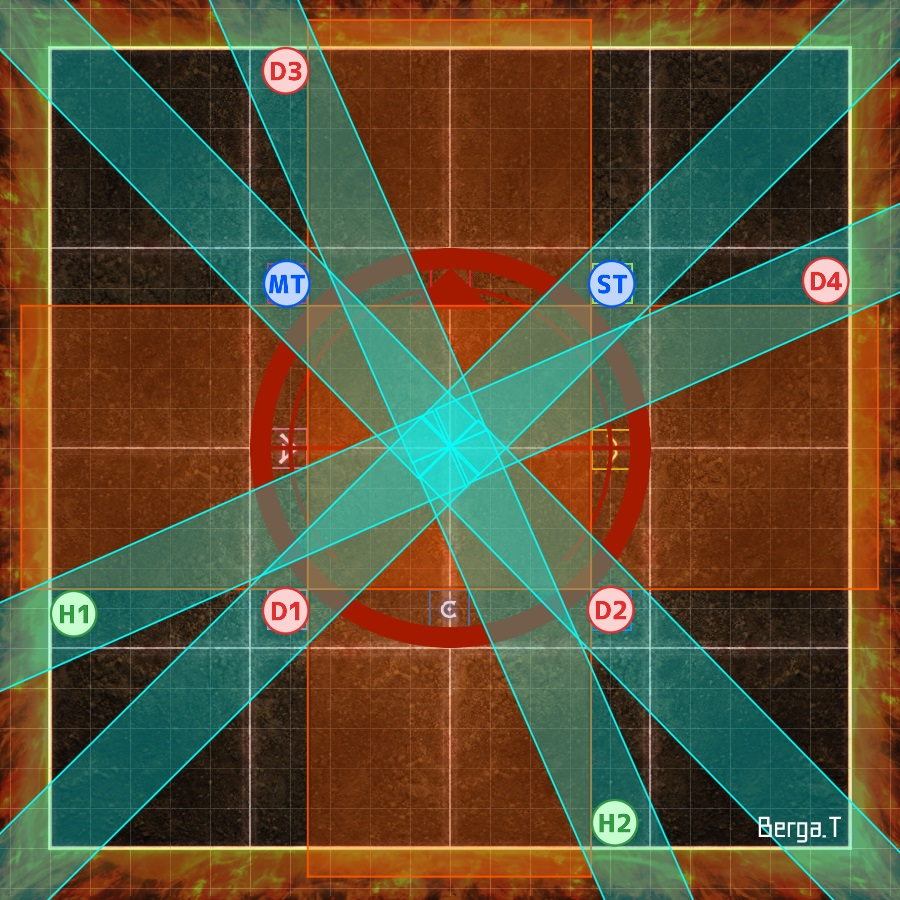
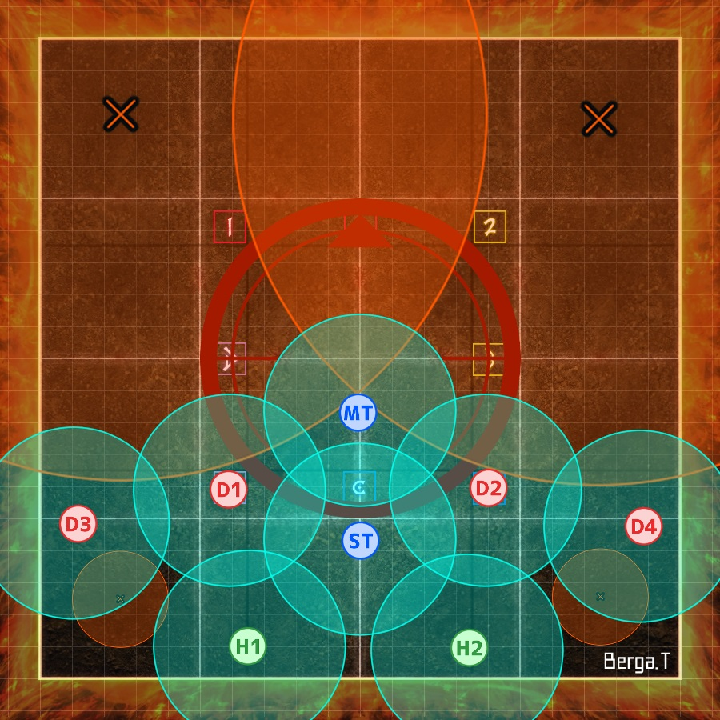
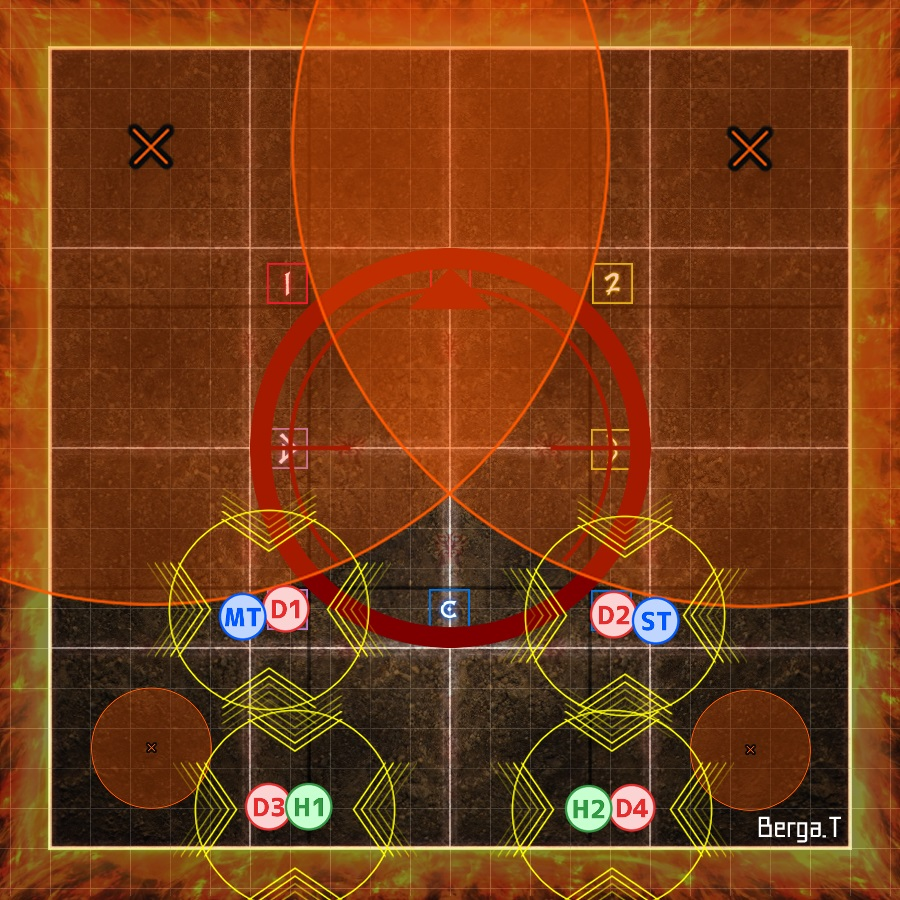
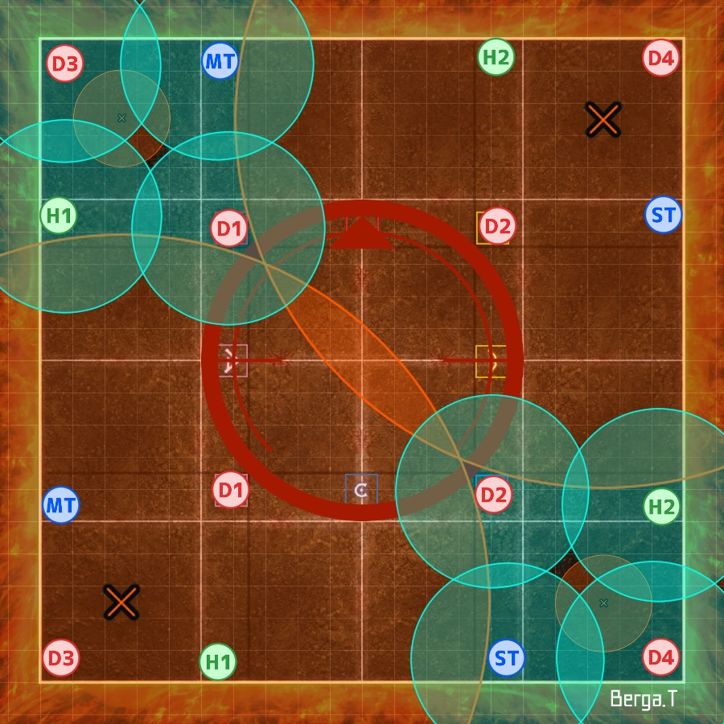
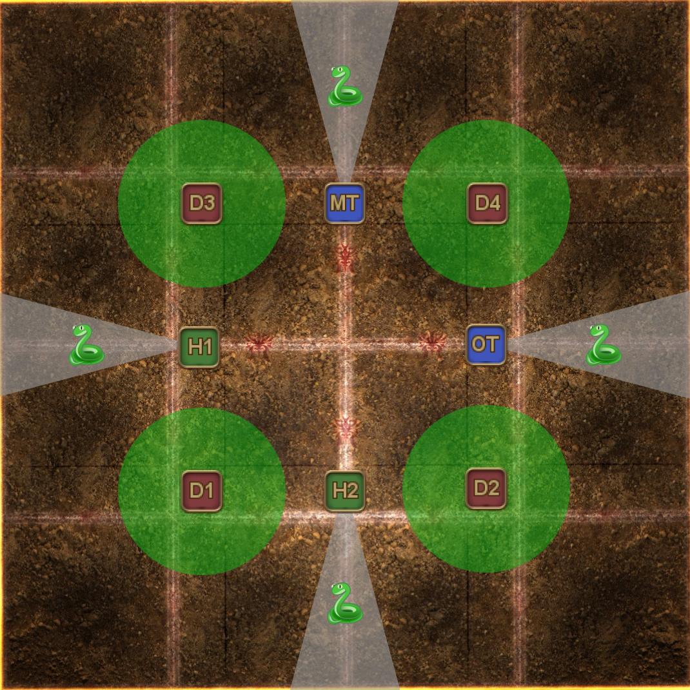
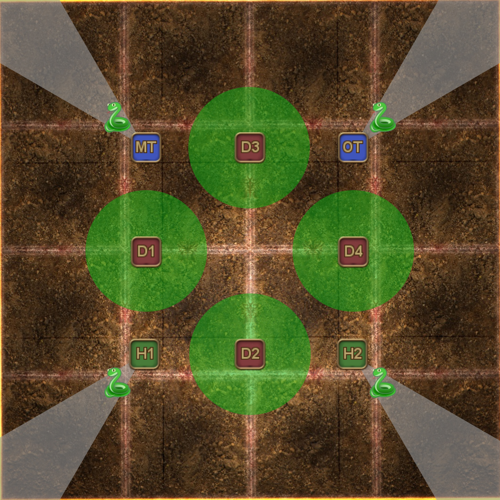
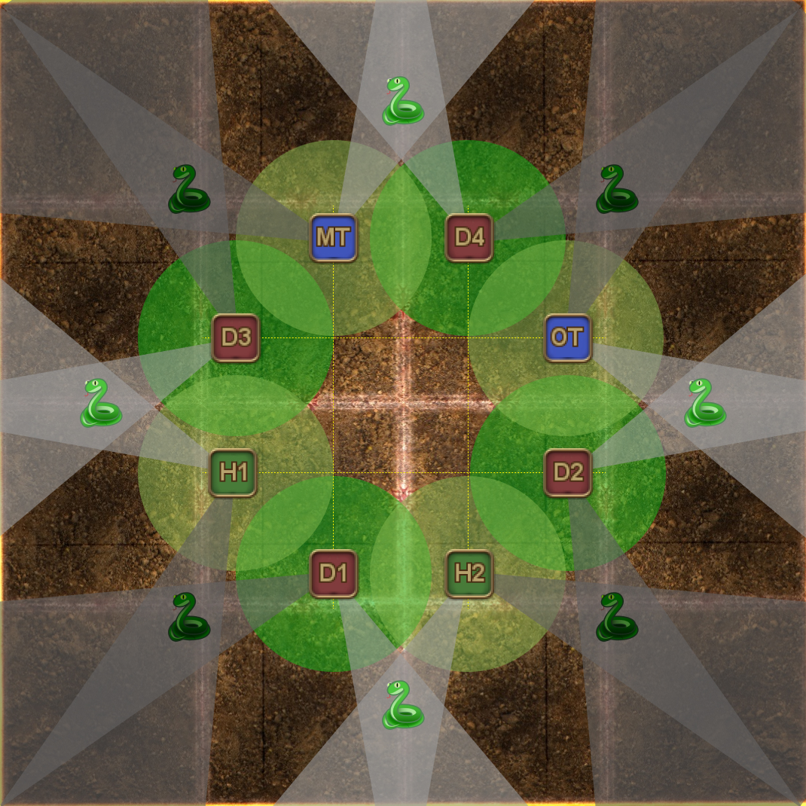

# Abyssos: The Eighth Circle (Savage) - Part 1

### Things to check on Party Finger

- Note the spread positions are not the typical spread.
- Check the Gorgons 2 strat (colours vs Spriggan).

## FFO strat

PF and Game8 went along with the [FFO strat](https://jp.finalfantasyxiv.com/lodestone/character/17170591/blog/5094725/), named after the ["Final Fantasy Online" board on 5ちゃねる](https://egg.5ch.net/ffo/), where the strat was pieced together.

The following videos specifically go over the FFO strat:

  - [Hamkatsu](https://youtu.be/D63JWdvXqWY)
  - [Inumaru](https://youtu.be/YSRmSAbPyAM)

The FFO strat resolves Gorgons 2 based on coloured markers. *Some* parties (particularly EN) will do "Spriggan Gorgons 2" instead *(see below)*

## Japanese

*(FFO strat, colour-coded Gorgons 2)*
```
■テトラオクタ/誘導/蛇2　 ■基本散会
　MT/D3　→　ST/D4　　　D3 MT D4
　　↑　　 ☆　　↓　 　　　H1(H2) ST
　H1/D1　←　H2/D2 　　D1 H2 D2
■イントゥシャドウ(1回目)
　蛇：北から時計回りMTD1>STD2>H1D3>H2D4
■フェイタルストンプ
　1,3回目→1(北西)　2,4回目→中央　待機→A(北)
■幻影創造
◎竜竜×散開　　　　 │◎フェニ×散開
　　　　D3　　　 　 │　D3 MT D4
　　　　MT　ST　D4│　H1 ☆ ST
　　H1 D1　D2　　 │　D1 H2 D2
　　　　　　 H2　　 │
■四重炎嵐(縦横) ｜■四重炎嵐(角)
　　　 MT　　　│　　　中央　※MT組：西優先
　 D1 ST D2　　│T　近
　D3 H1 H2 D4 │遠  H
◎頭割り：近H位置(MTD1/STD2/H1D3/H2D4)
■イントゥシャドウ(2回目) 4:4頭割り
　デバフ持ち：北西>MT/D1>ST/D2>H1/D3>H2/D4>南東
　無職：北西TH/南東DPS
■テトラ/ディフレア
　テトラ：(ボス)MT/D1>ST/D2>H1/D3>H2/D4
　ディフレア：(ボス)MTH1D1D2>STH2D3D4 
```

## English

*(FFO strat, colour-coded Gorgons 2)*
```
■Tetra/Octa/baits/Snakes 2　 ■ Basic Spread
　MT/D3　→　ST/D4　　　　　　  D3 MT D4
　　↑　　 ☆　　↓　　　　　　　　H1(H2) ST
　H1/D1　←　H2/D2　　　　　　 D1 H2 D2
■ Into the Shadows #1
　Gorgons：From N, going clockwise
　　　MTD1>STD2>H1D3>H2D4
■ Stomp Dead
　1st, 3rd→NW　2nd, 4th→mid　Standby→N
■ Illusory Creation
◎2x Dragon + spread│◎ 2x Phoenix + spread
　　　　D3　　　 　 　│　D3 MT D4
　　　　MT　ST　D4   │　H1 ☆  ST
　　H1 D1　D2　　　 │　D1 H2 D2
　　　　　　 H2　　 　│
■Fourfold Fires(sides) ｜■Fourfold Fires(corners)
　　　　　 MT　　　　　│　　　　(BOSS)
　　　 D1 ST D2 　　　   ｜　T　M　　※MT group：　
　　D3 H1 H2 D4 　　　│　R　H　　　West priority
◎ Stacks：M+H locations (MTD1/STD2/H1D3/H2D4)
■ Into the Shadows #2 (4:4 stacks)
　Debuffs：N/W：MT/D1>ST/D2>H1/D3>H2/D4：S/E
　Nothing：N/W→TH　S/E→DPS
■ Tetraflare/Diflare
　Tetraflare：(Boss)MT/D1>ST/D2>H1/D3>H2/D4
　Diflare：(Boss)MTH1D1D2>STH2D3D4 
```

## FFO strat (with Spriggan Gorgons 2)

Some parties (particularly English groups) will do ["Spriggan Gorgons 2"](#spriggan-gorgons-fixed-positions) instead of the colour-coded style that Game8 proposes.

## English 

*(FFO strat, Spriggan Gorgons 2)*
```
■Tetra/Octa/baits　　　 ■ Basic Spread
　MT/D3　→　ST/D4　　　 D3 MT D4
　　↑　　 ☆　　↓　　　　   H1(H2) ST
　H1/D1　←　H2/D2　　　D1 H2 D2
■ Into the Shadows #1
　Gorgons：From N, going clockwise
　　　MTD1>STD2>H1D3>H2D4
■ Stomp Dead
　1st, 3rd→NW　2nd, 4th→mid　Standby→N
■ Illusory Creation
◎2x Dragon + spread│◎ 2x Phoenix + spread
　　　　D3　　　 　 　│　D3 MT D4
　　　　MT　ST　D4   │　H1 ☆  ST
　　H1 D1　D2　　　 │　D1 H2 D2
　　　　　　 H2　　 　│
■Fourfold Fires(sides) ｜■Fourfold Fires(corners)
　　　　　 MT　　　　　│　　　　(BOSS)
　　　 D1 ST D2 　　　   ｜　T　M　　※MT group：　
　　D3 H1 H2 D4 　　　│　R　H　　　West priority
◎ Stacks：M+H locations (MTD1/STD2/H1D3/H2D4)
■ Into the Shadows #2 (4:4 stacks)
　Spriggan Gorgon：
　　MT　D4　　※Aim gaze to closest snake
　D3　　　ST　　Debuffs (FFO split)：
　　　  ●　　　　　N/W：MT > ST > H1 > H2：S/E
　H1　　　D2　　  N/W：D1 > D2 > D3 > D4：S/E
　　D1　H2　　　Nothing：N/W→T/H　S/E→DPS
■ Tetraflare/Diflare
　Tetraflare：(Boss)MT/D1>ST/D2>H1/D3>H2/D4
　Diflare：(Boss)MTH1D1D2>STH2D3D4 
```

## Japanese

*(FFO strat, Spriggan Gorgons 2 - 蛇2回目固定式)*
```
■テトラオクタ/誘導　　　　 ■基本散会
　MT/D3　→　ST/D4　　　D3 MT D4
　　↑　　 ☆　　↓　 　　　H1(H2) ST
　H1/D1　←　H2/D2 　　D1 H2 D2
■イントゥシャドウ(1回目)
　蛇：北から時計回りMTD1>STD2>H1D3>H2D4
■フェイタルストンプ
　1,3回目→1(北西)　2,4回目→中央　待機→A(北)
■幻影創造
◎竜竜×散開　　　　 │◎フェニ×散開
　　　　D3　　　 　 │　D3 MT D4
　　　　MT　ST　D4│　H1 ☆ ST
　　H1 D1　D2　　 │　D1 H2 D2
　　　　　　 H2　　 │
■四重炎嵐(縦横) ｜■四重炎嵐(角)
　　　 MT　　　│　　　中央　※MT組：西優先
　 D1 ST D2　　│T　近
　D3 H1 H2 D4 │遠  H
◎頭割り：近H位置(MTD1/STD2/H1D3/H2D4)
■イントゥシャドウ(2回目): 位置固定
　　MT　D4　
　D3　　　ST　※近い蛇に向いて視線を調整　
　　　  ●
　H1　　　D2　※4:4頭割り
　　D1　H2　　無職：北西TH　南東DPS
デバフ持ち：北西>MT/D1>ST/D2>H1/D3>H2/D4>南東
■テトラ/ディフレア
　テトラ：(ボス)MT/D1>ST/D2>H1/D3>H2/D4
　ディフレア：(ボス)MTH1D1D2>STH2D3D4 
```

## Markers

- 1 and A are for resolving Stomp Dead (using the L-stomp method)


<details markdown=block>
<summary>XIVLauncher WaymarkPresetPlugin positions</summary>

```json
{"Name":"P8S","MapID":884,"A":{"X":100.0,"Y":0.0,"Z":91.6,"ID":0,"Active":true},"B":{"X":108.4,"Y":0.0,"Z":100.0,"ID":1,"Active":true},"C":{"X":100.0,"Y":0.0,"Z":108.4,"ID":2,"Active":true},"D":{"X":91.6,"Y":0.0,"Z":100.0,"ID":3,"Active":true},"One":{"X":91.6,"Y":0.0,"Z":91.6,"ID":4,"Active":true},"Two":{"X":108.4,"Y":0.0,"Z":91.6,"ID":5,"Active":true},"Three":{"X":108.4,"Y":0.0,"Z":108.4,"ID":6,"Active":true},"Four":{"X":91.6,"Y":0.0,"Z":108.4,"ID":7,"Active":true}}
```

</details>

## Timeline

*(Credit: [u/ExiaKuromonji](https://www.reddit.com/r/ffxiv/comments/x9kttl/p8s_part_1_timeline/))*

## L-Stomps

"L-Stomps" refers to the following Tweet:

<blockquote class="twitter-tweet"><p lang="ja" dir="ltr">4層前半のフェイタルストンプ(ピョンピョンするやつ)近接ずっと殴れるやり方<br>(うちの学者さん考案)<br>これめっちゃいい <a href="https://t.co/wQWMBX5olX">pic.twitter.com/wQWMBX5olX</a></p>&mdash; あおいさまさま (@aoisamasama23) <a href="https://twitter.com/aoisamasama23/status/1565394643763597312?ref_src=twsrc%5Etfw">September 1, 2022</a></blockquote> <script async src="https://platform.twitter.com/widgets.js" charset="utf-8"></script>

This is a way to resolve the Earth AoEs and the "Stomp Dead" mechanic in the first "beast" mode.

Note that the video in the Tweet uses the `A` and `2` markers to resolve the mechanic, while the macro uses `1` and `A` instead.


*(Credit: [Berga Thompson](https://jp.finalfantasyxiv.com/lodestone/character/17170591/blog/5094725/))*

## Illusory Creation

In the event the boss uses Nest of Flamevipers when the clones are 2x Dragons, the spread positions are as follows:


*(Credit: [Berga Thompson](https://jp.finalfantasyxiv.com/lodestone/character/17170591/blog/5094725/))*

## Fourfold Fires

Here is how to handle the stacks/spreads in Fourfold Fires.

**Note that the corner spreads here are the FFO strat's spread positions, and are different from Waun Siu's strat.**

<table>
  <tr>
    <td></td>
    <td></td>
  </tr>
  <tr>
    <td></td>
    <td></td>
  </tr>
</table>

*(Credit: [Berga Thompson](https://jp.finalfantasyxiv.com/lodestone/character/17170591/blog/5094725/))*

## Into the Shadows #2 (Gorgon 2)

There are two strats going around for Gorgon 2 (蛇2回目 in Japanese).

### Colour-coordinated

This is the strat mostly preferred by Japanese parties.

<table>
  <tr>
    <td><p>Each T/H + DPS pair takes turns petrifying the Gorgon in their quadrant (demarcated by the coloured markers).</p><p>The player that is <em>not</em> petrifying the Gorgon places their poison puddle out of the way.</p></td>
    <td></td>
    <td></td>
  </tr>
</table>

### Spriggan Gorgons (fixed positions)

This is the strat done by EN parties. *Some* Japanese parties also do this strat, but they call it "Fixed Snakes 2" instead (蛇2回目固定). 

The advantage of Spriggan Gorgons is that player positions are all fixed for the first part of the mechanic.

<table>
  <tr>
    <td><p>All players are at fixed positions, regardless of where the snakes spawn.</p><p>Players should stand <b>2/3rds of the way in their tile</b> (towards the center of the arena) to not hit the other player, or the snakes with their poison puddle.</p><p>Petrify the closest snake to you when it's your turn.</p></td>
    <td></td>
  </tr>
</table>

**Clips:**
  - [Snakes at cardinals](https://www.twitch.tv/doanstv/clip/InexpensiveColdbloodedPterodactylRlyTho--3RDXuxtRjxtv1TZ)
  - [Snakes at intercardinals](https://clips.twitch.tv/SarcasticPoliteOpossumBloodTrail-1QkX3UFKiHVvAeti)

### 4:4 stacks

A clone of the boss will appear at the edge of the arena **when the second set of poison puddles go off**. The clone will destroy two of the petrified Gorgons, leaving two behind for players to resolve the last mechanic of the phase.


*(Credit: [Berga Thompson](https://jp.finalfantasyxiv.com/lodestone/character/17170591/blog/5094725/))*