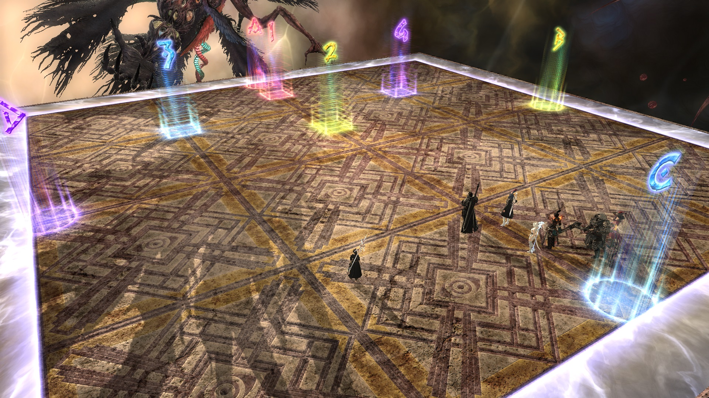
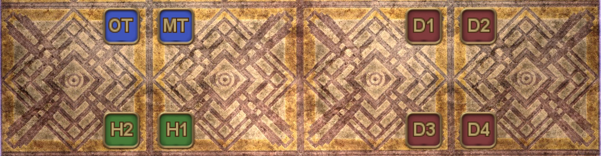
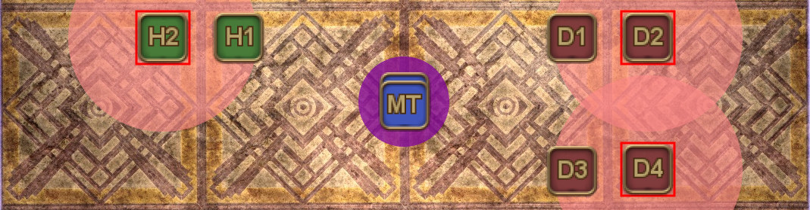
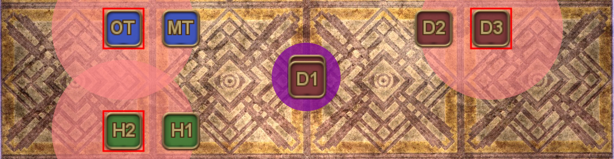
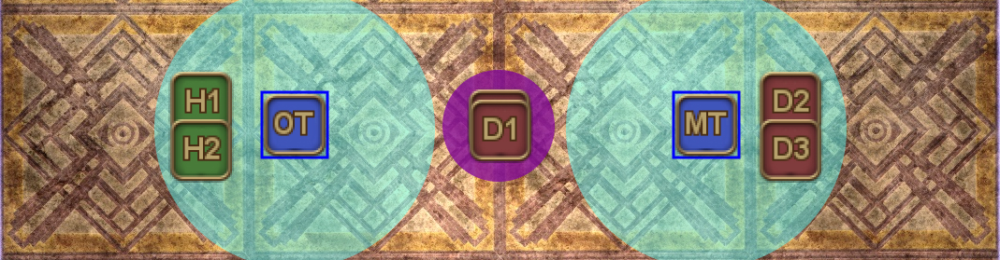

# Abyssos: The Eighth Circle (Savage) - Part 2

**DISCLAIMER:** *I haven't gotten around to clearing P8S myself yet, so I may be missing some context in the translation below.*

PF uses [Nukemaru's strat](https://youtu.be/RaLfkv-B2Zg), substituting [Hydi/Bijyon's strat for Limitless Desolation](#limitless-desolation).

The combination is often nicknamed "**Nukehai**" (ぬけはい).

## Game 8's macro

The following is [Game8's macro](https://game8.jp/ff14/480771), which follows Nukemaru's strat.

### Japanese

*(Nukemaru's strat, Hydi/Bijyon's Limitless Desolation)*
```
【術式1回目(頭割は西)】【術式炎氷(TH西 DPS東) 】
　 　★　　　紫 　 ST│ ▼炎:中央前詰め　▼氷誘導
D1 MT D2　　 MT　│ MT>ST >H1>H2 西 D1>ST
H1　　H2　H1　D2│ D1>D2>D3>D4 東MT>D2
D3 S T D4　 　 D1　│【術式2回目散開 】
※左安置は　H2　D3│　STMT 紫 D3D1
　左右反転→　 D4 　│　　 H1H2D4D2
【概念1回目①】　　【概念1回目②】
　　　　早α　　 　 │　　　遅α
複/遅α　　　　　　│
　　　　　　 早β 　│ 生物　　　　遅β
重/遅βγ　　　　　 │
　　　　早γ　　 　 │　　　遅γ
※4塔：遅αβγ→北で合成
　 　 　 複/重/早余り→南で合成
【万象灰燼：はいじあ/ビジョン式】
　　MT　　D1
ST　 +　　　+　D2　※1,3番塔は前+で範囲捨て
H1　+　　　+　D3　※2,4番塔は後+で範囲捨て
　 　H2　　D4
【概念2回目①】 　 　【概念2回目②】
　　 無/早α　　　 │　　　　遅α
単　　　　　 　 　 │ 生物
　　　　　　早β　│ ｲﾌ ｲﾌ　　　　遅β
複/遅　　　　　　 │ 生物
　　　 早γ 　　 　 │　　　　遅γ
※4塔：遅αβ→北で合成　遅γ/早余り→南で合成
【支配者の一撃】　　　　　【塔優先度】
　MTH1 D3 D1　西>MTSTH1H2D4D3D2D1>東
　ST H2 D4 D2
 ```
 
### English:

*(Nukemaru's strat, Hydi/Bijyon's Limitless Desolation)*
```
【Natural Alignment 1(stack west】
　　 　★　　　　(purple)　ST
　D1 MT D2　　　　　　 MT
　H1　　H2　　　　　H1　D2　※Flip horizontal
　D3 S T D4　　　　　　  D1　　　if west safe
   　　　　　　　　　　H2　D3
　　　　　　　　　　　　D4 
【Fire/Ice(TH west DPS east) 】
▼Fire: Close + forward prio　▼Ice baits prio
　 MT>ST >H1>H2　　　　　　　West： D1>ST
 　D1>D2>D3>D4　　　　　　　East：MT>D2
【Natural Alignment 2 spread 】
　STMT (purple) D3D1
　　 　H1H2D4D2
【High Concept 1-1】【High Concept 1-2】
　　　　8α　　 　 │　　　　　28α
+28α　　　　　 │
　　　　　　 8β 　│(Creation)　　　28β
+28βγ　　　　  │
　　　　8γ　　 　 │　　　　　28γ
※4 towers：　　　28αβγ→Synthesize North
　 　  //Unused 8αβγ→Synthesize South
【Limitless Desolation：Hydi/Bijyon strat】
　　MT　　D1
ST　 +　　　+　D2　※1st, 3rd bait AoE at front +
H1　+　　　+　D3　※2nd, 4th bait AoE at rear +
　 　H2　　D4
【High Concept 2-1】　【High Concept 2-2】
　　 Nothing/7α　　│　　　　　　27α
Solo　　　　　　　　│　Concept
　　　　　　　　　7β│ Ifrit　　Ifrit　　　　27β
/27　　　　　　　  │　Concept
　　　 　　7γ 　　 　 │　　　　　　27γ
※4 Towers：　　　27αβ→Synthesize North
　　　27γ/Unused 7αβ→Synthesize South
【Dominion】　　　　【Tower priority】
　MTH1 D3 D1　W：MTSTH1H2D4D3D2D1：E
　ST H2 D4 D2
 ```

## Lambda Unendlich's macro

 This is slightly modified version of [Lambda Unendlich's macro](https://ffxiv.link/078732) for the same strat (substituting in Game8's Limitless Desolation), but goes into a little more detail about some of the mechanics:

### Japanese

*(Nukemaru's strat, Hydi/Bijyon's Limitless Desolation)*
```
【術式記述1回目】
デバフ持ち→A、他→2待機　頭割りからの場合は西受け
 <1回目の散開>       |　<2回目の散開>
　　　   ◎　            | ST  　　◎　　  ST
　　MT　  ST          |　 　MT     MT
　D1　　　 D2       | D2        H1        D2
　H1　        H2       |　　 D1　   D1
       D3　  D4          | D3 　   H2　　 D3
　　　　　　　　   ｜　　D4　   D4
 <炎処理>
 ②/①     　     ①/②　※西側TH   MT>ST>H1>H2
　　　　◎　　　　　　東側DPS D1>D2>D3>D4
 ④/③              ③/④　　上記優先度で番号順に配置
 誘導：②④
 <氷処理> ※MTD1調整
 西側：タンヒラ　東側：DPS
 西側誘導：D1>ST　東側誘導：MT>D2
【概念支配1回目】
 <1回目デバフ処理>　 　＜2回目デバフ処理＞
　　　　 早α　　　   |　　　　遅α
複/遅α　　　　　　  |
　　　　　　　 早β   |　生物　　　　遅β　※マカA>B>C順で複>重
重/遅βγ　　　　　   |　　　　　　　　　　　完成概念がいない場所へ
　　　　 早γ　　　   |　　　　遅γ
 <塔処理優先度> 
1回目：北>α>β>γ>南
2回目：北>遅α>遅β>遅γ>他>南
【万象灰燼：はいじあ/ビジョン式】
　　MT　　D1
ST　 +　　　+　D2　※1,3番塔は前+で範囲捨て
H1　+　　　+　D3　※2,4番塔は後+で範囲捨て
　 　H2　　D4
【術式記述2回目】
　<散開>　　　　　　　　　＜頭割り＞
　   MT    ◎     D3　D1　　　　中央
ST
　   H1　H2　D4　D2
【概念支配2回目】
 <1回目デバフ処理>　 　＜2回目デバフ処理＞
　　　 無/早α　　    |　　　　遅α
単　　　　　　          |　生
　　　　　　　 早β   | ｲﾌ  ｲﾌ　　　　遅β
複/遅　　　　　        |　生
　　　　 早γ　　　   |　　　　遅γ
 <塔処理優先度>
1回目：北>α>β>γ>南　無→3で合成
2回目：北>遅α>遅β>遅γ>早αβγ>南
【支配者の一撃】
MT　H1　D3　D1
 ST　H2　D4　D2
 塔処理：西MTSTH1H2D4D3D2D1東
```

### English

*(Nukemaru's strat, Hydi/Bijyon's Limitless Desolation)*
```
【Natural Alignment 1】
Debuffs→A、Others→Standby at 2　If stack first, resolve West
 <Spread 1st>       |　<Spread 2nd>
　　　   ◎　            | ST  　　◎　　  ST
　　MT　  ST          |　 　MT     MT
　D1　　　 D2       | D2        H1        D2
　H1　        H2       |　　 D1　   D1
       D3　  D4          | D3 　   H2　　 D3
　　　　　　　　   ｜　　D4　   D4
 <Forcible Trifire>
 ②/①　　　 ①/②　※①②③④ priority：
　　　　◎　　　　　　T/H West：MT>ST>H1>H2
 ④/③　　　 ③/④　　  DPS East：D1>D2>D3>D4
　Baits：②④
 <Forcible Difreeze> ※MTD1 baits
　West：T/H　East：DPS
West Bait：D1>ST　East Bait：MT>D2
【High Concept 1】
　 <1st Debuffs>　 　＜2nd Debuffs＞
　　　　 8α　　　   |　　　　28α
+28α　　　　　　|
　　　　　　　 8β   |　(Animal)　　28β　※> replaces players
+28β+28γ　　　|　　　　　　　　　　　that formed a creation
　　　　 8γ　　　   |　　　　28γ　　　　　from A>B>C
 <Tower priority>
　1st：N：α > β > γ：S
　2st：N：Slow α > Slow β > Slow γ > Others：S
【Limitless Desolation：Hydi/Bijyon strat】
　　MT　　D1
ST　 +　　　+　D2　※1st, 3rd bait AoE at front +
H1　+　　　+　D3　※2nd, 4th bait AoE at rear +
　 　H2　　D4
【Natural Alignment 2】
　<Spread>　　　　　　　　　＜Stack＞
　   MT    ◎     D3　D1　　　　mid
ST
　   H1　H2　D4　D2
【High Concept 2】
　<1st Debuffs>　 　＜2nd Debuffs＞
　 Nothing/7α　    |　　　　　27α
Solo　　　　　　　|　Concept
　　　　　　　 7β   | Ifrit　Ifrit　　　　27β
/27βγ　　　        |　Concept
　　　　 7γ　　　   |　　　　　27γ
 <Tower priority>
1st set：N:α>β>γ:S　Nothing→Synthesize at 3
2nd set：N:27α>27β>27γ>7αβγ:S
【Dominion】
MT　H1　D3　D1
 ST　H2　D4　D2
 Towers：(West)MTSTH1H2D4D3D2D1(East)
```

## Markers:

- `1` and `2` are for the two players who are not involved in Natural Alignment's Ice/Fire.
- `ABC` is for αβγ in High Concept
- `D` demarcates the center line for the two stacks in High Concept:
    - North of `D`: 2-man stack (High Concept 1), Solo-man (High Concept 2)
    - South of `D`: 3-man stack (High Concept 1, High Concept 2)



<details markdown=block>
<summary>XIVLauncher WaymarkPresetPlugin positions</summary>

```json
{"Name":"P8S P2 (Nukemaru)","MapID":884,"A":{"X":100.0,"Y":0.0,"Z":81.5,"ID":0,"Active":true},"B":{"X":118.5,"Y":0.0,"Z":100.0,"ID":1,"Active":true},"C":{"X":100.0,"Y":0.0,"Z":118.5,"ID":2,"Active":true},"D":{"X":81.5,"Y":0.0,"Z":100.0,"ID":3,"Active":true},"One":{"X":100.0,"Y":0.0,"Z":85.0,"ID":4,"Active":true},"Two":{"X":100.0,"Y":0.0,"Z":95.0,"ID":5,"Active":true},"Three":{"X":90.0,"Y":0.0,"Z":90.0,"ID":6,"Active":true},"Four":{"X":110.0,"Y":0.0,"Z":90.0,"ID":7,"Active":true}}
```

</details>

## Timeline

*(Credit: [u/ExiaKuromonji](https://www.reddit.com/r/ffxiv/comments/xa6me7/p8s_part_2_timeline/))*

## Nukemaru's Natural Alignment

Here's a breakdown for the Fire/Ice portion in Nukemaru's Natural Alignment.

<table>
  <tr>
    <td><p>These are the base positions for all players during Natural Alignment.</p><p>Two players of the same role (T/H vs DPS) will be selected as the <b>Sigils</b> (the players with the purple mark), forcing the remaining six players into a 2-4 or a 4-2 split.</p></td>
    <td></td>
  </tr>
</table>

**Fire** is baited by the three <b>furthest</b> players from the Sigil.

- The side with 4 players take up their base positions as above.
- The side with 2 players have to figure out the priority between themselves to see who baits Fire:
```
Inside: MT>ST>H1>H2: Outside (baits Fire)
Inside: D1>D2>D3>D4: Outside (baits Fire)
```
<table>
  <tr>
    <td><p><b>Example 1:</b> MT and ST are selected as the Sigils.</p>
    <p>The remaining pairs are:<ul><li>H1 > H2</li><li>D1 > D2</li><li>D3 > D4</li></ul>In each pair, the player with the lower priority baits Fire (H2, D2, D4).</p></td>
    <td></td>
  </tr>
  <tr>
    <td><p><b>Example 2:</b> D1 and D4 are selected as the Sigils.</p>
    <p>The remaining pairs are:<ul><li>MT > ST</li><li>H1 > H2</li><li>D2 > D3</li></ul>In each pair, the player with the lower priority baits Fire (ST, H2, D3).</p></td>
    <td></td>
  </tr>
</table>

**Ice** is baited by the two **closest** players to the Sigil.

- Because the party is split 2-4 or 4-2, one of the players in the group of 4 will have to move to the other group to make it an even 3-3 split. This will **either** be the MT (if T/H have four players), or D1 (if DPS have four players)
- The melee pair from the side that has four players (MT+ST, or D1+D2) baits Ice.

<table>
  <tr>
    <td><p><b>Example 1:</b> MT and ST are selected as the Sigils.</p>
    <p><ul><li>The DPS side has four players, so D1 moves to the other side.</li><li>D1 and D2 bait Ice.</li></ul></p></td>
    <td></td>
  </tr>
  <tr>
    <td><p><b>Example 2:</b> D1 and D4 are selected as the Sigils.</p>
    <p><ul><li>The T/H side has four players, so MT moves to the other side.</li><li>MT and ST bait Ice.</li></ul></p></td>
    <td></td>
  </tr>
</table>

There is a variant that also does [Natural Alignment on just one tile](https://youtu.be/Gkk5GsqC5dY) instead of two, making it easier to heal, but makes positioning stricter.

## Limitless Desolation:

Hydi Ai and [Bijyon](https://youtu.be/GA3IWJde15g) proposes the following strategy for Limitless Desolation.

It takes advantage of the fact that the first and third set of towers always spawn in the top two rows, while the second and fourth set of towers always spawn in the middle two rows.

[Nukemaru also made a guide](https://youtu.be/8kdGUhXYBJI) explaining the strat.
