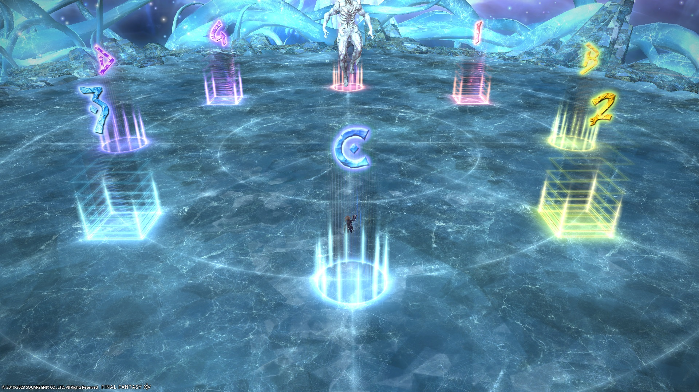

# Anabaseios: The Ninth Circle (Savage)

[Game8](https://game8.jp/ff14/532345) has gone with Nukemaru's strat for P9S.



### Things to check on Party Finder

- Check the Chimeric Succession positions for players marked `1` and `2`.
    - Some macros have `1` go **west**, and `2` go **east**.
    - Some macros have `1` go **east**, and `2` go **west**.

### English

```

```

### Japanese

```

```

## Markers

The colours indicate the pairs positions (MT/D3 are on red, etc).


<details markdown=block>
<summary>XIVLauncher WaymarkPresetPlugin positions</summary>

```json
{"Name":"P9S","MapID":937,"A":{"X":100.0,"Y":0.0,"Z":86.0,"ID":0,"Active":true},"B":{"X":114.0,"Y":0.0,"Z":100.0,"ID":1,"Active":true},"C":{"X":100.0,"Y":0.0,"Z":114.0,"ID":2,"Active":true},"D":{"X":86.0,"Y":0.0,"Z":100.0,"ID":3,"Active":true},"One":{"X":90.101,"Y":0.0,"Z":90.101,"ID":4,"Active":true},"Two":{"X":109.899,"Y":0.0,"Z":90.101,"ID":5,"Active":true},"Three":{"X":109.899,"Y":0.0,"Z":109.899,"ID":6,"Active":true},"Four":{"X":90.101,"Y":0.0,"Z":109.899,"ID":7,"Active":true}}
```

</details>

You may see the square markers rotated 90 degrees clockwise in Japanese parties.


<details markdown=block>
<summary>XIVLauncher WaymarkPresetPlugin positions</summary>

```json
{"Name":"P9S (JP)","MapID":937,"A":{"X":100.0,"Y":0.0,"Z":86.0,"ID":0,"Active":true},"B":{"X":114.0,"Y":0.0,"Z":100.0,"ID":1,"Active":true},"C":{"X":100.0,"Y":0.0,"Z":114.0,"ID":2,"Active":true},"D":{"X":86.0,"Y":0.0,"Z":100.0,"ID":3,"Active":true},"One":{"X":109.899,"Y":0.0,"Z":90.1,"ID":4,"Active":true},"Two":{"X":109.899,"Y":0.0,"Z":109.899,"ID":5,"Active":true},"Three":{"X":90.1,"Y":0.0,"Z":109.899,"ID":6,"Active":true},"Four":{"X":90.1,"Y":0.0,"Z":90.1,"ID":7,"Active":true}}
```

</details>