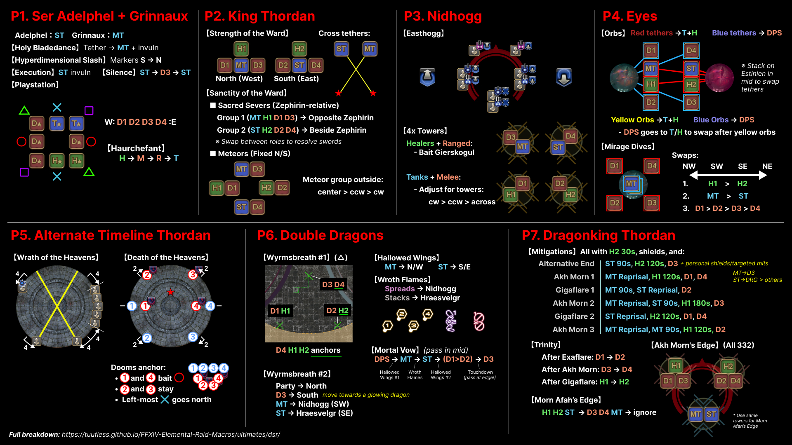
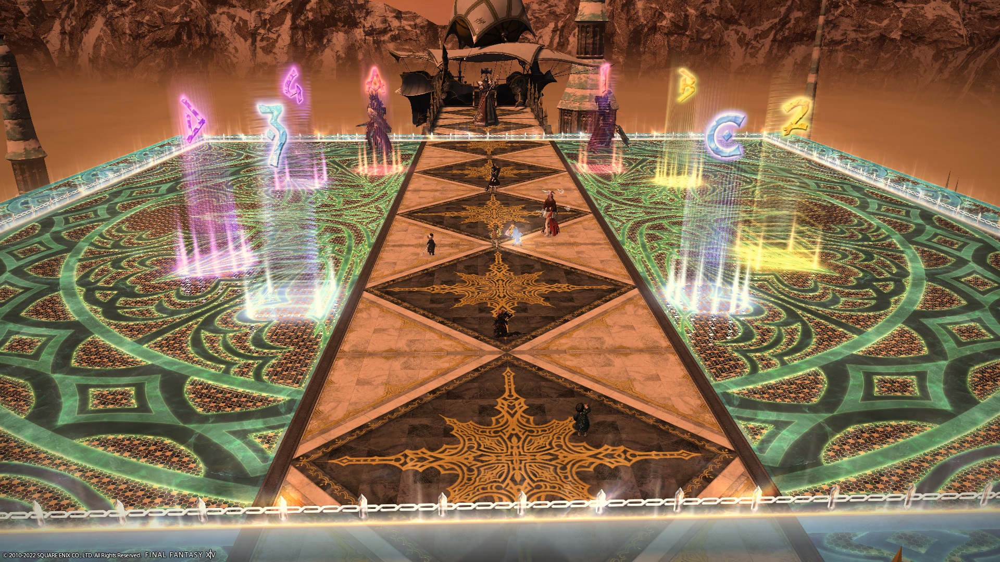
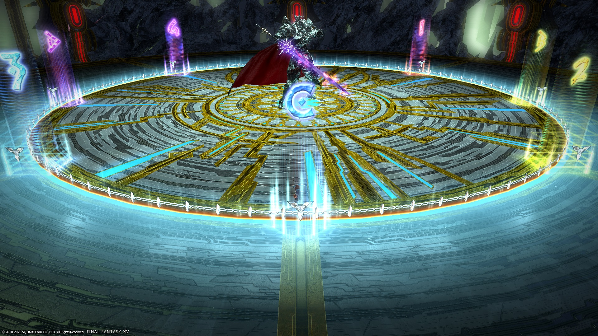

# Dragonsong's Reprise (Ultimate)

Elemental's DSR PF strat can be broken down as follows:

- [**Ser Adelphel + Grinnaux**](../01_adelphel_and_grinnaux/index.en.md): HMRT
- [**King Thordan**](../02_thordan/index.en.md): DRK-relative, role adjust
- [**Nidhogg**](../03_nidhogg/index.en.md): Easthogg
- [**Eyes**](../04_eyes/index.en.md): T/H red, DPS blue
- [**Alternate Timeline Thordan**](../05_alternate_thordan/index.en.md): 2-2 Dooms North, Anchored Dooms
- [**Double Dragons**](../06_double_dragons/index.en.md): △, DTTMR, Fixed WB2 *or* 5-1 WB2s
- [**Dragonking Thordan**](../07_dragonking_thordan/index.en.md): All 3-3-2

### BiS Notes

- Dragonsong's Reprise is the current Ultimate, and is **not** outgeared yet.
    - BiS will be a mix of i600 gear, and i605 gear from Lapis Manalis.

Looking towards the future:

- Dragonsong's Reprise will not be outgeared until **i730** gear is available.
- Relic weapons (when they arrive) will have their substats capped at **269**.


*(Shortened link: [https://cutt.ly/EleDC_DSR_summary](images/dsr_cheatsheet.jpg))*

# Ser Adelphel and Ser Grinnaux

Dragonsong's Reprise is the first Ultimate to showcase a "door" boss. As such, there are two sets of markers and macros to use for this fight.

### Things to check on Party Finder

- Check the marker order for Hyperdimensional Slash (some groups do N→S).
- Check the Playstation positions (there are many variants).

## English
```

```

## Markers

All markers are used to bait Hyperdimensional Slashes (black orbs).


<details markdown=block>
<summary>XIVLauncher WaymarkPresetPlugin positions</summary>

```json
{
  "Name":"Adelphel and Grinnaux",
  "MapID":788,
  "A":{"X":93.015,"Y":0.0,"Z":89.036,"ID":0,"Active":true},
  "B":{"X":110.964,"Y":0.0,"Z":93.015,"ID":1,"Active":true},
  "C":{"X":106.985,"Y":0.0,"Z":110.964,"ID":2,"Active":true},
  "D":{"X":89.036,"Y":0.0,"Z":106.985,"ID":3,"Active":true},
  "One":{"X":106.985,"Y":0.0,"Z":89.036,"ID":4,"Active":true},
  "Two":{"X":110.964,"Y":0.0,"Z":106.985,"ID":5,"Active":true},
  "Three":{"X":93.015,"Y":0.0,"Z":110.964,"ID":6,"Active":true},
  "Four":{"X":89.036,"Y":0.0,"Z":93.015,"ID":7,"Active":true}
}
```

</details>

# King Thordan

This is the macro for the bulk of the fight.

## English
```

```

## Markers

If you are doing the fixed Wyrmsbreath 2 strat, I recommend you use the "outer" markers as the tanks can use the intercardinal markers for reference on where to stand.


<details markdown=block>
<summary>XIVLauncher WaymarkPresetPlugin positions</summary>

```json
{
  "Name":"Dragonsong's Reprise (Outer)",
  "MapID":788,
  "A":{"X":100.0,"Y":0.0,"Z":79.0,"ID":0,"Active":true},
  "B":{"X":121.0,"Y":0.0,"Z":100.0,"ID":1,"Active":true},
  "C":{"X":100.0,"Y":0.0,"Z":121.0,"ID":2,"Active":true},
  "D":{"X":79.0,"Y":0.0,"Z":100.0,"ID":3,"Active":true},
  "One":{"X":114.849,"Y":0.0,"Z":85.151,"ID":4,"Active":true},
  "Two":{"X":114.849,"Y":0.0,"Z":114.849,"ID":5,"Active":true},
  "Three":{"X":85.151,"Y":0.0,"Z":114.849,"ID":6,"Active":true},
  "Four":{"X":85.151,"Y":0.0,"Z":85.151,"ID":7,"Active":true}
}
```

</details>

Otherwise, the "inner" markers are also popular.

The intercardinal markers demarcate:

- The boundaries for the charges at the start of Strength of the Ward
- Where to stand to bait the towers in Nidhogg
- The boundary of Hot Tail in the Double Dragons phase.


<details markdown=block>
<summary>XIVLauncher WaymarkPresetPlugin positions</summary>

```json
{
  "Name":"Dragonsong's Reprise (Inner)",
  "MapID":788,
  "A":{"X":100.0,"Y":0.0,"Z":87.0,"ID":0,"Active":true},
  "B":{"X":113.0,"Y":0.0,"Z":100.0,"ID":1,"Active":true},
  "C":{"X":100.0,"Y":0.0,"Z":113.0,"ID":2,"Active":true},
  "D":{"X":87.0,"Y":0.0,"Z":100.0,"ID":3,"Active":true},
  "One":{"X":109.192,"Y":0.0,"Z":90.807,"ID":4,"Active":true},
  "Two":{"X":109.192,"Y":0.0,"Z":109.192,"ID":5,"Active":true},
  "Three":{"X":90.807,"Y":0.0,"Z":109.192,"ID":6,"Active":true},
  "Four":{"X":90.807,"Y":0.0,"Z":90.807,"ID":7,"Active":true}
}
```

</details>

## Frequently Asked Questions

<details markdown=block>
<summary><b>[Damage Down]</b> How strong is the damage down debuff in this fight?</summary>
<table>
  <tr><td><p>The Damage Down debuff in this phase lowers a player's damage by <b>50%</b>.</p></td></tr>
</table>
</details>