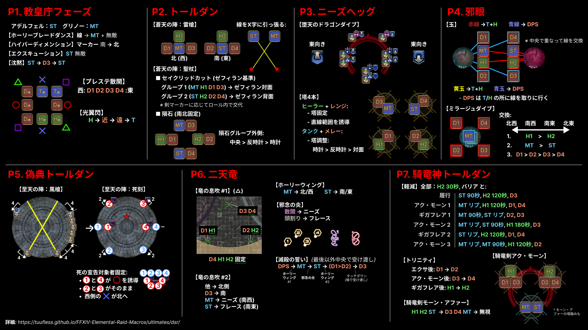

# 絶竜詩戦争

Elemental DC の野良のやり方を以下に要約する：

- [**教皇庁フェーズ**](../01_adelphel_and_grinnaux/index.en.md)：光翼閃 H1H2 D1D2 D3D4 MTST
- [**正典トールダン**](../02_thordan/index.en.md)：聖杖ゼフィラン基準、ロール内で交代
- [**ニーズヘッグ**](../03_nidhogg/index.en.md)：イル B スパ D（東向き）
- [**邪眼フェーズ**](../04_eyes/index.en.md)：T/H 赤、DPS 青
- [**偽典トールダン**](../05_alternate_thordan/index.en.md)：宣告北 & 宣告固定
- [**二天竜フェーズ**](../06_double_dragons/index.en.md)：息吹 1 三角散開、滅殺 DTTMR、息吹 2 位置固定 *または* 北 5 南 1（5-1）
- [**騎竜神トールダン**](../07_dragonking_thordan/index.en.md)：アク・モーン 3-3-2


*(リンク: [https://cutt.ly/EleDC_DSR_summary](images/dsr_cheatsheet_jp.jpg))*

日本の動画の違いは以下の通り。

- 教皇庁一回目 ハイパーディメンションは**南 → 北**。日本は北 → 南
- 教皇庁一回目 プレステ散開の散開図が異なる
- 教皇庁一回目 光翼閃を受ける順序と、蒼天の刻印を捨てる位置が異なる
- ニーズヘッグ **東を向く**が基本。日本は西を向くが基本
- 邪眼フェーズ 散開、玉を取る順序、ミラージュダイブを受ける順序が異なる
- 至天の陣：死刻 **南北が逆**、散開位置が少し異なる
- 最終フェーズ（パールダンこと騎竜神トールダン） トリニティ（AA）を受ける順序が異なる

# 教皇庁フェーズ

絶竜詩戦争は絶シリーズ初のチェックポイントがあるため、マクロとマーカーが 2 つある。

## マクロ
```

```

## マーカー

すべてのマーカーをハイパーディメンションの誘導に使用する。


<details markdown=block>
<summary>XIVLauncher WaymarkPresetPlugin の座標</summary>

```json
{
  "Name":"Adelphel and Grinnaux",
  "MapID":788,
  "A":{"X":95.0,"Y":0.0,"Z":91.5,"ID":1,"Active":true},
  "B":{"X":108.5,"Y":0.0,"Z":95.0,"ID":2,"Active":true},
  "C":{"X":105.0,"Y":0.0,"Z":108.5,"ID":5,"Active":true},
  "D":{"X":91.5,"Y":0.0,"Z":105.0,"ID":6,"Active":true},
  "One":{"X":105.0,"Y":0.0,"Z":91.5,"ID":3,"Active":true},
  "Two":{"X":108.5,"Y":0.0,"Z":105.0,"ID":4,"Active":true},
  "Three":{"X":95.0,"Y":0.0,"Z":108.5,"ID":7,"Active":true},
  "Four":{"X":91.5,"Y":0.0,"Z":95.0,"ID":0,"Active":true}
}
```

</details>

# 正典トールダン

以下は正典トールダン以後のマクロ。

## マクロ
```

```

## マーカー

息吹 2 回目で位置固定法を使う場合、タンクの安地を分かりやすくするために数字マーカーを外周に置くことを推奨する。


<details markdown=block>
<summary>XIVLauncher WaymarkPresetPlugin の座標</summary>

```json
{
  "Name":"Dragonsong's Reprise (Outer)",
  "MapID":788,
  "A":{"X":100.0,"Y":0.0,"Z":79.0,"ID":0,"Active":true},
  "B":{"X":121.0,"Y":0.0,"Z":100.0,"ID":1,"Active":true},
  "C":{"X":100.0,"Y":0.0,"Z":121.0,"ID":2,"Active":true},
  "D":{"X":79.0,"Y":0.0,"Z":100.0,"ID":3,"Active":true},
  "One":{"X":114.849,"Y":0.0,"Z":85.151,"ID":4,"Active":true},
  "Two":{"X":114.849,"Y":0.0,"Z":114.849,"ID":5,"Active":true},
  "Three":{"X":85.151,"Y":0.0,"Z":114.849,"ID":6,"Active":true},
  "Four":{"X":85.151,"Y":0.0,"Z":85.151,"ID":7,"Active":true}
}
```

</details>

ただし、内周マーカーも好んで使用される。

内周マーカーの数字マーカーは以下を分かりやすくする。

- 雷槍開幕の突進の安地
- ニーズヘッグの 4 塔
- 二天竜フェーズのヒートテイルの安地


<details markdown=block>
<summary>XIVLauncher WaymarkPresetPlugin の座標</summary>

```json
{
  "Name":"Dragonsong's Reprise (Inner)",
  "MapID":788,
  "A":{"X":100.0,"Y":0.0,"Z":87.0,"ID":0,"Active":true},
  "B":{"X":113.0,"Y":0.0,"Z":100.0,"ID":1,"Active":true},
  "C":{"X":100.0,"Y":0.0,"Z":113.0,"ID":2,"Active":true},
  "D":{"X":87.0,"Y":0.0,"Z":100.0,"ID":3,"Active":true},
  "One":{"X":109.192,"Y":0.0,"Z":90.807,"ID":4,"Active":true},
  "Two":{"X":109.192,"Y":0.0,"Z":109.192,"ID":5,"Active":true},
  "Three":{"X":90.807,"Y":0.0,"Z":109.192,"ID":6,"Active":true},
  "Four":{"X":90.807,"Y":0.0,"Z":90.807,"ID":7,"Active":true}
}
```

</details>

## よくある質問

<details markdown=block>
<summary><b>[与ダメージ低下デバフ]</b> 与ダメージ低下率はどれくらいですか？</summary>
<table>
  <tr><td><p>ダメージは <b>50%</b> 低下します。</p></td></tr>
</table>
</details>