# Nidhogg

## Summary

If you are already familiar with Nidhogg and just need a quick summary:

<table>
  <tr>
    <td><b>Nidhogg</b></td>
    <td><ul><li>Easthogg</li></ul></td>
  </tr>
  <tr>
    <td><b>4x Towers</b></td>
    <td><ul><li>Ranged bait</li></ul></td>
  </tr>
</table>

Nidhogg's phase opens with Final Chorus, another very hard-hitting raid-wide attack. Notably, Nidhogg is not yet targetable, so debuffs like Reprisal or Addle cannot be used to mitigate this damage.

## Wyrmhole (Easthogg)

The first phase of Nidhogg is often called "Wyrmhole", due to its strong resemblance to Wormhole Formation in TEA.

Wyrmhole has two variants, affectionately dubbed "Easthogg" or "Westhogg", which dictates where players with arrow debuffs go, and which direction they face when placing towers.

- **English** parties prefer to go with "Easthogg".
- **Japanese** parties prefer to go with "Westhogg". Simply reflect all arrow positions and have players face west when placing towers instead.

Note that **at most**, only two pairs of arrows will appear. The following diagrams illustrate a scenario where all numbered groups have a pair of arrows, but this will not actually happen in-game.

<table>
  <tr>
    <td width="50%">
<b>1.</b> Numbers appear.

All players claim initial spots:<ul><li><b>1s + 3s:</b> One pair of each West, South, and East.</li><li><b>2s:</b> One NW, one NE.</li></ul>

These will be your positions during Wyrmhole <b>if your numbered group does not get arrows</b>.
</td>
    <td>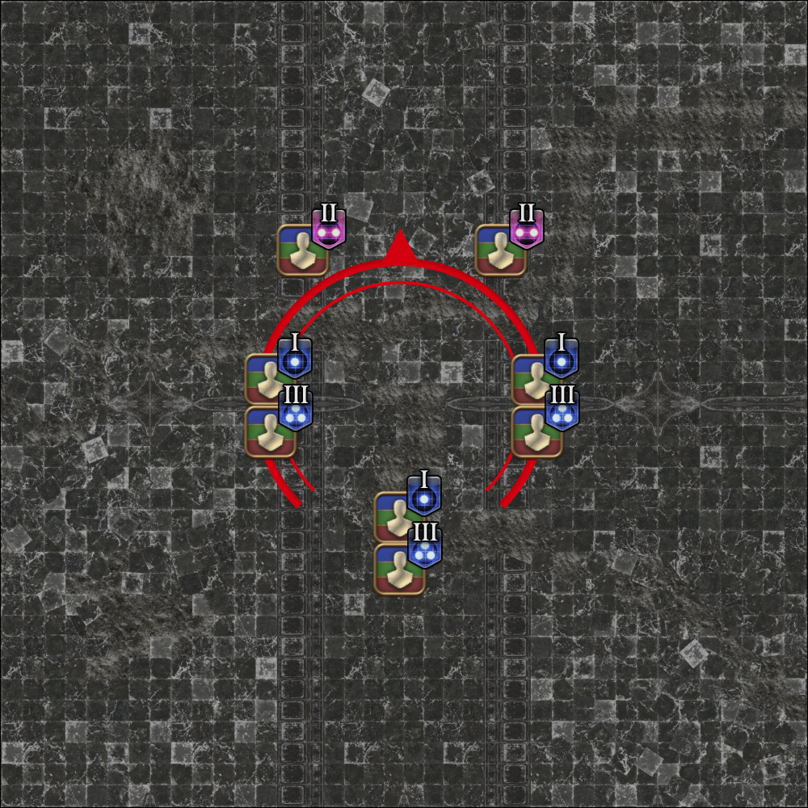</td>
  </tr>
  <tr>
    <td>
<b>2.</b> Arrow debuffs appear.

If your numbered group contains arrows (Elusive/Spineshatter Dives), <b>the arrows override the claimed positions from the previous step.</b>

    <ul>
      <li><b>Up arrow</b> (Spineshatter Dive Target): <b>West</b></li>
      <li><b>No arrow</b> (High Jump Target): <b>South</b></li>
      <li><b>Down arrow</b> (Elusive Jump Target): <b>East</b></li></ul>
    These are now the final player positions for the Wyrmhole phase.</td>
    <td>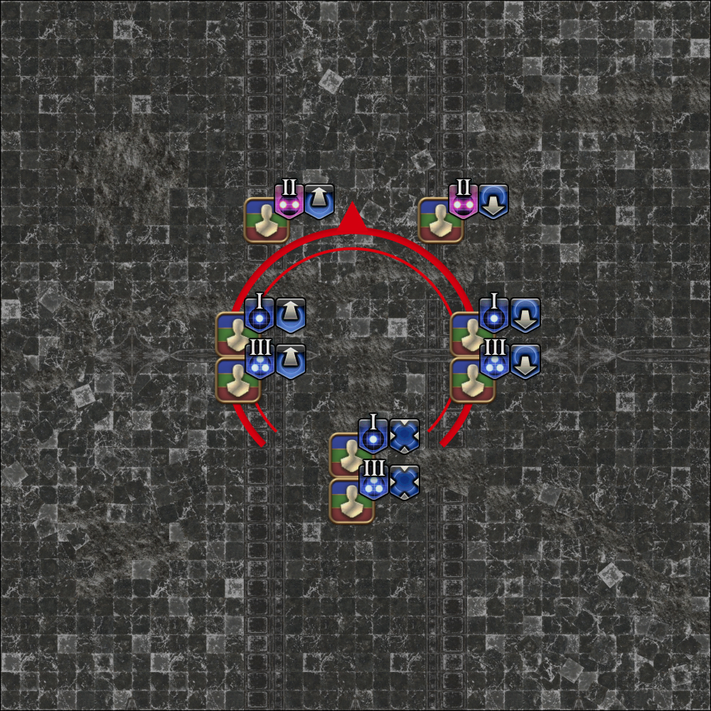</td>
  </tr>
  <tr>
    <td>
<b>3.</b> First loop begins
<ul><li><b>1s:</b> Place towers (face east if you have an arrow!)</li><li><b>2s:</b> Stack north</li><li><b>3s:</b> Stack north</li></ul></td>
    <td>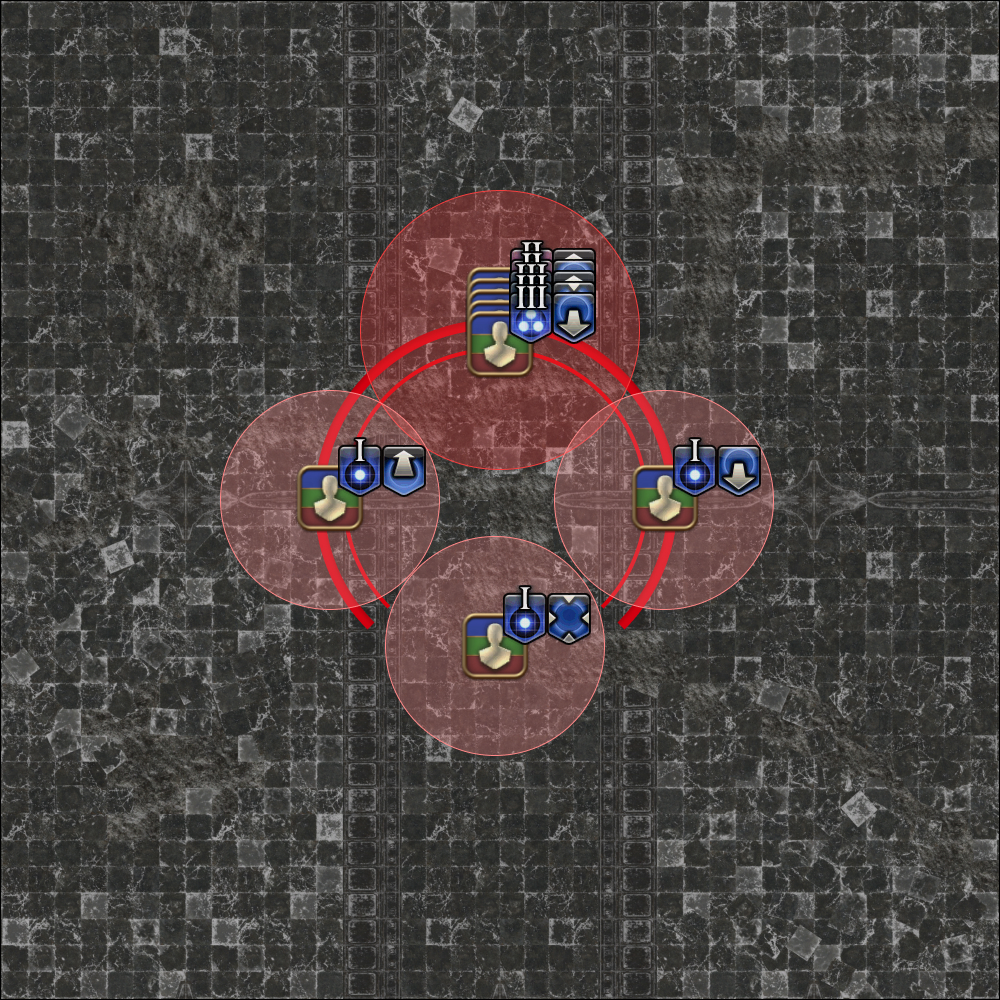</td>
  </tr>
  <tr>
    <td>
<b>4.</b> First "Lash and Gnash" or "Gnash and Lash".
<ul><li><b>1s:</b> Move north</li><li><b>3s:</b> Take towers while dodging in/out AoEs.</li></ul>
<em>(The diagram illustrates "Gnash and Lash")</em>
</td>
    <td></td>
  </tr>
  <tr>
    <td>
<b>5.</b> First "Lash and Gnash" or "Gnash and Lash" (cont'd).
<ul><li><b>1s:</b> Move north</li><li><b>3s:</b> Take towers while dodging in/out AoEs.</li></ul></td>
    <td></td>
  </tr>
  <tr>
    <td>
<b>6.</b> Second set of towers.
<ul><li><b>2s:</b> Place towers NW and NE (face east if you have an arrow!)</li><li><b>3s:</b> Bait Geirskoguls outside.</li></ul></td>
    <td>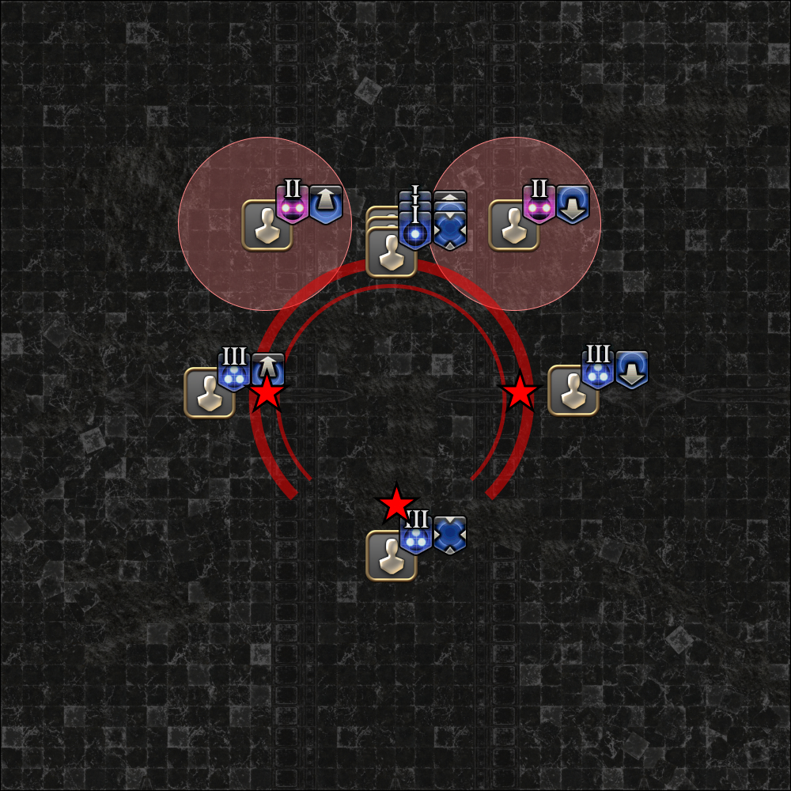</td>
  </tr>
  <tr>
    <td>
<b>7.</b> Second set of towers.
<ul><li><b>1s (with arrows):</b> Take towers.</li><li><b>2s:</b> Return to the stack north.</li><li><b>3s:</b> Dodge Geirskoguls.</li></ul></td>
    <td>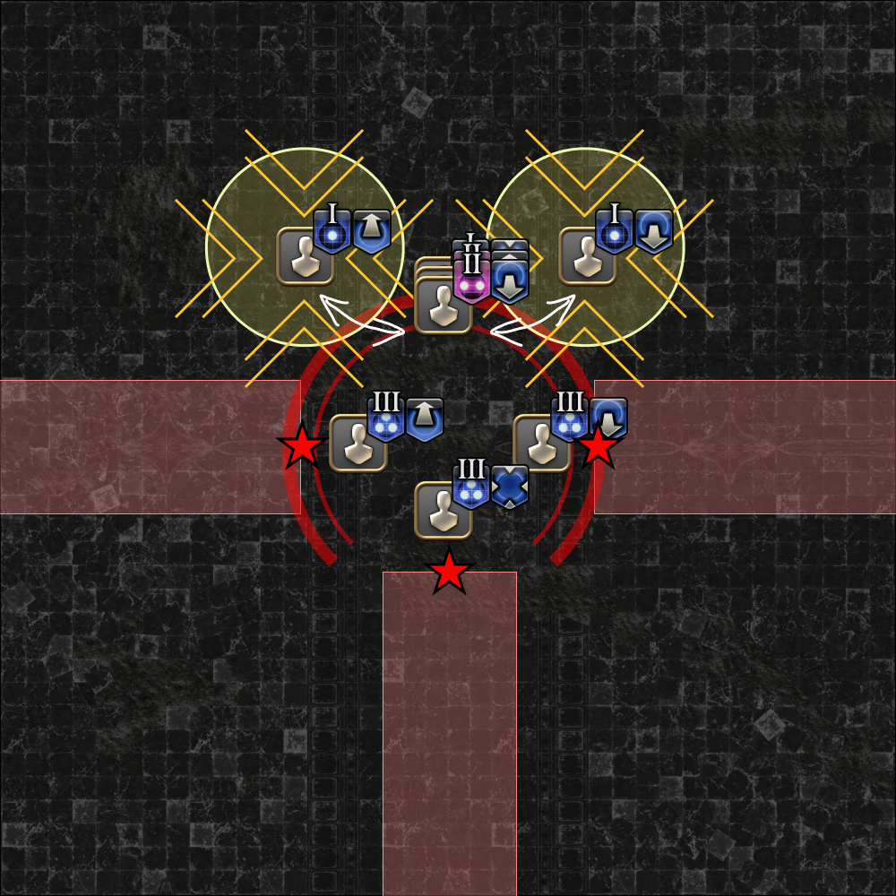</td>
  </tr>
  <tr>
    <td>
<b>8.</b> Second set of towers.
<ul><li><b>1s:</b> Bait Geirskoguls outside.</li></ul></td>
    <td>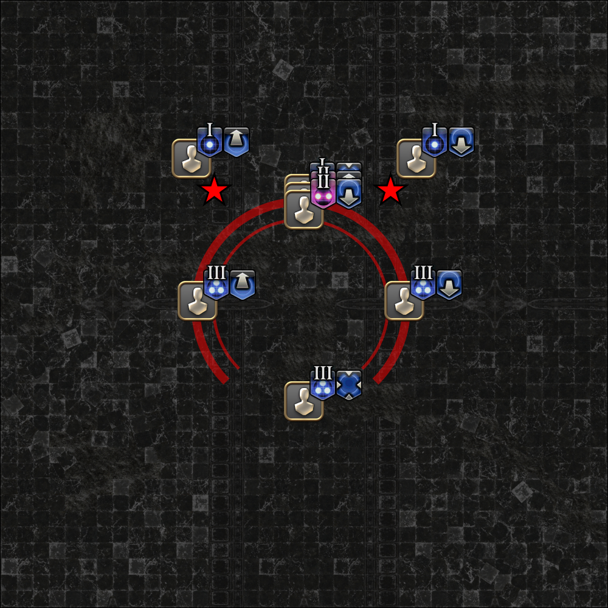</td>
  </tr>
  <tr>
    <td>
<b>9.</b> Second loop.
<ul><li><b>1s:</b> After baiting Geirskogul, <em>quickly</em> join the stack at north.</li><li><b>3s:</b> Place towers (face east if you have an arrow!).</li></ul></td>
    <td>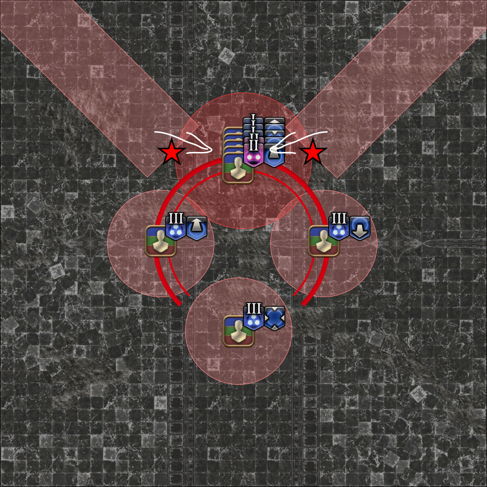</td>
  </tr>
  <tr>
    <td>
<b>10.</b> Second "Lash and Gnash" or "Gnash and Lash".
<ul>
    <li><b>1 (no arrow):</b> Take south tower while dodging in/out AoEs.</li><li><b>2s:</b> Take east/west towers while dodging in/out AoEs.</li><li><b>3s:</b> Move north.</li></ul>
<em>(The diagram illustrates "Lash and Gnash")</em>
</td>
    <td></td>
  </tr>
  <tr>
    <td>
<b>11.</b> Second "Lash and Gnash" or "Gnash and Lash" (cont'd).
<ul>
    <li><b>1 (no arrow):</b> Take south tower while dodging in/out AoEs.</li><li><b>2s:</b> Take east/west towers while dodging in/out AoEs.</li><li><b>3s:</b> Move north.</li></ul></td>
    <td>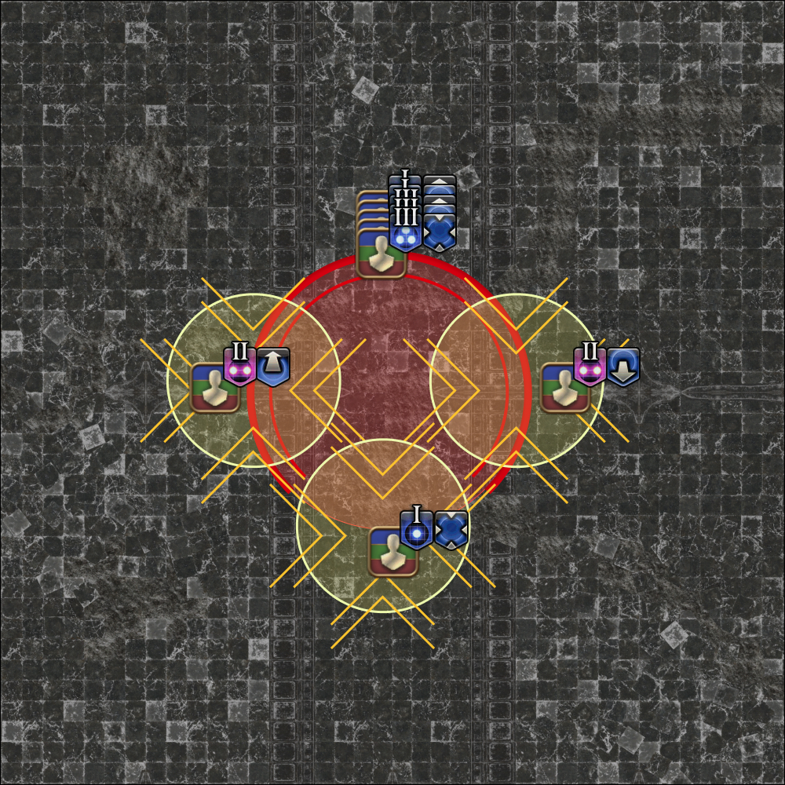</td>
  </tr>
  <tr>
    <td>
<b>12.</b> Second set of towers.
<ul><li><b>1s (no arrow):</b> Bait south Geirskogul outside.</li><li><b>2s:</b> Bait east/west Geirskoguls outside.</li></ul></td>
    <td>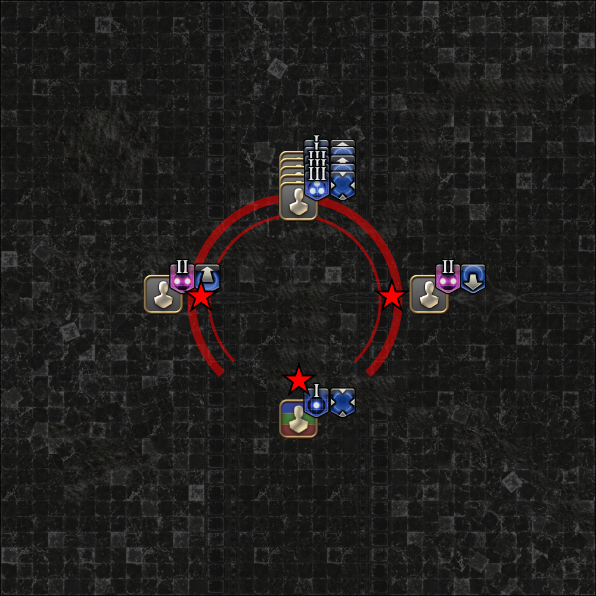</td>
  </tr>
  <tr>
    <td>
<b>13.</b> Second set of towers.
<ul><li><b>1s (no arrow):</b> Dodge Geirskogul.</li><li><b>2s:</b> Dodge Geirskogul.</li></ul>
    
Nidhogg will also resume auto-attacking the MT at this point, so players will need to dodge that as well.
</td>
    <td>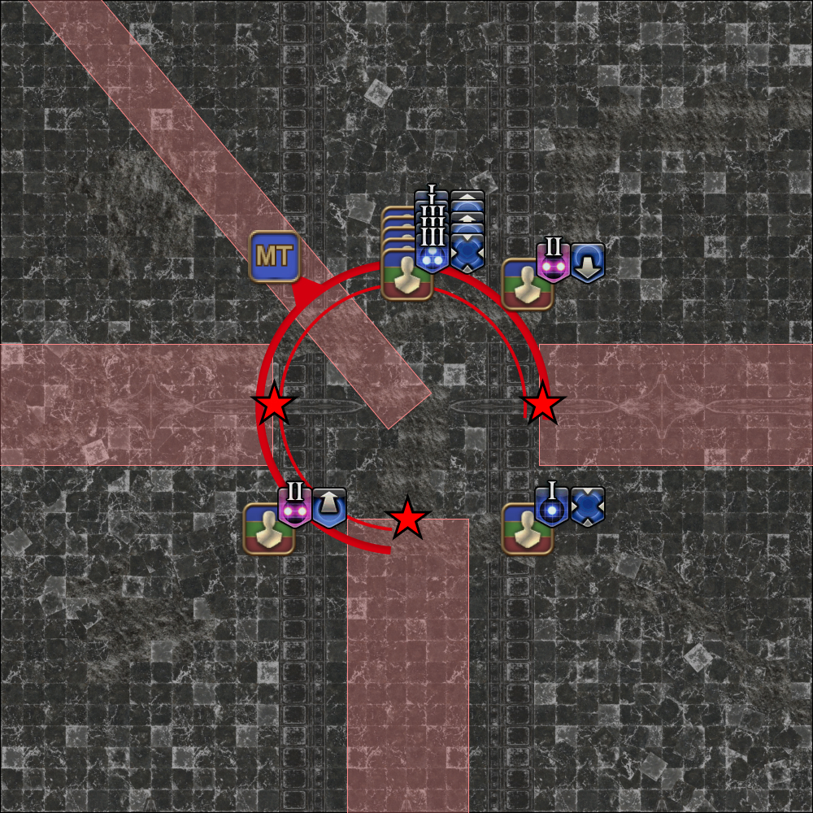</td>
  </tr>
  <tr>
    <td>
<b>14.</b> Nidhogg will auto-attack the MT <b>twice</b> before turning to face a <b>random</b> party member and cast Drachenlance.

Dodge or outrange this, and prepare for 4x towers.
</td>
    <td>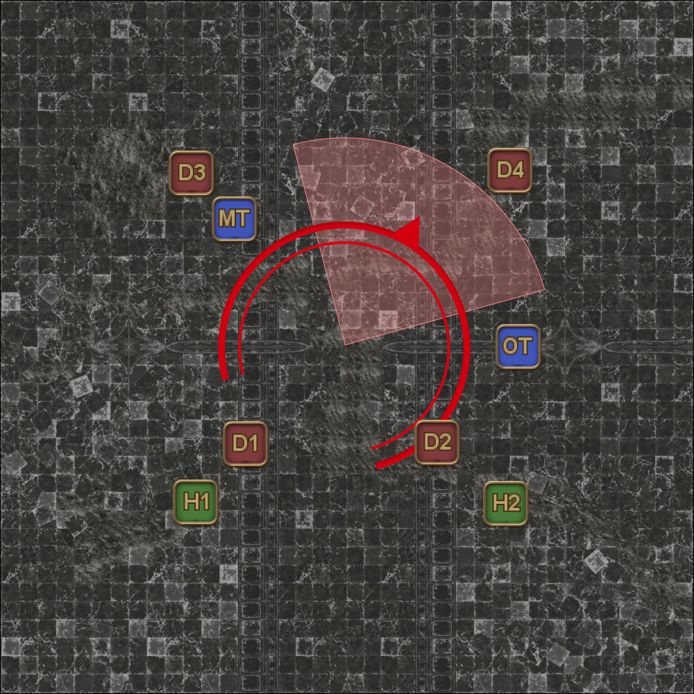</td>
  </tr>
</table>

## 4x Towers

Four towers will spawn at the four intercardinal towers. Each tower needs 1-4 players (chosen at random) to be inside, with a total of 8 players.

The easiest way to resolve this is to preposition in pairs at each tower:

<table>
  <tr>
    <td width="50%">
<b>Starting positions:</b>

      <ul>
        <li>
          <b>MT:</b> NW
        </li>
        <li>
          <b>ST:</b> NE
        </li>
        <li>
          <b>D1:</b> SW
        </li>
        <li>
          <b>D2:</b> SE
        </li>
      </ul>
    </td>
    <td>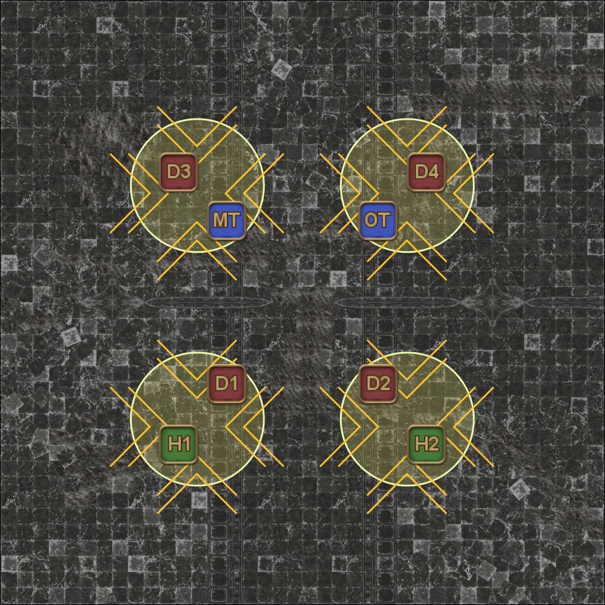</td>
  </tr>
</table>

- Healers and Ranged stay in their towers to bait Gierskogul.
- Tanks and Melee adjust:
    - If your tower needs **2 or more** players, **stay**.
    - Otherwise, adjust to the first tower that needs **more than 2** with the following priority:
        
            cw > ccw > across

      Done correctly, **at most** two players will need to move.

<table>
  <tr>
    <td width="50%">
      <ul>
        <li>
          <b>MT:</b>
          <ol>
            <li><b>MT</b> tower (NW) has 1 pip.</li>
            <li>CW tower has more than 2</li>
            <li><b>Rotate CW</b></li>
          </ol>
        </li>
        <li>
          <b>ST:</b>
          <ol>
            <li>Own tower (NE) has 2 or more pips.</li>
            <li><b>Stay</b></li>
          </ol>
        </li>
        <li>
          <b>D1:</b>
          <ol>
            <li>Own tower (SW) has 2 or more pips.</li>
            <li><b>Stay</b></li>
          </ol>
        </li>
        <li>
          <b>D2:</b>
          <ol>
            <li>Own tower (SE) has 1 pip.</li>
            <li>CW tower has more than 2</li>
            <li><b>Rotate CW</b></li>
          </ol>
        </li>
      </ul>
    </td>
    <td>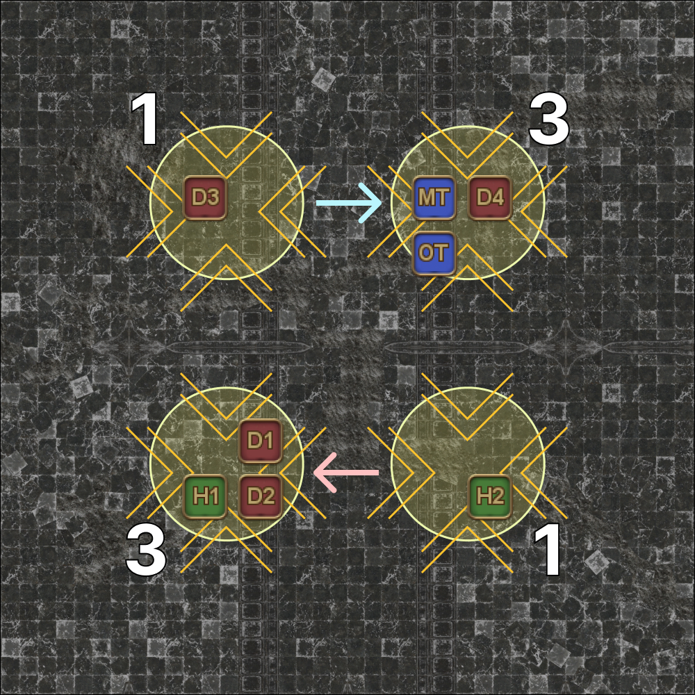</td>
  </tr>
</table>

Example 2

<table>
  <tr>
    <td width="50%">
      <ul>
        <li>
          <b>MT:</b>
          <ol>
            <li><b>MT</b> tower (NW) has 1 pip.</li>
            <li>CW tower has more than 2</li>
            <li><b>Rotate CW</b></li>
          </ol>
        </li>
        <li>
          <b>ST:</b>
          <ol>
            <li>Own tower (NE) has 2 or more pips.</li>
            <li><b>Stay</b></li>
          </ol>
        </li>
        <li>
          <b>D1:</b>
          <ol>
            <li>Own tower (SW) has 2 or more pips.</li>
            <li><b>Stay</b></li>
          </ol>
        </li>
        <li>
          <b>D2:</b>
          <ol>
            <li>Own tower (SE) has 1 pip.</li>
            <li>CW tower has 2 pips</li>
            <li>CCW tower has more than 2</li>
            <li><b>Rotate CCW</b></li>
          </ol>
        </li>
      </ul>
    </td>
    <td></td>
  </tr>
</table>

Example 3

<table>
  <tr>
    <td width="50%">
      <ul>
        <li>
          <b>MT:</b>
          <ol>
            <li>Own tower (NE) has 2 or more pips.</li>
            <li><b>Stay</b></li>
          </ol>
        </li>
        <li>
          <b>ST:</b>
          <ol>
            <li>Own tower (NE) has 2 or more pips.</li>
            <li><b>Stay</b></li>
          </ol>
        </li>
        <li>
          <b>D1:</b>
          <ol>
            <li>Own tower (SW) has 2 or more pips.</li>
            <li><b>Stay</b></li>
          </ol>
        </li>
        <li>
          <b>D2:</b>
          <ol>
            <li>Own tower (SE) has 1 pip.</li>
            <li>CW tower has 2 pips</li>
            <li>CCW tower has 2 pips</li>
            <li>Opposite tower has more than 2 pips</li>
            <li><b>Move across</b></li>
          </ol>
        </li>
      </ul>
    </td>
    <td>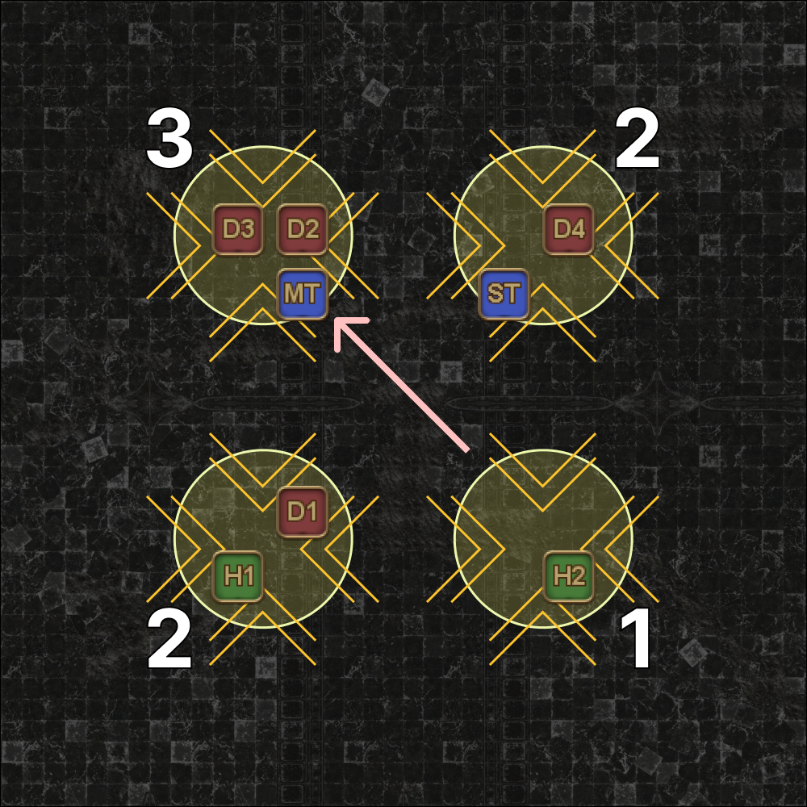</td>
  </tr>
</table>

Just like before, Nidhogg clones will appear where the towers were when resolved.

- Three of these clones will cast Geirskogul on their closest targets (baited by healers and ranged DPS)
- The last clone will attach a Soul tether to a random (non-tank) player.
- Nidhogg also attaches a Soul tether to a random (non-tank) player.

<table>
  <tr>
    <td width="50%">
      
<b>1.</b> Just like before, Nidhogg clones will appear where the towers were when resolved.

      <ul>
        <li><b>Three</b> clones will target the closest player with Geirskogul (baited by the healers and ranged DPS).</li>
        <li>The last clone will attach a Soul tether to a random (non-tank) player.</li>
        <li>Nidhogg also attached a Soul tether to a random (non-tank) player.</li>
      </ul>
    </td>
    <td>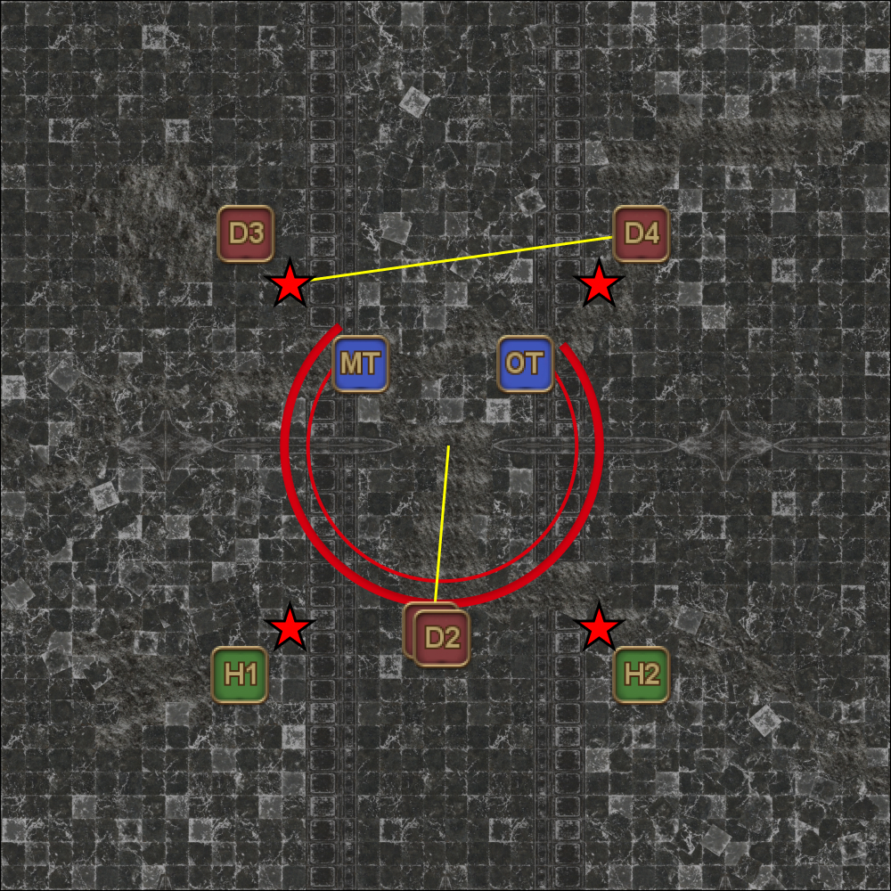</td>
  </tr>
  <tr>
    <td>
      
<b>2.</b> Tanks take the Soul tethers, and everyone dodges the Geirskoguls.

      <ul>
        <li><b>MT:</b> Take Nidhogg's Soul tether and resolve it near Nidhogg.</li>
        <li><b>ST:</b> Take the clone's Soul tether and resolve it away from Nidhogg.</li>
      </ul>
      
Soul tethers are <b>extremely</b> hard-hitting tankbusters (~270% of a tank's max HP!)

    </td>
    <td>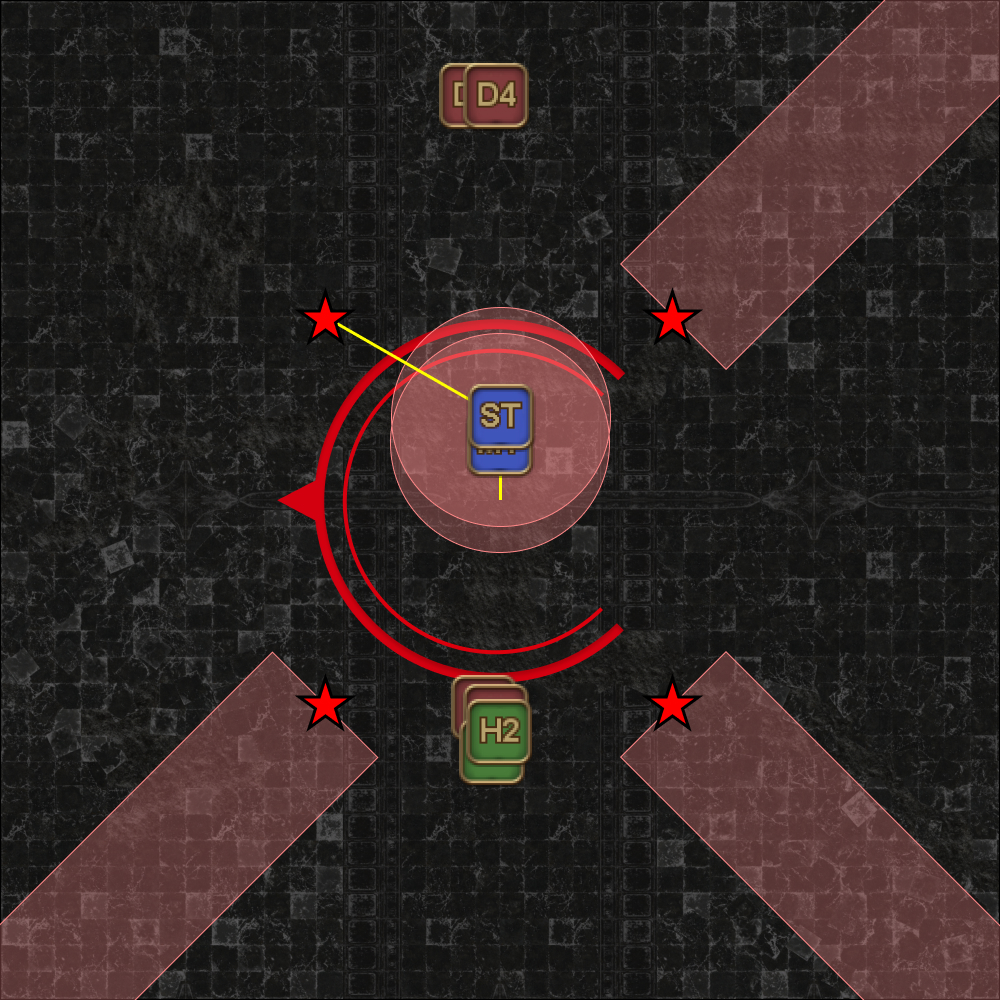</td>
  </tr>
</table>

After the Soul tethers resolve, Nidhogg will then autoattack the MT **five times** before turning for one final Drachenlance (which will **always** point South).

Nidhogg then starts casting Revenge of the Horde (enrage).