# Alternate Thordan

## Summary

If you are already familiar with the Alternate timeline Thordan phase, and just
need a quick summary:

<table>
  <tr>
    <td><b>Death of the Heavens</b></td>
    <td><ul><li>2-2 Dooms north</li><li>Anchored Dooms</li></ul></td>
  </tr>
</table>

---

Thordan appears in the center of the arena, facing South. Thordan starts the
phase by casting *Incarnation*, which simply revives the dragons lying around
the arena, and casting *The Dragon's Eye*, which is simply a damage up buff.

Because Thordan will not move or rotate while casting these abilities, have the
MT start South, and the party North.

Thordan will auto-attack the MT twice (remember, these are cone AoEs!), before
jumping to the center of the arena and casting the first Trio combo of the
phase, *Wrath of the Heavens*.

## Wrath of the Heavens

<table>
  <tr>
    <td width="50%">
      
<b>1.</b> A white dragon with two knights will spawn at a random
      cardinal edge.

      
Using the white dragon as north:

      <ul>
        <li>One player with the blue <em>Skyward Leap</em> marker will go NW (4
        notches from the "shuriken").</li>
        <li>Two players with <em>Spiral Thrust</em> tethers will cross their
        tethers and stand south (4 notches away from SW and SE).</li>
        <li>All other players line up along the east side (within 4 notches
        away from the NE and SE "shurikens").</li>
      </ul>
    </td>
    <td>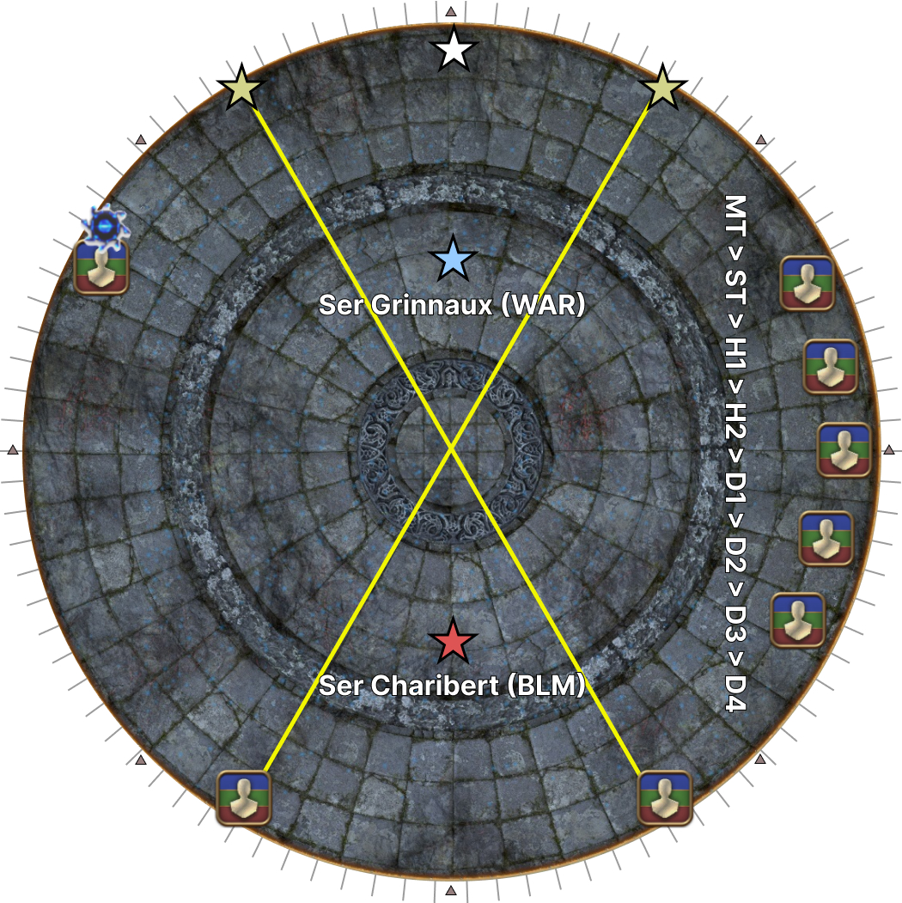</td>
  </tr>
  <tr>
    <td>
      
<b>2.</b> Ser Grinnaux (WAR) and Ser Charibert (BLM) will then spawn in
      the arena, one north, one south <b>in a random configuration</b>.

      
<b>Identify which is Ser Grinnaux (WAR), and which is Ser Charibert
      (BLM)</b>.

      
Two players will also get a <em>Thunderstruck</em> debuff, which will
      resolve later.

    </td>
    <td>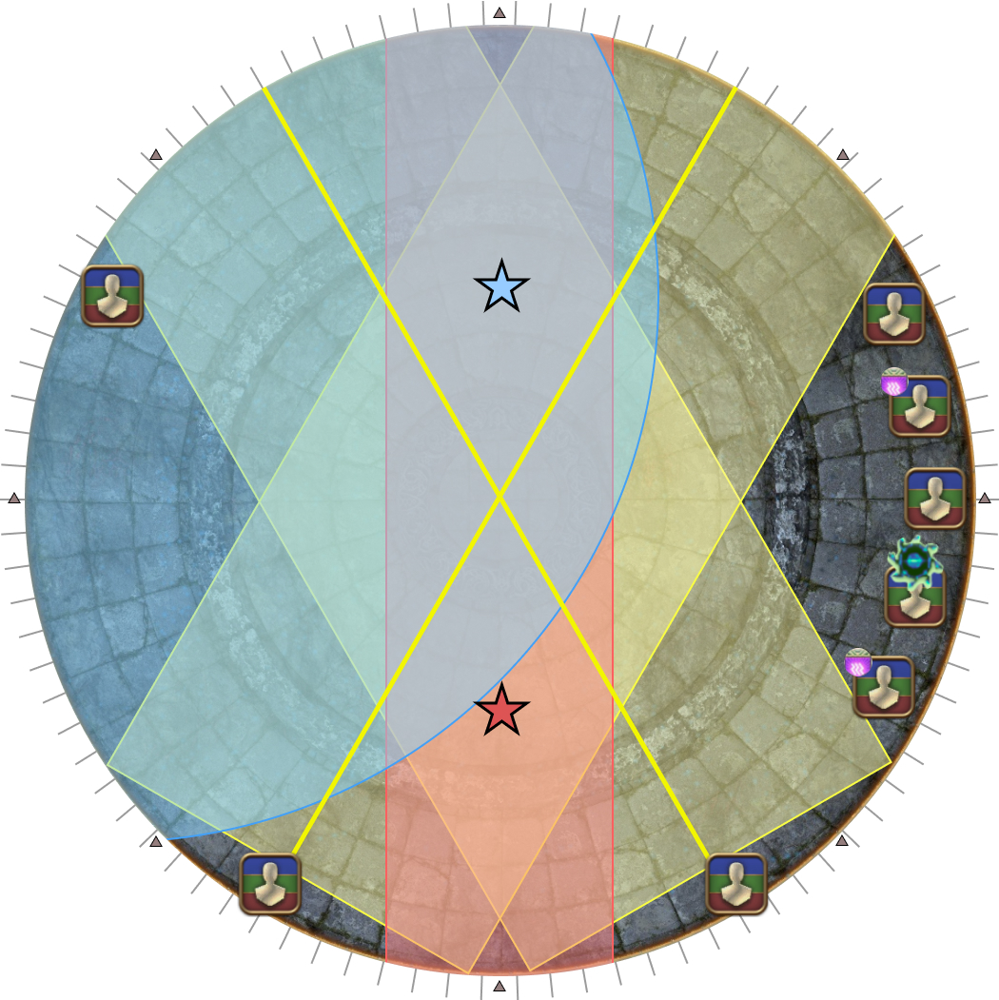</td>
  </tr>
  <tr>
    <td>
      
<b>3.</b> The AoEs resolve, and one of the five players that did not
      receive either a tether, or <em>Skyward Leap</em> will now get a green
      divebomb mark.

      
<b>All players move to dodge Twisters.</b>

    </td>
    <td>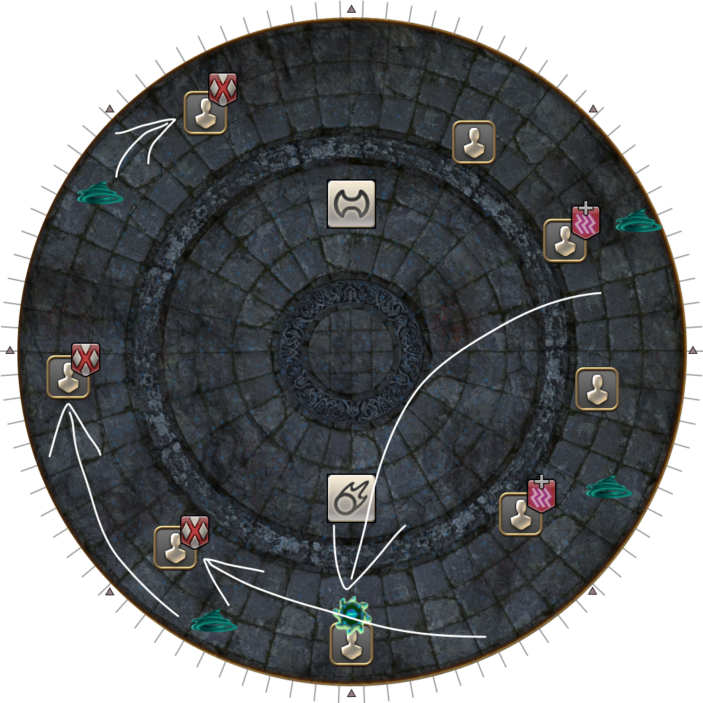</td>
  </tr>
  <tr>
    <td>
      
<b>4.</b> All players must now spread out with <b>at least 2 tiles
      between players</b>.

      <ul>
        <li>The three players who had the <em>Skyward Leap</em> and the two
        <em>Spiral Pierces</em> will always dodge clockwise and <b>spread along
        the west</b>.</li>
        <li>The player with the green divebomb mark goes to the <b>edge behind
        Ser Charibert (BLM)</b>.</li>
        <li>The remaining four players spread out along the east side.</li>
      </ul>
    </td>
    <td>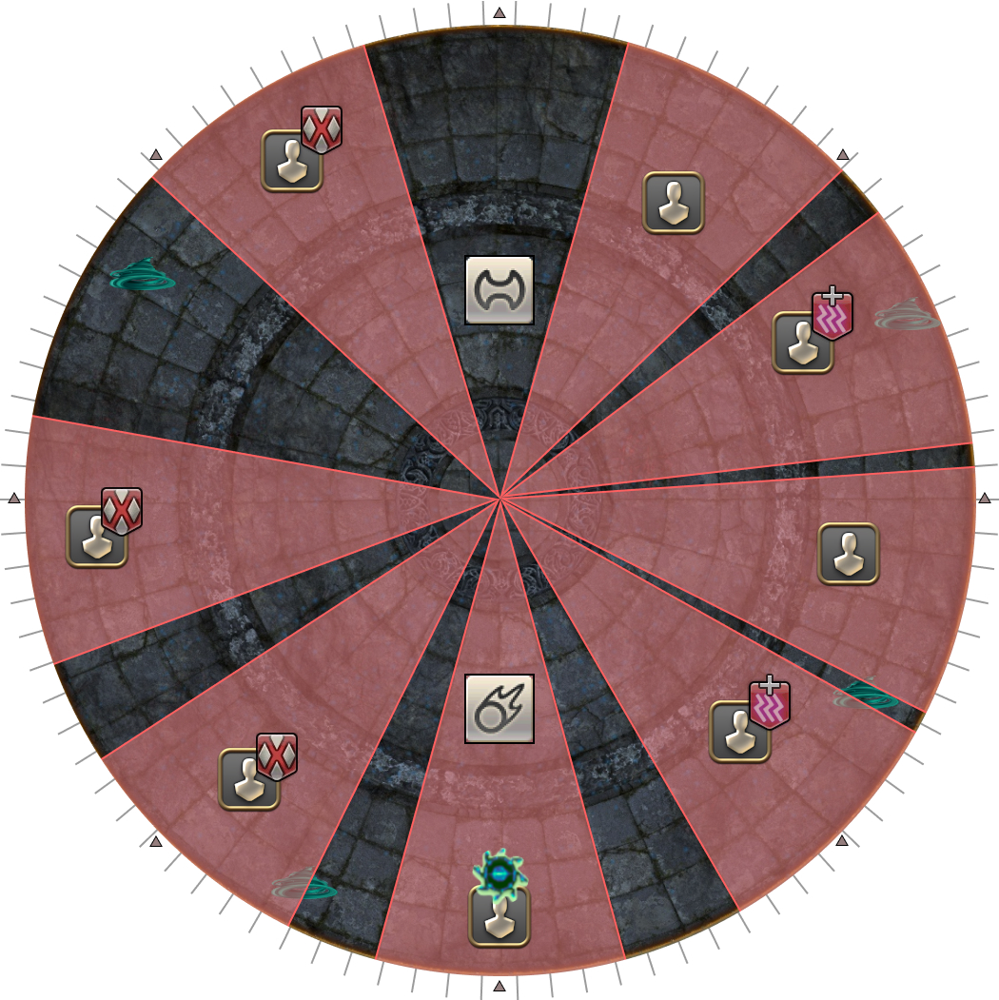</td>
  </tr>
  <tr>
    <td>
      
<b>5.</b> Thordan then resolves <em>Ascalon's Mercy Revealed</em>,
      which cleaves all players.

      
Baited AoEs then appear on two players:

      <ul>
        <li>One player who had either <em>Skyward Leap</em>,
        <em>Spiral Pierce</em>, or the divebomb will be targeted by 4 Altar
        Pyre AoEs.</li>
        <li>One of the four remaining players will be targeted by 5 <em>Liquid
        Heaven</em> AoEs.</li>
      </ul>
      
A player with <em>Thunderstruck</em> <b>will not</b> be targeted by
      either <em>Altar Pyre</em>, or <em>Liquid Heaven</em>.

    </td>
    <td></td>
  </tr>
  <tr>
    <td>
      
<b>6.</b> Bait <em>Altar Pyre</em> and <em>Liquid Heaven</em> AoEs,
      and move <b>towards Ser Grinnaux (WAR)</b>.

      <ul>
        <li>The two players with <em>Thunderstruck</em> will be towards the
        outside.</li>
        <li>All other players stack towards the center of the arena.</li>
      </ul>
      
The player on the east with <em>Liquid Heaven</em> should try to
      <b>enter the safe spot from the side</b>, as a player on the west side
      will be one-shot if they get hit by the <em>Liquid Heaven</em> AoE.

    </td>
    <td>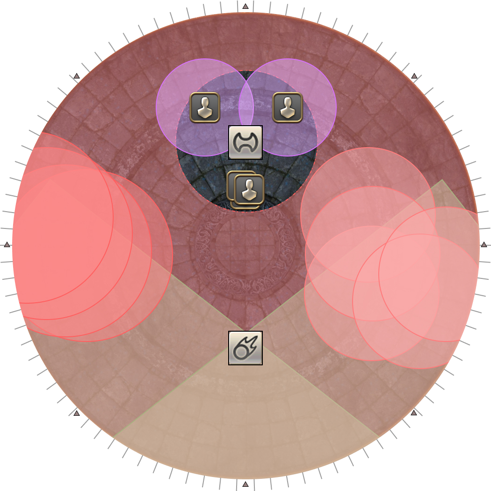</td>
  </tr>
  <tr>
    <td>
      
<b>7.</b> Final set of AoEs resolve.

      
Heal and prepare for <em>Ancient Quaga</em>.

    </td>
    <td>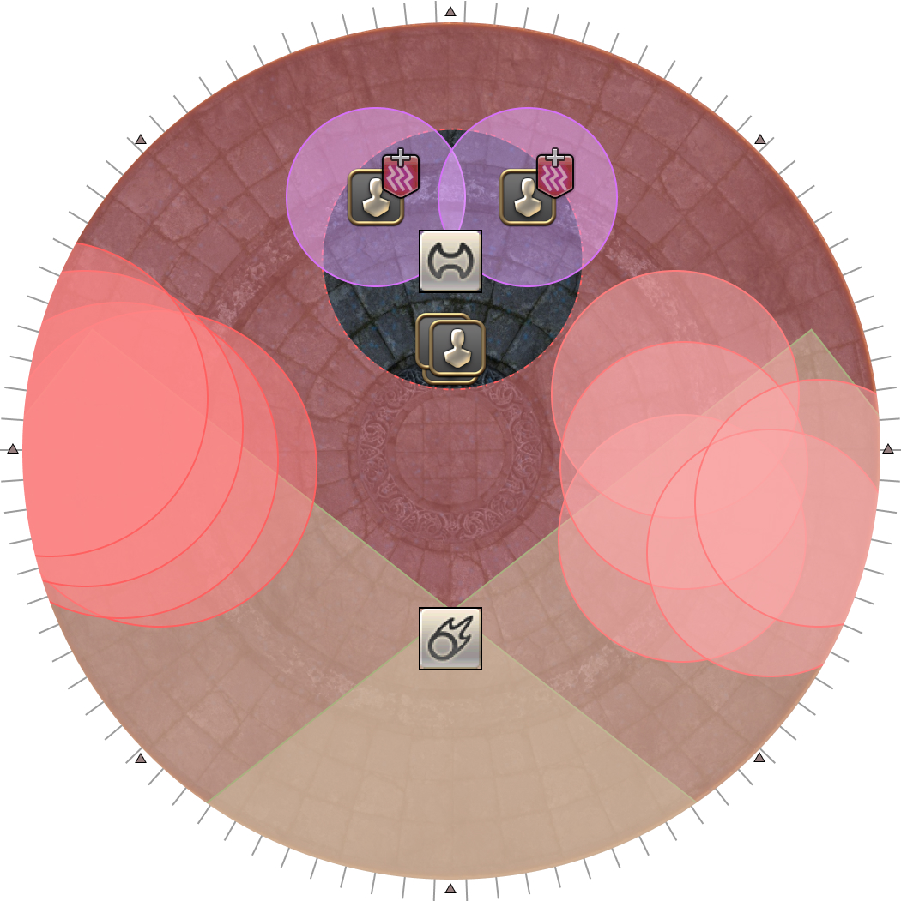</td>
  </tr>
</table>

Thordan will auto-attack the MT once, before doing a *Heavenly Heel* → 3x
*Ascalon's Might* combo.

<b>Tip:</b> A WAR can Holmgang this combo and have Holmgang back up in time for
Cauterize at the end of P6.

---

## Death of the Heavens

My preferred strat is an upside-down version of the "Komazou" strat, which
splits the Dooms 2-2.

<table>
  <tr>
    <td width="50%">
      
<b>1.</b> Ser Guerrique (WAR) will spawn on one of the four cardinal
      locations.

      <ul>
        <li>Use Ser Guerrique as North for the rest of the mechanic.</li>
        <li>Line up east-to-west.</li>
      </ul>
    </td>
    <td>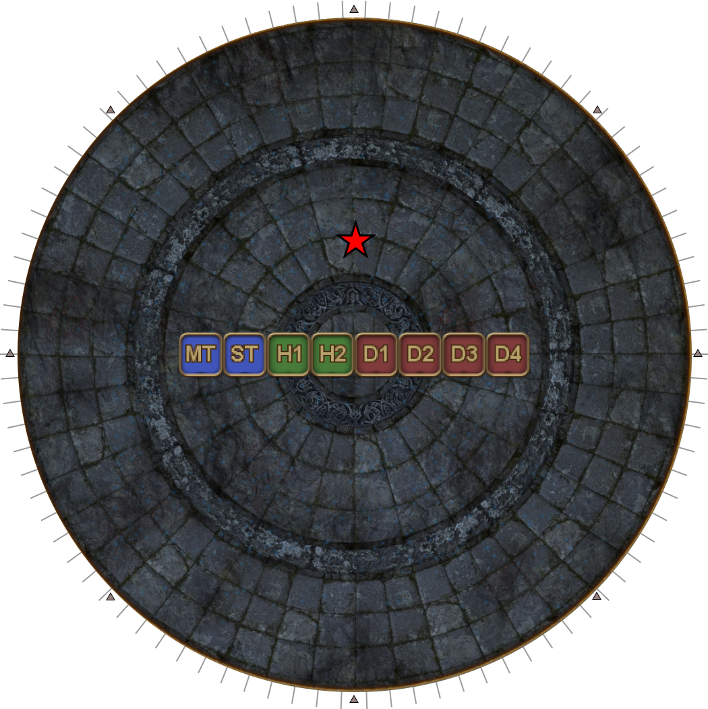</td>
  </tr>
  <tr>
    <td>
      
<b>2.</b> Four random players will be targeted with Doom.

      <ul>
        <li>Doomed players step towards Ser Guerrique to make a line of four.</li>
        <li>Non-Doomed players step away from Ser Guerrique to make a line of
        four.</li>
      </ul>
      
This step forward/back is to help the players in the center identify
      their order within each Doom vs. non-Doom group.

    </td>
    <td>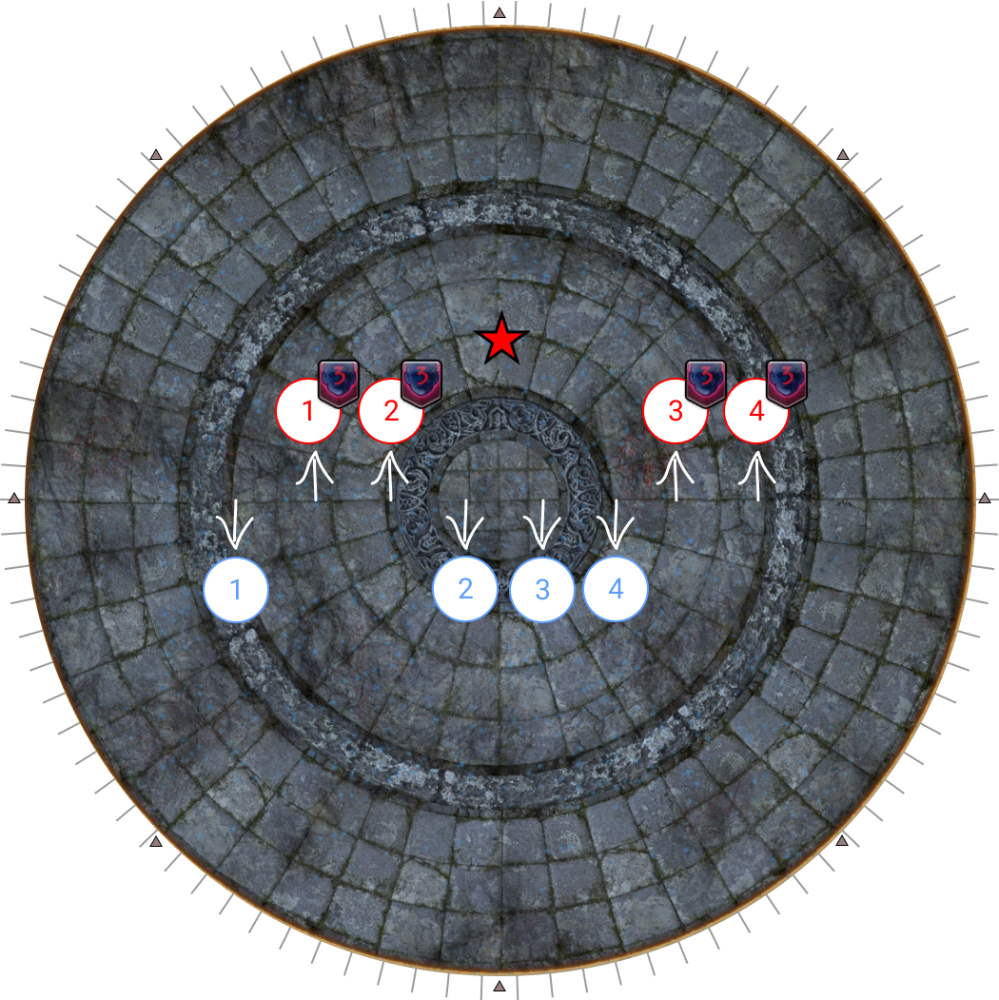</td>
  </tr>
  <tr>
    <td>
      
<b>3.</b> Spread out to your positions.

      <ul>
        <li>The furthest left/right players take the sides.</li>
        <li>The inner two players take the intercardinal positions. <em>(N.B:
        The intercardinal players are <u>not</u> directly in front of the
        "shuriken" mark.)</em></li>
      </ul>
      
<b>Find Thordan and the Dragon's Eye.</b>

      <ul>
        <li>Thordan and the Dragon's Eye will always spawn at cardinal or
        intercardinal positions, either 135 or 180 degrees away from each
        other.</li>
      </ul>
    </td>
    <td>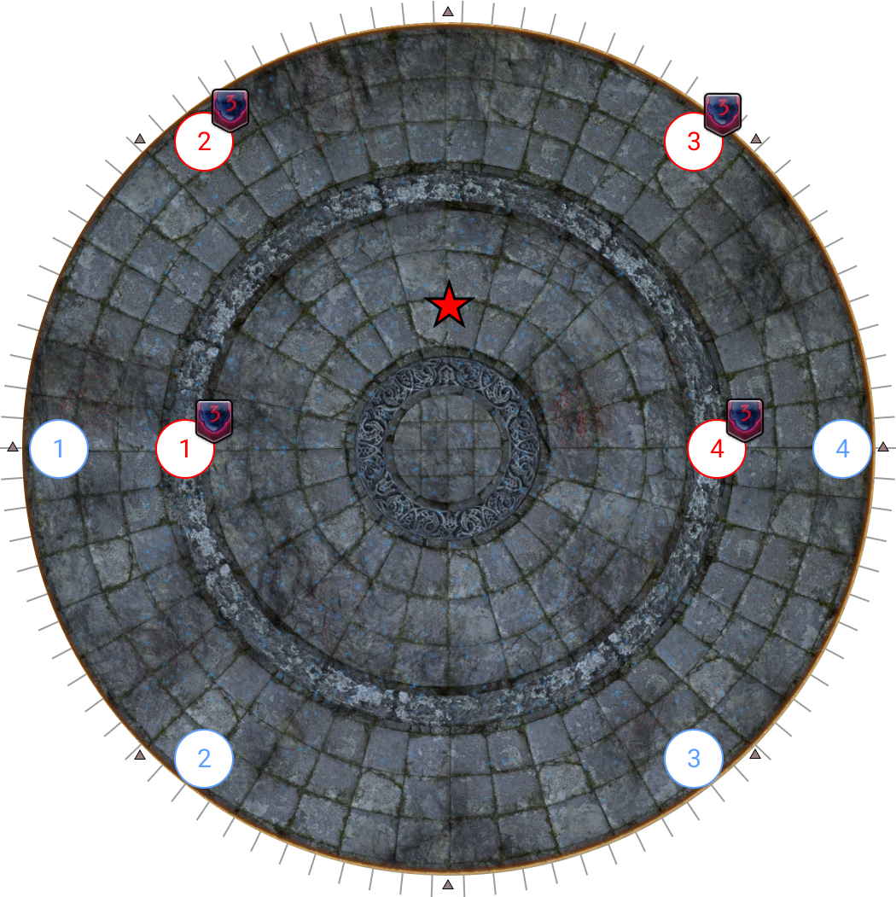</td>
  </tr>
  <tr>
    <td>
      
<b>4.</b> The second <em>Heavy Impact</em> resolves together with all
      the AoEs.

      
 <em>Twisters</em> will appear under random players.

      
<b>Doomed players:</b>

      <ul>
        <li>Dodge straight into the Heavy Impact AoE.</li>
      </ul>
      
<b>Non-Doomed players:</b>

      <ul>
        <li>Dodge into the <b>next</b> Heavy Impact AoE.</li>
      </ul>
    </td>
    <td>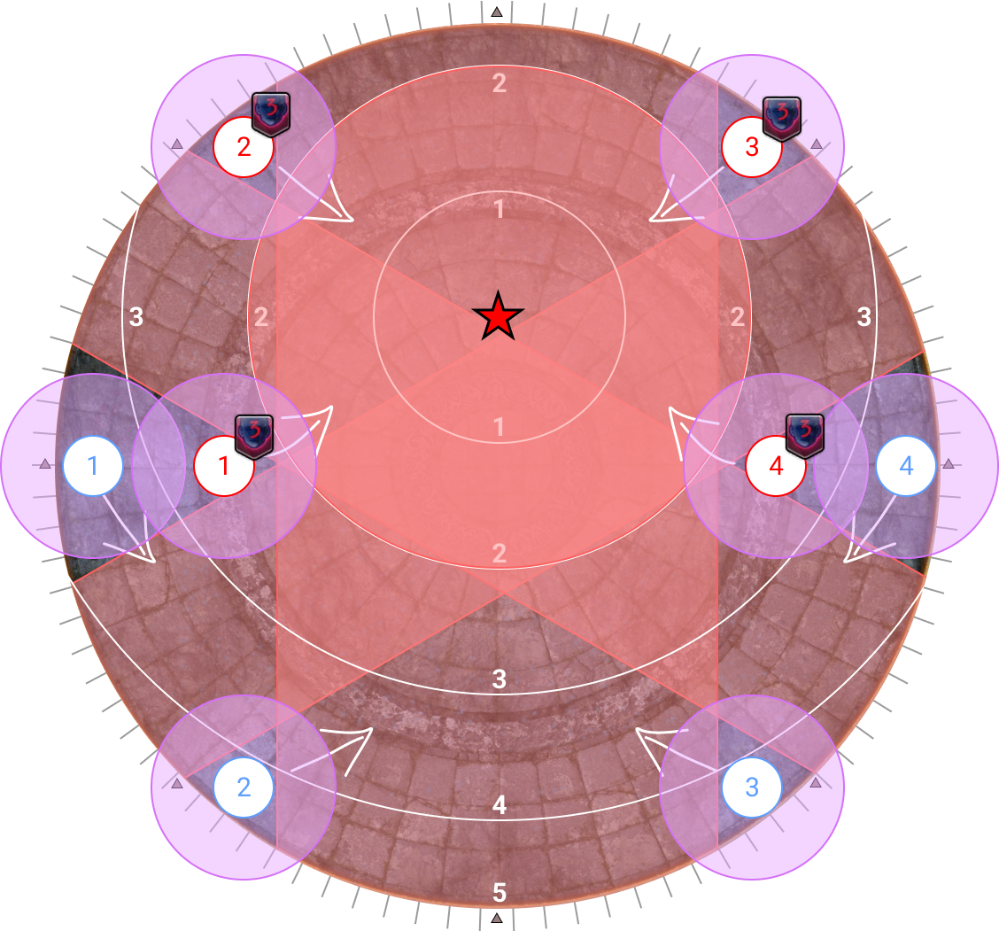</td>
  </tr>
  <tr>
    <td>
      
<b>5.</b> Take up positions to prepare for the Playstation markers.

      
<b>Doomed players:</b>

      <ul>
        <li>The east/west Doomed players will bait the circle marks by being
        the two furthest Doomed players.</li>
        <li>The two other Doomed players take up position towards SW and SE.</li>
      </ul>
      
<b>Non-Doomed players:</b>

      <ul>
        <li>Line up west-to-east a little north of center.</li>
      </ul>
    </td>
    <td>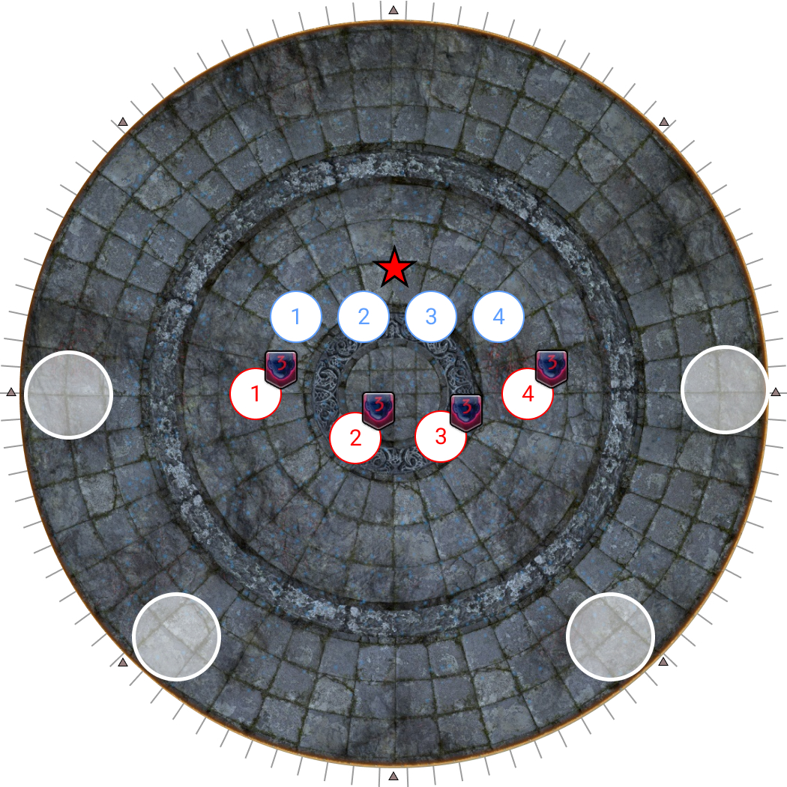</td>
  </tr>
  <tr>
    <td>
      
<b>6.</b> Playstation markers appear.

      
<b>Doomed players:</b>

      <ul>
        <li>After baiting circles, the two circle players move towards the
        center.</li>
        <li>The two other Doomed players do not move from their position.</li>
      </ul>
      
<b>Non-Doomed players:</b>

      <ul>
        <li>The left-side X takes the North position.</li>
        <li>The right-side X takes the South position.</li>
        <li>Square and Triangle move opposite the Doomed player with the same
        symbol.</li>
      </ul>
    </td>
    <td>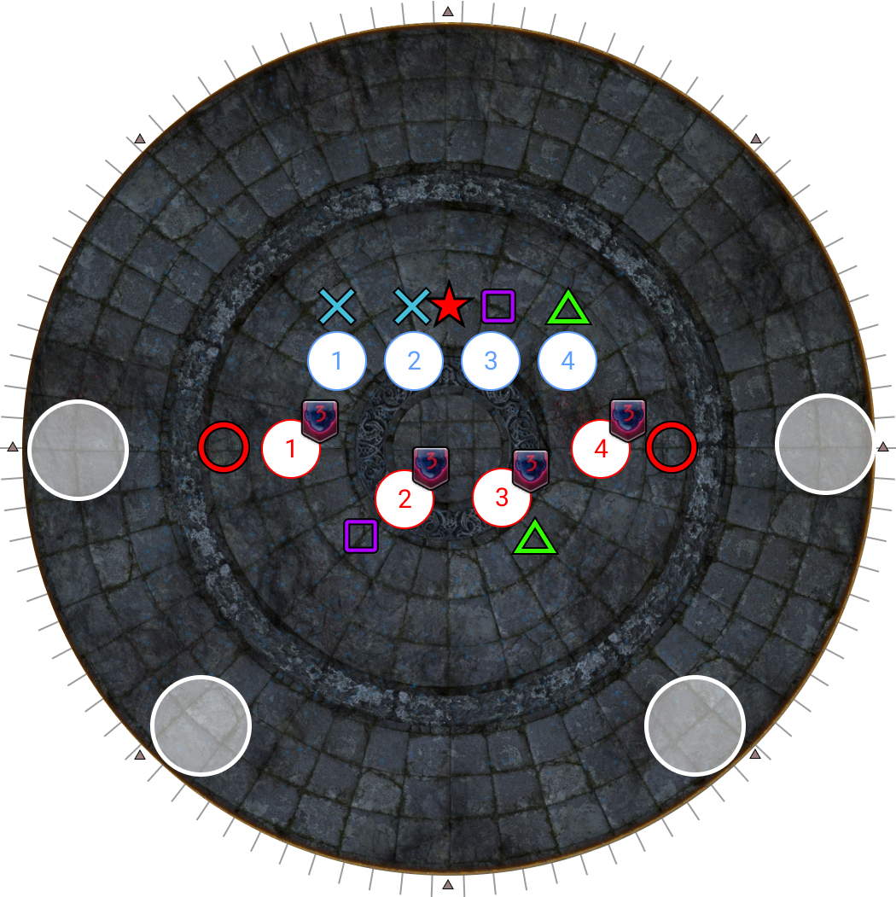</td>
  </tr>
  <tr>
    <td>
      <b>7.</b> Players adjust as needed, use markers/outside "shurikens" to
      properly align yourself, and <b>look away from both Thordan and the
      Dragon's Eye.</b>
    </td>
    <td></td>
  </tr>
  <tr>
    <td>
      
<b>8.</b> <em>Faith Unmoving</em> (knockback) and <em>Heavensflame</em>
      (AoEs on each player) resolves.

      
<b>Doomed players:</b>

      <ul>
        <li>Step into the white puddle left behind to cleanse Doom</li>
      </ul>
    </td>
    <td>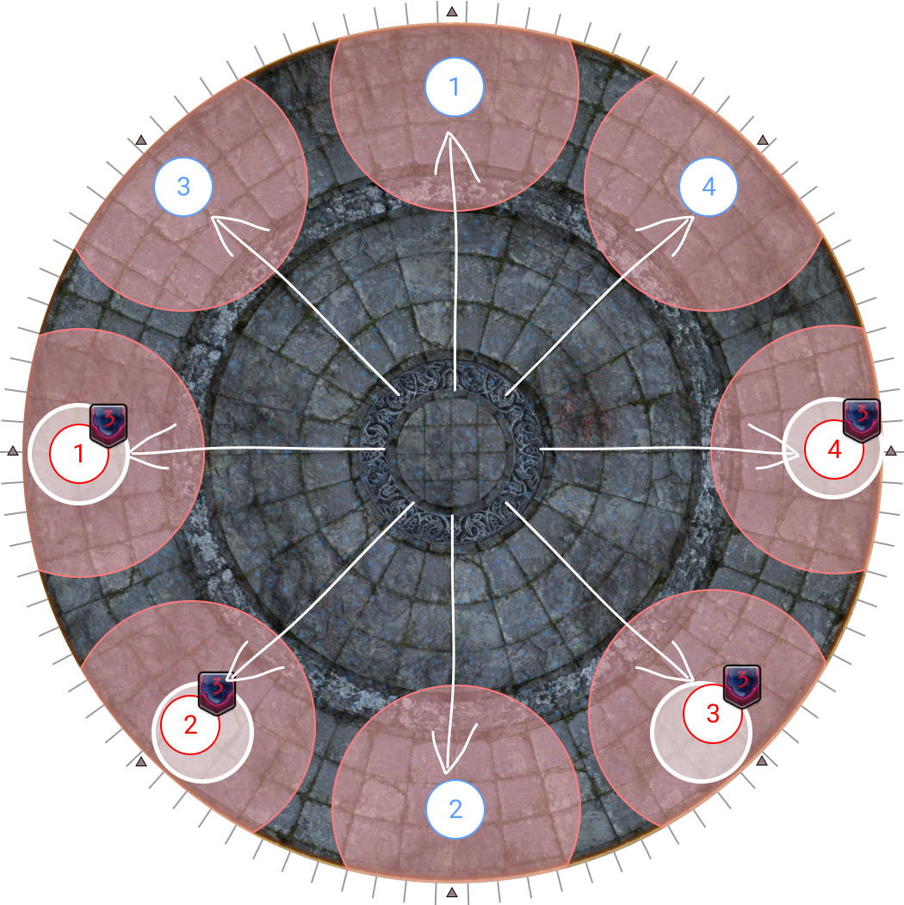</td>
  </tr>
</table>

After Death of the Heavens, eight Meteor Circles will spawn that must be
defeated quickly.

A caster LB2 will destroy three Meteor Circles; if there are no casters alive,
a ranged LB2 will also suffice.

- After all Meteors have been destroyed, Thordan will reappear in the middle
  and start casting *Ancient Quaga*.
- This is then followed by a *Heavenly Heel* → 3x *Ascalon's Mercy* combo.
- Thordan then auto-attacks one more time before casting *Aetheric Burst* as
  the enrage.

Once Thordan's HP drops **below 3.0%**, he will stumble, yield, and beg for
mercy. **Do not kill Thordan.**

---

## Frequently Asked Questions

  <b>[Death of the Heavens]</b> Is there a pattern to how the Dooms are
  assigned?

<table>
  <tr>
    <td>
      
Unfortunately not- who gets the Dooms are completely random.

      
Here's an example where all four tank/healers get Doom.

    </td>
  <td>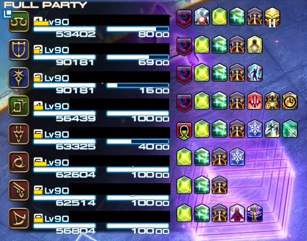</td></tr>
</table>

  <b>[Death of the Heavens]</b> Is there a particular reason why Dooms go North
  instead of South?

<table>
  <tr>
    <td>
      
This is just for simplification- having the Dooms "North" (towards Ser
      Guerrique) couples the Dooms to North/South positions.

      
That, in turn means that players can dodge based on whether they have
      Doom or not (Dooms dodge immediately, non-Dooms next), instead of adding
      a second layer of whether they're North or South.

    </td>
  </tr>
</table>

  <b>[Meteors]</b> Why caster LB2 instead of ranged LB2?

<table>
  <tr>
    <td>
      
A caster LB2 can target a Meteor and hit the two adjacent Meteors. A
      ranged LB2 will need to be properly aimed to hit three Meteors.

    </td>
  </tr>
</table>

  <b>[Thordan]</b> What happens if you kill Thordan in this phase?

<table>
  <tr>
    <td>
      
At the end of the next phase with Nidhogg and Hraesvelgr, Nidhogg's
      eyes threaten to take over Estinien again.

      
If Thordan was spared at the end of this phase, this is where Thordan
      jumps in to take the eyes and become Dragonking Thordan.

      
However, if you kill Thordan in this alternate timeline, Thordan isn't
      around to take the eyes and the party returns to a repeat of the Eyes
      phase except this time, Haurchefant isn't dead and the party is now
      missing Huarchefant's buff needed to damage the blue eye.

      <blockquote class="twitter-tweet">
        
もしも最後のトールダンを生かさず倒したらルート
          <a href="https://t.co/KSCL1DuGH7">pic.twitter.com/KSCL1DuGH7</a>
        

        &mdash; たかぱすと (@takapast)
        <a href="https://twitter.com/takapast/status/1522008634158649345?ref_src=twsrc%5Etfw">
        May 5, 2022</a>
      </blockquote>
      
    </td>
  </tr>
</table>

