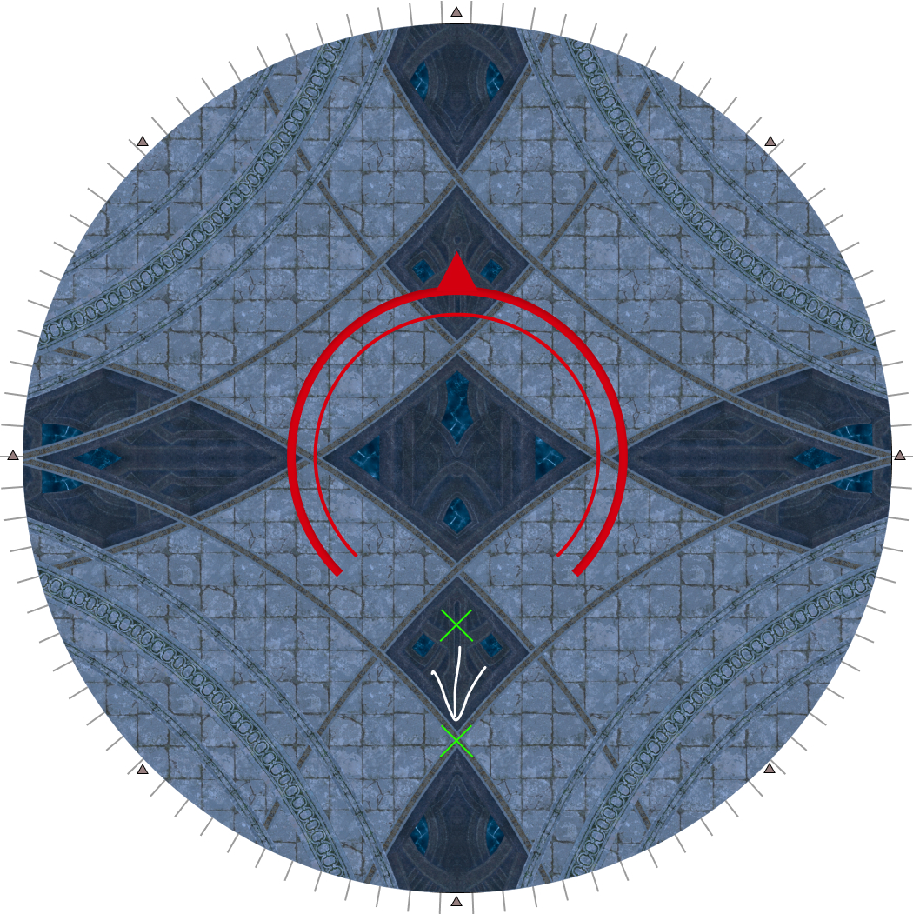
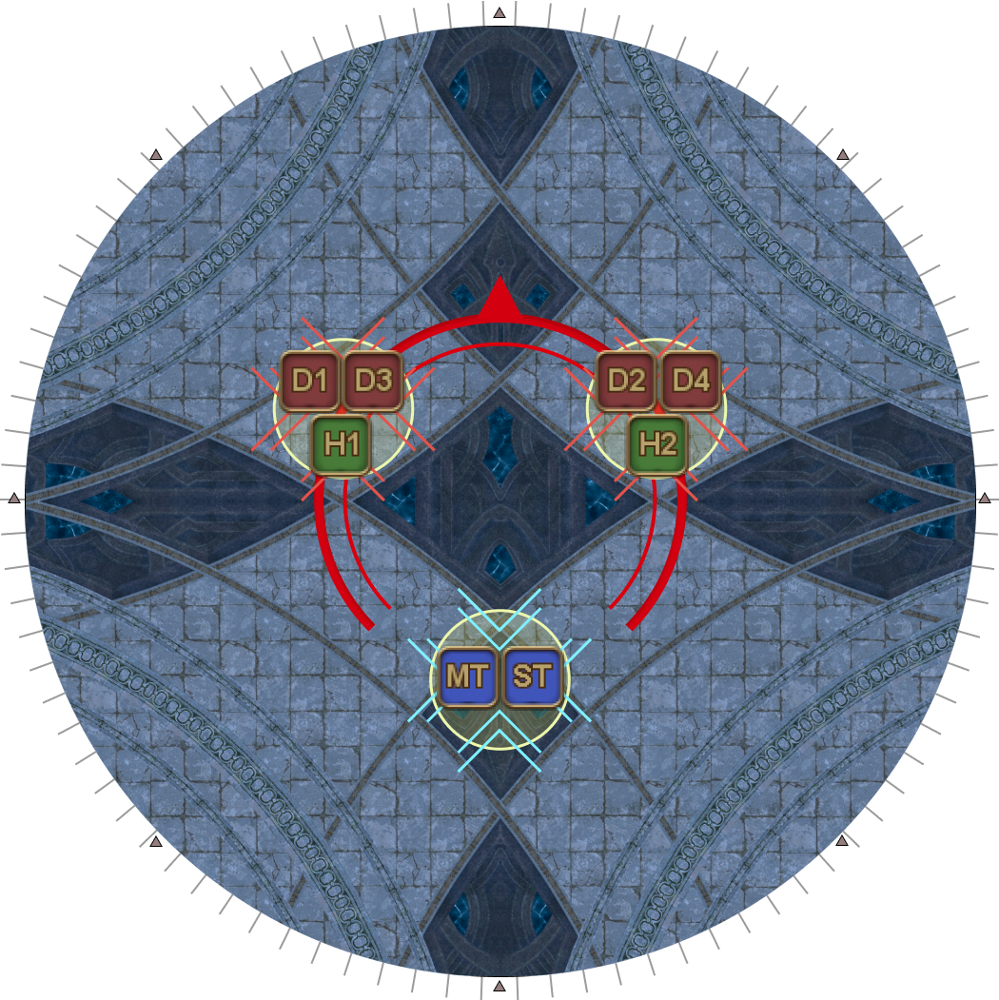

# Dragonking Thordan

## Summary

If you are already familiar with Dragonking Thordan and just need a quick summary:

<table>
  <tr>
    <td><b>Akh Morn's Edge</b></td>
    <td><ul><li>All 3-3-2</li></ul></td>
  </tr>
  <tr>
    <td><b>Trinity</b></td>
    <td><ul><li>D1/2 > D3/4 > H1/2</li></ul></td>
  </tr>
</table>

## Mitigations

This phase requires planning out and coordinating mitigations. The recommended base mitigation is:

<table>
  <tr>
    <td><b>Alterative End</b></td>
    <td>
MT 90s, ST 90s, H2 shields, H2 30s, H2 120s* (x2)

<em>* Expedience + Consolation / Holos + Panhaima</em>
</td>
  </tr>
  <tr>
    <td><b>Akh Morn's Edge #1</b></td>
    <td>MT Reprisal, H1 120s, H2 shields, H2 30s, D1, D4</td>
  </tr>
  <tr>
    <td><b>Gigaflare's Edge #1</b></td>
    <td>ST Reprisal, H2 shields, H2 30s, D2, D3</td>
  </tr>
  <tr>
    <td><b>Akh Morn's Edge #2</b></td>
    <td>MT Reprisal, MT 90s, ST 90s, H1 180s, H2 shields, H2 30s</td>
  </tr>
  <tr>
    <td><b>Gigaflare's Edge #2</b></td>
    <td>ST Reprisal, H2 shields, H2 30s, D1, D4</td>
  </tr>
  <tr>
    <td><b>Akh Morn's Edge #3</b></td>
    <td>MT Reprisal, H1 120s, H2 120s, D2, D3</td>
  </tr>
</table>

The above mitigation plan was made in the *absence* of jobs that provide more than one sort of mitigation such as PLD's Passage of Arms, AST's Collective Unconsciousness, DNC's Improvisation, or RDM's Magick Barrier.

Alternative End needs at least six party mitigations for everyone to survive.

If any extra mitigations are available, it's recommended they be slotted into either Gigaflare's Edge, or Akh Morn's Edge #2.

## Exaflare's Edge

<table>
  <tr>
    <td width="50%">
Have whoever's tanking face Dragonking Thordan either true North, or true South- this lets you also use the floor markings to guide your movement.

A backwards dodge (see the diagram) will <b>always</b> be safe.
</td>
    <td></td>
  </tr>
</table>

## Trinity

- It's easy for the tanks to lose track of who is supposed to be tanking the boss. Some things to help keep track are:
    - Add text to a Provoke macro so the chat log has a record of who last Provoked.
    - Look at the time remaining on the two Light/Dark debuff timers- **if the Dark debuff is lower than Light (or if you have no Dark debuff), you should be holding aggro.**
- We put D1 and D2 after Exaflares as they will naturally be the closest if they do an uptime dodge.
- We put H1 and H2 after Gigaflares as healers are the squishiest and there are only two Gigaflare's Edge.

## Akh Morn's Edge

Thordan will spawn three towers relative to where he is facing:

- One red tower at his front-left
- One red tower front-right
- One blue tower at his rear

The blue tower deals increased damage, and is meant to be taken by the tanks.

All players must be **inside** Thordan's hitbox in order to be within healing range of both healers- remember to step inside if Thordan's swords were originally red.

Akh Morn's Edge will be resolved with a 3-3-2 split.

<table>
  <tr>
    <td width="50%"><ul><li><b>Front-left:</b> H1, D1, D3</li><li><b>Front-right:</b> H2, D2, D4</li><li><b>Back:</b> MT, ST</li></ul></td>
    <td></td>
  </tr>
</table>

## Gigaflare's Edge

Mitigations for Gigaflare's Edge should be timed as the entire sequence lasts 8 seconds, while several debuffs (Reprisal, Feint, Addle) lasts only 10 seconds.

## Buff windows

Assuming the party used potions at the start of P6, the buff/pot window timings are:

<table>
  <tr>
    <td><b>First buff window + potions</b></td>
    <td>After Gigaflare's Edge #1</td>
  </tr>
  <tr>
    <td><b>Second buff window</b></td>
    <td>During Akh Morn's Edge #3</td>
  </tr>
</table>

## Morn Afah's Edge

Dragonking Thordan's enrage kills three players at a time. A general kill order should resemble:

<table>
  <tr>
    <td><b>First set of towers</b></td>
    <td>H1, H2, ST</td>
  </tr>
  <tr>
    <td><b>Second set of towers</b></td>
    <td>D3, D4, MT</td>
  </tr>
  <tr>
    <td><b>Third set of towers</b></td>
    <td>Ignore <em>(let the tower failed animation wipe the party instead of having D1 and D2 killed by the towers.)</em></td>
  </tr>
</table>

Morn Afah's Edge towers will match the Akh Morn's Edge tower groups.