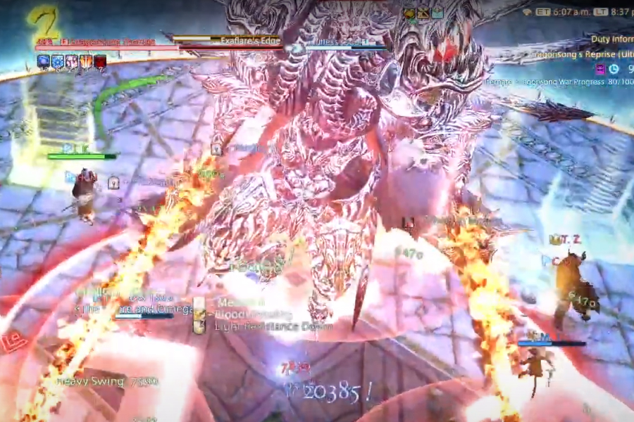
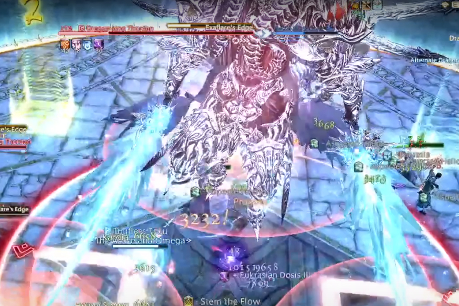
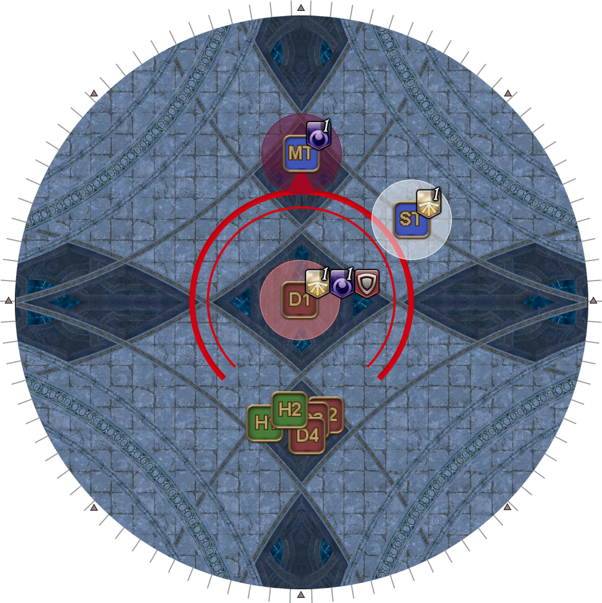
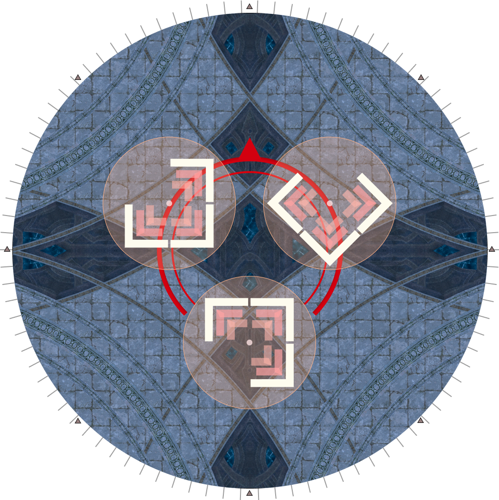
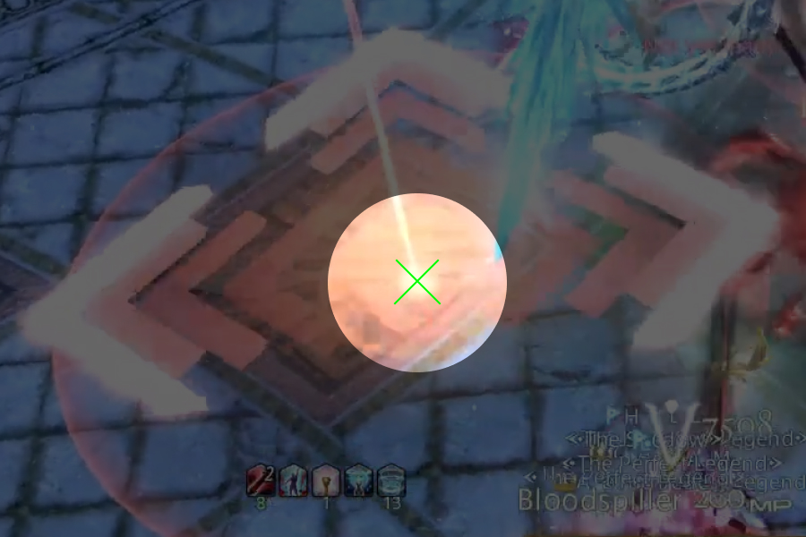
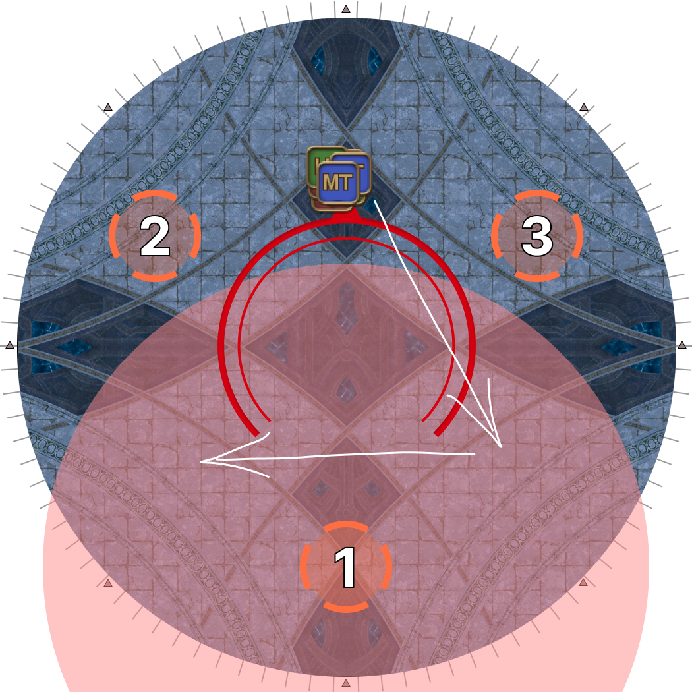

# Dragonking Thordan

## Summary

If you are already familiar with Dragonking Thordan and just need a quick summary:

<table>
  <tr>
    <td><b>Akh Morn's Edge</b></td>
    <td><ul><li>All 3-3-2</li></ul></td>
  </tr>
  <tr>
    <td><b>Trinity</b></td>
    <td><ul><li>D1/2 > D3/4 > H1/2</li></ul></td>
  </tr>
</table>

## Mitigations

This phase requires planning out and coordinating mitigations. The recommended base mitigation is:

<table>
  <tr>
    <td><b>Alterative End</b></td>
    <td>
MT 90s, ST 90s, H2 shields, H2 30s, H2 120s* (x2)

<em>* Expedience + Consolation / Holos + Panhaima</em>
</td>
  </tr>
  <tr>
    <td><b>Akh Morn's Edge #1</b></td>
    <td>MT Reprisal, H1 120s, H2 shields, H2 30s, D1, D4</td>
  </tr>
  <tr>
    <td><b>Gigaflare's Edge #1</b></td>
    <td>ST Reprisal, H2 shields, H2 30s, D2, D3</td>
  </tr>
  <tr>
    <td><b>Akh Morn's Edge #2</b></td>
    <td>MT Reprisal, MT 90s, ST 90s, H1 180s, H2 shields, H2 30s</td>
  </tr>
  <tr>
    <td><b>Gigaflare's Edge #2</b></td>
    <td>ST Reprisal, H2 shields, H2 30s, D1, D4</td>
  </tr>
  <tr>
    <td><b>Akh Morn's Edge #3</b></td>
    <td>MT Reprisal, H1 120s, H2 120s, D2, D3</td>
  </tr>
</table>

The above mitigation plan was made in the *absence* of jobs that provide more than one sort of mitigation such as PLD's Passage of Arms, AST's Collective Unconsciousness, DNC's Improvisation, or RDM's Magick Barrier.

Alternative End needs at least six party mitigations for everyone to survive.

If any extra mitigations are available, it's recommended they be slotted into either Gigaflare's Edge, or Akh Morn's Edge #2.

<b>Tip:</b> H2's 30s mitigations should be used when Akh Morn's Edge begins its cast for it to be back up in time for Gigaflare's Edge.

## Basic Mechanics

There are a couple of details that we should first go over before going into the main mechanics loop.

### Fire/Ice of Ascalon

All of Dragonking Thordan's mechanics are combined with either Fire or Ice of Ascalon, which resolves together at the beginning of the mechanic.

<table>
  <tr>
    <td width="34%">
If Dragonking Thordan's swords glow <b>red</b>, he will use <em>Fire of Ascalon</em>, which is a point-blank AoE.

Players must be <b>outside</b> his targeting circle.
</td>
    <td width="33%"></td>
    <td></td>
  </tr>
  <tr>
    <td width="34%">
If Dragonking Thordan's swords glow <b>blue</b>, he will use <em>Ice of Ascalon</em>, which is a donut AoE.

Players must be <b>inside</b> his targeting circle.
</td>
    <td width="33%"></td>
    <td></td>
  </tr>
</table>

### Trinity

After each mechanic has completed, Dragonking Thordan will auto-attack twice.

<table>
  <tr>
    <td width="50%">
Each auto-attack hits <em>three</em> players:
<ul>
      <li>The player with highest aggro will get hit with dark damage, and gain a stack of Dark Resistance Down.</li>
      <li>The player with the second-highest aggro will get hit with light damage, and gain a stack of Light Resistance Down.</li>
      <li>The <b>closest</b> player will get hit, and gain a stack of Dark Resistance Down, Light Resistance Down, and Physical Vulnerability Up.</li>
    </ul></td>
    <td></td>
  </tr>
</table>

Over the course of the fight, the non-tank players will rotate in to take one auto-attack each.

<table>
  <tr>
    <td><b>After Exaflare's Edge</b></td>
    <td>D1 → D2</td>
  </tr>
  <tr>
    <td><b>After Akh Morn's Edge</b></td>
    <td>D3 → D4</td>
  </tr>
  <tr>
    <td><b>After Gigaflare's Edge</b></td>
    <td>H1 → H2</td>
  </tr>
</table>

Because of the stacking Light/Dark Resistance Down debuffs on the tanks, the tanks will be constantly swapping aggro throughout the fight.

<b>Tip:</b> It's easy for the tanks to lose track of who is supposed to be tanking the boss. To help keep track of things:

<ul>
  <li>Add text to a Provoke macro so the chat log has a record of who last Provoked.</li>
  <li>The tank with <b>0 or 1 stack of Dark Resistance Down</b> should be holding aggro.</li>
</ul>

With all that setup, we can now go over Dragonking Thordan's major mechanics.

## Mechanics Loop

Dragonking Thordan will execute the following loop three times:

1. [Exaflare's Edge](#exaflares-edge)
2. [Akh Morn's Edge](#akh-morns-edge)
3. [Gigaflare's Edge](#gigaflares-edge) *(this will be replaced with [Morn Afah's Edge](#morn-afahs-edge) on the third loop.)*

### Exaflare's Edge

Have the tank with aggro point Dragonking Thordan either North or South before the start of this mechanic.

<table>
  <tr>
    <td width="50%">
<b>1.</b> Three Exaflare telegraphs will appear relative to Thordan's orientation.
</td>
    <td></td>
  </tr>
  <tr>
    <td>
<b>2.</b> Focus on the bright dot at the center of the Exaflares. This will be your first dodge point.

    
If Dragonking Thordan is facing either north or south, you can also use the floor markings to guide your movement.
</td>
    <td></td>
  </tr>
  <tr>
    <td>
<b>3.</b> When the Exaflares resolve, dodge to where the bright dot was.
</td>
    <td></td>
  </tr>
  <tr>
    <td>
<b>4.</b> Continue dodging the next set of Exaflare AoEs.

Dodging backwards (see the diagram) will <b>always</b> be safe.

As you get more experienced with the mechanic, you will notice Exaflare patterns where you can maintain melee uptime <em>(dodging to the left in this case)</em>, but this is not necessary.
</td>
    <td></td>
  </tr>
</table>

Thordan will then auto-attack twice, which should be taken by the two tanks, and D1, followed by D2.

The tanks should continue to face Thordan north or south, away from the party.

### Akh Morn's Edge

Thordan will spawn three towers relative to where he is facing:

- One red tower at his front-left
- One red tower front-right
- One blue tower at his rear

The blue tower deals increased damage, and is meant to be taken by the tanks.

All players must be **inside** Thordan's hitbox in order to be within healing range of both healers- remember to step inside if Thordan's swords were originally red.

*Akh Morn's Edge* will be resolved with a 3-3-2 split.

<table>
  <tr>
    <td width="50%"><ul><li><b>Front-left:</b> H1, D1, D3</li><li><b>Front-right:</b> H2, D2, D4</li><li><b>Back:</b> MT, ST</li></ul></td>
    <td></td>
  </tr>
</table>

Thordan will then auto-attack twice, which should be taken by the two tanks, and D3, followed by D4.

Where Thordan faces after *Akh Morn's Edge* doesn't matter.

### Gigaflare's Edge

<table>
  <tr>
    <td width="50%">
<em>Gigaflare's Edge</em> is a series of three raid-wide AoEs, each with an epicenter in a triangle going clockwise or anti-clockwise around Dragonking Thordan.

This is <em>not</em> falloff damage- standing inside the marked region <em>(illustrating a South Gigaflare)</em> will one-shot a player, while standing outside just deals heavy damage.

Mitigations for <em>Gigaflare's Edge</em> should be timed as the entire sequence lasts 8 seconds, while several debuffs (Reprisal, Feint, Addle) lasts only 10 seconds.
</td>
    <td></td>
  </tr>
</table>

Thordan will then auto-attack twice, which should be taken by the two tanks, and H1, followed by H2.

After *Gigaflare's Edge*, whoever's tanking the boss should face the boss **directly North or South** to prepare for *Exaflare's Edge*.

The loop then repeats from *Exaflare's Edge*.

## Morn Afah's Edge

Dragonking Thordan will put three towers and will continually hit them in quick order.

As each set of towers kills three players, the party can only take two rounds of towers as there aren't enough players to take the third set.

A general kill order should resemble:

<table>
  <tr>
    <td><b>First set of towers</b></td>
    <td>H1, H2, ST</td>
  </tr>
  <tr>
    <td><b>Second set of towers</b></td>
    <td>D3, D4, MT</td>
  </tr>
  <tr>
    <td><b>Third set of towers</b></td>
    <td>Ignore <em>(let the tower failed animation wipe the party instead of having D1 and D2 killed by the towers.)</em></td>
  </tr>
</table>

Morn Afah's Edge towers will match the Akh Morn's Edge tower groups.

## Buff windows

Assuming the party used potions at the start of P6, the buff/pot window timings are:

<table>
  <tr>
    <td><b>First buff window + potions</b></td>
    <td>After Gigaflare's Edge #1</td>
  </tr>
  <tr>
    <td><b>Second buff window</b></td>
    <td>During Akh Morn's Edge #3</td>
  </tr>
</table>