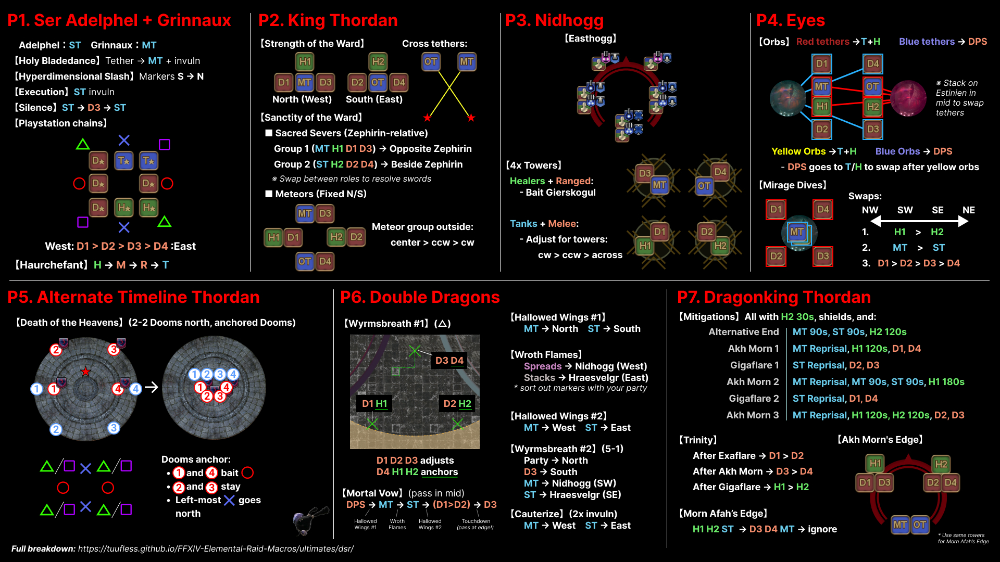
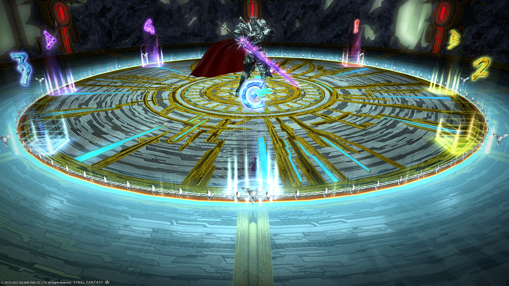
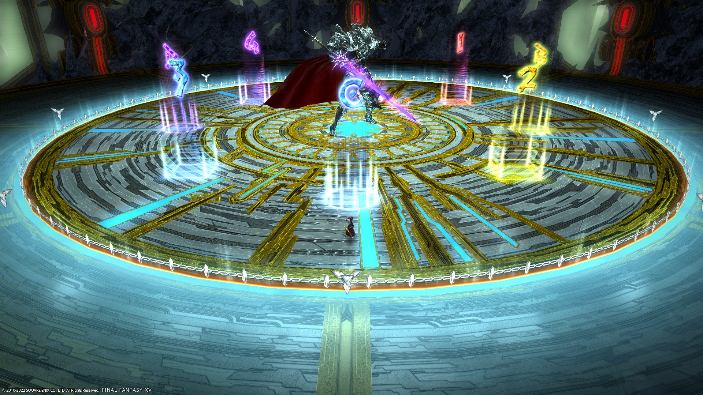

# Dragonsong's Reprise (Ultimate)

Elemental's DSR PF strat is still evolving. Use the following macros as a base to start with.

- [**Ser Adelphel + Grinnaux**](en/01_adelphel_and_grinnaux.md): HMRT
- [**King Thordan**](en/02_thordan.md): DRK-relative, role adjust
- [**Nidhogg**](en/03_nidhogg.md): Easthogg
- [**Eyes**](en/04_eyes.md): T/H red, DPS blue
- [**Alternate Timeline Thordan**](en/05_alternate_thordan.md): 2-2 Dooms North, Anchored Dooms
- [**Double Dragons**](en/06_double_dragons.md): △, DTTMR, 5-1
- [**Dragonking Thordan**](en/07_dragonking_thordan.md): All 3-3-2

### BiS Notes

- Dragonsong's Reprise is the current Ultimate, and is **not** outgeared yet.
    - Use your **i600** BiS.

Looking towards the future:

- Dragonsong's Reprise will not be outgeared until **i730** gear is available.
- Relic weapons (when they arrive) will have their substats capped at **269**.


*(Shortened link: [https://cutt.ly/EleDC_DSR_summary](images/dsr_cheatsheet.jpg))*

# Ser Adelphel and Ser Grinnaux

Dragonsong's Reprise is the first Ultimate to showcase a "door" boss. As such, there are two sets of markers and macros to use for this fight.

### Things to check on Party Finder

- Check the marker order for Hyperdimensional Slash (some groups do N→S).
- Check the Playstation positions (there are many variants).

## English
```

```

## Markers

All markers are used to bait Hyperdimensional Slashes (black orbs).


<details markdown=block>
<summary>XIVLauncher WaymarkPresetPlugin positions</summary>

```json
{"Name":"Adelphel and Grinnaux","MapID":788,"A":{"X":93.015,"Y":0.0,"Z":89.036,"ID":0,"Active":true},"B":{"X":110.964,"Y":0.0,"Z":93.015,"ID":1,"Active":true},"C":{"X":106.985,"Y":0.0,"Z":110.964,"ID":2,"Active":true},"D":{"X":89.036,"Y":0.0,"Z":106.985,"ID":3,"Active":true},"One":{"X":106.985,"Y":0.0,"Z":89.036,"ID":4,"Active":true},"Two":{"X":110.964,"Y":0.0,"Z":106.985,"ID":5,"Active":true},"Three":{"X":93.015,"Y":0.0,"Z":110.964,"ID":6,"Active":true},"Four":{"X":89.036,"Y":0.0,"Z":93.015,"ID":7,"Active":true}}
```

</details>

# King Thordan

This is the macro for the bulk of the fight.

## English
```

```

## Markers

A lot of players use the "outer" markers:


<details markdown=block>
<summary>XIVLauncher WaymarkPresetPlugin positions</summary>

```json
{"Name":"Dragonsong's Reprise (Outer)","MapID":788,"A":{"X":100.0,"Y":0.0,"Z":80.0,"ID":0,"Active":true},"B":{"X":120.0,"Y":0.0,"Z":100.0,"ID":1,"Active":true},"C":{"X":100.0,"Y":0.0,"Z":120.0,"ID":2,"Active":true},"D":{"X":80.0,"Y":0.0,"Z":100.0,"ID":3,"Active":true},"One":{"X":114.1421,"Y":0.0,"Z":85.85786,"ID":4,"Active":true},"Two":{"X":114.142,"Y":0.0,"Z":114.142,"ID":5,"Active":true},"Three":{"X":85.85786,"Y":0.0,"Z":114.142,"ID":6,"Active":true},"Four":{"X":85.858,"Y":0.0,"Z":85.858,"ID":7,"Active":true}}
```

</details>

I personally *much prefer* "inner" markers.


<details markdown=block>
<summary>XIVLauncher WaymarkPresetPlugin positions</summary>

```json
{"Name":"Dragonsong's Reprise (Inner)","MapID":788,"A":{"X":100.0,"Y":0.0,"Z":87.0,"ID":0,"Active":true},"B":{"X":113.0,"Y":0.0,"Z":100.0,"ID":1,"Active":true},"C":{"X":100.0,"Y":0.0,"Z":113.0,"ID":2,"Active":true},"D":{"X":87.0,"Y":0.0,"Z":100.0,"ID":3,"Active":true},"One":{"X":109.192,"Y":0.0,"Z":90.807,"ID":4,"Active":true},"Two":{"X":109.192,"Y":0.0,"Z":109.192,"ID":5,"Active":true},"Three":{"X":90.807,"Y":0.0,"Z":109.192,"ID":6,"Active":true},"Four":{"X":90.807,"Y":0.0,"Z":90.807,"ID":7,"Active":true}}
```

</details>
