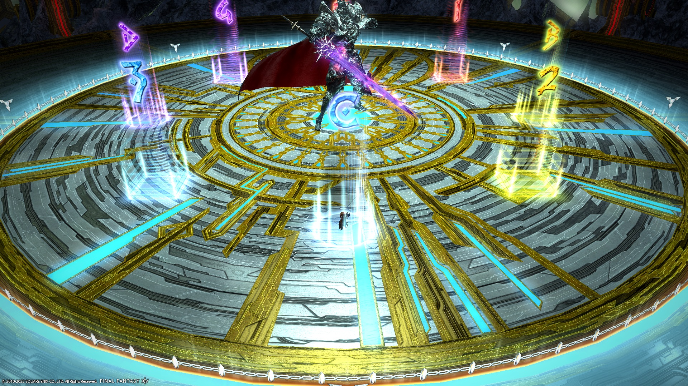

# Dragonsong's Reprise (Ultimate)

**DISCLAIMER** - People are trying to PF Dragonsong's Reprise on Elemental, but it is still a little too early for PF clears (everyone's used to their own static strats).

1. [**Adelphel and Grinnaux**](en/01_adelphel_and_grinnaux.md)
2. **King Thordan**
3. **Nidhogg**
4. **Eyes**
5. **Alternate Thordan**
6. **Double Dragons**
7. **Dragonking Thordan**

### BiS Notes

- Dragonsong's Reprise is the current Ultimate, and is **not** outgeared yet.
    - Use your **i600** BiS.

Looking towards the future:

- Dragonsong's Reprise will not be outgeared until **i730** gear is available.
- Relic weapons (when they arrive) will have their substats capped at **269**.

## English

**The following macros are still a work in progress and will very likely change in the future.**

### Ser Adelphel + Grinnaux
```
　Adelphel：ST　Grinnaux：MT
【Holy Bladedance】Tether → MT + invuln
【Hyperdimensional Slash】Markers N → S
【Execution】ST invulns
【Silence】ST → D3 → ST
【Playstation chains】
　　T□  H× H△
　　D〇　 　D〇　west: D1>2>3>4: east
　　D△ T× D□
【Haurchefant】
　　　cleave　cleave　　　※ cleaves towards
　　H/R AoE ★ T/M AoE　　　ring (True South)
　　　　　   party
　H1+H2 → D1+D2 → D3+D4 → MT+ST
```
### Thordan onwards
```
―《Thordan》――――――――――――――――――
【Strength of the Ward】
　　North (West)　　South (East)
　　　　   H1　　　　　　  H2
　　　D1 MT D3　　　D2 ST D4
　■ Skyward Leaps + Towers
　　※ Use Thordan as north
　　Cross tethers：
　　　MT：West tether → East of party
　　　ST：East tether → West of party
【Sanctity of the Ward】
　■ Sacred Severs (Zephirin-relative)
　　Group 1 (MTH1D1D3) → Opposite Zephirin
　　Group 2 (STH2D2D4) → Beside Zephirin
　　※ Swap between roles to resolve swords
　■ Meteors
　　　　　MT/D3　　　 ※ Fix Meteors N/S
　　　H1/D1　H2/D2　※ Meteors run cw
 　　　　　ST/D4
　　※ Meteor group (T/H or DPS) outside
　　　　　　　　center > cw > ccw
　　※ Meteor grp → Final cardinal towers
　　※ Non-meteor grp → Clockwise from ice
―《Nidhogg》("Easthogg") ―――――――――――
【Dive from Grace】
　　　　　　　　　   ②↑  ②↓
　　　  ②③　　　　　   ①　　　　　   ①③
　　①↑▲ ①↓  →  ③↑▲ ③↓  →  ②↑▲ ②↓
　　　　①　　　　　　 ③　　　　　　 ①
　　※ Face east when placing towers
【4x Towers (H/R fixed)】
　　MT/D3　ST/D4　　Extra tower "pips" from
　　　　　  ●　　　　　　True North：
　　H1/D1　H2/D2　　ccw：MT>D1>D2>ST：cw
　※ H/R bait Geirskogul
　■ Soul Tethers
　　MT → Nidhogg's tether (under boss)
　　ST → clone's tether
―《Eyes phase》――――――――――――――――
　　　D1　　D4　　T/H → Red tethers
　　　MT　　ST　　DPS → Blue tethers
　　　H1　　H2　　※ Stack on Estinien in mid
　　　D2　　D3　　　　to swap tethers
　【Yellow+Blue Orbs】
　　　　D1　　D4　　　　※ DPS goes to T/H
　MTH1　　　　　STH2　　　to swap tethers
　　　　D2　　D3
　【Mirage Dives】
　■ Initial spread　■ Swaps (from true North)
　　　D1　　D4　 　 1. ccw：H1>H2：cw
　　　　  T+H　　　　2. ccw：MT>ST：cw
　　　D2　　D3　  　3. ccw：D1>D2>D3>D4：cw
　※ Around blue eye
―《Alternate Timeline Thordan》―――――――
【Wrath of the Heavens】
　North：MT>ST>H1>H2>D1>D2>D3>D4：South
　　　　　▼　★　▼
　　(blue)　\　  /　　　　　※ Use white dragon
　　　　　　　\/　　(party)　　　as North
　　　　　　  /　\　
　　　(tether)　(tether)
【Death of the Heavens】
　■ Initial spread
　　　　●　　●　　※ Use Grinnaux as North
　　　　　　　　　　　● = Dooms
　　○　●　　●　○　　　(dodge 2nd Impact)
　　　　　　　　　　　○ = Non-doom
　　　　○　　○　　　　　(dodge 3rd Impact)
　■ Playstation 2 (Anchored Dooms)
　　△/□　×　△/□　※ All players cross from
　　　●　　　　●　　　initial spread position
　　▲/■　×　 ▲/■　※ Bait Doom circles E/W
　※ Doom players stay; non-doomed adjust
```

## Markers

Dragonsong's Reprise is the first Ultimate to showcase a "door" boss. As such, there are two sets of markers to use for this fight.

### Ser Adelphel + Grinnaux

* All markers are used to bait Hyperdimensional Slashes (black orbs).


<details>
<summary>XIVLauncher WaymarkPresetPlugin positions</summary>

<div class="language-json highlighter-rouge"><div class="highlight"><pre class="highlight">
<code>{"Name":"Adelphel + Grinneux","MapID":788,"A":{"X":93.014,"Y":0.0,"Z":89.036,"ID":0,"Active":true},"B":{"X":110.963,"Y":0.0,"Z":93.014,"ID":1,"Active":true},"C":{"X":106.985,"Y":0.0,"Z":110.963,"ID":2,"Active":true},"D":{"X":89.036,"Y":0.0,"Z":106.985,"ID":3,"Active":true},"One":{"X":106.985,"Y":0.0,"Z":89.036,"ID":4,"Active":true},"Two":{"X":110.963,"Y":0.0,"Z":106.985,"ID":5,"Active":true},"Three":{"X":93.014,"Y":0.0,"Z":110.963,"ID":6,"Active":true},"Four":{"X":89.036,"Y":0.0,"Z":93.014,"ID":7,"Active":true}}
</code></pre></div></div>

</details>

### Thordan

I personally really like "inside" markers.


<details>
<summary>XIVLauncher WaymarkPresetPlugin positions</summary>

<div class="language-json highlighter-rouge"><div class="highlight"><pre class="highlight">
<code>{"Name":"Dragonsong's Reprise","MapID":788,"A":{"X":100.0,"Y":0.0,"Z":87.0,"ID":0,"Active":true},"B":{"X":113.0,"Y":0.0,"Z":100.0,"ID":1,"Active":true},"C":{"X":100.0,"Y":0.0,"Z":113.0,"ID":2,"Active":true},"D":{"X":87.0,"Y":0.0,"Z":100.0,"ID":3,"Active":true},"One":{"X":109.192,"Y":0.0,"Z":90.807,"ID":4,"Active":true},"Two":{"X":109.192,"Y":0.0,"Z":109.192,"ID":5,"Active":true},"Three":{"X":90.807,"Y":0.0,"Z":109.192,"ID":6,"Active":true},"Four":{"X":90.807,"Y":0.0,"Z":90.807,"ID":7,"Active":true}}
</code></pre></div></div>

</details>
