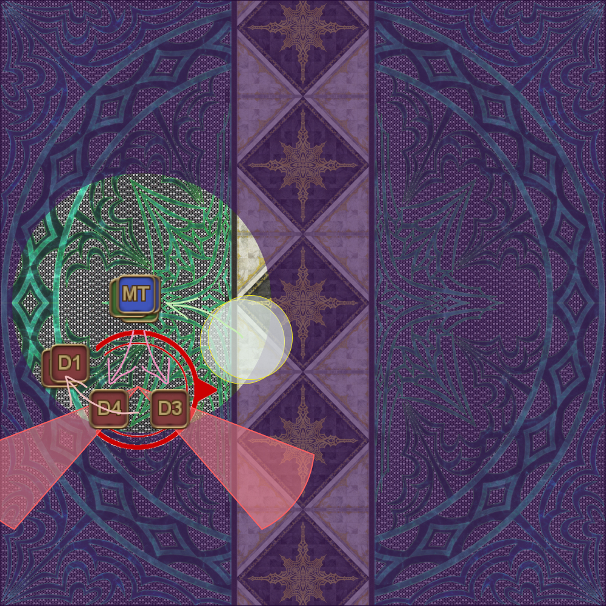
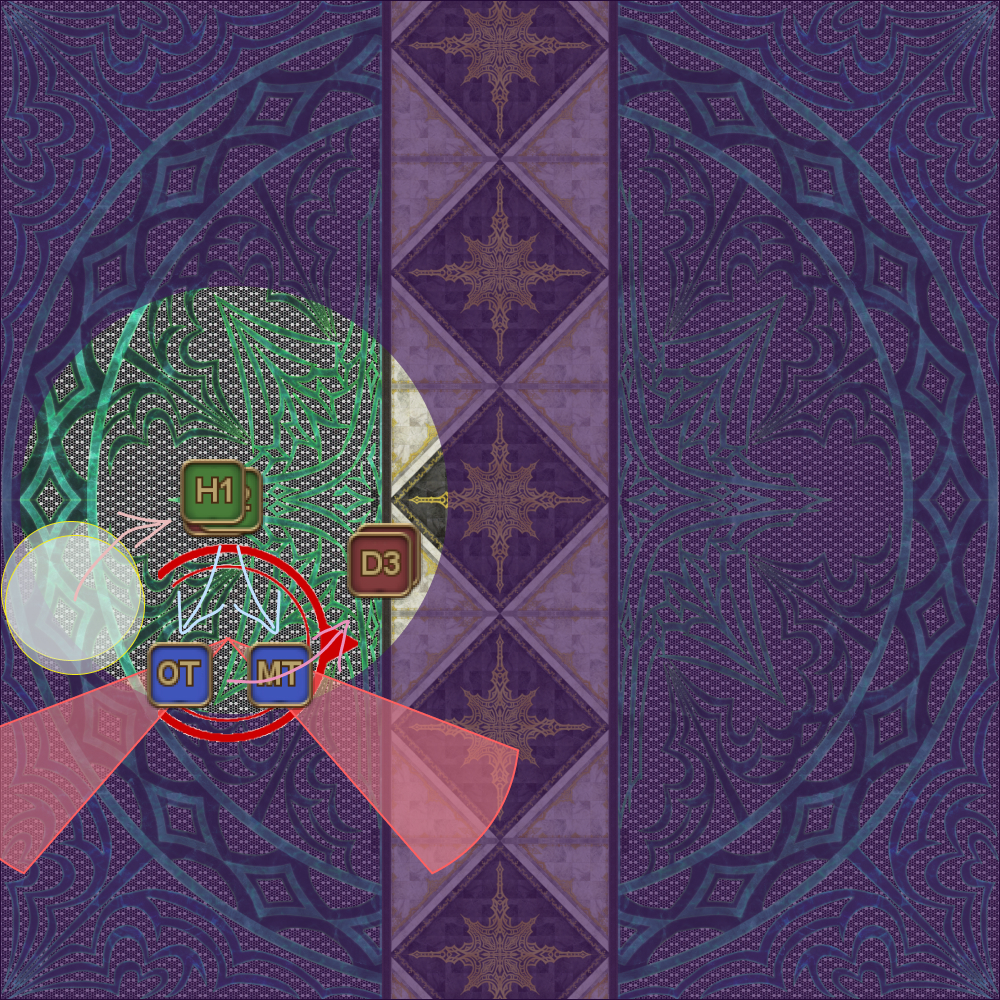
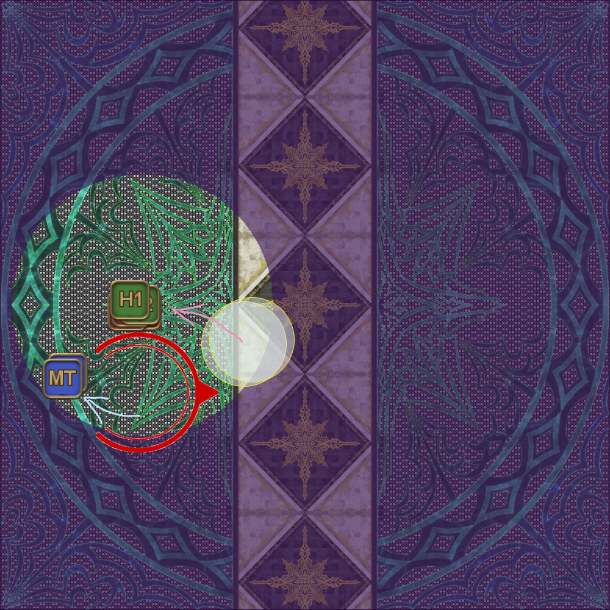

# Adelphel and Grinnaux

There are many Playstation formations that go around.

This was an early formation that mirrors the Death of the Heavens (swapping DPS for Dooms), that allows healers to preposition to top up the party prior to the knockback, and also uses the shapes to indicate positions (as 3 < 4).
```
【Playstation chains】
　　T□  H× H△
　　D〇　 　D〇　west: D1>2>3>4: east
　　D△ T× D□
```

This one probably makes more sense:
```
【Playstation chains】
　　D△  T× T□
　　D〇　 　D〇　west: D1>2>3>4: east
　　D□ H× H△
```

## Haurchefant

The general order goes HMRT (Healer → Melee → Ranged → Tanks).

- Healers are covered by the Tank LB3 (when it comes to the rewind).
- Ranged and melee alternate sides when dropping the Light Puddles.
- Tanks are last so healers are not rushing to top up the party before Pure of Heart resolves.
- The final set of puddles are not in between the party and Haurchefant (when it comes to the rewind).

This method for Pure of Heart allows for [full melee uptime with minimal movement](https://clips.twitch.tv/SuaveOddArmadilloSeemsGood-VfDpqFIoUkVKUF7Q).

<table>
  <tr>
    <td><p><b>1.</b> First set of baits.</p><ul><li><b>Healers</b>: Bait the first set of Brightwings.</li></ul></td>
    <td></td>
  </tr>
  <tr>
    <td><p><b>2.</b> Second set of baits.</p><ul><li><b>Healers</b>: Move in front of Ser Charibert to bait the puddles.</li><li><b>Melee</b>: Bait the second set of Brightwings.</li></ul></td>
    <td></td>
  </tr>
  <tr>
    <td><p><b>3.</b> Third set of baits.</p><ul><li><b>Healers</b>: Rejoin the party stack to dodge the puddles.</li><li><b>Melee</b>: Move behind Ser Charibert to bait the puddles.</li><li><b>Ranged</b>: Bait the third set of Brightwings.</li></ul></td>
    <td></td>
  </tr>
  <tr>
    <td><p><b>4.</b> Fourth set of baits.</p><ul><li><b>Melee</b>: Rejoin the party stack to dodge the puddles.</li><li><b>Ranged</b>: Move in front of Ser Charibert to bait the puddles.</li><li><b>Tanks</b>: Bait the fourth set of Brightwings.</li></ul></td>
    <td></td>
  </tr>
  <tr>
    <td><p><b>5.</b> Last set of movement before Pure of Heart resolves.</p><ul><li><b>Ranged</b>: Rejoin the party stack to dodge the puddles.</li><li><b>Tanks</b>: Move in front of Ser Charibert to bait the puddles.</li></ul></td>
    <td></td>
  </tr>
  <tr>
    <td><p><b>6.</b> Pure of Heart resolves.</p><ul><li><b>Tanks</b>: Rejoin the party stack to dodge the puddles.</li></ul></td>
    <td></td>
  </tr>
</table>