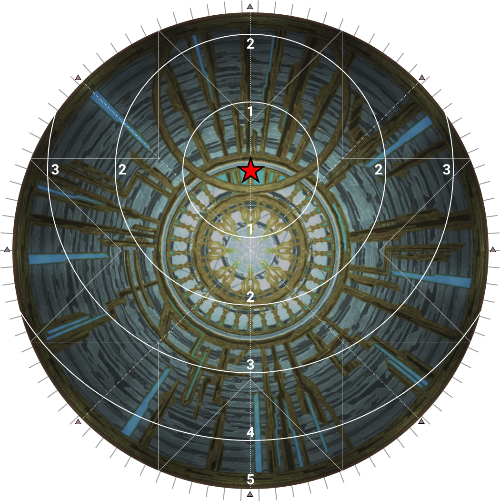
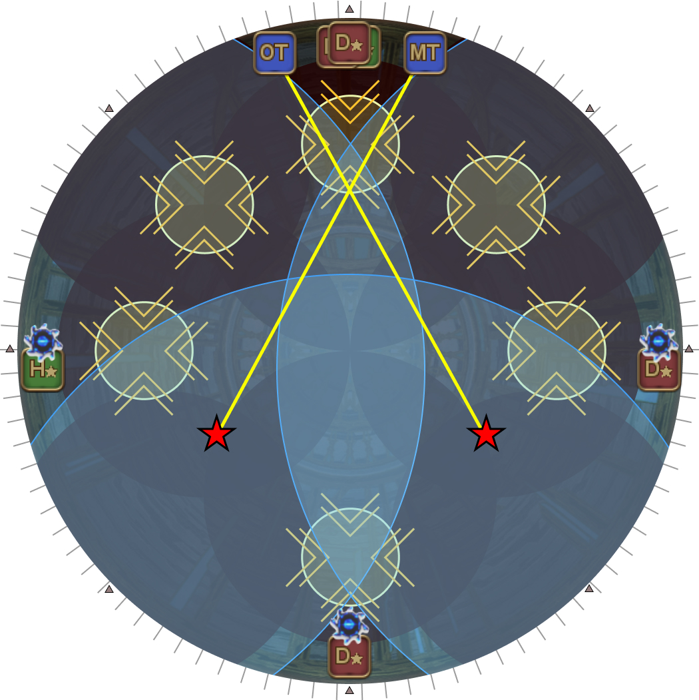
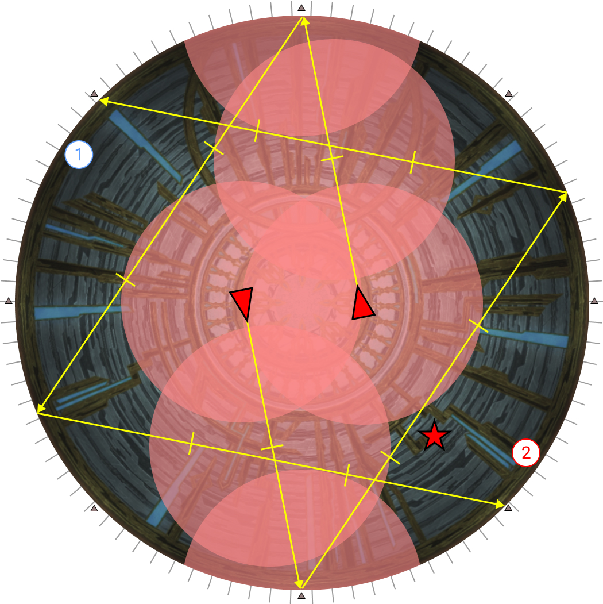
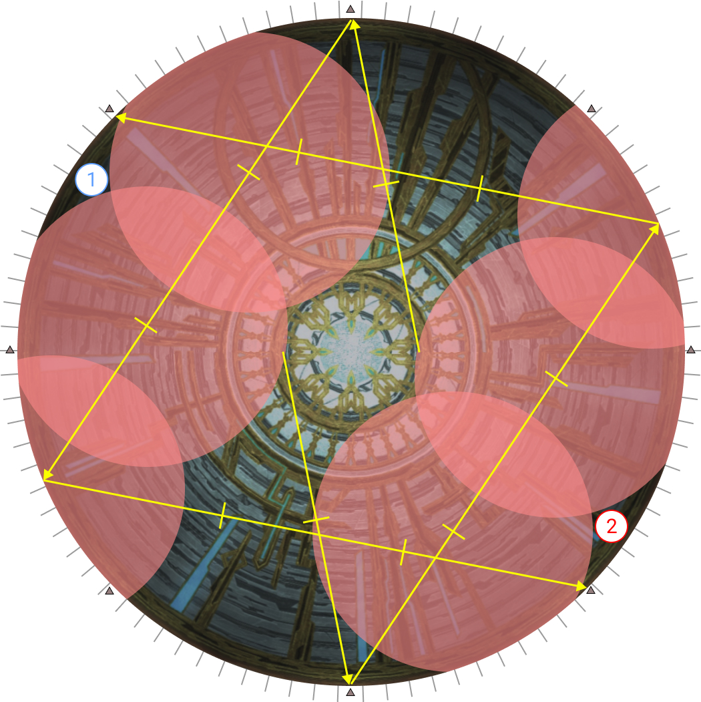
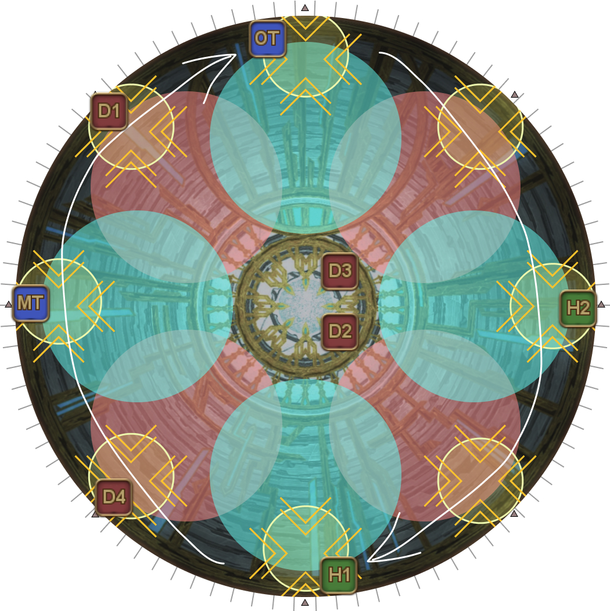
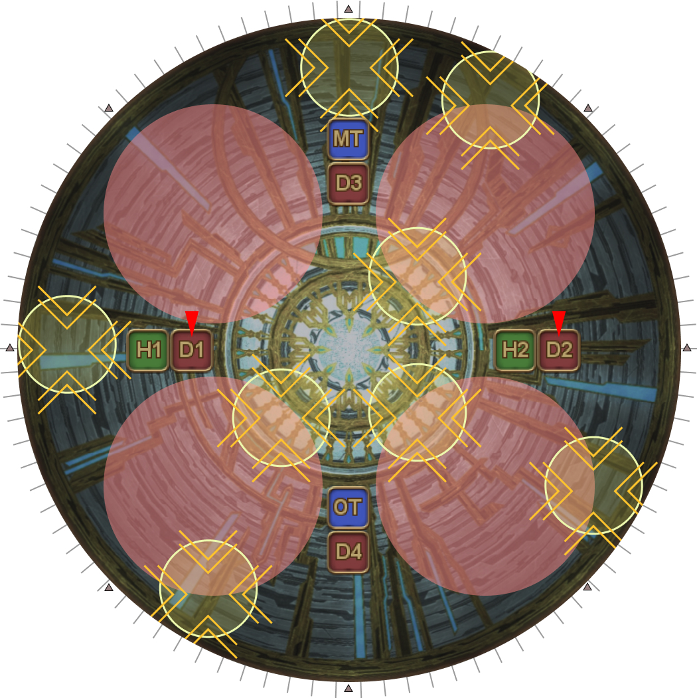
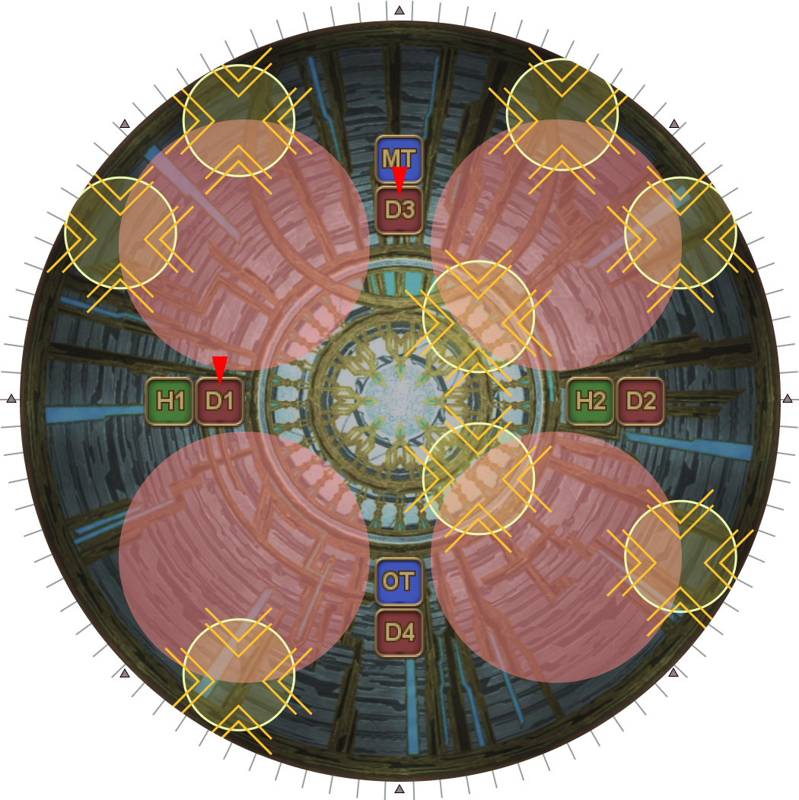
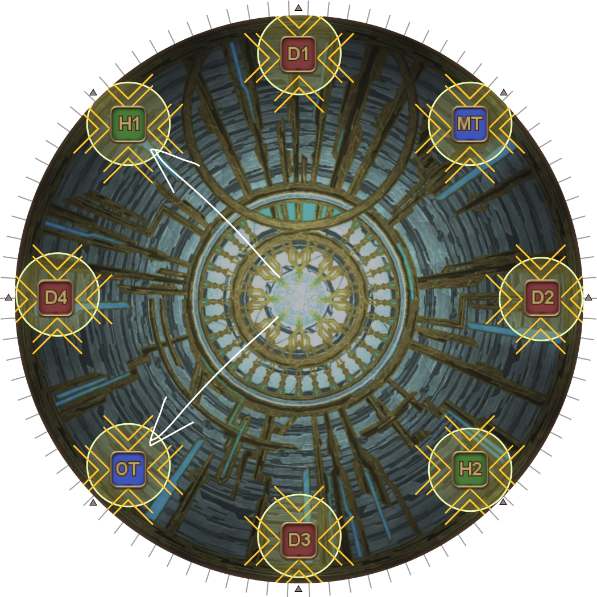

# King Thordan

## Summary

If you are already familiar with Thordan, and just need a quick summary:

<table>
  <tr>
    <td><b>Strength of the Ward</b></td>
    <td><ul><li>Crossed tethers</li></ul></td>
  </tr>
    <tr>
    <td><b>Sanctity of the Ward</b></td>
    <td><ul><li>DRK-relative, role swap</li><li>Meteor-roles out, center > ccw > cw</li></ul></td>
  </tr>
</table>

## Strength of the Ward

### Part 1

<table>
  <tr>
    <td>
<b>1.</b> Light party spreads.

Healers are in front to allow them to dodge into the upcoming Heavy Impact early. This then lets them cast an additional GCD heal without using Swiftcast.
</td>
    <td></td>
  </tr>
  <tr>
    <td>
<b>2.</b> Heavy Impact boundaries.
</td>
    <td></td>
  </tr>
</table>

Note that players on the back row can simply run forward to naturally dodge the Heavy Impacts as long as Ser Guerrique is not on one of the three closer positions.

- [Furthest Heavy Impact](https://clips.twitch.tv/GrotesqueDignifiedSkunkLitty-9twQOEUJM1i_Gca7)
- [Far Heavy Impact](https://clips.twitch.tv/FineTubularDelicataRiPepperonis-d5-AO5H6wUfRwd4H)
- [Middle Heavy Impact](https://clips.twitch.tv/AmusedCautiousFiddleheadsPanicVis-cs5131laAWRwlEkg)
- [Near Heavy Impact](https://clips.twitch.tv/SecretiveUnsightlyBorkRitzMitz-xUIR65ezwTfJOZL3)
- [Nearest Heavy Impact](https://clips.twitch.tv/RelatedPiercingGrasshopperOMGScoots-iqC09dukfOnorski)

### Part 2

After dodging the Heavy Impact and Ascalon's Mercy Concealed, orientate yourself such that Thordan is north.

<table>
  <tr>
    <td>
Using Thordan as north:
<ul><li>Three (non-tanks) will be targeted with blue Skyward Leap markers. These players go west, east, and south.</li><li>The other three (non-tanks) go north towards Thordan and loosely spread to communicate tower positions before stacking in front of the "shuriken" mark.</li><li>The two tanks take tethers, and criss-cross them.</li></ul></td>
    <td></td>
  </tr>
</table>

**Tips:**
- Do not look for Thordan. Instead, look for the two (of three) knights that spawn closest to the center.
  - Thordan appears at his position last, giving you the least amount of time to find him.
  - The two knights will spawn while the Heavy Impacts are resolving (and Thordan is still in the center).
  - The two knights will always spawn SW and SE relative to where Thordan will teleport to later.
- Have the tanks stand halfway in between and let the party members bring the tethers to them.
  - Tanks have probably been trained to stand right next to the knights (the tether sources) to pick up the tethers. However, if you do this, there isn't enough time to make it to the edge (without Sprint).
- The two blue prey targets east and west should stand one notch away from the party to avoid hitting the tanks with the AoE (and giving them a debuff that will kill them).

## Sanctity of the Ward

### Part 1: Sacred Severs

Currently, the most popular way to resolve Sacred Severs is a **DRK-relative, role-adjust** strat.

- The MT group takes Group 1 as its base position, away from the DRK.
- The ST group takes Group 2 as its base position, on the same side as the DRK.

If a player in a group receives the wrong numbered sword (e.g: D3 receives the "2" sword), then the corresponding role in the other group (D4) swaps groups with that person.

<table>
  <tr>
    <td><b>1.</b> Sort out swords, and start 3-4 notches away from the outside "shurikens" <b>in the same direction that the inside knights are facing</b>.</td>
    <td></td>
    <td></td>
  </tr>
  <tr>
    <td>
      
<b>2.</b> Your movement will also be in the <b>same direction</b> that the inside knights faced.

      
Wait for the explosion in front of you to go off first before moving.

      <ul>
        <li>If you are moving <b>towards</b> the N/S poles, you have the <b>fast/early</b> dodge (example on the left).</li>
        <li>If you are moving <b>away</b> from the N/S poles, you have the <b>slow/delayed</b> dodge (example on the right).</li>
      </ul>
    </td>
    <td></td>
    <td></td>
  </tr>
  <tr>
    <td><b>3.</b> Stop three notches away from the next shuriken.</td>
    <td></td>
    <td></td>
  </tr>
</table>

### Part 2: Meteors

<table>
  <tr>
    <td>
      
<b>1.</b> Split off into your preassigned pairs.

      
When the markers appear:

      <ul>
        <li>Check if the two targeted players are on two tank/healers, or two DPS. We will refer to these roles as the "Meteor-role" and "Non-meteor" role.</li>
        <li>Swap players as needed such that the two marked players are north and south.</li>
        <li>If the two marked players are east and west, west swaps with north, and east swaps with south.</li>
      </ul>
    </td>
    <td></td>
  </tr>
  <tr>
    <td><b>2.</b> After adjusting players, ice puddles get dropped on each pair.</td>
    <td></td>
  </tr>
  <tr>
    <td>
      
<b>3.</b> Players then split off into their respective towers.

      
<b>Meteor role:</b>

      <ul>
        <li>Take the first outside tower in the following priority:*<pre><code>center > ccw > cw</code></pre></li>
        <li>Take your tower as close to the center N/S line as you can <em>(observe H1's position in the diagram)</em>.</li>
      </ul>
      
<b>Non-Meteor role:</b>

      <ul>
        <li>Check if your quarter has two towers. If so, take the second tower (following the same priority above)</li>
        <li>If your quarter only has one tower on the outside, you are moving in instead.
          <ul>
            <li>If there is a tower immediately clockwise to your ice puddle, take it.</li>
            <li>If there isn't, flex to take any remaining towers on the inside.</li>
          </ul>
        </li>
      </ul>
      
<em>* If you have voice comms to coordinate, try to get the two meteor players opposite one another- prioritizing center is best in the</em> absence <em>of external player communication.</em>

    </td>
    <td></td>
  </tr>
  <tr>
    <td>
      
<b>4. </b> First set of towers resolve.

      
<b>Meteor players</b>:

      <ul>
        <li>
          
Run <b>clockwise</b> around the arena to drop meteors.

          
<em>Without any extra information, it is better to zigzag first and then speed up once you know you have room, instead of run first and discover you need to slow down.</em>

        </li>
        <li>The other two Meteor-role players (that aren't dropping Meteors) take the E/W towers.</li>
      </ul>
      
<b>Non-Meteor players:</b>

      <ul>
        <li>Move to take the intercardinal tower <b>clockwise</b> of your ice puddle.</li>
        <li>If you are on the inside, align yourself to get knocked back into that tower.</li>
      </ul>
    </td>
    <td></td>
  </tr>
  <tr>
    <td>
      
<b>5. </b>When the fifth Meteor lands, players on the <b>outside</b> use anti-knockback abilities.

      
Players on the <b>inside</b> get knocked back to their (intercardinal) towers.

    </td>
    <td></td>
  </tr>
</table>

## Additional Examples: Meteors

Since there are many Meteor configurations, here are a couple additional scenarios to consider.

Example #2 (D1, D2 meteors)

<table>
  <tr>
    <td>
      
<b>1.</b> Everyone splits off into their preassigned pairs.

      
Since D1 and D2 are targeted:

      <ul>
        <li>D1 (west) swaps with D3 (north)</li>
        <li>D2 (east) swaps with D4 (south)</li>
        <li>DPS are the Meteor-role, T/H are the non-Meteors.</li>
      </ul>
    </td>
    <td></td>
  </tr>
  <tr>
    <td><b>2.</b> After adjusting players, ice puddles get dropped on each pair.</td>
    <td></td>
  </tr>
  <tr>
    <td>
      
<b>3.</b> Players then split off into their respective towers.

      <ul>
        <li><b>North:</b>
          <ul>
            <li>
              <b>Meteor role</b> (D1): Takes the center tower, following the priority order.
            </li>
            <li><b>Non-Meteor role</b> (MT): Takes the remaining outside tower.
            </li>
          </ul>
        </li>
        <li><b>South:</b>
          <ul>
            <li>
              <b>Meteor role</b> (D2): Takes the lone outside tower.
            </li>
            <li><b>Non-Meteor role</b> (ST): Goes inside and takes the inner clockwise tower (SW).
            </li>
          </ul>
        </li>
        <li><b>East:</b>
          <ul>
            <li>
              <b>Meteor role</b> (D4): Takes the lone outside tower.
            </li>
            <li>
              <b>Non-Meteor role</b> (H2): Goes inside and takes the inner clockwise tower (SE).
            </li>
          </ul>
        </li>
        <li><b>West:</b>
          <ul>
            <li>
              <b>Meteor role</b> (D3): Takes the lone outside tower.
            </li>
            <li>
              <b>Non-Meteor role</b> (H1): Goes inside. Since there is no clockwise inner tower, H1 flexes (NE).
            </li>
          </ul>
        </li>
      </ul>
    </td>
    <td></td>
  </tr>
  <tr>
    <td>
      
<b>4. </b> First set of towers resolve.

      
<b>Meteor players</b>:

      <ul>
        <li>D1 and D2 drops meteors clockwise around the arena.</li>
        <li>D3 and D4 take the east and west towers.</li>
      </ul>
      
<b>Non-Meteor players:</b>

      <ul>
        <li>MT moves to take the intercardinal tower clockwise of their ice puddle (NE).</li>
        <li>ST and H2 are already in position.</li>
        <li>H1 moves to get knocked back to the tower clockwise of their original ice puddle (NW).</li>
      </ul>
    </td>
    <td></td>
  </tr>
  <tr>
    <td>
      
<b>5. </b>When the fifth Meteor lands, players on the <b>outside</b> use anti-knockback abilities.

      
Players on the <b>inside</b> get knocked back to their (intercardinal) towers.

    </td>
    <td></td>
  </tr>
</table>

Example #3 (D1, D3 meteors)

<table>
  <tr>
    <td>
      
<b>1.</b> Everyone splits off into their preassigned pairs.

      
Since D1 and D3 are targeted:

      <ul>
        <li>D1 (west) swaps with D4 (south)</li>
        <li>DPS are the Meteor-role, T/H are the non-Meteors.</li>
      </ul>
    </td>
    <td></td>
  </tr>
  <tr>
    <td><b>2.</b> After adjusting players, ice puddles get dropped on each pair.</td>
    <td></td>
  </tr>
  <tr>
    <td>
      
<b>3.</b> Players then split off into their respective towers.

      
This is the unfortunate case where following the macro makes things harder. If communication lines were available, D3 would've ideally gone to the cw tower instead of ccw.

      
By taking the towers as close to the N/S line, this maximises the available space even in the "cursed" configuration.

      <ul>
        <li><b>North:</b>
          <ul>
            <li>
              <b>Meteor role</b> (D3): Takes the ccw tower, following the priority order.
            </li>
            <li>
              <b>Non-Meteor role</b> (MT): Takes the remaining outside tower.
            </li>
          </ul>
        </li>
        <li><b>South:</b>
          <ul>
            <li>
              <b>Meteor role</b> (D1): Takes the lone outside tower.
            </li>
            <li><b>Non-Meteor role</b> (ST): Goes inside. Since there is no clockwise inner tower, ST will flex.
            </li>
          </ul>
        </li>
        <li><b>East:</b>
          <ul>
            <li>
              <b>Meteor role</b> (D2): Takes the ccw outside tower, following the priority order.
            </li>
            <li>
              <b>Non-Meteor role</b> (H2): Goes to the other outside tower.
            </li>
          </ul>
        </li>
        <li><b>West:</b>
          <ul>
            <li>
              <b>Meteor role</b> (D4): Takes the lone outside tower.
            </li>
            <li>
              <b>Non-Meteor role</b> (H1): Goes inside. Since there is no clockwise inner tower, H1 also flexes.
            </li>
          </ul>
        </li>
      </ul>
    </td>
    <td></td>
  </tr>
  <tr>
    <td>
      
<b>4. </b> First set of towers resolve.

      
<b>Meteor players</b>:

      <ul>
        <li>D1 and D3 drops meteors clockwise around the arena.</li>
        <li>D2 and D4 take the east and west towers.</li>
      </ul>
      
<b>Non-Meteor players:</b>

      <ul>
        <li>MT and H2 moves to take the intercardinal tower clockwise of their ice puddle (NE and SE).</li>
        <li>ST and H1 move to get knocked back to the tower clockwise of their original ice puddle (SW and NW).</li>
      </ul>
    </td>
    <td></td>
  </tr>
  <tr>
    <td>
      
<b>5. </b>When the fifth Meteor lands, players on the <b>outside</b> use anti-knockback abilities.

      
Players on the <b>inside</b> get knocked back to their (intercardinal) towers.

    </td>
    <td></td>
  </tr>
</table>

