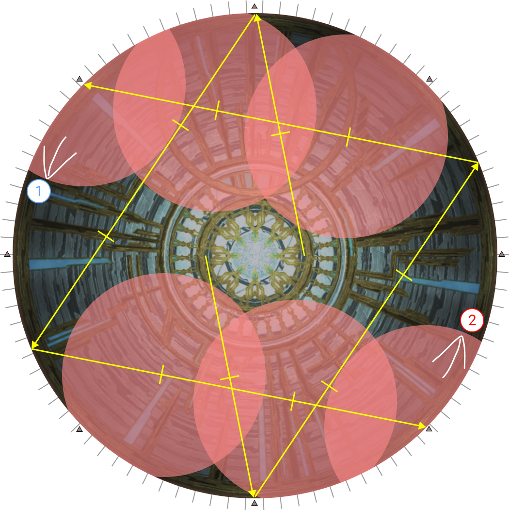

# King Thordan

## Strength of the Ward

### Part 1

<table>
  <tr>
    <td>
<b>1.</b> Light party spreads.

Healers are in front to allow them to dodge into the upcoming Heavy Impact early. This then lets them cast an additional GCD heal without using Swiftcast.</td>
    <td></td>
  </tr>
  <tr>
    <td>
<b>2.</b> Heavy Impact boundaries.
</td>
    <td></td>
  </tr>
</table>

Note that players on the back row can simply run forward to naturally dodge the Heavy Impacts as long as Ser Guerrique is not on one of the three closer positions.

- [Furthest Heavy Impact](https://clips.twitch.tv/GrotesqueDignifiedSkunkLitty-9twQOEUJM1i_Gca7)
- [Far Heavy Impact](https://clips.twitch.tv/FineTubularDelicataRiPepperonis-d5-AO5H6wUfRwd4H)
- [Middle Heavy Impact](https://clips.twitch.tv/AmusedCautiousFiddleheadsPanicVis-cs5131laAWRwlEkg)
- [Near Heavy Impact](https://clips.twitch.tv/SecretiveUnsightlyBorkRitzMitz-xUIR65ezwTfJOZL3)
- [Nearest Heavy Impact](https://clips.twitch.tv/RelatedPiercingGrasshopperOMGScoots-iqC09dukfOnorski)

### Part 2

<table>
  <tr>
    <td>

</td>
    <td></td>
  </tr>
</table>

**Tips:**
- Do not look for Thordan. Thordan appears at his position last, giving you the least amount of time to find him. Instead, look for the two (of three) knights that spawn closest to the center. These two knights will always spawn SW and SE relative to where Thordan will appear later.
- The two blue prey targets east and west should stand one north away from the party to avoid hitting the tanks with the AoE (and giving them a debuff that will kill them).

## Sanctity of the Ward

### Part 1: Sacred Severs

Currently, the most popular way to resolve Sacred Severs is a **DRK-relative, role-adjust** strat.

- The MT group takes Group 1 as its base position, away from the DRK.
- The ST group takes Group 2 as its base position, on the same side as the DRK.

If a player in a group receives the wrong numbered sword (e.g: MT receives the "2" sword), then the corresponding role in the other group (OT) swaps groups with that person.

<table>
  <tr>
    <td><b>1.</b> Sort out swords, and start 3-4 notches away from the outside "shurikens" <b>in the same direction that the inside knights are facing</b>.</td>
    <td></td>
    <td></td>
  </tr>
  <tr>
    <td>
<b>2.</b> Your movement will also be in the <b>same direction</b> that the inside knights faced.

Wait for the explosion in front of you to go off first before moving.

<ul><li>If you are moving <b>towards</b> the N/S poles, you have the <b>fast/early</b> dodge (example on the left).</li><li>If you are moving <b>away</b> from the N/S poles, you have the <b>slow/delayed</b> dodge (example on the right).</td>
    <td></td>
    <td></td>
  </tr>
  <tr>
    <td>
<b>3.</b> Stop three notches away from the next shuriken.</td>
    <td></td>
    <td></td>
  </tr>
</table>

### Part 2: Meteors

**N.B:** **Japanese** parties will do "center > cw > ccw" instead.

# Alternatives

## Sacred Severs - Fixed E/W dodges

This was originally the preferred way to resolve Sacred Severs, but has since fallen out of favour.

<table>
  <tbody>
    <tr>
      <th></th>
      <th>Advantages</th>
      <th>Disadvantages</th>
    </tr>
    <tr>
      <td>DRK-relative</td>
      <td>
        <ul>
          <li>Only one movement.</li>
          <li>Healers can cast a GCD in between Sacred Severs.</li>
        </ul>
      </td>
      <td>
        <ul>
          <li>Two different movement timings.</li>
          <li>Multiple start/end points make it more disorienting when preparing for Meteors.</li>
        </ul>
      </td>
    </tr>
    <tr>
      <td>Fixed E/W</td>
      <td>
        <ul>
          <li>Fixed movement timings.</li>
          <li>Ending point is always E/W, so it's easy to get your bearings for Meteors.</li>
        </ul>
      </td>
      <td>
        <ul>
          <li>Two movements.</li>
          <li>Healers cannot stand to cast a GCD heal.</li>
          <li>Slightly more damage dealt to Group 1.</li>
        </ul>
      </td>
    </tr>
  </tbody>
</table>

<table>
  <tr>
    <td><b>1.</b> Sort out swords, and start 0-4 notches away from the outside "shurikens" <b>in the <u>opposite</u> direction that the inside knights faced</b>.</td>
    <td></td>
  </tr>
  <tr>
    <td>
<b>2.</b> Your first movement will also be <b>in the <u>opposite direction</u> that the inside knights faced</b>.

When Dragon's Gaze goes off, move and stop 3-4 notches away from the next "shuriken".

    <td></td>
  </tr>
  <tr>
    <td>
<b>3.</b> When the AoE behind you goes off, turn around, and make your way back to the E/W positions.</td>
    <td></td>
  </tr>
</table>