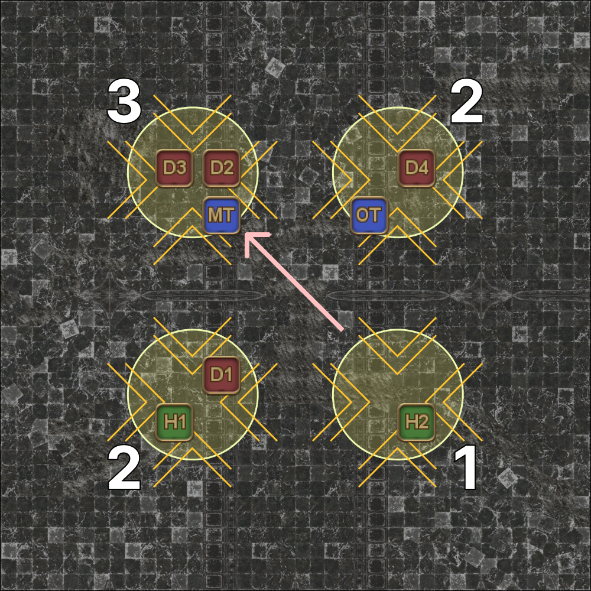

# Nidhogg

The main strat has two variants, affectionately dubbed "Easthogg" or "Westhogg".

- **English** parties prefer to go with "Easthogg".
- **Japanese** parties prefer to go with "Westhogg".

## 4x Towers

- Healers and Ranged stay in their towers.
- Tanks and Melee adjust:
    - If your tower needs **2 or more** players, **stay**.
    - Otherwise, adjust to the first tower that needs **more than 2** with the following priority:
        
            cw > ccw > across

### Examples

<table>
  <tr>
    <td>
<b>Starting positions:</b>

      <ul>
        <li>
          <b>MT:</b> NW
        </li>
        <li>
          <b>ST:</b> NE
        </li>
        <li>
          <b>D1:</b> SW
        </li>
        <li>
          <b>D2:</b> SE
        </li>
      </ul>
    </td>
    <td></td>
  </tr>
  <tr>
    <td>
<b>Example 1:</b>

      <ul>
        <li>
          <b>MT:</b>
          <ul>
            <li><b>MT</b> tower (NW) has 1 pip.</li>
            <li>CW tower has more than 2</li>
            <li><b>Rotate CW</b></li>
          </ul>
        </li>
        <li>
          <b>ST:</b>
          <ul>
            <li>Own tower (NE) has 2 or more pips.</li>
            <li><b>Stay</b></li>
          </ul>
        </li>
        <li>
          <b>D1:</b>
          <ul>
            <li>Own tower (SW) has 2 or more pips.</li>
            <li><b>Stay</b></li>
          </ul>
        </li>
        <li>
          <b>D2:</b>
          <ul>
            <li>Own tower (SE) has 1 pip.</li>
            <li>CW tower has more than 2</li>
            <li><b>Rotate CW</b></li>
          </ul>
        </li>
      </ul>
    </td>
    <td></td>
  </tr>
  <tr>
    <td>
<b>Example 2:</b>

      <ul>
        <li>
          <b>MT:</b>
          <ul>
            <li><b>MT</b> tower (NW) has 1 pip.</li>
            <li>CW tower has more than 2</li>
            <li><b>Rotate CW</b></li>
          </ul>
        </li>
        <li>
          <b>ST:</b>
          <ul>
            <li>Own tower (NE) has 2 or more pips.</li>
            <li><b>Stay</b></li>
          </ul>
        </li>
        <li>
          <b>D1:</b>
          <ul>
            <li>Own tower (SW) has 2 or more pips.</li>
            <li><b>Stay</b></li>
          </ul>
        </li>
        <li>
          <b>D2:</b>
          <ul>
            <li>Own tower (SE) has 1 pip.</li>
            <li>CW tower has 2 pips</li>
            <li>CCW tower has more than 2</li>
            <li><b>Rotate CCW</b></li>
          </ul>
        </li>
      </ul>
    </td>
    <td></td>
  </tr>
  <tr>
    <td>
<b>Example 3:</b>

      <ul>
        <li>
          <b>MT:</b>
          <ul>
            <li>Own tower (NE) has 2 or more pips.</li>
            <li><b>Stay</b></li>
          </ul>
        </li>
        <li>
          <b>ST:</b>
          <ul>
            <li>Own tower (NE) has 2 or more pips.</li>
            <li><b>Stay</b></li>
          </ul>
        </li>
        <li>
          <b>D1:</b>
          <ul>
            <li>Own tower (SW) has 2 or more pips.</li>
            <li><b>Stay</b></li>
          </ul>
        </li>
        <li>
          <b>D2:</b>
          <ul>
            <li>Own tower (SE) has 1 pip.</li>
            <li>CW tower has 2 pips</li>
            <li>CCW tower has 2 pips</li>
            <li>Opposite tower has more than 2 pips</li>
            <li><b>Move across</b></li>
          </ul>
        </li>
      </ul>
    </td>
    <td></td>
  </tr>
</table>