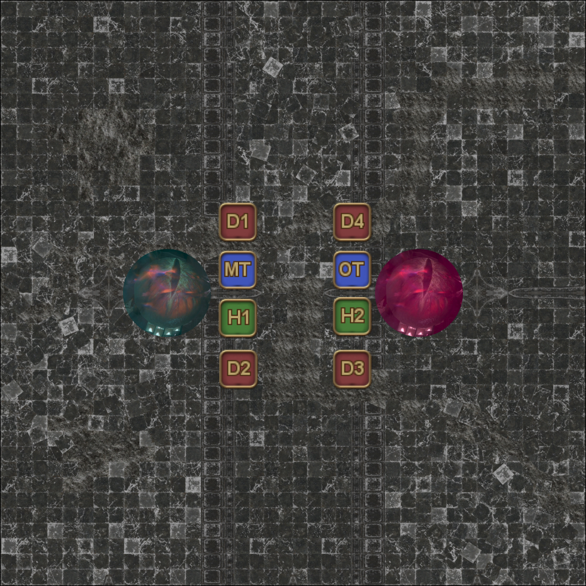
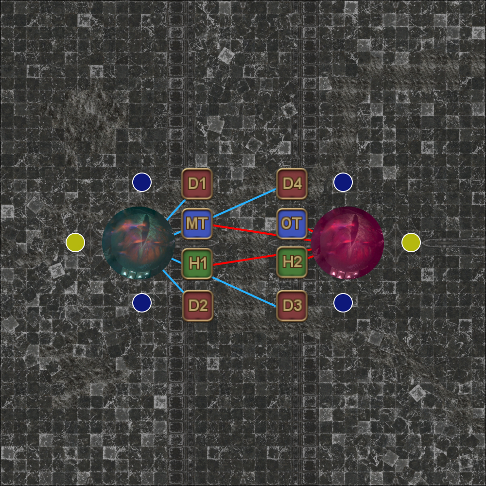
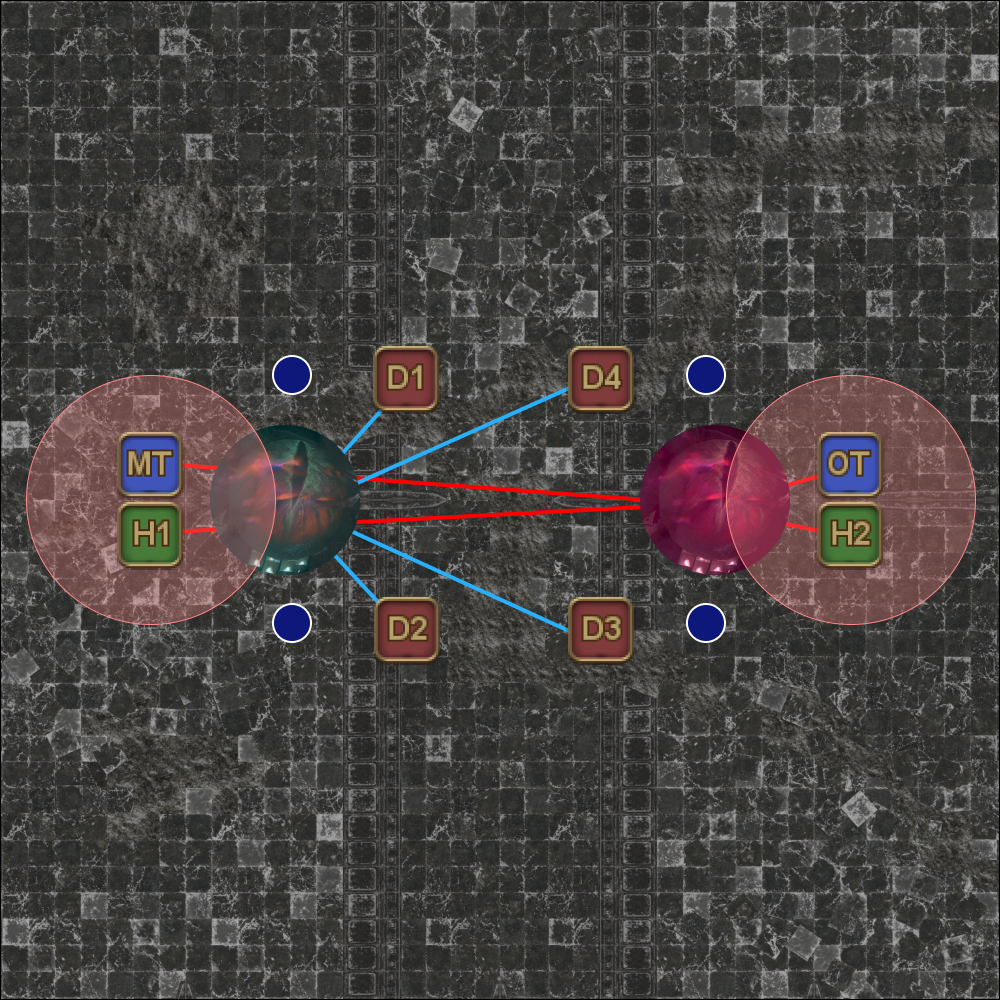
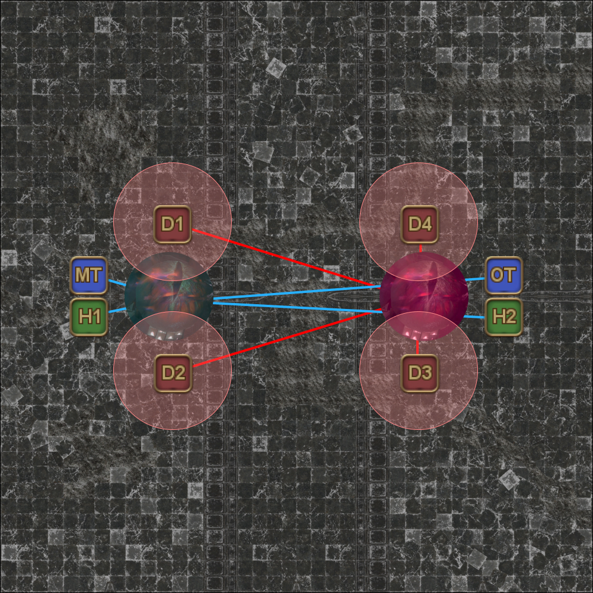
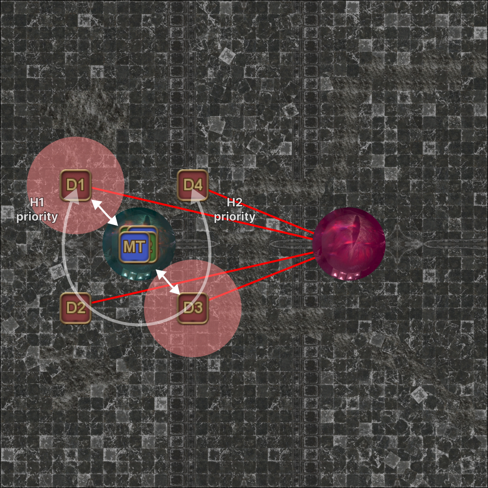
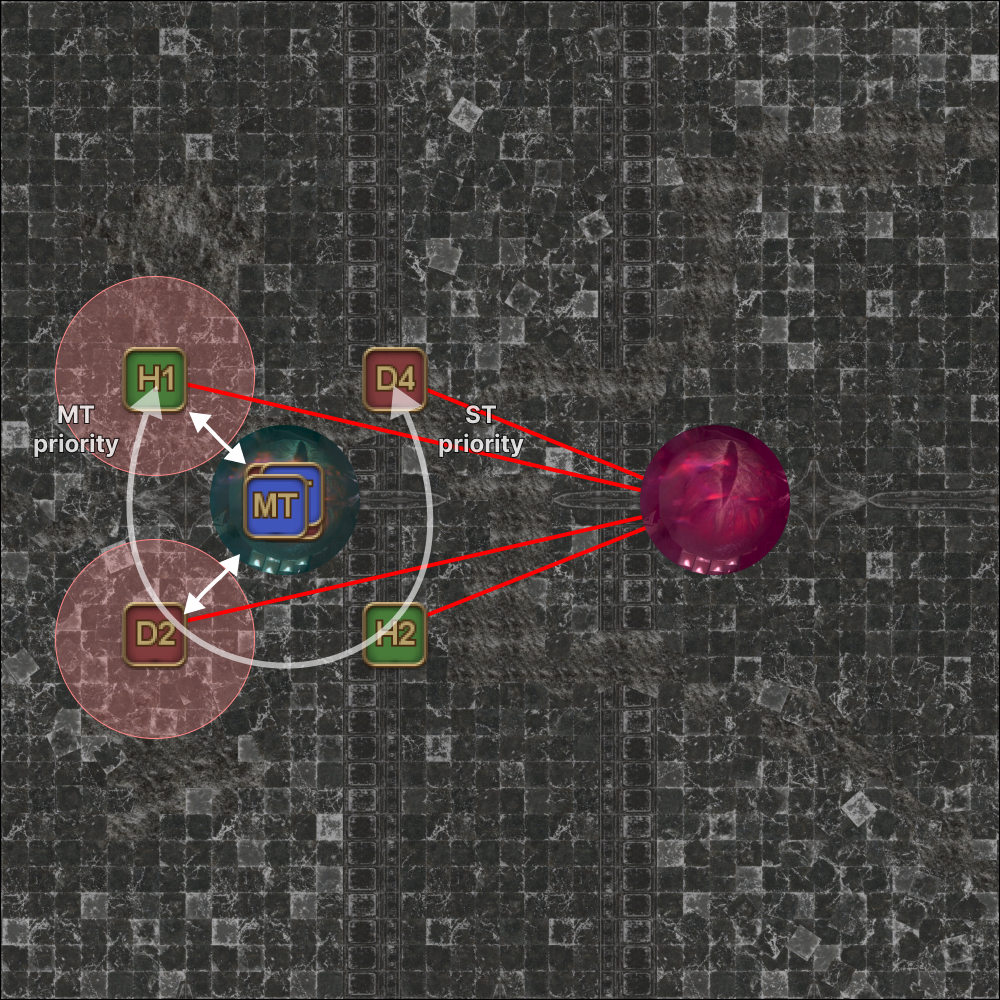
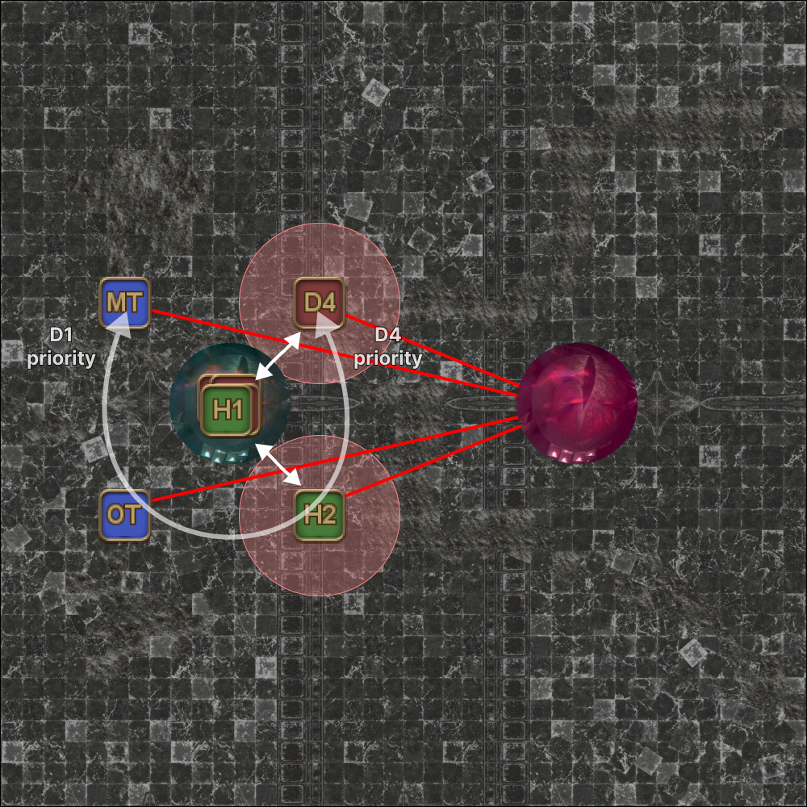
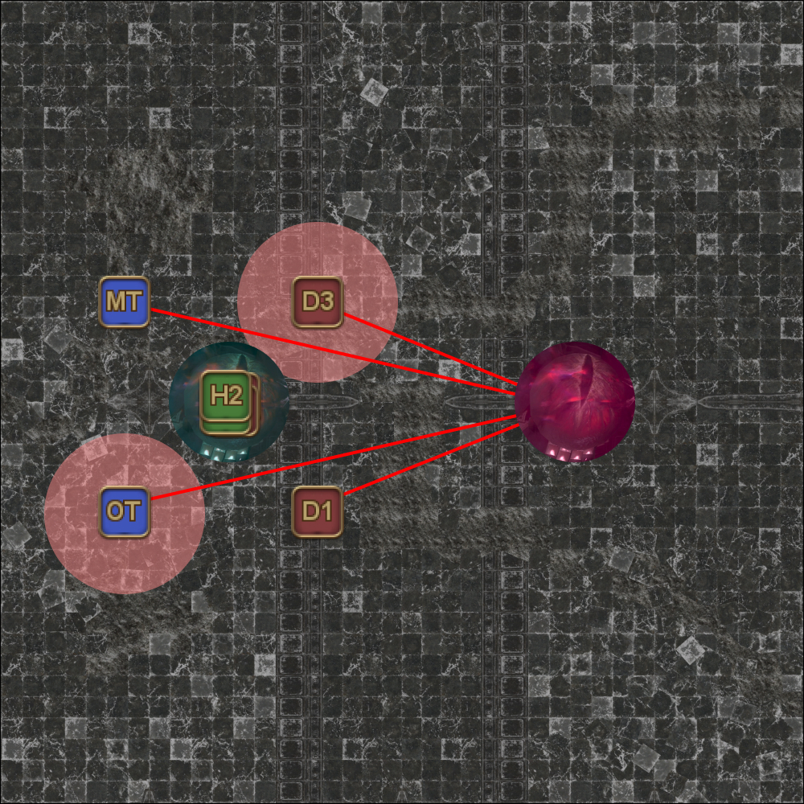

# Eyes

There are **many** Eyes strats out there. The following illustrates the strat used in the macro.

## T/H red, DPS blue

This phase references the Fang and Claw phase from Nidhogg EX.

Players get tethered with either blue or red tethers where:

- When a player with a **blue tether** takes damage, the blue eye **gets healed**.
- When a player with a **red tether** takes damage, the red eye **also takes damage**.

<table>
  <tr>
    <td>
<b>1.</b> Ghosts of Haurchefant and Ysayle spawn.
<ul><li>Haurchefant tethers to a random player.</li><li>Ysayle tethers to to Alphinaud.</li></ul>All players stack on Alphinaud (who's standing south of center) to get the two buffs from Haurchefant and Ysayle that lets you attack the two eyes.</td>
    <td></td>
  </tr>
  <tr>
    <td>
<b>2.</b> After getting the Soul of Friendship and Soul of Devotion buffs, spread out to your initial positions.</td>
    <td></td>
  </tr>
  <tr>
    <td>
<b>3.</b> After the eyes cast <b>Hatebound</b>, blue and red tethers spawn and attach to four random players each.

    <ul>
      <li><b>Tanks, Healers:</b> Want <b>red</b> tethers</li>
      <li><b>DPS:</b> Want <b>blue</b> tethers</li>
    </ul>
    If you have the <b>wrong</b> tether, stack on top of Estinien, who's in the middle of the arena to swap with someone else (who will also have the wrong tether).
    </td>
    <td></td>
  </tr>
  <tr>
    <td>
<b>4.</b> When the yellow orbs grow for the second time, <b>tanks and healers</b> pop the yellow orb together (shared damage).</td>
    <td></td>
  </tr>
  <tr>
    <td>
<b>5.</b> After the yellow orbs have been popped, DPS go to the tanks and healers to swap tethers (giving them blue and picking up red).</td>
    <td></td>
  </tr>
  <tr>
    <td>
<b>6.</b> When the blue orbs grow for the second time, <b>DPS</b> pop the blue orbs (one each).</td>
    <td></td>
  </tr>
  <tr>
    <td>
<b>7.</b> All players gather west to prepare for Mirage Dives.</td>
    <td></td>
  </tr>
  <tr>
    <td>
<b>8.</b> First set of dives.

<b>Healers</b> swap with the two dive targets.

    <pre><code>Starting from North:
    ccw: H1 > H2 :cw</code></pre>
    
Remember which two DPS were hit here, as those two DPS will be the ones swapping tethers after the third set of dives.
</td>
    <td></td>
  </tr>
  <tr>
    <td>
<b>9.</b> Second set of dives.

<b>Tanks</b> swap with the two dive targets.
<pre><code>Starting from North:
    ccw: MT > ST :cw</code></pre></td>
    <td></td>
  </tr>
  <tr>
    <td>
<b>10.</b> Third set of dives.

The <b>two DPS</b> that were hit earlier swap with the two dive targets.
<pre><code>Starting from North:
    ccw: D1 > D2 > D3 > D4 :cw</code></pre>
    
<em>(In this example, D1 and D3 were hit earlier in Step 8.)</em>
</td>
    <td></td>
  </tr>
  <tr>
    <td>
<b>11.</b> Fourth (final) set of dives.

Both eyes will begin to cast Steep in Rage shortly after.

At least one eye must be killed before Steep in Rage resolves, or the outgoing damage will wipe the party.

    
Note that because red-tethered players take damage from Steep in Rage, the red eye will also take damage as a result.

    
Similarly, the blue eye will revive (as the blue-tethered players took damage).
</td>
    <td></td>
  </tr>
</table>

### Notes

- The only thing that affects how much damage the red eye takes is the size of the orbs when taken. How much damage the players actually take (through shields, mitigations) does **not** affect the damage the red eye takes.
- If a player dies and is revived, they will be unable to deal damage to the eyes as they will have lost Haurchefant's and Ysayle's buffs.

# Saving Haurchefant

Once the eyes are defeated, time rewinds to the end of Phase 1. The key difference is that now players have access to a Tank LB3 that's needed to save Haurchefant.

- The method for Pure of Heart is exactly the same as Phase 1.
- Tank LB3 must be used **after** Haurchefant appears on the arena, but **before** he gets hit by the Spear of the Fury.

The Tank LB3 will reduce the damage Haurchefant takes, and also allows him to be healed.

After Pure of Heart resolves, the Spear of the Fury becomes targetable, and casts Pierce. The Spear must be destroyed before Pierce resolves, or Haurchefant dies.

If Haurchefant dies in this phase, the fight loops back to Thordan in Phase 2.

### Notes
- The first two Brightwind hits on the healers will be covered by the Tank LB3.
- In Phase 1, the pulsing AoE damage from the Spear ends early when Haurchefant is killed. This time around, Haurchefant stays alive so the pulsing AoE damage will continue until Pure of Heart resolves.
- Haurchefant will take heavy damage from Pure of Heart, and will need to be roughly 65% health to survive.
- Benediction **works** on Haurchefant.