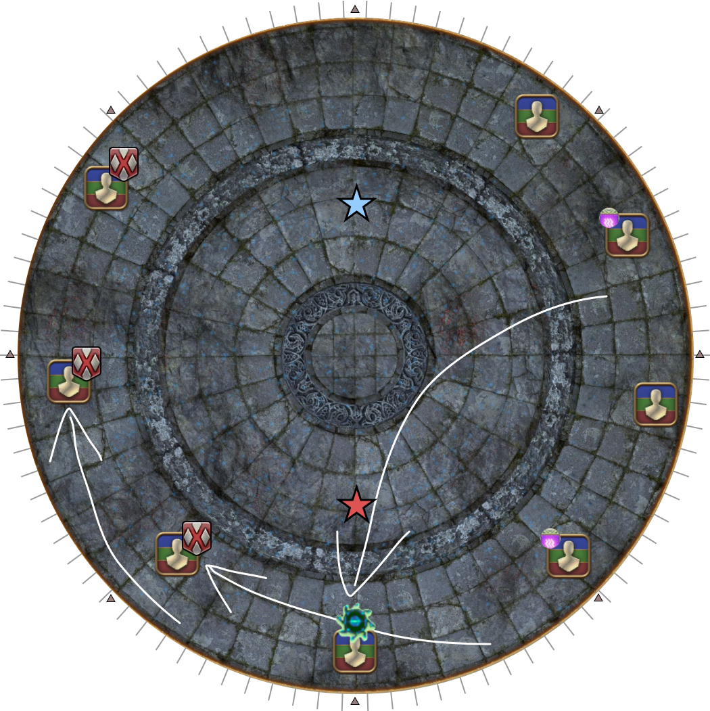
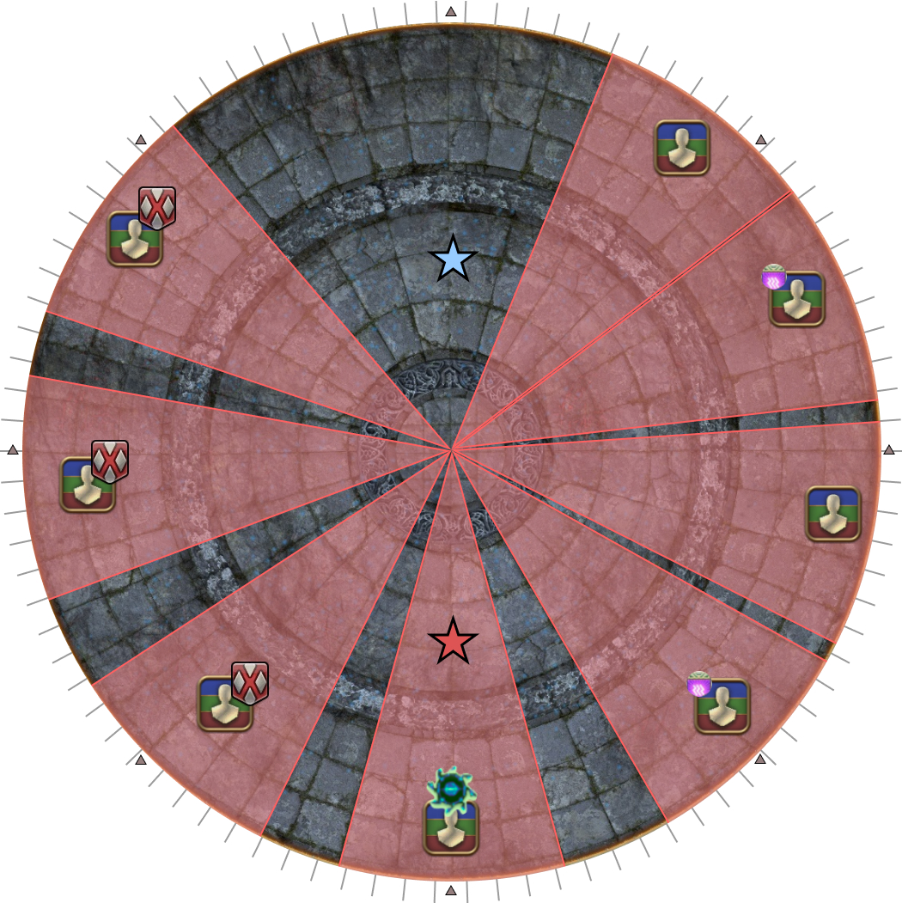
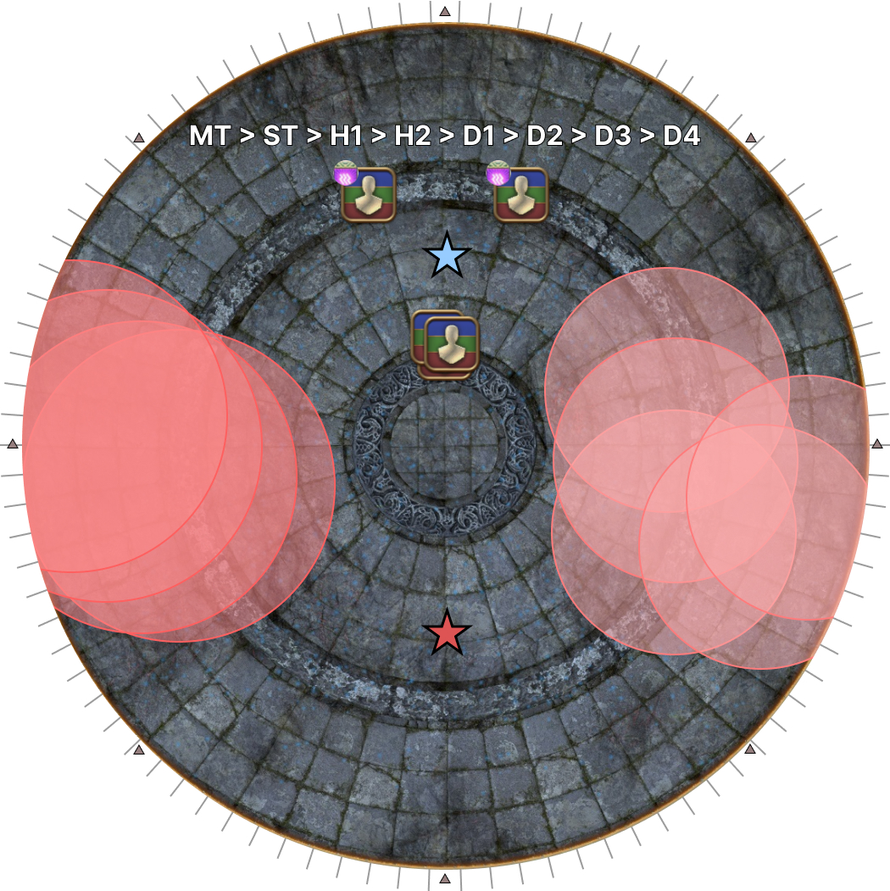
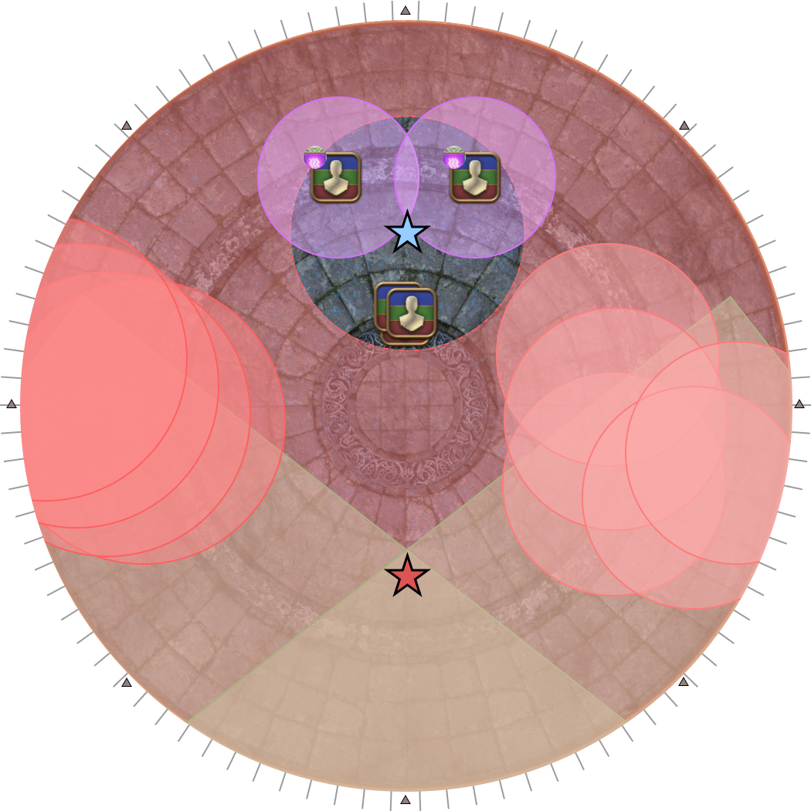
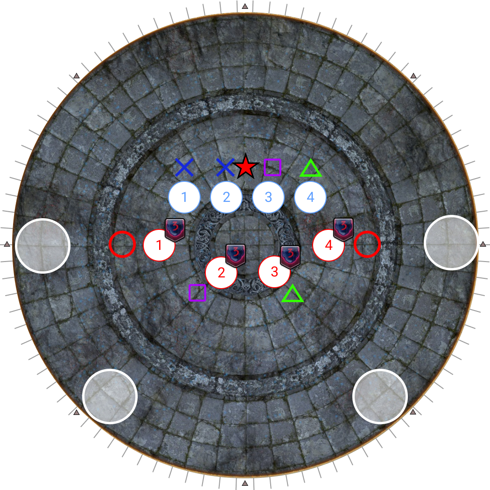
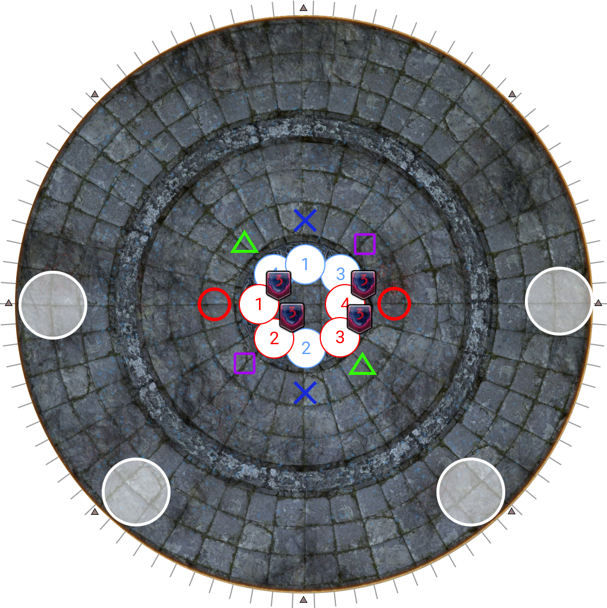

# Alternate Thordan

## Wrath of the Heavens

<table>
  <tr>
    <td>
<b>1.</b> A white dragon with two knights will spawn at a random cardinal edge.

Using the white dragon as north:
<ul><li>One player with the blue Skyward Leap marker will go NW (4 notches from the "shuriken").</li><li>Two players with Spiral Thrust tethers will cross their tethers and stand south (4 notches away from SW and SE)</li><li>All other players line up along the east side (within 4 notches away from the NE and SE "shurikens")</li></ul>
Ser Grinnaux (WAR) and Ser Charibert (BLM) will also spawn in the arena, one north, one south <b>in a random configuration</b>.

<b>Identify which is Ser Grinnaux (WAR), and which is Ser Charibert (BLM)</b>.</td>
    <td></td>
  </tr>
  <tr>
    <td>
<b>2.</b> Additional debuffs appear before the first set of AoEs resolve.
<ul><li>Two players will get a Thunder debuff. <b>If you get Thunder, identify who the other Thunder player is.</b></li><li>One player gets targeted with a green divebomb marker.</li></ul></td>
    <td></td>
  </tr>
  <tr>
    <td>
<b>3.</b> After the first round of AoEs resolve, <b>move to dodge Twisters</b>, and spread out <b>towards Ser Charibert (BLM)</b> with <b>at least 2 tiles between players</b>.
<ul><li>The three players who had the Skyward Leap and the two Spiral Pierces will always dodge and <b>spread along the west</b>.</li><li>The player with the green divebomb mark goes to the <b>edge behind Ser Charibert (BLM)</b>.</li><li>The remaining players spread out along the east side.</li></ul></td>
    <td></td>
  </tr>
  <tr>
    <td>
<b>4.</b> When Ascalon's Mercy Revealed resolves, baited AoEs appear.
<ul><li>One player who had either Skyward Leap, Spiral Pierce, or Divebomb will be targeted by 4 Altar Pyre AoEs.</li><li>One of the four remaining players will be targeted by 5 Liquid Heaven AoEs.</li></ul>
A player with Thunder <b>will not</b> be targeted by either Altar Pyre, or Liquid Heaven.</td>
    <td></td>
  </tr>
  <tr>
    <td>
<b>5.</b> Bait Altar Pyre and Liquid Heaven AoEs, and move <b>towards Ser Grinnaux (WAR)</b>.
<ul><li>The two players targeted with Lightning will be on the outside as per the priority.</li><li>All other players stack towards the center of the arena.</li></ul>
The player on the east with Liquid Heaven should try to <b>enter the safe spot from the side</b>, as a player on the west side will be one-shot if they get hit by the Liquid Heaven AoE.

Sprint is <b>very useful</b> here.
</td>
    <td></td>
  </tr>
  <tr>
    <td>
<b>6.</b> Final set of AoEs resolve.

Heal and prepare for Ancient Quaga.

N.B: The MT will need to use their 2m buff to mitigate Ancient Quaga (and the subsequent Heavenly Heel) for it to be back in time for the first tankbuster in P6.
</td>
    <td></td>
  </tr>
</table>

## Death of the Heavens

My preferred strat is an upside-down version of the "Komazou" strat, which splits the Dooms 2-2.

<table>
  <tr>
    <td>
<b>1.</b> Ser Guerrique (WAR) will spawn on one of the four cardinal locations.
<ul><li>Use Ser Guerrique as North for the rest of the mechanic.</li><li>Line up east-to-west.</li></ul></td>
    <td></td>
  </tr>
  <tr>
    <td>
<b>2.</b> Four random players will be targeted with Doom.
<ul><li>Doomed players step towards Ser Guerrique to make a line of four.</li><li>Non-Doomed players step away from Ser Guerrique to make a line of four.</li><li>Establish your order within your line.</li></ul></td>
    <td></td>
  </tr>
  <tr>
    <td>
<b>3.</b> Spread out to your positions.
<ul><li>The furthest left/right players take the sides.</li><li>The inner two players take the intercardinal positions. <em>(N.B: The intercardinal players are <u>not</u> directly in front of the "shuriken" mark.)</em></li></ul>
<b>Find Thordan and the Dragon's Eye.</b>
</td>
    <td></td>
  </tr>
  <tr>
    <td>
<b>4.</b> The second Heavy Impact resolves together with all the AoEs.

 Twisters will appear under random players.
<b>Doomed players:</b><ul><li>Dodge straight into the Heavy Impact AoE.</li></ul><b>Non-Doomed players:</b><ul><li>Dodge into the <b>next</b> Heavy Impact AoE.</li></ul></td>
    <td></td>
  </tr>
  <tr>
    <td>
<b>5.</b> Take up positions to prepare for Playstation markers.
<b>Doomed players:</b><ul><li>The furthest east/west Doomed players will bait the circle marks by being the two furthest Doomed players.</li><li>The two other Doomed players take up position towards SW and SE.</li></ul><b>Non-Doomed players:</b><ul><li>Line up west-to-east a little north of center.</li></ul></td>
    <td></td>
  </tr>
  <tr>
    <td>
<b>6.</b> Playstation markers appear.
<b>Doomed players:</b><ul><li>After baiting circles, the two circle players move towards the center.</li><li>The two other Doomed players do not move from their position.</li></ul><b>Non-Doomed players:</b><ul><li>The left-side X takes the North position.</li><li>The right-side X takes the South position.<li>Square and Triangle move opposite the Doomed player with the same symbol.</li></ul></td>
    <td></td>
  </tr>
  <tr>
    <td>
<b>7.</b> Players adjust as needed, use markers/outside "shurikens" to properly align yourself, and <b>look away from both Thordan and the Dragon's Eye.</b></td>
    <td></td>
  </tr>
  <tr>
    <td>
<b>8.</b> Faith Unmoving (knockback) and Heavensflame (AoEs on each player) resolves.
<b>Doomed players:</b><ul><li>Step into the white puddle left behind to cleanse Doom</li></ul></td>
    <td></td>
  </tr>
</table>

## Notes
- **Only WAR** can Holmgang the tankbuster after Wrath of the Heavens and still invuln P6's Cauterize.
