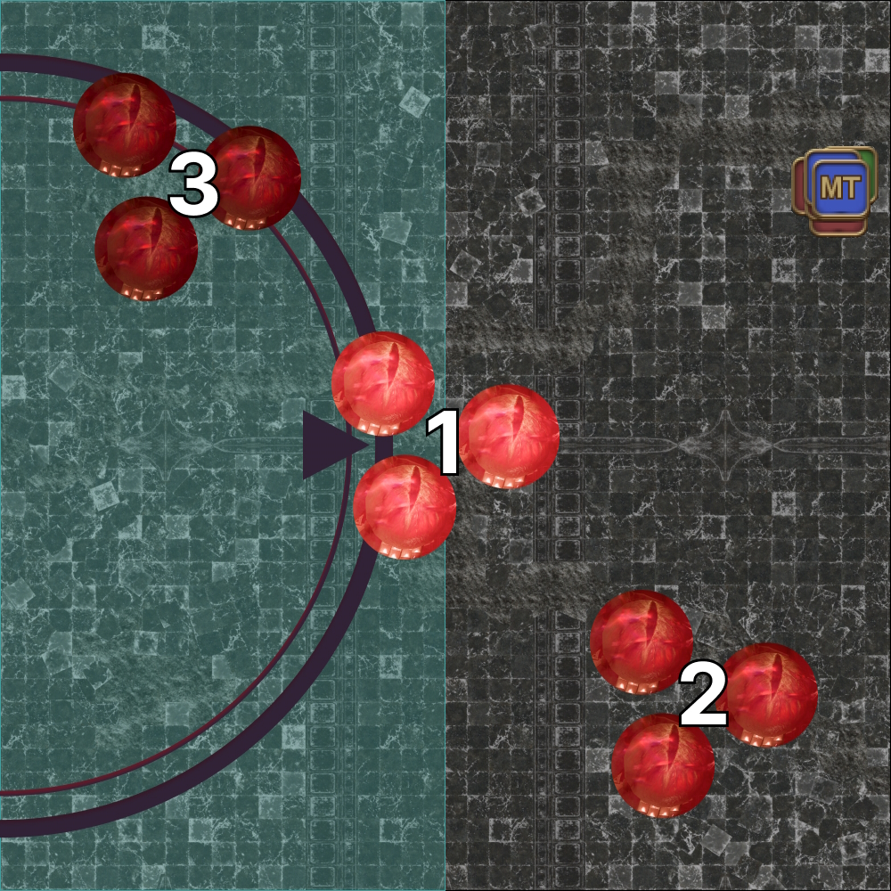

# Double Dragons

## Summary

If you are already familiar with the Double Dragons phase, and just need a quick summary:

<table>
  <tr>
    <td><b>Wyrmsbreath #1</b></td>
    <td>
      <ul>
        <li>△, D1 D2 D3 adjusts</li>
      </ul>
    </td>
  </tr>
  <tr>
    <td><b>Mortal Vow</b></td>
    <td>
      <ul>
        <li>DPS → MT → ST → D1/D2 → D3</li>
      </ul>
    </td>
  </tr>
  <tr>
    <td><b>Wroth Flames</b></td>
    <td>
      <ul>
        <li>Spreads to Nidhogg (west)</li>
        <li>Stacks to Hraesvelgr (east)</li>
      </ul>
    </td>
  </tr>
  <tr>
    <td><b>Wyrmsbreath #2</b></td>
    <td>
      <ul>
        <li>5-1, D3 south</li>
      </ul>
    </td>
  </tr>
</table>

## Mortal Vow

There are *four* Mortal Vow passes in this phase.

1. After Hallowed Wings #1
2. After Wroth Flames (this pass is *quick*)
3. After Hallowed Wings #2
4. After Cauterize → Touchdown

We pass "DTTMR", or in other words:

```
DPS → MT → ST → D1/D2 → D3
```
All passes happen in the center of the arena, except for the final pass after Touchdown (which is just done at the edge).

## First half

<table>
  <tr>
    <td>
      <p><b>1. Wyrmsbreath #1</b></p>
      <p>Have everyone preposition to prepare for the upcoming mechanic.</p>
      <ul>
        <li><b>Center:</b> D3, D4</li>
        <li><b>Bottom-left:</b> H1, D1</li>
        <li><b>Bottom-right:</b> H2, D2</li>
      </ul>
      <p>This will also be your second pot window.</p>
    </td>
    <td></td>
  </tr>
  <tr>
    <td>
      <p><b>2. Wyrmsbreath #1</b></p>
      <p>More precisely, these are the anchor (H1, H2, D4) positions.</p>
      <p><b>None of these positions are in melee range.</b></p>
      <p><em>(Note the white tile that can be used as reference for the center position.)</em></p>
    </td>
    <td></td>
  </tr>
  <tr>
    <td>
      <p><b>3. Wyrmsbreath #1</b></p>
      <p>Tethers appear.</p>
      <ul>
        <li><b>D1, D2, D3:</b> If your pair has the same-coloured tether, swap with the other pair that also has two tethers of the opposite colour.</li>
        <li><b>H1, H2, D4:</b> Does not move.</li>
      </ul>
      <p><em>(In this example, D1 and D3 will swap positions.)</em></p>
    </td>
    <td></td>
  </tr>
  <tr>
    <td>
      <p><b>4. Wyrmsbreath #1</b></p>
      <p>Mechanics resolve.</p>
      <ul>
        <li><b>MT, ST:</b> If your dragon's mouth is <b>not</b> glowing, you have a single-target tankbuster. Otherwise, you have a shared tankbuster (stack in the middle).</li>
      </ul>
      <p><em>(In this example, Nidhogg's mouth is glowing.)</em></p>
    </td>
    <td></td>
  </tr>
  <tr>
    <td>
      <p><b>5. Mortal Vow</b></p>
      <p>DPS spread out- Nidhogg will target a random DPS for the first Mortal Vow (in an AoE around that player).</p>
    </td>
    <td></td>
  </tr>
  <tr>
    <td>
      <p><b>6. Akh Afah #1</b></p>
      <p>4-man shared AoEs on the two healers. Nidhogg and Hraesvelgr's HP <b>must be within 3%</b> or their Akh Afah stack will kill all players.</p>
      <p>If the HP difference is too large, a tether will appear connecting both bosses:</p>
      <ul>
        <li><b>No tether:</b> Both dragons' HP is within 3%.</li>
        <li><b>Purple tether:</b> Nidhogg's HP is too high.</li>
        <li><b>White tether:</b> Hraesvelgr's HP is too high.</li>
      </ul>  
    </td>
    <td></td>
  </tr>
  <tr>
    <td>
      <p><b>7. Hallowed Wings #1</b></p>
      <p>Turn to face Hraesvelgr.</p>
      <p>Avoid Hraesvelgr's Hallowed Wings and Nidhogg's Cauterize, and then position yourselves based on whether <b>Hraesvelgr's head is up or down</b>.</p>
      <ul>
        <li><b>Head up:</b> Party near, tanks far.</li>
        <li><b>Head down:</b> Tanks near, party far.</li>
        <li><b>MT:</b> North</li>
        <li><b>ST:</b> South</li>
      </ul>
      <p><em>(In this example, Hraesvelgr's head is down.)</em></p>
    </td>
    <td></td>
  </tr>
  <tr>
    <td>
      <p><b>8. Mortal Vow pass #1</b></p>
      <p>The DPS that Nidhogg targeted with Mortal Vow passes it to the MT in the middle of the arena.</p>
    </td>
    <td></td>
  </tr>
</table>

## Wroth Flames

Wroth Flames is the "intermission" in this phase, separating the first and second iteration of each of the looped mechanics.

When dropping Akh Morns, the most efficient movement (geometrically) is to move **perpendicular from the wall in a straight line**, and then curve in after the third Akh Morn.

<table>
  <tr>
    <td><p><b>1.</b> Identify the starting location.</p>
      <ol>
        <li>Avoid Hraesvelgr's Cauterize</li>
        <li>Be as far away from the <b>second</b> set of eyes as you can.</li>
      </ol>
      <p><em>(In this example, Hraesvelgr's Cauterize will hit the east half.)</em></p>
    </td>
    <td></td>
  </tr>
  <tr>
    <td>
      <p><b>2.</b> Hraesvelgr's Cauterize resolves. Drop first Akh Morn puddle.</p>
      <p>The initial Akh Morn movement will always go east-to-west or vice versa.</p>
    </td>
    <td></td>
  </tr>
  <tr>
    <td>
      <p><b>3.</b> First set of eye AoEs resolve. Drop the second Akh Morn puddle without getting hit by the eye AoE.</p>
    </td>
    <td></td>
  </tr>
  <tr>
    <td>
      <p><b>4.</b> Drop third and fourth Akh Morn puddles.</p>
    </td>
    <td></td>
  </tr>
  <tr>
    <td>
      <p><b>5.</b> Move to the middle and identify whether Nidhogg is casting Hot Wing or Hot Tail.</p>
    </td>
    <td></td>
  </tr>
  <tr>
    <td>
      <p><b>6.</b> Spreads will go towards Nidhogg (west), stacks will go towards Hraesvelgr (east).</p>
      <p>A general priority order would resemble:</p>
      <pre><code>(Center) Tanks > Healers > Ranged > Melee (Edge)</code></pre>
      <p>There is enough space for two "spreads" to stand side-by-side if they are on the sides of the safe zone.</p>
    </td>
    <td></td>
  </tr>
  <tr>
    <td>
      <p><b>7.</b> Finally, pass Mortal Vow from the MT to the ST.</p>
    </td>
    <td></td>
  </tr>
</table>

## Second half

The second half is a rehash of the first, with slightly different spins on the same mechanics from earlier.

<table>
  <tr>
    <td>
      <p><b>1. Akh Afah #2</b></p>
      <p>Depending on how much uptime the party got earlier with Hallowed Wings #1 and Wroth Flames, the two dragons' HP may be skewed to one side.</p>
    </td>
    <td></td>
  </tr>
  <tr>
    <td>
      <p><b>2. Hallowed Wings #2</b></p>
      <p>This time, Hallowed Wings will happen in combination with Hot Wing <em>or</em> Hot Tail from Nidhogg.</p>
      <ul>
        <li><b>MT: </b> Takes the western position.</li>
        <li><b>ST: </b> Takes the eastern position.</li>
      </ul>
      <p><em>(This example has Hot Wing with Hraesvelgr's head up.)</em></p>
    </td>
    <td></td>
  </tr>
  <tr>
    <td>
      <p><b>3. Mortal Vow pass #3</b></p>
      <p>This pass goes from the ST to D1, <em>unless</em> D1 started with the first Mortal Vow, in which case ST passes to D2 instead.</p>
      <p>Other players line up to prepare for Wyrmsbreath #2.</p>
    </td>
    <td></td>
  </tr>
  <tr>
    <td>
      <p><b>4. Wyrmsbreath #2</b></p>
      <p>This time, we <b>do not</b> want to stack opposite tethers.</p>
      <ul>
        <li><b>MT:</b> SW if you get the single-target tankbuster (by Nidhogg).</li>
        <li><b>ST:</b> SE if you get the single-target tankbuster (by Hraesvelgr).</li>
        <li><b>D3:</b> Go south, and <b>move towards a dragon whose mouth is glowing</b>.</li>
        <li><b>All other non-tanks:</b> Spread out along the <b>north</b> edge.</li>
      </ul>
      <p><em>(In this example, Hraesvelgr's mouth is glowing).</em></p>
    </td>
    <td></td>
  </tr>
</table>

## Cauterize

The reason why we did not stack opposite tethers in Wyrmsbreath #2 was because we needed the fire/ice debuffs in order to survive this mechanic.

<table>
  <tr>
    <td>
      <p><b>1. Cauterize</b></p>
      <p>Nidhogg and Hraesvelgr will spawn along the north edge in a <b>random</b> orientation.</p>
      <ul>
        <li><b>MT:</b> West, in front of the other party members.</li>
        <li><b>ST:</b> East, in front of the other party members.</li>
        <li><b>Players with the Fire debuff:</b> Stand in front of Hraesvelgr.</li>
        <li><b>Players with the Ice debuff:</b> Stand in front of Nidhogg.</li>
      </ul>
      <p><b>Do not move</b> once Nidhogg's debuff turns into Pyretic, or Hraesvelgr's Cauterize will kill you and enrage.</p>
    </td>
    <td></td>
  </tr>
  <tr>
    <td>
      <p><b>2. Mortal Vow pass #4</b></p>
      <p>After Cauterize, everybody gathers north to avoid Nidhogg's and Hraesvelgr's Touchdown damage.</p>
      <p>After Touchdown, all players move away from the stack point <em>except</em> the DPS with Mortal Vow and D3.</p>
    </td>
    <td></td>
  </tr>
</table>

## Additional Examples: Hallowed Wings #1

Here are some other potential configurations:

<details>
<summary>NE quadrant safe, head up</summary>
<table>
  <tr>
    <td>
      <p>Heads up means tanks far, party near.</p>
      <p>The MT takes the northern-most position.</p>
    </td>
    <td></td>
  </tr>
</table>
</details>

<details>
<summary>SW quadrant safe, head down</summary>
<table>
  <tr>
    <td>
      <p>Heads down means tanks near, party far.</p>
      <p>The MT takes the northern-most position.</p>
    </td>
    <td></td>
  </tr>
</table>
</details>

<details>
<summary>SW quadrant safe, head up</summary>
<table>
  <tr>
    <td>
      <p>Heads up means tanks far, party near.</p>
      <p>The MT takes the northern-most position.</p>
    </td>
    <td></td>
  </tr>
</table>
</details>

## Additional Examples: Wroth Flames

Since there are many possible variations with Wroth Flames, here are a couple additional scenarios to consider.

<details>
<summary>Hraesvelgr middle (uptime available), 2-to-1 dodge</summary>
<table>
  <tr>
    <td>
      <p><b>1.</b> Identify the starting location.</p>
      <ul>
        <li>Since Hraesvelgr's in the center, the party can start either west or east.</li>
        <li>In this case, west gives the party melee uptime on Nidhogg, but with a 2-1 dodge.</li>
      </ul>
    </td>
    <td></td>
  </tr>
  <tr>
    <td><p><b>2.</b> Hraesvelgr's Cauterize resolves. Drop first Akh Morn puddle.</p></td>
    <td></td>
  </tr>
  <tr>
    <td><p><b>3.</b> First set of eye AoEs resolve. Drop the second Akh Morn puddle without getting hit.</p></td>
    <td></td>
  </tr>
  <tr>
    <td><p><b>4.</b> Drop third and fourth Akh Morn puddles.</p></td>
    <td></td>
  </tr>
  <tr>
    <td><p><b>5.</b> Move to the middle, identify whether Nidhogg is casting Hot Wing or Hot Tail.</p></td>
    <td></td>
  </tr>
</table>
</details>

<details>
<summary>Hraesvelgr west (forced downtime), 2-to-1 dodge</summary>
<table>
  <tr>
    <td>
      <p><b>1.</b> Identify the starting location.</p>
      <ul>
        <li>Since Hraesvelgr's west, the party can only start east.</li>
        <li>The furthest position away from the second set of eyes is NE.</li>
      </ul>
    </td>
    <td></td>
  </tr>
  <tr>
    <td><b>2.</b> Hraesvelgr's Cauterize resolves. Drop first Akh Morn puddle.</td>
    <td></td>
  </tr>
  <tr>
    <td><b>3.</b> First set of eye AoEs resolve. Drop the second Akh Morn puddle without getting hit.</td>
    <td></td>
  </tr>
  <tr>
    <td><b>4.</b> Drop third and fourth Akh Morn puddles.</td>
    <td></td>
  </tr>
  <tr>
    <td><b>5.</b> Move to the middle, identify whether Nidhogg is casting Hot Wing or Hot Tail.</td>
    <td></td>
  </tr>
</table>
</details>

## Additional Examples: Hallowed Wings #2

Here are some other potential configurations:

<details>
<summary>Hot Wing, head up</summary>
<table>
  <tr>
    <td>
      <p>Hot Wing means all party members must stay near the E/W line.</p>
      <p>Heads up means the tanks are away from Hraesvelgr, and the rest of the party is towards Hraesvelgr.
      <p>The MT takes the western-most position.</p>
    </td>
    <td></td>
  </tr>
</table>
</details>

<details>
<summary>Hot Tail, head down</summary>
<table>
  <tr>
    <td>
      <p>Hot Wing means all party members must stay near the E/W line.</p>
      <p>Heads up means the tanks are away from Hraesvelgr, and the rest of the party is towards Hraesvelgr.
      <p>The MT takes the western-most position.</p>
    </td>
    <td></td>
  </tr>
</table>
</details>

## Notes

* DRK is the only tank that doesn't *actually* need Rampart in this phase, as Dark Mind's cooldown is quick enough for it to be available for both Hallowed Wings.
* PLD is the only tank without a third cooldown, and will literally run out of cooldowns in this phase. Healer targeted cooldowns (Aquaveil, Protraction, Exaltation, Taurachole) will be needed to help a PLD out.
* There are strats where only one tank invulns Cauterize, or neither tank invulns Cauterize in order to have a 1-1-6 Akh Morn's edge in P7. While the recommended PF strat is to just invuln Cauterize, a static may consider having just one tank invuln Hraesvelgr's Cauterize (and have the other mitigate Nidhogg's). I personally wouldn't recommend having both tanks mitigate Cauterize.
* If a tank was hit by a fire or ice tether in Wyrmsbreath #2, they should also go in front of the appropriate dragon to get their debuff cleansed by Cauterize.
* If someone happens to move after the fire debuff turns into Pyretic, they should keep moving into the wall, or into Nidhogg's side so they do **not** die to Hraesvelgr.