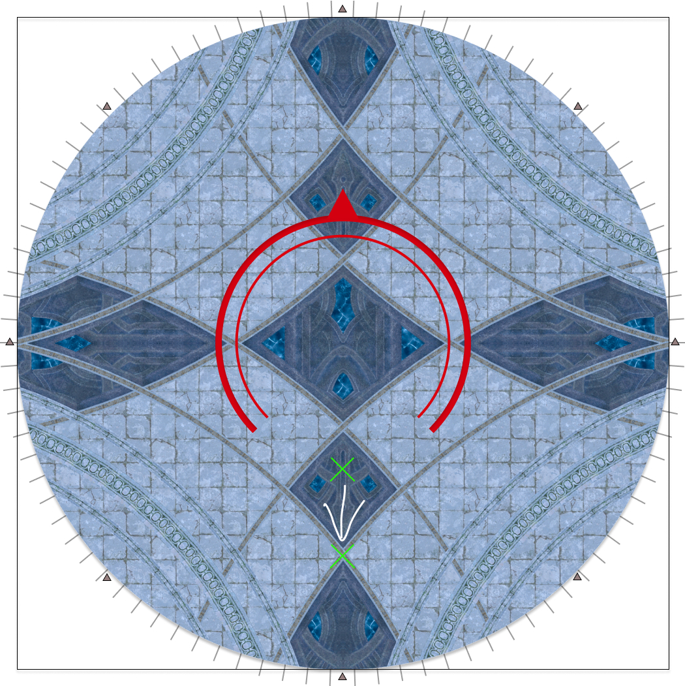
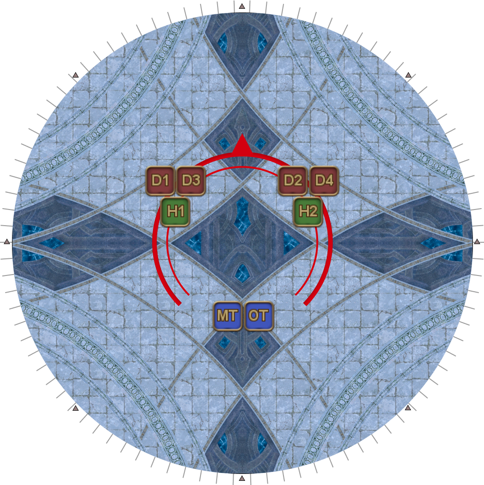

# Dragonking Thordan

## Summary

If you are already familiar with Dragonking Thordan and just need a quick summary:

<table>
  <tr>
    <td><b>Akh Morn's Edge</b></td>
    <td><ul><li>All 3-3-2</li></ul></td>
  </tr>
  <tr>
    <td><b>Trinity</b></td>
    <td><ul><li>D1/2 > D3/4 > H1/2</li></ul></td>
  </tr>
</table>

## Exaflare's Edge

<table>
  <tr>
    <td>
Have whoever's tanking face Dragonking Thordan either true North, or true South- this lets you also use the floor markings to guide your movement.

A backwards dodge (see the diagram) will <b>always</b> be safe.
</td>
    <td></td>
  </tr>
</table>

## Trinity

- It's easy for the tanks to lose track of who is supposed to be tanking the boss. Some things to help keep track are:
    - Add text to a Provoke macro so the chat log has a record of who last Provoked.
    - Look at the time remaining on the two Light/Dark debuff timers- **if the Dark debuff is lower than Light (or if you have no Dark debuff), you should be holding aggro.**
- We put D1 and D2 after Exaflares as they will naturally be the closest if they do an uptime dodge.
- We put H1 and H2 after Gigaflares as healers are the squishiest and there are only two Gigaflare's Edge.

## Akh Morn's Edge

<table>
  <tr>
    <td>
The base strat for Akh Morn's Edge is a 3-3-2 split (boss relative).
<ul><li><b>Front-left:</b> H1, D1, D3</li><li><b>Front-right:</b> H2, D2, D4</li><li><b>Back:</b> MT, ST</li></ul></td>
    <td></td>
  </tr>
</table>
