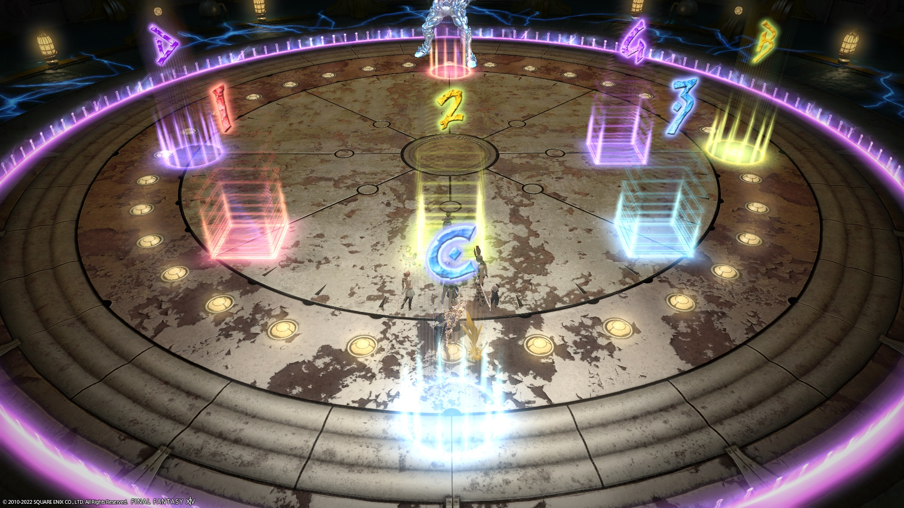

# The Epic of Alexander (Ultimate)

**DISCLAIMER** - Since Elemental PF hasn't agreed on a TEA strat since Patch 5.1, I'm going to take the liberty of piecing one together myself. This is what I would do:

- [**Living Liquid**](en/01_living_liquid.md): Modified Separations (the "JP strat")
- [**Limit Cut**](en/02_limit_cut.md): 1211 or 1256
- [**Brute Justice + Cruise Chaser**](en/03_bjcc.md): Tollgate (this is my strat that I use)
- [**Alexander Prime**](en/04_alex_prime.md): 09STOP Wormhole (Korean sim strat- this is also called "Onyxia" by NA/EU)
- [**Perfect Alexander**](en/05_perfect_alex.md)

### BiS Notes

- Any gear at or above **i595** will have their substats capped.
- Relic weapons will have their substats capped at **184**.

## English

```
―《Living Liquid (Separations)》――――――――
　■ Jagd Dolls：
　　D1●D2　　Protean Baits：　
　　　　　　　　H1 (north), D3 (west), H2 (east)
　●D3　D4●
　■ 1st Protean Waves
　　　MT ST　　　1. Stack N/S
　　D1　　D2　　2. Melee in, ranged out
　　D3　　D4　　3. Ranged in, melee out
　　　H1H2
　■ Throttles
　　H1 → MTSTH1H2D1D2D3D4 ← H2
　■ 2nd Protean Waves
　　　●　　　　　　　●D3D4　　　　MT●
　　　①　　　　　　　MT　　　　　　ST　D3
　●　◎　●　→　●  ST◎　●　→　●　◎D4  ●
　　　②　　　　 H1  D1D2  H2　　D1 H1H2 D2
　①MTSTD3D4
　②H1H2D1D2
―《Limit Cut (1211)》―――――――――――――
　Start from 1st explosion between W and NE
　　(even) (odd)　　　Odds：out + forward
　　　　　●　(party)　Evens：out + back
―《 Brute Justice + Cruise Chaser (Tollgate)》――
　■ Initial spread　　　　　■ Enumeration：
　　D3D4　　MT→CC　　　　West：D1D3H1
　H1　　H2　ST→BJ　　　　　East：D2D4H2
 　ST　　MT　※MTST swaps　※D1D2 swap if
　　D1D2　　　at Photon　　　　needed
　■ Nisi　　　　　　　1. After Photon
　　MTD1*、STD2*　　2. After Enumeration
　　H1D3、H2D4　　  3. After Plasma Shield
　　* Pass with closest melee after Enumeration
　■ Water　　　　　　　　■ Lightning
　　1st (N): H + D234　　　　1st (E): DPS → ST
　　2nd (S): D1234　　　　　2nd (mid): ST → MT
　　3rd (SE): H2 + D1234　　3rd (N): MT → H1
　　　(except 2nd water)
―《Temporal Stasis》――――――――――――――
　Red/Green：West-side boss (T/H: N, DPS: S)
　No debuff：East-side boss (T/H: N, DPS: S)
　Blue ：T/H→ West　　DPS→ East
　　　※ side next to CC stands closer to mid
　Aggravated Assault：Edge with BJ
―《Alexander Prime》―――――――――――――
　【Opener】ST tanks at the start
　■ Chastening Heat
　　Start of Alex：ST invuln
　　After Inception：MT invuln
―《Inception Formation》―――――――――――
　■ Orb tethers：
　　　Curve orbs around mid and cross tethers
　■ Flarethrowers：
　　　MT(south) → ST (mid) → party (north)
　■ Debuffs (True Heart as north)
　　West：MT + ST + Shared Sentence DPS
　　East：H1 + H2 + other DPS
　■ Super Jump + Alpha Swords (True north)
　　　　　　　　　　H1
　　Blue tether DPS ●　(party)　ST
　　　　　　　　　　H2　　　　(Super Jump)
―《Wormhole Formation：09STOP》――――――
　Enumeration：West：D1D3H1, East：D2D4H2
　　　　　　　　※ D1, D2 swap if needed
　Mega Holy：MT Reprisal + D4 Addle
―《J-Storm》――――――――――――――――――
　After 6 stacks: Tank 90s + H1H2 120s
　After 8 stacks: H2 30s + D3 + ST Reprisal
　After 10 stacks: MT Reprisal
―《Perfect Alexander》―――――――――――――
　■ Forced March (E→W)：
　　Light Beacon：West　　Dark Beacon：East
　■ Spread　　　　■ Stacks
　　D3 MT D4　　　　West: H1 > D3 > D1 > MT
　　H1　　H2　　　　 East: H2 > D4 > D2 > ST
　　D1  ST D2　　　　※ Lower priority switches
　■ Ordained Capital Punishment
　　MT+ST share → ST invuln → MT invuln
　■ Fate Calibration Alpha
　　West：Shared Sentence + No debuff
　　East：Aggravated Assault
　■ Fate Calibration Beta
　　Light Beacon：NNW
　　Dark Beacon：East (on marker)
　■ Exatrines
　　※ All with shields + H2 30s and:
　　　1st: MT Reprisal + MT 90s + H1 + D3
　　　2nd: ST Reprisal + ST 90s + D4
```

## Markers

- `ABCD` are for orientation

**Limit Cut:**
- `1234` divides the arena for Limit Cut
	- If doing 1211, start from the first explosion on the non-marked side.
	- If doing 1256, the 1256 group goes to the side without markers. The 3478 group goes to the side with markers.
	
**Brute Justice + Cruise Chaser:**
- `A`: 1st Water
- `C`: 2nd Water
- `3`: 3rd Water

**Alexander Prime:**
- `4`: Party stack for Inception Formation (except for ST, healers, and blue-tether DPS)

**Perfect Alexander:**
- `B`: Dark Beacon (Forced March, Fate Calibration Beta)
- `1234`: Exatrine


<details markdown=block>
<summary markdown=span>XIVLauncher WaymarkPresetPlugin positions</summary>

```json
{"Name":"TEA","MapID":694,"A":{"X":100.0,"Y":0.0,"Z":88.0,"ID":0,"Active":true},"B":{"X":114.0,"Y":0.0,"Z":100.0,"ID":1,"Active":true},"C":{"X":100.0,"Y":0.0,"Z":116.0,"ID":2,"Active":true},"D":{"X":87.75,"Y":0.0,"Z":100.0,"ID":3,"Active":true},"One":{"X":92.2,"Y":0.0,"Z":107.8,"ID":4,"Active":true},"Two":{"X":100.0,"Y":0.0,"Z":107.8,"ID":5,"Active":true},"Three":{"X":107.8,"Y":0.0,"Z":107.8,"ID":6,"Active":true},"Four":{"X":107.8,"Y":0.0,"Z":100.0,"ID":7,"Active":true}}
```

</details>