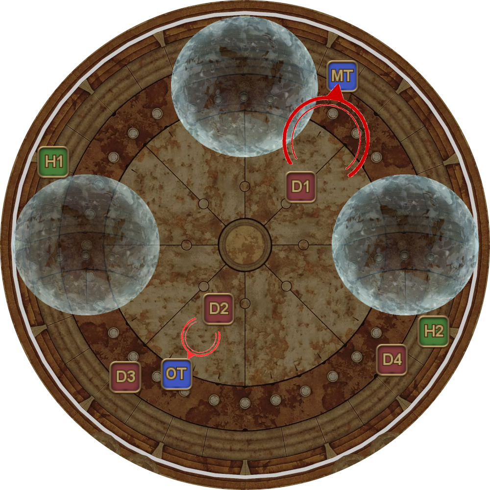
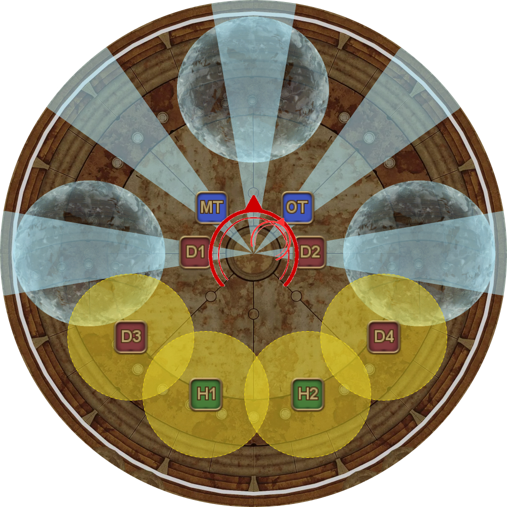

# Living Liquid

This is a modified version of the original Separations Living Liquid strat.

Notable changes are:
- The MT Provokes the Liquid Hand and invulns the first set of Fluid Swings and the Protean Wave from the "north" puddle.
- The first set of Protean Waves are baited by the MT and both healers, instead of both healers and D3.
- The DPS positions for the final set of Protean Waves are different.

<table>
  <tr>
    <td>
<b>1.</b> Living Liquid casts the first Cascade and the Liquid Hand spawns.

<ul><li>The party orients themselves to the three water puddles.</li><li><b>MT, ST:</b> Separate Living Liquid and Hand to force Liquid Hand to an open palm.</li></ul>
</td>
	<td></td>
  </tr>
  <tr>
    <td>
<b>2.</b> Liquid Hand glows as an open palm.

<ul><li><b>MT:</b> Provoke the Liquid Hand to stack it on top of Living Liquid.</li><li><b>MT, H1, H2:</b> Bait the first set of (telegraphed) Protean Waves from the water puddles.</li></ul>
</td>
	<td></td>
  </tr>
  <tr>
    <td>
<b>3.</b> Jagd Dolls spawn, and first set of untelegraphed Protean Waves resolve.

<ul><li><b>MT:</b> Invuln Living Liquid's Fluid Swing and the Living Hand's Fluid Swing.</li><li><b>MT, H1, H2:</b> Bait telegraphed Protean Waves from the puddles</li><li><b>DPS:</b> Take your assigned Jagd Doll.</li></ul>
</td>
	<td></td>
  </tr>
  <tr>
    <td>
<b>4.</b> The second set of untelegraphed Protean Waves resolve.

<ul><li><b>D1, D2:</b> Stack on top of your doll to avoid getting hit by two Doll AoEs. Be careful not to accidentally bait the Protean Wave away from the MT.</li></ul>
</td>
	<td></td>
  </tr>
  <tr>
    <td>
<b>5.</b> Liquid Hand casts Hand of Pain; two Embolus orbs spawn and slowly move towards the bosses.

<ul><li><b>MT:</b> When D1's doll is under 25% HP, move to the center of the arena.</li></ul>
</td>
	<td></td>
  </tr>
  <tr>
    <td>
<b>6.</b> D3's and D4's Dolls pulse one more time.

<ul><li><b>MT, ST:</b> Position NW and NE to prepare for Fluid Swing.</li><li><b>D2:</b> Feed your doll to either boss at under 25% HP.</li></ul>
</td>
	<td></td>
  </tr>
  <tr>
    <td>
<b>7.</b> Fluid Swing happens on the two tanks.

<ul><li><b>D3, D4:</b> Feed your dolls to the bosses when they are under 25% HP. You may want to wait for the Fluid Swings to resolve first.</li></ul>
</td>
	<td></td>
  </tr>
  <tr>
    <td>
<b>8.</b> Party stacks "north/south" to bait the first set of telegraphed Protean Waves from Living Liquid.
</td>
	<td></td>
  </tr>
  <tr>
    <td>
<b>9.</b> First set of untelegraphed Protean Waves.

<ul><li><b>MT, ST, D1, D2:</b> Stay close to take these Protean Waves.</li><li><b>H1, H2, D3, D4:</b> Bait AoEs away from the bosses.</li></ul>
</td>
	<td></td>
  </tr>
  <tr>
    <td>
<b>10.</b> Second set of untelegraphed Protean Waves.

<ul><li><b>MT, ST, D1, D2:</b> Move to max-melee to avoid baiting the Protean Waves.</li><li><b>H1, H2, D3, D4:</b> Fan out under Living Liquid's targeting circle to bait the Protean Waves.</li></ul>
</td>
	<td></td>
  </tr>
  <tr>
    <td>
<b>11.</b> 6x Splashes from Living Liquid.

<ul><li><b>MT, ST:</b> Drainage tethers are strong tankbusters with an AoE.</li></ul>
</td>
	<td></td>
  </tr>
  <tr>
    <td>
<b>12.</b> 2nd Cascade. The party should reorient themselves to the new water puddles.

<ul><li><b>MT, ST, D3, D4:</b> Stack together "north" to bait the telegraphed Protean Waves</li><li><b>H1, H2, D3, D4:</b> Stack together "south" to bait the telegraphed Protean Waves.</li><li><b>H1, H2:</b> Esuna Throttled players</li></ul>
</td>
	<td></td>
  </tr>
  <tr>
    <td>
<b>13.</b> 1st untelegraphed Protean Waves from Living Liquid.

The Liquid Hand will also do a Hand of Pain here.

<ul><li><b>H1, H2, D3, D4:</b> Bait AoEs next to assigned puddles. Don't move until you see the telegraphed Protean waves from the puddles.</li></ul>

If Living Liquid is ~10% HP at this point, the whole party can switch over to focus only on hitting Living Liquid.
</td>
	<td></td>
  </tr>
  <tr>
    <td>
<b>14.</b> 1st telegraphed Protean Waves from the puddles.

<ul><li><b>D1, D2:</b> Prepare to bait the "west" and "east" puddles.</li><li><b>H1, H2, D3, D4:</b> Move in to bait Living Liquid's Protean Waves after the puddle's telegraphs appear.</li></ul>

<em>(The East puddle's Protean Wave can be baited by either H2 or D4.)</em>
</td>
	<td></td>
  </tr>
  <tr>
    <td>
<b>15.</b> 2nd untelegraphed Protean Waves from Living Liquid.
</td>
	<td></td>
  </tr>
  <tr>
    <td>
<b>16.</b> 2nd untelegraphed Protean Waves from the puddles.

<ul><li><b>ST:</b> If you're confident on the party's DPS, you can alternatively bring the Liquid Hand "south" instead, but an Embolus may now go through the center if DPS is low.</li></ul>
</td>
	<td></td>
  </tr>
  <tr>
    <td>
<b>17.</b> Embolus orbs spawn.

<ul><li><b>MT, ST:</b> Stack Living Liquid and the Liquid Hand together for Hand of Parting once the Liquid Hand glows as an open palm.</li></ul>
</td>
	<td></td>
  </tr>
  <tr>
    <td>
<b>18.</b> The Liquid Hand does a final Hand of Pain while Living Liquid Splashes six times before targeting the MT with Fluid Swing.

Living Liquid then becomes untargetable and casts Cascade, serving as the enrage.
</td>
	<td></td>
  </tr>
</table>
